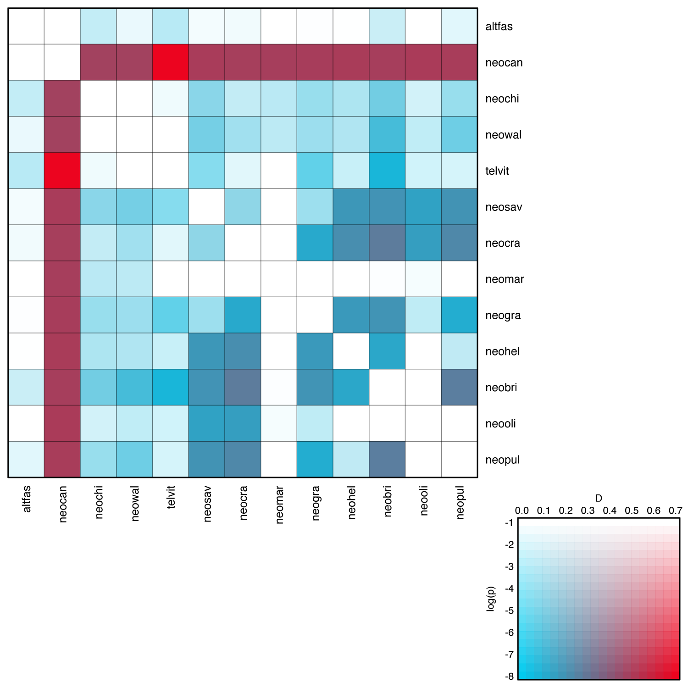

# Analysis of Introgression with SNP Data

A tutorial on the analysis of hybridization and introgression with SNP data 
By [Michael Matschiner](https://evoinformatics.group/team.html#michaelmatschiner) and [Milan Malinsky](https://www.milan-malinsky.org)

## Summary

A number of approaches for the analysis of introgression based on SNP data have been developed in the last decade or so. Among these is the *D*-statistic  ([Green et al. 2010](https://doi.org/10.1126/science.1188021)), based on the so-called "ABBA-BABA test", and the related estimate of the admixture fraction *f*, also referred to as the "*f*4-ratio". Both are commonly used to assess evidence of gene flow between populations or closely related species in genomic datasets. They are based on examining patterns of allele sharing across populations or closely related species. Although they were developed in a population genetic framework, the methods can be successfully applied for learning about hybridization and introgression within groups of closely related species, as long as common population genetic assumptions hold – namely that (a) the species share a substantial amount of genetic variation due to common ancestry and incomplete lineage sorting; (b) recurrent and back mutations at the same sites are negligible; and (c) substitution rates are uniform across species.

When introgression occurs between two species, signals of that gene flow may appear in the *D*-statistic or the *f*4-ratio not only when these are calculated for these two species, but also when close relatives of the introgression donor are included in the test instead. Similarly, when introgression occurred between two ancestral species, all of the derived species may inherit signals of that gene flow. Thus, a single pair of introgressing species may leave signals of introgression in many more species pairs. To identify from such sets of signals the one species pair responsible for these, yet another statistic, called "*f*-branch", has been developed ([Malinsky et al. 2018](https://doi.org/10.1038/s41559-018-0717-x)).

The *D*-statistic and its related statistics have also been used to identify introgressed loci by sliding window scans along the genome, or by calculating these statistics for particular short genomic regions. Because the *D*-statistic itself has large variance when applied to small genomic windows and because it is a poor estimator of the amount of introgression, additional statistics which are related to the *f*4-ratio have been designed specifically to investigate signatures of introgression in genomic windows along chromosomes. These statistics include *f*d ([Martin et al. 2015](https://doi.org/10.1093/molbev/msu269)), its extension *f*dM ([Malinsky et al. 2015](https://doi.org/10.1126/science.aac9927)), and the distance fraction *d*f ([Pfeifer and Kapan 2019](https://doi.org/10.1186/s12859-019-2747-z)). All of these statistics have recently been implemented in the program Dsuite ([Malinsky et al. 2021](https://doi.org/10.1111/1755-0998.13265)), which will be used in this turorial.

If a putative hybrid individual as well as the presumed parental species have already been identified, patterns of introgression can further be investigated with a method called "ancestry painting" ([Runemark et al. 2018](https://doi.org/10.1038/s41559-017-0437-7)), which focuses on sites that are fixed between the parental species and the alleles observed at these sites in the putative hybrid.

## Table of contents

* [Outline](#outline)
* [Dataset](#dataset)
* [Requirements](#requirements)
* [Analyzing introgression with Dsuite](#dsuite)
	* [Identifying the occurrence of introgression using the *D*-statistic](#dstats)
	* [Localizing introgression on a phylogeny using *f*-branch](#fbranch)
	* [Identifying introgressed loci](#loci)
* [Ancestry painting](#painting)
* [Avoiding reference bias](#bias)

## Outline

In this tutorial I am going to present the use of the program [Dsuite](https://github.com/millanek/Dsuite)([Malinsky et al. 2021](https://doi.org/10.1111/1755-0998.13265)) to identify introgression between species of the genus *Neolamprologus* with the *D*-statistic and the *f*-branch statistic, based on SNP data. Cases of introgression will be further investigated with sliding-window analyses, and ancestry painting will be used to  verify putatitve cases of hybridization.

## Dataset

The SNP data used in this tutorial is the unfiltered dataset used for species-tree inference with SVDQuartets in tutorial [Species-Tree Inference with SNP Data](../species_tree_inference_with_snp_data/README.md). More detailed information about the origin of this dataset is given in the Dataset section of this other tutorial. In brief, the dataset includes SNP data for the 28 samples of 14 cichlid species listed in the table below, and this data has already been filtered based on read quality and depth. Only SNPs mapping to chromosome 5 of the tilapia genome assembly ([Conte et al. 2017](https://doi.org/10.1186/s12864-017-3723-5)) are included in the dataset.

| Sample ID | Species ID | Species name                  | Tribe         |
|-----------|------------|-------------------------------|---------------|
| IZA1      | astbur     | *Astatotilapia burtoni*       | Haplochromini |
| IZC5      | astbur     | *Astatotilapia burtoni*       | Haplochromini |
| AUE7      | altfas     | *Altolamprologus fasciatus*   | Lamprologini  |
| AXD5      | altfas     | *Altolamprologus fasciatus*   | Lamprologini  |
| JBD5      | telvit     | *Telmatochromis vittatus*     | Lamprologini  |
| JBD6      | telvit     | *Telmatochromis vittatus*     | Lamprologini  |
| JUH9      | neobri     | *Neolamprologus brichardi*    | Lamprologini  |
| JUI1      | neobri     | *Neolamprologus brichardi*    | Lamprologini  |
| LJC9      | neocan     | *Neolamprologus cancellatus*  | Lamprologini  |
| LJD1      | neocan     | *Neolamprologus cancellatus*  | Lamprologini  |
| KHA7      | neochi     | *Neolamprologus chitamwebwai* | Lamprologini  |
| KHA9      | neochi     | *Neolamprologus chitamwebwai* | Lamprologini  |
| IVE8      | neocra     | *Neolamprologus crassus*      | Lamprologini  |
| IVF1      | neocra     | *Neolamprologus crassus*      | Lamprologini  |
| JWH1      | neogra     | *Neolamprologus gracilis*     | Lamprologini  |
| JWH2      | neogra     | *Neolamprologus gracilis*     | Lamprologini  |
| JWG8      | neohel     | *Neolamprologus helianthus*   | Lamprologini  |
| JWG9      | neohel     | *Neolamprologus helianthus*   | Lamprologini  |
| JWH3      | neomar     | *Neolamprologus marunguensis* | Lamprologini  |
| JWH4      | neomar     | *Neolamprologus marunguensis* | Lamprologini  |
| JWH5      | neooli     | *Neolamprologus olivaceous*   | Lamprologini  |
| JWH6      | neooli     | *Neolamprologus olivaceous*   | Lamprologini  |
| ISA6      | neopul     | *Neolamprologus pulcher*      | Lamprologini  |
| ISB3      | neopul     | *Neolamprologus pulcher*      | Lamprologini  |
| ISA8      | neosav     | *Neolamprologus savoryi*      | Lamprologini  |
| IYA4      | neosav     | *Neolamprologus savoryi*      | Lamprologini  |
| KFD2      | neowal     | *Neolamprologus walteri*      | Lamprologini  |
| KFD4      | neowal     | *Neolamprologus walteri*      | Lamprologini  |

## Requirements

This tutorial requires **FigTree** to be installed. Details about the installation of this tool can be found in tutorial [Bayesian Phylogenetic Inference](../bayesian_phylogeny_inference/README.md).

## Analyzing introgression with Dsuite
		
Under incomplete lineage sorting alone, two sister species are expected to share about the same proportion of derived alleles with a third closely related species. Thus, if species "P1" and "P2" are sisters and "P3" is a closely related species, then the number of derived alleles shared by P1 and P3 but not P2 and the number of derived alleles that is shared by P2 and P3 but not P1 should be approximately similar. In contrast, if hybridization leads to introgression between species P3 and one of the two species P1 and P2, then P3 should share more derived alleles with that species than it does with the other one, leading to asymmetry in the sharing of derived alleles. These expectations are the basis for the so-called "ABBA-BABA test" (first described in the Supporting Material of [Green et al. 2010](http://science.sciencemag.org/content/328/5979/710.full)) that quantifies support for introgression by the *D*-statistic. In addition to the three species P1, P2, and P3, the ABBA-BABA test requires a fourth species, "P4", which should be a common outgroup to P1, P2, and P3, and only serves to determine which allele is the ancestral one and which is derived; the ancestral allele is then labelled "A" and the derived allele of a bi-allelic SNP is labelled "B". In the simplest case in which only a single haploid sequence is sampled from each of the four species, "ABBA sites" are those where species P2 and P3 share the derived allele B while P1 retains the ancestral allele A. Similarly "BABA sites" are those where P1 and P3 share the derived allele B while P2 retains the ancestral allele A. The *D*-statistic is then defined as the difference between the counts of ABBA sites and BABA sites relative to the sum of both types of sites:

*D* = (*C*ABBA - *C*BABA) / (*C*ABBA + *C*BABA)

This statistic is expected to be 0 if no introgression occurred, to be 1 in the extreme case of no incomplete lineage sorting but introgression between P2 and P3, and -1 if incomplete lineage sorting is absent but introgression occurred between P1 and P3. When the dataset includes more than a single sequence per species, the calculation of the *D*-statistic is slightly more complicated and involves weighting each site for the ABBA or BABA pattern based on the allele frequencies observed in each species.

When more than four species are included in the dataset, obtaining *D*-statistics has long been a bit tedious because no program was available to calculate them automatically for all possible combinations of species in a VCF input file. This gap in the available methodology has recently been filled efficiently with the program [Dsuite](https://github.com/millanek/Dsuite) ([Malinsky et al. 2021](https://doi.org/10.1111/1755-0998.13265)), which will be used in this tutorial. To calculate *D*-statistics not just for one specific quartet but comprehensively for sets of species in a VCF file, Dsuite keeps the outgroup (which is specified by the user) fixed, but tests all possible ways in which three species can be selected from the ingroup species and placed into the positions P1, P2, and P3. In addition to the *D*-statistic, Dsuite allows the calculation of a *p*-value based on jackknifing for the null hypothesis that the *D*-statistic is 0, which means that the absence of introgression can be rejected if the *p*-value is below the significance level.

### Identifying the occurrence of introgression using the *D*-statistic

In this part of the tutorial, we are going to calculate *D*-statistics with Dsuite to test for introgression among sets of species from our dataset. We will apply these statistics in particular to determine potential introgression into *Neolamprologus cancellatus*, the species that had been excluded from species-tree analyses in tutorials [Species-Tree Inference with SNP Data](../species_tree_inference_with_snp_data/README.md) and [Divergence-Time Estimation with SNP Data](../divergence_time_estimation_with_snp_data/README.md) due to its presumed hybrid nature. As mentioned in tutorial [Species-Tree Inference with SNP Data](../species_tree_inference_with_snp_data/README.md), *Neolamprologus cancellatus* ("neocan") is not accepted as a valid species by some authors who speculate that it is a "natural hybrid between *Telmatochromis vittatus* and another species" ([Konings 2015](http://www.cichlidpress.com/books/details/tc3.html)), based on field observations.

* Make sure that you have the file `NC_031969.f5.sub1.vcf.gz`, which was already used in tutorial [Species-Tree Inference with SNP Data](../species_tree_inference_with_snp_data/README.md), in your current directory on Saga. If this is not the case, get it either by copying it from `/cluster/projects/nn9458k/phylogenomics/week2/data` or by downloading it from GitHub, using one of the following two commands:

		cp /cluster/projects/nn9458k/phylogenomics/week2/data/NC_031969.f5.sub1.vcf.gz .
		
	or
	
		wget https://github.com/ForBioPhylogenomics/tutorials/raw/main/week2_data/NC_031969.f5.sub1.vcf.gz

* To assign samples to species for the calculation of the *D*-statistic, we'll need to write a table with two columns, where the first column contains the individual IDs and the second column contains the corresponding species ID. In contrast to some of the scripts used in other tutorials, Dsuite strictly requires that the table is delimited by actual tab symbols rather than just any whitespace. However, if you use Emacs to write files on Saga, Emacs will be default convert any tab to multiple whitespace symbols, meaning that the table would then not be read correctly by Dsuite. To avoid this default conversion made by Emacs, we need to add `(global-set-key (kbd "TAB") 'self-insert-command);` to a file with Emacs settings that is named `.emacs` and placed in your home directory (`~`). The easiest way to do this is to use the following command (this solution was found [here](https://superuser.com/questions/602510/how-to-insert-tab-character-in-text-mode)):

		echo "(global-set-key (kbd \"TAB\") 'self-insert-command);" >> ~/.emacs

	Users of the text editors Nano and Vim should not have this issue, and therefore do not need to execute the above command.

* In the table that we write for Dsuite, we need to specify that the only species from outside the tribe Lamprologini in the dataset, *Astatotilapia burtoni*, should be used as the outgroup (its outgroup position was confirmed in tutorial [Divergence-Time Estimation with SNP Data](../divergence_time_estimation_with_snp_data/README.md)). To specify this for Dsuite, the keyword "Outgroup" must be used. Thus, write the following text to a new file named `individuals_dsuite.txt`:

		IZA1	Outgroup
		IZC5	Outgroup
		AUE7	altfas
		AXD5	altfas
		JBD5	telvit
		JBD6	telvit
		JUH9	neobri
		JUI1	neobri
		LJC9	neocan
		LJD1	neocan
		KHA7	neochi
		KHA9	neochi
		IVE8	neocra
		IVF1	neocra
		JWH1	neogra
		JWH2	neogra
		JWG8	neohel
		JWG9	neohel
		JWH3	neomar
		JWH4	neomar
		JWH5	neooli
		JWH6	neooli
		ISA6	neopul
		ISB3	neopul
		ISA8	neosav
		IYA4	neosav
		KFD2	neowal
		KFD4	neowal

* Load the module for Dsuite:

		module load Dsuite/20210309-GCC-9.3.0

* To familiarize yourself with Dsuite, simply start the program with the command `Dsuite`. When you hit enter, you should see a help text that informs you about four different commands named "Dtrios", "DtriosCombine", "Dinvestigate", and "Fbranch", with short descriptions of what these commands do. Of the four commands, we are first going to focus on `Dtrios`, which is the one that calculates the *D*-statistic for all possible species trios.

* To learn more about the command, type `Dsuite Dtrios` and hit enter. The help text should then inform you about how to run this command. You'll see that the available options allow to limit the genomic region used in the analysis, to specify a window size for significance testing based on jackknifing, or to specify a tree file. For now, there is no need to specify any of these options, but we'll look at the tree-file option later in this tutorial.

	As shown at the top of the Dsuite help text, the program can be run with `Dsuite Dtrios [OPTIONS] INPUT_FILE.vcf SETS.txt`. In our case, the input file is `NC_031969.f5.sub1.vcf.gz` and the sets file is the table with individual and species IDs `individuals_dsuite.txt`.

* Start the Dsuite analysis of the SNP dataset:

		srun --ntasks=1 --mem-per-cpu=1G --time=00:02:00 --account=nn9458k --pty Dsuite Dtrios NC_031969.f5.sub1.vcf.gz individuals_dsuite.txt
		
	If this should produce an error message that says "Line 1 does not have two columns separated by a tab.", then your attempt at writing tabs to separate columns in file `individuals_dsuite.txt` unfortunately failed. To fix this, you could either try a different editor on Saga, download the file to your local computer with `scp`, edit it there, and copy it back to Saga, or you could copy a prepared version of the file to your directory on Saga with `cp /cluster/projects/nn9458k/phylogenomics/week2/data/individuals_dsuite.txt .`
	
	Dsuite should finish after around a minute.

* Now have a look at the files in the current directory, using the `ls` command. You should see that Dsuite has written a number of files named after the sample-table file:

		individuals_dsuite_BBAA.txt
		individuals_dsuite_Dmin.txt
		individuals_dsuite_combine.txt
		individuals_dsuite_stderr.txt

	The two files `individuals_dsuite_combine.txt` and `individuals_dsuite_stderr.txt` are only used when Dsuite combines the results of multiple analyses and can be ignored.

* Have a look at the content of file `individuals_dsuite_BBAA.txt`, for example using the `less` command. You'll see that the first part of this files has the following content:

		P1	P2	P3	Dstatistic	Z-score	p-value	f4-ratio	BBAA	ABBA	BABA
		altfas	neocan	neobri	0.492528	12.8508	0	0.156015	13501.1	4080.97	1387.56
		neobri	neochi	altfas	0.0073103	0.290924	0.385555	0.00145015	8177.96	2333.88	2300
		neocra	neobri	altfas	0.0370295	2.62363	0.00434989	0.00434047	14205.3	1625.19	1509.13
		neogra	neobri	altfas	0.0174756	0.71411	0.23758	0.00203405	14341.1	1629.63	1573.65
		neohel	neobri	altfas	0.0454291	1.46708	0.0711774	0.00514006	14775.2	1564.36	1428.4
		neomar	neobri	altfas	0.0675149	2.81502	0.00243871	0.00917209	13201.1	1995.39	1742.99
		neooli	neobri	altfas	0.0650284	2.62718	0.00430484	0.00743308	14769.6	1680.78	1475.53
		neopul	neobri	altfas	0.0493064	1.67681	0.0467898	0.00490612	14314.9	1295.72	1173.95
		neosav	neobri	altfas	0.0341682	1.72065	0.0426576	0.00448924	12658.2	1744.45	1629.18
		neowal	neobri	altfas	0.0187707	0.875942	0.190531	0.00370784	8598.75	2546.38	2452.54
		neobri	telvit	altfas	0.0201382	0.880013	0.189426	0.00423982	8282.7	2701.18	2594.53
		altfas	neocan	neochi	0.480527	11.1475	0	0.147145	12327.3	3759.62	1319.14
		altfas	neocan	neocra	0.490934	12.4976	0	0.160357	14224.1	4111.57	1403.86
		altfas	neocan	neogra	0.496232	12.5877	0	0.147084	14846.8	4299.18	1447.49
		altfas	neocan	neohel	0.500996	12.2821	0	0.142226	14087.9	4120.38	1369.81
		altfas	neocan	neomar	0.491482	12.2634	0	0.135651	14819.9	4199.12	1431.68
		altfas	neocan	neooli	0.503496	12.8118	0	0.152775	14857.6	4294	1418.02
		...

	Here, each row shows the results for the analysis of one trio, and for example in the first row, *Altolamprologus fasciatus* ("altfas") was used as P1, *Neolamprologus cancellatus* was considered as P2, and *Neolamprologus brichardi* was placed in the position of P3. The fourth column reports the *D*-statistic, followed by the Z-score for the *D*-statistic derived from jackknifing, the *p*-value calculated from the Z-score, and the f4-ratio. The last three columns then report the counts of BBAA sites *C*BBAA (where the derived allele is shared by P1 and P2), ABBA sites *C*ABBA (where the derived allele is shared by P2 and P3), and BABA sites *C*BABA (where the derived allele is shared by P1 and P3) for that trio. You may notice that *C*BBAA is always greater than *C*ABBA and that *C*ABBA is always greater than *C*BABA; this is when writing the file with the `_BBAA.txt` ending, Dsuite places the three species of each trio in the positions P1, P2, and P3 so that *C*BBAA > *C*ABBA > *C*BABA. As a result of this convention, the *D*-statistic is never negative but always between 0 and 1, and any significant *D*-statistic always supports introgression between the species in positions P2 and P3.

	**Question 1:** Can you tell why these numbers are not integer numbers but have decimal positions? [(see answer)](#q1)

	**Question 2:** How many different trios are listed in the file? Are these all possible (unordered) trios? [(see answer)](#q2)

* Have a brief look at the other output file, named `individuals_dsuite_Dmin.txt`.

	**Question 3:** Can you identify differences between the two files, and what could be the cause of these differences? [(see answer)](#q3)

From answering the above question or reading the answer, you will have learned that Dsuite uses different rules to assign the three species of a trio to the positions P1, P2, and P3:

1. The trio is assigned to P1, P2, and P3 so that P1 and P2 are the two species of the trio that share the largest number of derived sites, and that P2 and P3 share more derived sites with each other than P1 and P3 (*C*BBAA > *C*ABBA > *C*BABA). The idea behind this type of rearrangement is that the two species that share the largest number of derived sites are most likely the true two sister species in the trio, and thus rightfully placed in the positions P1 and P2. This assumption is expected to hold under certain conditions (e.g. clock-like evolution, absence of homoplasies, absence of introgression, and panmictic ancestral populations), but how reliable it is for real datasets is sometimes difficult to say. The output for this assignment is written to a file with the ending `_BBAA.txt`.
2. All possible assignments are tested, and the one resulting in the lowest *D*-statistic (called *D*min) is selected for each trio. *D*min is therefore a conservative estimate of the *D*-statistic in a given trio. This output is written to a file with the ending `_Dmin.txt`.
3. To tell Dsuite directly which species of a trio should be considered sister species (and thus, which should be assigned to P1 and P2), a tree file that contains all species of the dataset can be provided by the user with option `-t` or `--tree`. The output will then be written to an additional file that will have the ending `_tree.txt`.

	**Question 4:** How is it possible at all that the first two rules produce different results? Shouldn't it always be the assignment in which P1 and P2 share the largest number of derived alleles that also produces the lowest *D*-statistic? [(see answer)](#q4)

To use the `--tree` option of Dsuite, we will obviously need a tree file. As a basis for that, we can use the time-calibrated species tree generated in tutorial [Divergence-Time Estimation with SNP Data](../divergence_time_estimation_with_snp_data/README.md), in file `snapp.tre`.

* Make sure that you still have the file `snapp.tre`, and if not, get it either by copying it from `/cluster/projects/nn9458k/phylogenomics/week2/res` or download it from GitHub, using one of the following two commands:

		cp /cluster/projects/nn9458k/phylogenomics/week2/res/snapp.tre .
		
	or
	
		wget https://raw.githubusercontent.com/ForBioPhylogenomics/tutorials/main/week2_res/snapp.tre

However, we need to prepare the tree file before we can use it with Dsuite. First, Dsuite requires tree files in Newick format, but the tree file `snapp.tre` is written in Nexus format. Second, as the tree generated in tutorial [Divergence-Time Estimation with SNP Data](../divergence_time_estimation_with_snp_data/README.md) did not include *Neolamprologus cancellatus*, we will need to add this species to the tree manually.

* To convert the file `snapp.tre` from Nexus to Newick format, make sure that the R script `convert_to_newick.r` is still in your current directory on Saga:

		ls convert_to_newick.r
		
	If the file should be missing, have a look at tutorial [Bayesian Species-Tree Inference](../bayesian_species_tree_inference/README.md) to see how they should be written.
		
* Then execute the script to convert the tree in Nexus format in file `snapp.tre` to a tree in Newick format that is written to a new file named `snapp.nwk`:

		module load R/4.0.0-foss-2020a
		srun --ntasks=1 --mem-per-cpu=1G --time=00:01:00 --account=nn9458k --pty Rscript convert_to_newick.r snapp.tre snapp.nwk

* To add *Neolamprologus cancellatus* ("neocan") to the tree, we need to make a decision about where to place it. Perhaps the best way to do this would be a separate phylogenetic analysis, but as we will see later, there is no single true position of *Neolamprologus cancellatus* ("neocan") in the species tree anyway. So for now it will be sufficient to use the counts of shared derived sites from file `individuals_dsuite_BBAA.txt` as an indicator for where best to place the species. Thus, we need to find the largest count of derived sites that *neocan* shares with any other species. To do this, use the following command on Saga:

		cat individuals_dsuite_BBAA.txt | grep neocan | sort -n -k 8 -r | head -n 1

	This should produce the following line:
	
		altfas	neocan	neooli	0.503496	12.8118	0	0.152775	14857.6	4294	1418.02

	This output shows that the overall largest *C*BBAA value in a trio including "neocan" is 14857.6, and that this number is found in the trio in which "altfas" is P1, "neocan" is P2, and "neooli" is P3. This means that "neocan" appears to be more closely related to "altfas" than to other species in the dataset.
	
* Write a new file in Newick file named `snapp_w_neocan.nwk` in which "neocan" is inserted into the tree string as the sister species of "altfas". The easiest way to do this to replace "altfas" with "(altfas:1.0,neocan:1.0)", including the parentheses (the branch length of 1.0 is arbitrary but will not be used by Dsuite anyway), using `sed`:

		cat snapp.nwk | sed "s/altfas/(altfas:1.0,neocan:1.0)/g" > snapp_w_neocan.nwk

	File `snapp_w_neocan.nwk` should then contain the following tree string:
	
		(((altfas:1.0,neocan:1.0):2.6520367123213346,((((((neobri:0.5240051105707518,(neooli:0.3610385760756361,neopul:0.3610385760756361):0.16296653449511578):0.06084458117051339,neohel:0.5848496917412653):0.11293049810600309,((neocra:0.5011109162246027,neomar:0.5011109162246028):0.09226605826642365,neogra:0.5933769744910264):0.10440321535624186):0.14067115586556878,neosav:0.8384513457128372):0.28515609256191665,telvit:1.1236074382747534):0.060210462250667174,(neochi:0.06552780931213173,neowal:0.06552780931213173):1.1182900912132892):1.4682188117959136):4.311456556721317,astbur:6.963493269042651);

* Run Dsuite again, this time adding the `-t` (or `--tree`) option to specify the newly prepared tree file `snapp_w_neocan.nwk`:

		srun --ntasks=1 --mem-per-cpu=1G --time=00:01:00 --account=nn9458k --pty Dsuite Dtrios -t snapp_w_neocan.nwk NC_031969.f5.sub1.vcf.gz individuals_dsuite.txt

	This Dsuite analysis should again take no longer than about a  minute. The output should be identical to the previously written output except that a file named `individuals_dsuite_tree.txt` should now also be written.

	**Question 5:** Do the results differ when trios are rearranged either according to the numbers of derived sites shared between P1 and P2 (thus, the results in file `individuals_dsuite_BBAA.txt`) or according to the provided tree (in file `individuals_dsuite_tree.txt`)?

* To further explore differences among the output files based on different rules for trio rearrangement, find the highest *D*-statistic reported in each of the files `individuals_dsuite_BBAA.txt`, `individuals_dsuite_Dmin.txt`, and `individuals_dsuite_tree.txt`. One way to do this are the three following commands (with `sort -g -k 4`, we can sort by the values in the fourth column of each file, which are the *D*-statistics):

		cat individuals_dsuite_BBAA.txt | tail -n +2 | sort -g -k 4 -r | head -n 1
		cat individuals_dsuite_Dmin.txt | tail -n +2 | sort -g -k 4 -r | head -n 1
		cat individuals_dsuite_tree.txt | tail -n +2 | sort -g -k 4 -r | head -n 1
		
	You should see that the highest *D*-statistic reported in file `individuals_dsuite_Dmin.txt` (0.503496) is smaller than those in the the other two files (0.777784 in both cases). This is not surprising, given that, as explained above, the *D*min values are conservative measure of introgression in a given trio. The high *D*-statistic of 0.777784 is reported for the trio in which "altfas" is P1, "neocan" is P2, and "telvit" is P3. Following this *D*-statistic in the fourth column, the Z-score in the fifth column should be 39.9918, the *p*-value should be reported as 0, and the *f*4-ratio should be 0.413526. The number of derived sites shared between "altfas" and "neocan" (*C*BBAA) should be reported as 12,928.8, while "neocan" and "telvit" share 7,200.16 derived sites (*C*ABBA) and "altfas" and "telvit" share 899.99 derived sites (*C*BABA). The *D*-statistic in files `individuals_dsuite_BBAA.txt` and `individuals_dsuite_tree.txt` was thus calculated as
	
	*D* = (7200.16 - 899.99) / (7200.16 + 899.99) = 0.777784.
	
* Once again have a look at file `individuals_dsuite_BBAA.txt`, for example with `less`:

		less individuals_dsuite_BBAA.txt

	You'll see that the *D*-statistic is high and the associated *p*-value significant for many trios that include *Neolamprologus cancellatus* ("neocan"), meaning that introgression involving this species is strongly supported. Given that the highest value of the *D*-statistic is reported for the trio in which "altfas" is P1, "neocan" is P2, and "telvit" is P3, we may hypothesize that *Neolamprologus cancellatus* ("neocan") has received a large amount of introgression from *Telmatochromis vittatus*, in agreement with the speculation by [Konings (2015)](http://www.cichlidpress.com/books/details/tc3.html) that *Neolamprologus cancellatus* is a "natural hybrid between *Telmatochromis vittatus* and another species".

* To get a better overview of introgression patterns supported by the *D*-statistic, we'll plot these in the form of a heatmap in which the species in positions P2 and P3 are sorted on the horizontal and vertical axes, and the color of the corresponding heatmap cell indicates the most significant *D*-statistic found with these two species, across all possible species in P1. This can be done with the Ruby script `plot_d.rb`. To prepare this plot, we will, however, first need to prepare a file that lists the order in which the P2 and P3 species should be listed along the heatmap axes. It makes sense to sort species for this according to the tree file that we used as input for Dsuite (`snapp_w_neocan.nwk`); thus, write the following list to a new file named `species_order.txt`:

		altfas
		neocan
		neochi
		neowal
		telvit
		neosav
		neocra
		neomar
		neogra
		neohel
		neobri
		neooli
		neopul
		
	(note that even though the outgroup "astbur" is included in the tree file, we here exclude it because it was never placed in the positions of P2 or P3 in the Dsuite analyses).

* Add the script `plot_d.rb` to your current directory on Saga, either by copying it from `` or by downloading it from GitHub, using one of the following two commands:

		cp /cluster/projects/nn9458k/phylogenomics/week2/src/plot_d.rb .

	or

		wget https://raw.githubusercontent.com/ForBioPhylogenomics/tutorials/main/week2_src/plot_d.rb

* When executing the script `plot_d.rb`, one of Dsuite's output files must be specified as input, together with a maximum *D* value that will limit the color scale used in the heatmap, and the name for the output file with the plot. Use `individuals_dsuite_BBAA.txt` as the input file, a maximum *D* of 0.7, and the output file name `individuals_dsuite_BBAA.svg`:

		module load Ruby/2.7.2-GCCcore-9.3.0
		srun --ntasks=1 --mem-per-cpu=1G --time=00:01:00 --account=nn9458k --pty ruby plot_d.rb individuals_dsuite_BBAA.txt species_order.txt 0.7 individuals_dsuite_BBAA.svg
		
* The heatmap plot in file `individuals_dsuite_BBAA.svg` is written scalable vector graphic (SVG) format. Download this file to your local computer with `scp` and then open it with a program capable of reading files in SVG format, for example with a browser such as Safari, Chrome, or Firefox, or with Adobe Illustrator. The heatmap plot should look as shown below:

 As you can see from the color legend in the bottom right corner, the colors of this heatmap show two things at the same time, the *D*-statistic as well as its *p*-value. So red colors indicate higher *D*-statistics, and generally more saturated colors indicate greater significance. Thus, the strongest signals for introgression are shown with saturated red, as in the bottom right of the color legend. All cells in rows or columns for "neocan" should bo colored in red or purple corresponding to a highly significant values of the *D*-statistic of at least 0.3.

	In case that you're wondering why the heatmap looks symmetric, that is because no matter whether the maximum value of the *D*-statistic for two species is obtained with the first species in position P2 and the second in position P3 or vice versa, the same value is plotted. The reason for this is that even though different values may result in the two cases, those differences should not be taken as evidence for a directionality of introgression from P3 to P2; it could just as well have come from P2 and into P3.

* Before further interpreting the patterns of introgression shown in the heatmap, also produce heatmap plots for the other two of Dsuite's output files, `individuals_dsuite_Dmin.txt` and `individuals_dsuite_tree.txt`:

		srun --ntasks=1 --mem-per-cpu=1G --time=00:01:00 --account=nn9458k --pty ruby plot_d.rb individuals_dsuite_Dmin.txt species_order.txt 0.7 individuals_dsuite_Dmin.svg
		srun --ntasks=1 --mem-per-cpu=1G --time=00:01:00 --account=nn9458k --pty ruby plot_d.rb individuals_dsuite_tree.txt species_order.txt 0.7 individuals_dsuite_tree.svg
		
* Also download the two plot files `individuals_dsuite_Dmin.svg` and `individuals_dsuite_tree.svg` to your local computer with `scp`.

	The two heatmaps should look as shown below (`individuals_dsuite_Dmin.svg` at top, `individuals_dsuite_tree.svg` below):

 As you can see, the heatmaps of files `individuals_dsuite_BBAA.svg` and `individuals_dsuite_tree.svg` are both a bit more saturated overall than the heatmap of file `individuals_dsuite_Dmin.svg`, in agreement with the interpretation of *D*min as a conservative estimate of introgression. The strongest difference, however, is in the patterns shown for *Telmatochromis vittatus* ("telvit"). The most saturated red colors in the heatmaps for files `individuals_dsuite_BBAA.svg` and `individuals_dsuite_tree.svg` are those for the cells connecting "neocan" and "telvit". In contrast, these cells are only light blue in the plot based on *D*min. Nevertheless, these plots support the hypothesis that introgression occurred between *Neolamprologus cancellatus* ("neocan") and *Telmatochromis vittatus* ("telvit"). However, the other red-purple cells in the rows and columns for "neocan" and "telvit" may only be side effects of this introgression, being caused by sites that are shared between *Neolamprologus cancellatus* ("neocan") and other species only because these other species are closely related to *Telmatochromis vittatus* ("telvit"), the putative donor of introgression.
	
	In addition, there seems to be some support for introgression among the species of the genus *Neolamprologus*, such as between *N. crassus* and *N. brichardi* or between *N. brichardi* and *N. pulcher*.

Like the *D*-statistic, we can also plot the *f*4-ratio, quantifying the fraction of genomes inferred to be admixed, in the same way with a heatmap. This can be done with the Ruby script `plot_f4ratio.rb`, which works exactly like the `plot_d.rb` script.

* Add the script `plot_f4ratio.rb` to your current directory on Saga, either by copying it from `/cluster/projects/nn9458k/phylogenomics/week2/src` or by downloading it from GitHub with one of the following two commands:

		cp /cluster/projects/nn9458k/phylogenomics/week2/src/plot_f4ratio.rb .

	or

		wget https://raw.githubusercontent.com/ForBioPhylogenomics/tutorials/main/week2_src/plot_f4ratio.rb

* Use the `plot_f4ratio.rb` script to produce a heatmap of the *f*4-ratio values in file `individuals_dsuite_BBAA.txt`, as before for the *D*-statistic but with a maximum value of 0.2:

		srun --ntasks=1 --mem-per-cpu=1G --time=00:01:00 --account=nn9458k --pty ruby plot_f4ratio.rb individuals_dsuite_BBAA.txt species_order.txt 0.4 individuals_dsuite_BBAA_f4.svg

* Download the plot file `individuals_dsuite_BBAA_f4.svg` to your local computer and open it in a program capable of reading files in SVG format. The heatmap should look as shown below:

### Localizing introgression on a phylogeny using *f*-branch

The two script `plot_d.rb` and `plot_f4ratio.rb` both illustrate signals of introgression between pairs of species, as reported by Dsuite. But as mentioned above, introgression between one pair of species can produce signals of introgression also between pairs of species that are closely related or descendant from those that actually were involved in the genetic exchange. In the case of the heatmaps produced above with `plot_d.rb` and `plot_f4ratio.rb`, the signals of introgression in the columns and rows for *Neolamprologus cancellatus* "(neocan)" and *Telmatochromis vittatus* ("telvit") seem to support introgression between all species (except the outgroup) and both *Neolamprologus cancellatus* "(neocan)" and *Telmatochromis vittatus* ("telvit"); however, whether these signals should be taken at face value might be questioned.

To distinguish between signals of introgression that might be side effects, and those signals that might have caused these side effect, the *f*-branch statistic has been developed by Svardal and Malinsky and was first introduced in [Malinsky et al. (2018)](https://doi.org/10.1038/s41559-018-0717-x). The *f*-branch statistic builds upon and formalises verbal arguments employed by [Martin et al. (2013)](https://doi.org/10.1101/gr.159426.113), who used these lines of reasoning to assign introgression to specific internal branches on the phylogeny of *Heliconius* butterflies. It thus makes use of the whole set of results together with information about the tree topology to determine those branches that most likely exchanged genetic information with each other.

The logic of the *f*-branch statistic is illustrated in the following figure. The panel **a** provides an example illustrating interdependences between different *f*4-ratio values, which can be informative about the timing of introgression. In this example, different choices for the P1 population provide constraints on when the genetic exchange could have happened. **b)** Based on relationships between the f4-ratio results from different four taxon tests, the *f*-branch statistic distinguishes between introgression at different time periods, assigning signals to different (possibly internal) branches in the phylogeny.

The *f*-branch statistic can be quantified with Dsuite's `Fbranch` command.

* Call Dsuite with the `Fbranch` command to see the requirements for it:

		Dsuite Fbranch
		
	You should see that a tree file in Newick format (here calle "TREE_FILE.nwk") as well as a file with output from Dsuite's `Dtrios` command, executed with the `-t` option (here called "FVALS_tree.txt"), are required as input. The tree that was used with the `Dtrios` command should be identical to the one that is used as input for the `Fbranch` command, and it should be rooted with the outgroup (which is the case for the tree in file `snapp_w_neocan.nwk`).
	
* Quantify the *f*-branch statistic with the `Fbranch` command, using `snapp_w_neocan.nwk` as the input tree file and `individuals_dsuite_tree.txt` as the file with output from `Dtrios`:

		srun --ntasks=1 --mem-per-cpu=1G --time=00:01:00 --account=nn9458k Dsuite Fbranch snapp_w_neocan.nwk individuals_dsuite_tree.txt > fbranch.txt

* To plot the *f*-branch statistic, another script from the [Dsuite GitHub](https://github.com/millanek/Dsuite) repository is required, namely the Python script named `dtools.py`. Download this script to your current directory on Saga:

		wget https://raw.githubusercontent.com/millanek/Dsuite/master/utils/dtools.py

* To execute the script `dtools.py`, an additional Python library named `pandas` is required. Install this library in with `pip`:

		pip install --user pandas

* Then, run the Python script `dtools.py` to plot the *f*-branch statistic, using the files `fbranch` and `snapp_w_neocan.nwk` as input and specifying "astbur" as the outgroup:

		module load Python/3.8.2-GCCcore-9.3.0
		srun --ntasks=1 --mem-per-cpu=1G --time=00:01:00 --account=nn9458k --pty python dtools.py fbranch.txt snapp_w_neocan.nwk --outgroup=astbur
	
	This command should have written two new files named `fbranch.png` and `fbranch.svg` for the plot of the *f*-branch statistic.
	
* Download the file `fbranch.png` to your local computer and open it. The plot should look as shown below:
 As you can see, the plot now includes, to the top and the left of the heatmap, an illustration of the tree that was provided as input. The tree on the left is plotted so that not only terminal branches, but also internal branches correspond to rows of the heatmap. This way, the heatmap can illustrate introgression that is inferred to lead to an internal branch. Note that gray cells indicate pairs of species or branches for which no tests could be conducted, e.g. because they are identical to each other, descendants of each other, or sisters on the phylogeny.

	**Question 6** Can the introgression events be identified more clearly from the *f*-branch plot, compared to the heatmaps produced before? [(see answer)](#q6)

### Identifying introgressed loci

So far we only calculated *D*-statistics across the entire chromosome 5 (the only chromosome included in the VCF), but we haven't yet tested whether the *D*-statistic is homogeneous or variable throughout the chromosome. This information could be valuable to determine how recent introgression has occurred because younger introgression events are expected to produce more large-scale variation in the *D*-statistic than older introgression events. The information could also help to identify individual introgressed loci.

To quantify the *D*-statistic in sliding windows across the genome, Dsuite's `Dinvestigate` command can be used, and we will apply it to the trio with the strongest signals of introgression, composed of the three species *Altolamprologus fasciatus* ("altfas"), *Neolamprologus cancellatus* ("neocan"), and *Telmatochromis vittatus* ("telvit").

* Have a look at the available options for this command, simply by typing the following:

		Dsuite Dinvestigate

	As you can see, besides the VCF input file and the table assigning individuals to species, two more pieces of information are required. One is a file containing only the species names from one or more trios, and the other is a window size (plus the step size by which the window is incremented) that should be used for the sliding window-analyses.
	
* Prepare a file specifying the trio "altfas", "neocan", and "telvit", and name this file `test_trios.txt`. This could be done on the command line with the following command:

		echo -e "altfas\tneocan\ttelvit" > test_trios.txt
		
* In addition, we'll use the VCF file `NC_031969.f5.sub1.vcf.gz`, the table file `individuals_dsuite.txt`, and a window size of 500 SNPs, incremented by 100 SNPs per iteration. To start sliding-window analyses with these settings, execute the following command:

		srun --ntasks=1 --mem-per-cpu=1G --time=00:01:00 --account=nn9458k --pty Dsuite Dinvestigate -w 500,100 NC_031969.f5.sub1.vcf.gz individuals_dsuite.txt test_trios.txt 
		
	This analysis should take less than a minute. Dsuite should then have written a file named `altfas_neocan_telvit_localFstats__500_100.txt`.
	
* Have a look at file `altfas_neocan_telvit_localFstats__500_100.txt`, for example using the `less` command:

		less altfas_neocan_telvit_localFstats__500_100.txt
		
	The rows in this file correspond to individual chromosomal windows, and the  seven columns included in the file contain information on the chromosome ID and the start and end positions of each window. This is followed by four numbers on each line, which represent the *D*-statistic calculated for the window in the fourth column, and three further statistics aiming to quantify the proportions of the window affected by introgression. The three statistics are the *f*d statistic of [Martin et al. (2015)](https://doi.org/10.1093/molbev/msu269), the related *f*dM statistic introduced by [Malinsky et al. (2015)](https://doi.org/10.1126/science.aac9927), and the *d*f statistic of [Pfeifer and Kapan (2019)](https://doi.org/10.1186/s12859-019-2747-z).
	
* Find out into how many windows chromosome 5 was divided, using the following command:

		cat altfas_neocan_telvit_localFstats__500_100.txt | tail -n +2 | wc -l
		
	This should show that 235 windows were used in Dsuite's Dinvestigate analysis. If this number would be much higher or lower, the information density could be adjusted by specifying a larger or smaller window size with `-w`.
	
To visualize the variation of the *D* and *f*dM statistics across chromosome 5, we'll generate plots with the R environment.

* Load the module for R:

		module load R/4.0.0-foss-2020a
		
* Start R interactively on the command line using `srun`:

		srun --ntasks=1 --mem-per-cpu=1G --time=00:15:00 --account=nn9458k --pty R
	
* Then, write the following commands to read file `altfas_neocan_telvit_localFstats__500_100.txt` and plot the *D* and *f*dM statistics against the chromosomal position of the center of the alignment:

		table <- read.table("altfas_neocan_telvit_localFstats__500_100.txt", header=T)
		windowCenter=(table$windowStart+table$windowEnd)/2
		pdf("altfas_neocan_telvit_localFstats__500_100.pdf", height=7, width=7)
		plot(windowCenter, table$D, type="l", xlab="Position", ylab="D (gray) / fDM (black)", ylim=c(0,1), main="Chromosome 5 (altfas, neocan, telvit)", col="gray")
		lines(windowCenter, table$f_dM)
		dev.off()

* To exit the interactive R environment and return to the command line, type this command:

		quit(save="no")

	The above commands should have written the plot to a file named `altfas_neocan_telvit_localFstats__500_100.pdf` in the current directory on Saga.
	
* Make sure that the file has been written:

		ls altfas_neocan_telvit_localFstats__500_100.pdf
		
* Download the file `altfas_neocan_telvit_localFstats__500_100.pdf` from Saga to your local computer with `scp`, and then open the file to see the plot.

	The plot should show that the *D*-statistic (in gray) is almost in all windows substantially higher than the *f*d-statistic (in black), and that the *f*dM-statistic, which estimates the admixture proportion is mostly close 0.5:

 There also appears to be a dip in both statistics at around 5 Mbp; however, whether this is an artifact resulting from e.g. missing data or misassembly in the reference genome, or whether it shows a biological signal of reduced introgression is difficult to tell without further analyses.

* Repeat the same for a second trio that appeared to show signals of introgression, composed of *Neolamprologus olivaceous* ("neooli"), *N. pulcher* ("neopul), and *N. brichardi* ("neobri"). To do so, use these commands on Saga:

		echo -e "neooli\tneopul\tneobri" > test_trios.txt
		srun --ntasks=1 --mem-per-cpu=1G --time=00:01:00 --account=nn9458k --pty Dsuite Dinvestigate -w 500,100 NC_031969.f5.sub1.vcf.gz individuals_dsuite.txt test_trios.txt

* To produce the same type of plot as before now for the trio of "neooli", "neopul", and "neobri", start R again interactively using `srun`:

		srun --ntasks=1 --mem-per-cpu=1G --time=00:15:00 --account=nn9458k --pty R

* Then, enter the following commands:

		table <- read.table("neooli_neopul_neobri_localFstats__500_100.txt", header=T)
		windowCenter=(table$windowStart+table$windowEnd)/2
		pdf("neooli_neopul_neobri_localFstats__500_100.pdf", height=7, width=7)
		plot(windowCenter, table$D, type="l", xlab="Position", ylab="D (gray) / fDM (black)", ylim=c(0,1), main="Chromosome 5 (neooli, neopul, neobri)", col="gray")
		lines(windowCenter, table$f_dM)
		dev.off()
		
* Again, quit the R environment with `quit(save="no")`).

* Download the file `neooli_neopul_neobri_localFstats__500_100.pdf` from Saga to your local computer and open it.

	This second plot, showing the *D*-statistic and the *f*d-statistic for the trio composed of *Neolamprologus olivaceous* ("neooli"), *N. pulcher* ("neopul), and *N. brichardi* ("neobri"), should look like the one shown below:

	As you can see, both statistics are lower than for the first trio. Notably, the dip at around 5 Mbp that was apparent in both statistics for the first trio is again visible. As it appears improbable that the same region has more introgression in both species trios, this may indicate that the dip is in fact caused by technical artifacts rather than biological processes. To further investigate whether any of the peaks or troughs in this plot result from actual changes in the introgression proportion, it might be necessary to compare the *D* and *f*dM-statistics to measures of between-species differentiation (*F*ST) and divergence (*d*XY) (see, e.g. [The Heliconius Genome Consortium 2012](https://doi.org/10.1038/nature11041)). The reliability of these patterns could also be tested by repeating the analysis after mapping to an alternative, if possible more closely related, reference genome. Such in-depth analyses of introgressed loci based on genome scans are covered, for example, in the [Physalia Speciation Genomics workshop](https://speciationgenomics.github.io) run by Mark Ravinet and Joana Meier.

To see a pattern that has previously been interpreted as a biological signal rather than an artifact, we will repeat the above analyses with Dsuite's `Dinvestigate` command using a second dataset. This dataset was produced by [Malinsky et al. (2018)](https://doi.org/10.1038/s41559-018-0717-x) for 135 species of cichlid fishes from Lake Malawi. The study by Malinsky et al. found that two lineages of cichlids adapted to deep water share signatures of selection and very similar haplotypes in two green-sensitive opsin genes (RH2Aβ and RH2B). These genes are located next to each other on scaffold 18.

* Add the dataset of SNPs on scaffold 18 for Lake Malawi cichlids to your current directory on Saga, either by copying it from `/cluster/projects/nn9458k/phylogenomics/week2/data` or by downloading it from GitHub, using one of the following two commands:

		cp /cluster/projects/nn9458k/phylogenomics/week2/data/scaffold_18.vcf.gz .
		
	or
	
		wget https://github.com/ForBioPhylogenomics/tutorials/raw/main/week2_data/scaffold_18.vcf.gz

* Also add a prepared file with a table assigning individual IDs to species IDs for the Lake Malawi dataset, using one of the following two commands:

		cp /cluster/projects/nn9458k/phylogenomics/week2/data/MalawiSetsFile.txt .
		
	or
	
		wget https://raw.githubusercontent.com/ForBioPhylogenomics/tutorials/main/week2_data/MalawiSetsFile.txt
		
* Write a new version of the file specifying the species trio:

		echo -e "mbuna\tdeep\tDiplotaxodon" > test_trios.txt

* To start sliding-window analyses with these input files (and smaller window sizes), execute the following command:

		srun --ntasks=1 --mem-per-cpu=1G --time=00:10:00 --account=nn9458k --pty Dsuite Dinvestigate -w 50,10 scaffold_18.vcf.gz MalawiSetsFile.txt test_trios.txt
		
	This time, Dsuite should take just a bit over a minute to finish.
	
* Plot the results again as before with R:

		srun --ntasks=1 --mem-per-cpu=1G --time=00:15:00 --account=nn9458k --pty R
		table <- read.table("mbuna_deep_Diplotaxodon_localFstats__50_10.txt", header=T)
		windowCenter=(table$windowStart+table$windowEnd)/2
		pdf("mbuna_deep_Diplotaxodon_localFstats__50_10.pdf", height=7, width=7)
		plot(windowCenter, table$D, type="l", xlab="Position", ylab="D (gray) / fDM (black)", ylim=c(0,1), main="Scaffold 18 (mbuna, deep, Diplotaxodon)", col="gray")
		lines(windowCenter, table$f_dM)
		dev.off()
		quit(save="no")
		
* Download the resulting file `mbuna_deep_Diplotaxodon_localFstats__50_10.pdf` to your local computer with `scp` and open it. The plot should look as shown below:

	**Question 7**: Can you see any interesting signal in the *D*- or *f*dM-statistic statistics? The opsin genes that were found to be under selection by [Malinsky et al. (2018)](https://doi.org/10.1038/s41559-018-0717-x) are located between 4.3 Mbp and 4.4 Mbp. Do you see anything interesting there? [(see answer)](#q7)
	
* Repeat the last analysis with different values for Dsuite's `-w` option specifying window sizes and increments. You could test the following combinations: `-w 100,20`, `-w 250,50`, and `-w 500,100`.

## Ancestry painting

A very simple alternative way of investigating patterns of ancestry in potentially introgressed or hybrid species is to "paint" their chromosomes according to the genotypes carried at sites that are fixed between the presumed parental species. This type of plot, termed "ancestry painting" was used for example by [Fu et al. (2015; Fig. 2)](https://doi.org/10.1038/nature14558) to find blocks of Neanderthal ancestry in an ancient human genome, by [Der Sarkassian et al. (2015; Fig. 4)](https://doi.org/10.1016/j.cub.2015.08.032) to investigate the ancestry of Przewalski's horses, by [Runemark et al. (2018; Suppl. Fig. 4)](https://doi.org/10.1038/s41559-017-0437-7) to assess hybridization in sparrows, and by [Barth et al. (2020; Fig. 2)](https://doi.org/10.1038/s41467-020-15099-x) to identify hybrids in tropical eels.

* If you haven't seen any of the above-named studies, you might want to have a look at the ancestry-painting plots in some of them. You may note that the ancestry painting in [Fu et al. (2015; Fig. 2)](https://doi.org/10.1038/nature14558) is slightly different from the other two studies because no discrimination is made between heterozygous and homozygous Neanderthal alleles. Each sample in Fig. 2 of [Fu et al. (2015)](https://doi.org/10.1038/nature14558) is represented by a single row of cells that are white or colored depending on whether or not the Neanderthal allele is present at a site. In contrast, each sample in the ancestry paintings of [Der Sarkassian et al. (2015; Fig. 4)](https://doi.org/10.1016/j.cub.2015.08.032), [Runemark et al. (2018; Suppl. Fig. 4)](https://doi.org/10.1038/s41559-017-0437-7), and [Barth et al. (2020; Fig. 2)](https://doi.org/10.1038/s41467-020-15099-x) is drawn with two rows of cells. However, as the analyses in both studies were done with unphased data, these two rows do not represent the two haplotypes per sample. Instead, the two cells per site were simply both colored in the same way for homozygous sites or differently for heterozygous sites without regard to haplotype structure.

	Here, we are going to use ancestry painting to investigate ancestry in *Neolamprologus cancellatus* ("neocan"), assuming that it is a hybrid between the parental species *Altolamprologus fasciatus* ("altfas") and *Telmatochromis vittatus* ("telvit"). As in [Der Sarkassian et al. (2015; Fig. 4)](https://doi.org/10.1016/j.cub.2015.08.032), [Runemark et al. (2018; Suppl. Fig. 4)](https://doi.org/10.1038/s41559-017-0437-7), and [Barth et al. (2020; Fig. 2)](https://doi.org/10.1038/s41467-020-15099-x), we are going to draw two rows per sample to indicate whether genotypes are homozygous or heterozygous.

To generate an ancestry painting, we will need to run two Ruby scripts. The first of these, `get_fixed_site_gts.rb` determines the alleles of the putative hybrid species at sites that are fixed differently in the two putative parental species. The second script, `plot_fixed_site_gts.rb` then uses the output of the first script to draw an ancestry painting.

* Add the two scripts to your current directory on Saga, either by copying them from `/cluster/projects/nn9458k/phylogenomics/week2/src` or by downloading them from GitHub with one of the following two pairs of commands:

		cp /cluster/projects/nn9458k/phylogenomics/week2/src/get_fixed_site_gts.rb .
		cp /cluster/projects/nn9458k/phylogenomics/week2/src/plot_fixed_site_gts.rb .

	or

		wget https://raw.githubusercontent.com/ForBioPhylogenomics/tutorials/main/week2_src/get_fixed_site_gts.rb
		wget https://raw.githubusercontent.com/ForBioPhylogenomics/tutorials/main/week2_src/plot_fixed_site_gts.rb

As the first script requires an uncompressed VCF file as input, first uncompress the VCF file for the SNP dataset with the following command:

		gunzip -c NC_031969.f5.sub1.vcf.gz > NC_031969.f5.sub1.vcf

* Then, run the Ruby script `get_fixed_site_gts.rb` to determine the alleles at sites that are fixed differently in the two parents. This script expects six arguments; these are
	* the name of the uncompressed VCF input file, `NC_031969.f5.sub1.vcf`,
	* the name of an output file, which will be a tab-delimited table,
	* a string of comma-separated IDs of samples for the first putative parent species,
	* a string of comma-separated IDs of samples for the putative hybrid species,
	* another string of comma-separated IDs of samples for the second putative parent species,
	* a threshold value for the required completeness of parental genotype information so that sites with too much missing data are discarded.

	We'll use `NC_031969.f5.sub1.vcf` as the input and name the output file `pops1.fixed.txt`. Assuming that the parental species are *Altolamprologus fasciatus* ("altfas") and *Telmatochromis vittatus* ("telvit") and the hybrid species is *Neolamprologus cancellatus* ("neocan"), we'll specify the sample IDs for these species with the strings "AUE7,AXD5", "JBD5,JBD6", and "LJC9,LJD1". Finally, we'll filter for sites without missing data by specifying "1.0" as the sixth argument. Thus, run the script `get_fixed_site_gts.rb` with the following command:

		srun --ntasks=1 --mem-per-cpu=1G --time=00:01:00 --account=nn9458k --pty ruby get_fixed_site_gts.rb NC_031969.f5.sub1.vcf pops1.fixed.txt AUE7,AXD5 LJC9,LJD1 JBD5,JBD6 1.0

* The second script, `plot_fixed_site_gts.rb`, expects four arguments, which are
	* the name of the file written by script `get_fixed_site_gts.rb`,
	* the name of an output file which will be a plot in SVG format,
	* a threshold value for the required completeness, which now applies not only to the parental species but also to the putative hybrid species,
	* the minimum chromosomal distance in bp between SNPs included in the plot. This last argument aims to avoid that the ancestry painting is overly dominated by high-divergence regions.

	We'll use the file `pops1.fixed.txt` as input, name the output file `pops1.fixed.svg`, require again that no missing data remains in the output, and we'll thin the remaining distances so that those plotted have a minimum distance of 1,000 bp to each other. Thus, use the following command to draw the ancestry painting:

		srun --ntasks=1 --mem-per-cpu=1G --time=00:01:00 --account=nn9458k --pty ruby plot_fixed_site_gts.rb pops1.fixed.txt pops1.fixed.svg 1.0 1000
		
	The screen output of this script will include some warnings about unexpected genotypes, these can be safely ignored as the script automatically excludes those sites. At the very end, the output should indicate that 6,069 sites with the required completeness were found, these are the sites included in the ancestry painting. Th output also reports, for all analyzed specimens, the heterozygosity at those 6,069 sites. For first-generation hybrids, this heterozygosity is expected to be close to 1.

* Download the file `pops1.fixed.svg` to your local computer with `scp` and open it with a program capable of reading files in SVG format. You should see a plot like the one shown below. 

	In this ancestry painting, the two samples of the two parental species are each drawn in solid colors because all included sites were required to be completely fixed and completely without missing data. The samples of *Neolamprologus cancellatus*, "LJC9" and "LJD1" are drawn in between, with two rows per sample that are colored according to genotypes observed at the 6,069 sites. Keep in mind that even though the pattern may appear to show phased haplotypes, this is not the case; instead the bottom row for a sample is arbitrarily colored in red and the top row is colored in blue when the genotype is heterozygous.
	
	**Question 8:** Do you notice any surprising difference to the ancestry plots of [Der Sarkassian et al. (2015; Fig. 4)](https://doi.org/10.1016/j.cub.2015.08.032) and [Runemark et al. (2018; Suppl. Fig. 4)](https://doi.org/10.1038/s41559-017-0437-7)? [(see answer)](#q8)

	**Question 9:** How can this difference be explained? [(see answer)](#q9)

## Avoiding reference bias

Reference bias can generate artificial signals of introgression when SNP datasets are based on mapping to a reference genome ([Günther and Nettelblad 2019](https://doi.org/10.1371/journal.pgen.1008302)). This is because reads with smaller numbers of substitutions compared to the reference may map better than those that have more substitutions, with the effect that the mapped genomes may appear slightly more similar to the reference genome than they truly are. The strength of this effect depends on the quantity and quality of the mapped reads as well as the phylogenetic distance to the reference species, and so genomes that are of lower quality, have a lower coverage, or are more distant to the reference species are more strongly affected than others. One way to minimize the risk of reference bias is to sequence all genomes with a similar coverage and quality and to map to an outgroup species that is equally distant to all ingroup species. However, even in such cases, species with a higher rate of evolution may be more affected than those with lower rates, as the higher rate of evolution also increases the genetic distance between these species and the reference.

While the effect of reference bias may rarely large enough to lead to false conclusions of introgression, it might be a good idea to confirm any signals of introgression with an approach that is not based on mapping and thus immune to reference bias. One such approach is to use variant calls extracted from a whole-genome alignment. As these alignments are based on assemblies and not on mapping, no reference is used and thus no reference bias can arise. However, to analyse such datasets with Dsuite, SNPs need to be extracted from the whole-genome alignment and stored in a file in VCF format.

In this part of the tutorial, I am going to demonstrate how SNPs can be extracted from a whole-genome alignment, using the whole-genome alignment for five *Neolamprologus* species and the outgroup Nile tilapia that was produced in tutorial [Whole-Genome Alignment](../whole_genome_alignment/README.md).

* Make sure that you still have the whole-genome alignment in MAF format, in file `cichlids_chr5.maf` that was produced in tutorial [Whole-Genome Alignment](../whole_genome_alignment/README.md)<!--XXX or ml_inference_of_species_networks? XXX-->, in your current directory on Saga. If not, you can copy one prepared version of it from `/cluster/projects/nn9458k/phylogenomics/week2/data`:

		cp /cluster/projects/nn9458k/phylogenomics/week2/data/cichlids_chr5.maf .
		
* Add the Python script `make_vcf_from_maf.py` to your current directory on Saga, either by copying it from `/cluster/projects/nn9458k/phylogenomics/week2/src` or by downloading it from GitHub with one of the following two commands:

		cp /cluster/projects/nn9458k/phylogenomics/week2/src/make_vcf_from_maf.py .
		
	or
	
		wget https://raw.githubusercontent.com/ForBioPhylogenomics/tutorials/main/week2_src/make_vcf_from_maf.py

* Have a look at the help text of the script `make_vcf_from_maf.py`:

		module load Python/3.8.2-GCCcore-9.3.0
		python make_vcf_from_maf.py -h

	You'll see that the script requires two parameters that specify the name of the input file in MAF format and the name of an output file in VCF format, and that additionally, a minimum length of alignment blocks (`-l`), a minimum completeness of these blocks (`-c`), and a minimum number of sequences per block (`-x`) can be specified. These options are analogous to those of the script `make_alignments_from_maf.py` that was used in tutorial [Maximum-Likelihood Inference of Species Networks](../ml_inference_of_species_networks/README.md) and are here supposed to allow filtering of the most reliable alignment blocks.
	
* Extract SNPs from alignment blocks of the whole-genome alignment `cichlids_chr5.maf` that have a minimum length of 500 bp (`-l 500`), a minimum completeness of 80% (`-c 0.8`), and include sequences from all six species of the whole-genome alignment (`-x 6`):

		srun --ntasks=1 --mem-per-cpu=1G --time=00:05:00 --account=nn9458k --pty python make_vcf_from_maf.py cichlids_chr5.maf cichlids_chr5.vcf -l 500 -c 0.8 -x 6

	**Question 10:** How many SNPs are extracted from the whole-genome alignment? [(see answer)](#q10)
	
* Have a look at the VCF file `cichlids_chr5.vcf` written by the script.

	**Question 11:** What is unusual about the genotypes in the VCF file? [(see answer)](#q11)

To analyze the new VCF file with Dsuite, we still need a file with a table assigning individual IDs to species IDs. In this case, the IDs that were used in the whole-genome alignment ("orenil", "neomar", etc.) were individual IDs and species IDs at the same time, but we nevertheless have to write the table file for Dsuite, and we need to specify the outgroup in this file.

* Write a new file named `individuals_wga_dsuite.txt` in your current directory on Saga, with the following content:

		orenil	Outgroup
		neomar	neomar
		neogra	neogra
		neobri	neobri
		neooli	neooli
		neopul	neopul
		
* Then, run Dsuite's `Dtrios` command to analyze the VCF file `cichlids_chr5.vcf`:

		srun --ntasks=1 --mem-per-cpu=1G --time=00:05:00 --account=nn9458k --pty Dsuite Dtrios cichlids_chr5.vcf individuals_wga_dsuite.txt

* Have a look at the output file `individuals_wga_dsuite_BBAA.txt` written by Dsuite:

		less individuals_wga_dsuite_BBAA.txt

	**Question 12:** Did this new Dsuite analysis corroborate the earlier results or indicate that earlier results were the result of reference bias?  [(see answer)](#q12)

 

                   

## Answers

* **Question 1:** In fact, integer counts of ABBA and BABA sites would only be expected if each species would be represented only by a single haploid sequence. With diploid sequences and multiple samples per species, allele frequences are taken into account to weigh the counts of ABBA and BABA sites as described by equation 1 of [Malinsky et al. 2021](https://doi.org/10.1111/1755-0998.13265).

* **Question 2:** Because each trio is listed on a single row, the number of trios in file `individuals_dsuite_BBAA.txt` is identical to the number of lines in this file after the header line. This number can easily be counted using, e.g. the following command:

		cat individuals_dsuite_BBAA.txt | tail -n +2 | wc -l
		
	(`tail -n +2` removes the first line).
		
	You should see that the file includes 286 lines after the header line and therefore contains results for 286 trios. Given that the dataset includes (except the outgroup species) 13 species and 3 of these are required to form a trio, the number of possible trios is 
	
	[13 choose 3](https://en.wikipedia.org/wiki/Binomial_coefficient) = 13! / (3! &times; 10!) = 6227020800 / (6 &times; 3628800) = 286.
	
	(where ! denotes the [factorial function](https://en.wikipedia.org/wiki/Factorial))
	
	Thus, all possible trios seem to be included in file `individuals_dsuite_BBAA.txt`.
	

* **Question 3:** Differences between similar files can perhaps best be found with the `diff` command:

		diff individuals_dsuite_BBAA.txt individuals_dsuite_Dmin.txt
		
	This should show a list of 124 lines that specify differences on individual lines or set of lines. For example, the first four lines of the output indicate that line 22 of `individuals_dsuite_BBAA.txt` differs from line 22 of file `individuals_dsuite_Dmin.txt` (the label `22c22` indicates that the change is on line 22):
	
		22c22
		< altfas	neocan	telvit	0.777784	39.9918	0	0.413526	12928.8	7200.16	899.99
		---
		> telvit	altfas	neocan	0.284598	21.0273	0	1.05042	899.99	12928.8	7200.16
		...

	As you can see, the difference between the two lines is in the assignment of the three species "altfas", "neocan", and "telvit" to the positions P1, P2, and P3. In file `individuals_dsuite_BBAA.txt`, "altfas" is P1, "neocan" is P2, and "telvit" is P3, whereas in file `individuals_dsuite_Dmin.txt`, "telvit" is P1, "altfas" is P2, and "neocan" is P3. This affects whether numbers of shared sites between the species are considered to be *C*BBAA, *C*ABBA, or *C*BABA, and so the numbers 12928.8, 7200.16, and 899.99 are reordered in file `individuals_dsuite_Dmin.txt`. And because of the differences in *C*BBAA, *C*ABBA, or *C*BABA, also the *D*-statistic, the Z-score, the *p*-value, and the *f*4-ratio reported in the two files are different. The reason for these differences is that when writing the file with the ending `_Dmin.txt`, Dsuite does not order the species so that *C*BBAA > *C*ABBA > *C*BABA, but instead so that the *D*-statistic is minimized. This provides a kind of "lower bound" on the signals of introgression, which can be useful in cases where the true relationships between species are not clear. In most cases, the order is identical with both criteria, but not always.

* **Question 4:** No, this is not the case, and the reason is that the number of derived alleles shared between P1 and P2 does not even go into the calculation of the *D*-statistic:
	
	*D* = (*C*ABBA - *C*BABA) / (*C*ABBA + *C*BABA)
	
	As you can see from the equation, the *D*-statistic is low when the numbers of derived alleles shared between P2 and P3 (*C*ABBA) and those between P1 and P3 (*C*BABA) are similar, regardless of the number of derived alleles shared between P1 and P2. Thus, if for example, P1 and P2 share the derived allele at 10,000 sites (*C*BBAA = 10000) while P2 and P3 share the derived allele at 9,000 sites (*C*ABBA = 10000) and P1 and P3 share the derived allele at 1,000 sites, then the *D*-statistic would be calculated as
	
	*D* = (9000 - 1000) / (9000 + 1000) = 0.8

	This is the *D*-statistic that would be reported in the file with the ending `_BBAA.txt`.
	
	However, when the species are reassigned to P1, P2, and P3 so that the P1 and P2 share the 1,000 sites with the derived allele (*C*BBAA = 1000), P2 and P3 share the 10,000 sites with the derived allele (*C*ABBA = 10000), and P1 and P3 share the 9,000 sites with the derived allele (*C*ABBA = 9000), then the *D*-statistic would be calculated as
	
	*D*min = (10000 - 9000) / (10000 + 9000) = 0.0526
	
	This version of the *D*-statistic, which is substantially lower than the first, would be reported in the file with the ending `_Dmin.txt`.
	
	In my view, the *D*min should be used cautiously because it might lead to a failure to detect strong signals of introgression: Regardless of the true relationship between the three species of the trio, incomplete lineage sorting alone would be very unlikely to be able to explain a situation where the numbers of shared derived sites are 10,000, 9,000, and 1,000.	

* **Question 5:** Comparing the two files `individuals_dsuite_BBAA.txt` and `individuals_dsuite_tree.txt`, for example using the command `diff individuals_dsuite_BBAA.txt individuals_dsuite_tree.txt` shows some differences. For example, the trio "neobri", "neocan", and "telvit" is assigned to P1, P2, and P3 so that "neocan" and "telvit" are in the positions of P1 and P2 in `individuals_dsuite_BBAA.txt`, but "neobri" and "telvit" are in the same positions in `individuals_dsuite_tree.txt` (this may differ if your SNAPP analysis produced a slightly different tree topology). This disagreement could have arisen because the SNAPP analysis used only a randomly selected subset of the SNP data used with Dsuite, or because SNAPP's phylogeny-inference is based on a model of evolution and not on parsimony.

* **Question 6:** The introgression events indeed seem clearer in the plot of the *f*-branch statistic. While the row for "neocan" still shows some signals with all other *Neolamprologus* species, the column for "neocan" now only shows a strong signal when paired with "telvit". Similarly, many of the signals between *Neolamprologus* species that were shown in the other plots are not found in the plot based on the *f*-branch statistic, such as those with "neomar". On the other hand, the signal between "neopul" and "neobri" remains and confirms the genetic exchange that was also inferred between these species in other tutorials.

* **Question 7:** The highest values of both statistics in fact appear to lie somewhere between 4.3 Mbp and 4.4 Mbp. However, it might be useful to test different window sizes to explore the nature and width of this signal.

* **Question 8:** One remarkable difference compared to the ancestry paintings of [Der Sarkassian et al. (2015; Fig. 4)](https://doi.org/10.1016/j.cub.2015.08.032) and [Runemark et al. (2018; Suppl. Fig. 4)](https://doi.org/10.1038/s41559-017-0437-7) is that almost no homozygous genotypes are observed in the two samples of *Neolamprologus cancellatus*: the bottom rows are drawn almost entirely in red for the two putative hybrid individuals and the top rows are almost entirely in blue. The same pattern, however, can be found in [Barth et al. (2020; Fig. 2)](https://doi.org/10.1038/s41467-020-15099-x).

* **Question 9:** The fact that both *Neolamprologus cancellatus* samples are heterozygous for basically all sites that are differentially fixed in the two parental species can only be explained if both of these samples are in fact first-generation hybrids. If introgression would instead be more ancient and backcrossing (or recombination within the hybrid population) had occurred, we would expect that only certain regions of the chromosome are heterozygous while others should be homozygous for the alleles of one or the other of the two parental species. However, unlike in cases where the genomes have been sequenced of parent-offspring trios, we do not know who the actual parent individuals were. We can guess that the parent individuals were members of the species *Altolamprologus fasciatus* and *Telmatochromis vittatus*, but whether the parental individuals were part of the same population as the sampled individuals or a more distantly related population within these species remains uncertain. 

* **Question 10:** The screen output of the script `make_vcf_from_maf.py` should report that around 650,000 SNPs were extracted from the whole-genome alignment and written to file `cichlids_chr5.vcf`.

* **Question 11:** As you might notice, the genotypes are all homozygous. This is unusual for VCF files but comes from the fact that the assemblies used for the whole-genome alignment did not include any heterozygous sites, as is common for assemblies. Thus, information about within-species variation has been lost, but this should not bias the analysis of introgression signals with Dsuite.

* **Question 12:** The *D*-statistic should again support the introgression signals that were before detected with the mapping-based VCF file `NC_031969.f5.sub1.vcf.gz`, in other turorials, and in [Bouckaert et al. (2019)](https://doi.org/10.1371/journal.pcbi.1006650). In particular, introgression between *N. marunguensis* ("neomar") and *N. olivaceous* (neooli) should be supported with a highly significant *D*-statistic around 0.1, and introgression between *N. brichardi* ("neobri") and *N. pulcher* ("neopul") should be supported by a *D*-statistic over 0.2. 