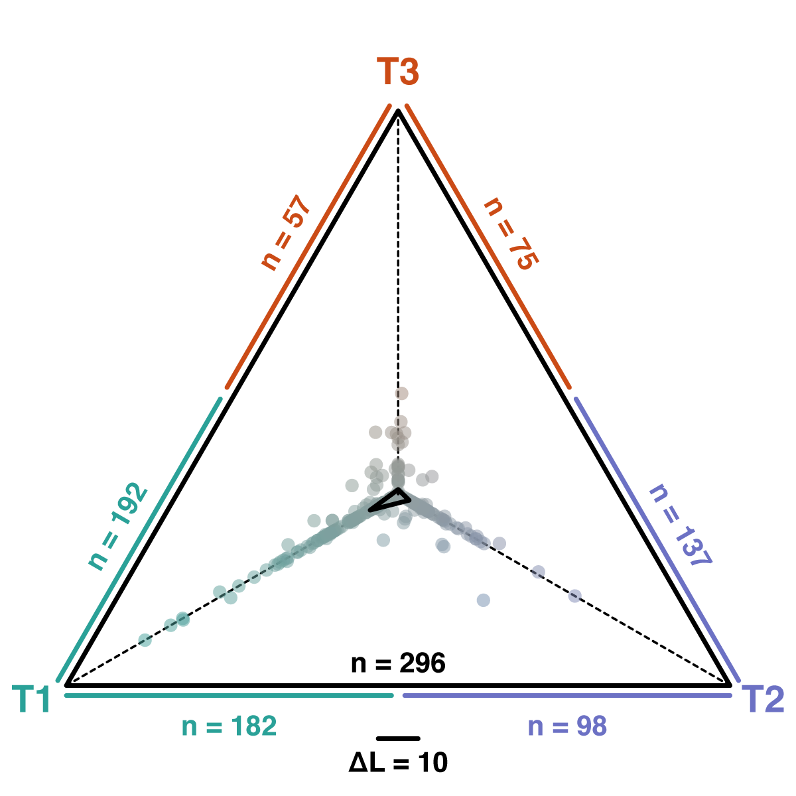

# Analysis of Introgression with Tree Topologies

A tutorial on the analysis of hybridization and introgression with whole-chromosome alignments 
By [Michael Matschiner](https://evoinformatics.group/team.html#michaelmatschiner)

## Summary

Comparisons of the frequencies of tree topologies, inferred from sequence alignments from across the genome, can serve as a useful complement to SNP-based analyses for the detection of past introgression events. Importantly, introgression tests based on such sets of phylogenies could be robust to conditions that may produce misleading results in the ABBA-BABA test. In particular, the ABBA-BABA test assumes identical substitution rates for all species and the absence of homoplasies so that derived sites can only be shared if they had the same origin; the possibility of multiple independent substitutions at the same site is ignored. These conditions assumed by the ABBA-BABA test are likely to hold in sets of recently diverged species, but may be problematic when more divergent species are compared. Phylogenetic approaches based on sequence alignments can therefore serve to verify or reject patterns of introgression determined with SNP-based methods.

On the other hand, test using tree topologies also have assumptions that may likely be violated by most genomic datasets, and could potentially produce misleading results. One such assumption is the expectation that a single tree describes the history of all sites of an alignment. This may be true for non-recombining sequences like the mitochondrial genome, but whenever recombination has occurred within an alignment, sites from one and the same alignment might have evolved along two or more distinct trees. If that is the case, the tree inferred from the alignment might not represent any of these trees correctly. How this might affect the frequencies of tree topologies and potential signals of introgression remains questionable. This potential issue has been ignored in all of the previous tutorials that used alignments, but will be addressed in this tutorial.

## Table of contents

* [Outline](#outline)
* [Dataset](#dataset)
* [Requirements](#requirements)
* [Assessing the effect of recombination with c-genie](#cgenie)
* [Identifying alignments for phylogenetic analysis](#alignments)
* [Inferring alignment phylogenies with IQ-TREE](#iqtree)
* [Analyzing frequencies of trio topologies](#frequencies)
* [Genome-wide genealogy interrogation](#interrogation)

## Outline

In this tutorial I am going to demonstrate how comparisons of tree topologies, inferred from alignments sampled from across the genome, can be used to infer past introgression events. I will first present the use of [c-genie](https://github.com/mmatschiner/c-genie) (Malinsky and Matschiner; unpublished), a tool to assess the occurrence and impact of within-alignment recombination. The information gained from this tool will then be used in the extraction of alignments for phylogenetic inference from the whole-genome alignment generated in tutorial [Whole-Genome Alignment](../whole_genome_alignment/README.md). The alignments will be filtered according to their proportion of missing data and their frequency of recombination breakpoints, to identify the most suitable alignments for phylogenetic analysis. Trees will then be inferred for each selected alignment based on maximum likelihood with IQ-TREE. The resulting set of trees will then be used to determine differences in the frequencies of alternative tree topologies for each species trio, and as with the *D*-statistics in tutorial [Analysis of Introgression with SNP data](../analysis_of_introgression_with_snp_data/README.md), these results will be visualized in the form of a heatmap. Additionally, one particular phylogenetic relationships will be analyzed in more detail by plotting differences in likelihood support for competing topological hypotheses.

## Dataset

The dataset used in this tutorial is a set of alignments extracted from the whole-genome alignment produced in tutorial [Whole-Genome Alignment](../whole_genome_alignment/README.md). This whole-genome alignment contains sequences for five species of the cichlid genus *Neolamprologus* of Lake Tanganyika: *Neolamprologus brichardi* ("neobri"), *Neolamprologus gracilis* ("neogra") *Neolamprologus marunguensis* ("neomar"), *Neolamprologus olivaceous* ("neooli"), and *Neolamprologus pulcher* ("neopul"). Additionally, the whole-genome alignment contains sequences for Nile tilapia (*Oreochromis niloticus*; "orenil"), which will be used as an outgroup. The alignments will all have a length of 1,000 bp.

## Requirements

This tutorial requires **FigTree** to be installed. Details about the installation of this tool can be found in tutorial [Bayesian Phylogenetic Inference](../bayesian_phylogeny_inference/README.md).

The following tools are required additionally:

* **Msprime:** The Python library [Msprime](https://tskit.dev/msprime/docs/stable/intro.html) ([Kelleher et al. 2016](http://journals.plos.org/ploscompbiol/article?id=10.1371/journal.pcbi.1004842)) is a requirement of the c-genie tool. The Msprime library can be installed with pip for Python, using the following commands:

		module purge
		module load Python/3.8.2-GCCcore-9.3.0
		pip install --user msprime
		
	The installation can be tested with this command:
	
		python -c 'import msprime'
		
	If this does not produce an error message, the installation was successful.

* **SciPy:** [SciPy](https://www.scipy.org) ([Virtanen et al. 2020](https://doi.org/10.1038/s41592-019-0686-2)) is a multi-purpose Python library for scientific computing that will also be required by c-genie. It can also be installed with pip with these commands:

		pip install --user scipy

	The installation can be tested with this command:
	
		python -c 'import scipy'

## Assessing the effect of recombination with c-genie

One assumption underlying most phylogenetic analyses is that the alignments used for tree inference are free of recombination. If this assumption should be violated, the consequences for the accuracy of the phylogenetic analyses as well as all analyses of introgression based on these phylogenies would be difficult to predict. But how probable is within-alignment recombination? And how would a phylogenetic inference be influenced if it was frequent?

These questions are so far rather poorly answered, even though they are actively debated in the recent literature (e.g. [Springer and Gatesy 2016](https://doi.org/10.1016/j.ympev.2015.07.018); [Edwards et al. 2016](https://doi.org/10.1016/j.ympev.2015.10.027)). One way to approach the problem is with simulations: We could simulate how probable it would be to actually have not even a single recombination breakpoint in an alignment of a certain length, and simulated sequences could also be used to test the reliability of phylogenetic inference under these conditions. In one such study, [Lanier and Knowles (2012)](https://doi.org/10.1093/sysbio/syr128) concluded that within-alignment recombination had no noticeable effect on species-tree reconstruction; however, the simulations used in this study were for a rather small set of species, and it is not clear if the results would hold for larger phylogenies. Furthermore, the possible effects of within-alignment recombination on phylogenomic tests for introgression have so far not been tested.

To address at least the question of how probable the absence of recombination is in alignment of a certain size, we can use the Python program [c-genie](https://github.com/mmatschiner/c-genie) (Malinsky and Matschiner; unpublished). This program simulates phylogenetic histories with recombination and calculates the average length of "c-genes" ("coalescent genes"; [Doyle 1995](https://doi.org/10.2307/2419811)), genomic regions uninterrupted by recombination. In addition, c-genie also calculates the lengths of "single-topology tracts", fragments sharing the same tree topology even though recombination within these fragments might have led to variable branch lengths in different parts of the fragment. The length of these single-topology tracts might be more relevant for phylogenetic analysis than the length of c-genes, because one could argue that only those recombination breakpoints that change the tree topology within an aligment have negative consequence for phylogenetic inference while those breakpoints that only change the branch lengths are safe to ignore.

As the probability of recombination depends on many factors, including the recombination rate, the generation time, the length of branches in the species tree, and the population size, c-genie requires estimates for these parameters as input. We will here use a tree approximating the relationships of the species included in the whole-genome alignment, as well as a population size and a generation time appropriate for the cichlid species of the whole-genome alignment. For the tree, we'll use the phylogeny of the five *Neolamprologus* species that received the strongest support in [Bouckaert et al. (2019)](https://doi.org/10.1371/journal.pcbi.1006650), with the outgroup *Metriaclima zebra* ("metzeb") that was used in that study replace by the more divergent Nile tilapia (*Oreochromis niloticus*; "orenil"), as this species takes the role of the outgroup in the whole-genome alignment. The following Newick string encodes this phylogeny: "(((neomar:1.6,neogra:1.6):0.3,(neobri:1.2,(neooli:0.5,neopul:0.5):0.7):0.7):14.1,orenil:16.0)"

We'll also assume a recombination rate of 3&times;10-8 per generation, corresponding to one recombination event per generation on a chromosome that is 33 Mbp long –- a length compararable to those of cichlids. Additionally, we'll again use the assumptions of a generation time of 3 years for cichlids ([Malinsky et al. 2018](https://doi.org/10.1038/s41559-018-0717-x)) and a population size of 1.1 &times; 105 (see the tutorial [Divergence-Time Estimation with SNP Data](../divergence_time_estimation_with_snp_data/README.md)).

* Start by download the c-genie program from its [GitHub repository](https://github.com/mmatschiner/c-genie), using the following command:

		wget https://raw.githubusercontent.com/mmatschiner/c-genie/master/c-genie

* Make c-genie executable:

		chmod +x c-genie

* Then, have a look at the help text of c-genie with this command:

		module load Python/3.8.2-GCCcore-9.3.0
		./c-genie -h
		
	(for some strange reason, this command might take a while on Saga before producing any screen output).
		
	When the help text appears, you'll see that besides calculating the lengths of c-genes and single-topology tracts, c-genie also allows the simulation of alignments with recombination, which can then be used to test the accuracy of phylogenetic methods in the presence of within-alignment recombination. Here, however, we will use c-genie only to find out how plausible the assumed absence of recombination in our alignments of a certain size really is.
	
* You may also have noticed from c-genie's help text that a generation time of 3 years and a recombination rate of 3 &times;10-8 are already the default values for these two parameters; thus, we only need to specify the species tree and the population size estimate from the SNAPP analysis in tutorial [Divergence-Time Estimation with SNP Data](../divergence_time_estimation_with_snp_data/README.md).

* Write a new file named `c-genie.tre` with the Newick string for the phylogeny that should be used for simulations. The file should have this content:

		(((neomar:1.6,neogra:1.6):0.3,(neobri:1.2,(neooli:0.5,neopul:0.5):0.7):0.7):14.1,orenil:16.0)

* Execute c-genie with file `c-genie.tre` as the species tree, "cichlids" as the prefix for the output file, a recombination rate of 3 &times;10-8 (`-r 3E-8`), a generation time of 3 years (`-g 3`),  and an assumed population size of 1.1 &times; 105 (`-n 1.1E5`):

		srun --ntasks=1 --mem-per-cpu=1G --time=00:10:00 --account=nn9458k --pty ./c-genie c-genie.tre cichlids -r 3E-8 -g 3 -n 1.1E5

	This anaysis should finish within a few minutes. As you should then see from the screen output of c-genie, an output file in HTML format has been written to file `cichlids.html`.

* Download the HTML file `cichlids.html` from Saga to your local computer using `scp`.

* Open the HTML file `cichlids.html` in a web browser such as Firefox and scroll through the plots included in this file.

	**Question 1:** What are the mean lengths of c-genes and single-topology tracts? What is the probability that an alignment of 2,500 bp includes just one c-gene or one single-topology tract? [(see answer)](#q1)

* Repeat the simulations with different assumptions for the population size to see how these assumptions inluence the resulting lengths of c-genes and single-topology tracts.

There are some reasons why the lengths of c-genes and single-topology tracts may not be as short in practice as the results of c-genie may suggest. For example, undetected past population bottlenecks would reduce the amount of incomplete lineage sorting, which could extend the length of both types of fragments. In addition, the presence of "recombination deserts" ([Yu et al. 2001](https://doi.org/10.1038/35057185)) could lead to some very large c-genes and single-topology tracts. Nevertheless, it is important to be aware of the possible presence of recombination within the alignments used for phylogenetic inference. While the study of [Lanier and Knowles (2012)](https://doi.org/10.1093/sysbio/syr128) suggested that within-alignment recombination may in fact not have a strong influence on the inference of the species-tree topology, the consequences for divergence-time estimates and downstream analyses of introgression are less clear and should be investigated in future studies.

## Identifying alignments for phylogenetic analysis

Ideally, alignments used for phylogenetic analysis should have as little missing data as possible, be as informative as possible, and show no signs of within-alignment recombination. Thus, we are for this tutorial again going to extract alignments from the whole-genome alignment produced in tutorial [Whole-Genome Alignment](whole_genome_alignment/README.md) while filtering for information content (completeness and number of polymorphic sites), but to reduce the probability of within-alignment recombination, we are, we will also quantify signals of recombination per alignment and remove those alignments for which these signals are strongest.

As the length of all alignments, we use 1,000 bp, assuming that this length is a good compromise between increasing probability of recombination with longer alignments and decreasing phylogenetic signal with shorter alignments. For a more thorough analysis, however, it might be worth testing a range of different alignment lengths.

* Make sure that you still have the script `make_alignments_from_maf.py`, which was used in tutorials [Maximum-Likelihood Inference of Species Networks](../ml_inference_of_species_networks/README.md) and [Bayesian Inference of Species Networks](../bayesian_inference_of_species_networks/README.md), in your current directory on Saga. If not, copy it from `/cluster/projects/nn9458k/phylogenomics/week2/src` or download it from GitHub, using one of the following two commands:

		cp /cluster/projects/nn9458k/phylogenomics/week2/src/make_alignments_from_maf.py .
		
	or

		wget https://raw.githubusercontent.com/ForBioPhylogenomics/tutorials/main/week2_src/make_alignments_from_maf.py

* Also make sure that the whole-genome alignment file `cichlids_chr5.maf` is still in your current directory. If the file should be missing, copy it from `/cluster/projects/nn9458k/phylogenomics/week2/data`:

		cp /cluster/projects/nn9458k/phylogenomics/week2/cichlids_chr5.maf .

Unlike in the earlier tutorials, we are now going to extract a much larger number of alignments, first because the shorter alignment length of 1,000 bp now allows more alignments to be extracted, and second because we will still filter the alignments by their signals for recombination.

* Execute the script `make_alignments_from_maf.py` to extract up to a maximum of 5,000 alignments (`-n 10000`) with a length of 1,000 bp (`-l 1000 -k 1000`) in Nexus format (`-f nexus`) from the whole-genome alignment `cichlids_chr5.maf`, using only those with sequences for all six species of the whole-genome alignment (`-x 6`), a completeness of at least 90% (`-c 0.95`), and at least 20 polymorphic sites (`-m 10`):

		module load Python/3.8.2-GCCcore-9.3.0
		srun --ntasks=1 --mem-per-cpu=1G --time=00:10:00 --account=nn9458k --pty python make_alignments_from_maf.py cichlids_chr5.maf cichlids -n 10000 -x 6 -l 1000 -k 1000 -c 0.95 -m 10 -p short_alignments -f nexus

	The last line of the screen output should indicate that close to 7,000 alignments have been written to directory `short_alignments`.

* Make sure that close to 7,000 alignments in Nexus format are in fact in the new directory `short_alignments`:

		ls short_alignments/*.nex | wc -l

* Have a look at the content of directory `short_alignments`. To see a list of the first 20 Nexus files in that directory, use `ls` and `head`:

		ls short_alignments/*.nex | head -n 20
	
* Download one of these Nexus files to your local computer with `scp` and open it with either a text editor or preferably with an alignment viewer like SeaView or [AliView](https://ormbunkar.se/aliview/) ([Larsson 2014](https://doi.org/10.1093/bioinformatics/btu531)), to get a sense of the completeness and the variation present in the alignment. As in the next screenshot, you'll probably find that most of the variation distinguishes the outgroup sequence "orenil" from the five other sequences, and that there may therefore be relatively little information for the inference of relationships among the five ingroup species of the genus *Neolamprologus*:

As a measure of within-alignment recombination, we are going to quantify the number of so-called hemiplasies in each alignment, and we will use this measure as a criterion for filtering. Simply put, a hemiplasy is a site that supports a grouping that is in conflict with a grouping supported by another site of the same alignment. Possible explanations for hemiplasy include sequencing errors but within-alignment recombination in combination with incomplete lineage sorting can also produce them. And because within-alignment recombination can lead to unreliable phylogenetic inference, this means that alignments with none of few hemiplasies are more suitable for phylogenetic inference than other alignments with many hemiplasies ([Maynard Smith and Smith, 1998](https://doi.org/10.1093/oxfordjournals.molbev.a025960)).

Fortunately, the number of hemiplasies can easily be approximated as the difference between the number of variable sites and the so-called parsimony score of an alignment, which is the lowest number of substitutions on a phylogeny that is required to produce the alignment (the result is only an approximation because some hemiplasies may increase the parsimony-score by more than 1 if three or more substitutions are required to explain them). To calculate the number of variable sites, the script `get_number_of_variable_sites.rb` can be used.

* Download the script `get_number_of_variable_sites.rb` from the GitHub repository of the study by [Ronco et al. (2021)](https://doi.org/10.1038/s41586-020-2930-4) to your current directory on Saga:

		wget https://raw.githubusercontent.com/cichlidx/ronco_et_al/master/lt_phylogenomics/src/get_number_of_variable_sites.rb

* Before moving on to calculate parsimony scores, first test this script with the first Nexus file in directory `short_alignments` to make sure that it's working:
	
		module load Ruby/2.7.2-GCCcore-9.3.0
		nex=`ls short_alignments/*.nex | head -n 1`
		srun --ntasks=1 --mem-per-cpu=1G --time=00:01:00 --account=nn9458k --pty ruby get_number_of_variable_sites.rb ${nex}

	This should write just a single number to the screen.

The calculation of parsimony scores requires the software PAUP\*, which is installed on Saga and has already been used in tutorial [Species-Tree Inference with SNP Data](species_tree_inference_with_snp_data). Conveniently, we can use another script from the GitHub repository of [Ronco et al. (2021)](https://doi.org/10.1038/s41586-020-2930-4) to run PAUP\* and calculate the parsimony score for an input file in Nexus format.

* Download the script `get_parsimony_score.sh` from the GitHub repository of [Ronco et al. (2021)](https://doi.org/10.1038/s41586-020-2930-4):

		wget https://raw.githubusercontent.com/cichlidx/ronco_et_al/master/lt_phylogenomics/src/get_parsimony_score.sh

	This script performs several steps: It writes a command file for PAUP\* which specifies the task that PAUP\* should perform as well as the input file, then it runs PAUP* with this command file, it reads the output of PAUP* to extract the parsimony score, reports that score, and finally it removes the temporary files that were written by PAUP* to clean up the directory.

* Before running the script `get_parsimony_score.sh`, we have to make a single change the script. Open the file `get_parsimony_score.sh` with a text editor available on Saga, and delete lines 3 and 4, which have the following content: 

		# Load the paup module.
		module load paup/4.0a163

* Then check that the script works by running it with the first Nexus file in directory `short_alignments`, using the following commands:

		module load PAUP/4.0a168-centos64
		nex=`ls short_alignments/*.nex | head -n 1`
		srun --ntasks=1 --mem-per-cpu=1G --time=00:02:00 --account=nn9458k --pty bash get_parsimony_score.sh ${nex}

	The reported parsimony score should be identical or greater than the number of variable sites, calculated before for the same alignment.

* Now, use the two different scripts jointly to quantify the number of hemiplasies for all alignments (as the difference between the parsimony score and the number of variable sites), and to record this information in a new table that will be named `short_alignment_stats.txt`. To do that, write a new Slurm script named `get_numbers_of_hemiplasies.slurm` in which the two other scripts are called and the two numbers reported by them are subtracted from each other. The Slurm script should have the following content:

		#!/bin/bash
		
		# Job name:
		#SBATCH --job-name=get_hemiplasies
		#
		# Wall clock limit:
		#SBATCH --time=1:00:00
		#
		# Processor and memory usage:
		#SBATCH --ntasks=1
		#SBATCH --mem-per-cpu=1G
		#
		# Accounting:
		#SBATCH --account=nn9458k
		#
		# Output:
		#SBATCH --output=get_numbers_of_hemiplasies.out
		
		# Set up job environment.
		set -o errexit  # Exit the script on any error
		set -o nounset  # Treat any unset variables as an error
		module --quiet purge  # Reset the modules to the system default
		
		# Load modules.
		module load Ruby/2.7.2-GCCcore-9.3.0
		module load PAUP/4.0a168-centos64

		# Get the command-line argument.
		last_char=${1}

		# Get the absolute path of the alignment directory.
		alignment_dir=`readlink -f short_alignments`

		# Set an output file with absolute path.
		out=`readlink -f short_alignment_stats_${last_char}.txt`

		# Copy scripts to a temporary directory.
		cp get_number_of_variable_sites.rb ${SCRATCH}
		cp get_parsimony_score.sh ${SCRATCH}

		# Change to the temporary directory.
		cd ${SCRATCH}

		# Make sure that the output file is not present already.
		rm -f ${out}
		
		# Get the numbers of hemiplasies per alignment.
		for nex in ${alignment_dir}/*${last_char}.nex
		do
			id=`basename ${nex%.nex}`
			n_variable_sites=`ruby get_number_of_variable_sites.rb ${nex}`
			parsimony_score=`bash get_parsimony_score.sh ${nex}`
			n_hemiplasies=$((${parsimony_score}-${n_variable_sites}))
			echo -e "${id}\t${n_variable_sites}\t${n_hemiplasies}" >> ${out}
		done

	As you may have noticed, this script is using the same quick-and-dirty trick for parallelization as the script `prepare_phylonet.slurm` that was used in tutorial [Maximum-Likelihood Inference of Species Networks](../ml_inference_of_species_networks/README.md). The variable `last_char` stores a number that can be passed to the script when it is called on the command line, and the script then only processes Nexus files with names ending in that number. Thus, by calling the script ten times with different numbers, ten batches of files will be processed in parallel. The script will write the numbers of variable sites and hemiplasies to ten different output files named `short_alignment_stats_0.txt` to `short_alignment_stats_9.txt`; each of these output files then contains the results for one of the ten batches.
	
	You may also have noticed that in contrast to similar scripts that were used in other tutorials, this script is using a temporary directory. This is necessary, because each of the ten times that the script is executed, temporary files are written for PAUP\*, and these temporary files would lead to conflict when they are written ten times to the same directory.
	
* Submit this new Slurm script ten times with `sbatch` using the following loop:

		for i in {0..9}; do sbatch get_numbers_of_hemiplasies.slurm ${i}; done
	
* As soon as the script starts running, make sure that the output files are being written by the script:

		ls short_alignment_stats_?.txt

* Monitor how the number of rows in all output files is growing as the script runs, by repeatedly using the following command:

		cat short_alignment_stats_?.txt | wc -l
		
	All alignment files should be processed by the script after around 12 minutes.
	
* Combine all output files of the script into a single one named `short_alignment_stats.txt` (and add a header line) with the following commands:

		echo -e "id\tn_variable_sites\tn_hemiplasies" > short_alignment_stats.txt
		cat short_alignment_stats_?.txt >> short_alignment_stats.txt
	
* Have a look at the content of file `short_alignment_stats.txt `, using `less`:

		less short_alignment_stats.txt

	You'll see that the file contains a table with three columns, of which the first lists the alignment ID, the second the number of variable sites in the alignment, and the third the number of hemiplasies in the alignment.
	
It is likely that the numbers of variable sites and hemiplasies correlate with each other, because without variable sites, an alignment could not have any hemiplasies. However, the most suitable alignments for phylogenetic inference are those with a large number of variable sites (thus, much phylogenetic information) and a small number of hemiplasies. We are therefore going to filter the alignments based on these two criteria. But before, we will need to decide on thresholds for the two criteria. To allow us to determine suitable thresholds on the minimum number of variables sites and the maximum number of hemiplasies in alignments, we will plot the two measures against each other.

* Write a new R script named `plot_n_variable_and_n_hemiplasies.r` with the following content:

		table <- read.table("short_alignment_stats.txt", header=T)
		pdf("short_alignment_stats.pdf", height=7, width=7)
		plot(table$n_variable_sites, table$n_hemiplasies, xlim=c(0,100), xlab="Variable sites", ylab="Hemiplasies", pch=16, col = rgb(red=0, green=0, blue=0, alpha=0.2))
		dev.off()

* Then, use the following commands to execute the R script `plot_n_variable_and_n_hemiplasies.r`:

		module load R/4.0.0-foss-2020a
		srun --ntasks=1 --mem-per-cpu=1G --time=00:01:00 --account=nn9458k --pty Rscript plot_n_variable_and_n_hemiplasies.r

	This should produce file `short_alignment_stats.pdf`
	
* Download file `short_alignment_stats.pdf` from Saga to your local computer with `scp`, and open it in a PDF viewer. The plot should look roughly like the one shown below.

		
	Given the above plot, a reasonable choice for filtering the most suitable alignments may be to use only those with at least 40 variable sites and no more than one hemiplasy.

* To filter the most suitable alignments, write a new script named `filter_alignments.sh` with the following content:

		mkdir -p short_alignments_filtered
		cat short_alignment_stats.txt | tail -n +2 | awk '$2 >= 50' | awk '$3 == 0' | cut -f 1 > tmp.txt
		while read line
		do
			echo "Selecting file short_alignments/${line}.nex"
			cp short_alignments/${line}.nex short_alignments_filtered
		done < tmp.txt
		rm tmp.txt

* Execute the script `filter_alignments.sh ` with `srun`:

		srun --ntasks=1 --mem-per-cpu=1G --time=00:02:00 --account=nn9458k --pty bash filter_alignments.sh

	**Question 2:** How many alignments have been moved to directory `short_alignments_filtered`? [(see answer)](#q2)

## Phylogenetic inference with IQ-TREE

In this part of the tutorial, we are going to infer phylogenies for each filtered alignment; the set of inferred phylogenies will subsequently be used to determine asymmetries in the topologies of species trios which can serve as an indicator for introgression. Note that it may in fact be important for this subsequent test that the set of phylogenies is generated based on maximum likelihood, without assuming a clock model as in BEAST2 analyses. While this conclusion should be tested in more detail, I found in preliminary analyses that clock-rate variation among species may influence the frequencies of species-trio topologies in time-calibrated analyses, but that it has no or only weak effect on maximum-likelihood inference without a clock model. As a result, I also do not recommend any longer to use the related approach of [Meyer et al. (2017)](https://doi.org/10.1093/sysbio/syw069), in which asymmetry in divergence times among species trios was used to infer introgression.

As in tutorials [Maximum-Likelihood Phylogenetic Inference](../ml_phylogeny_inference/README.md) and [Maximum-Likelihood Species-Tree Inference](../ml_species_tree_inference/README.md), we are going to use IQ-TREE for maximum-likelihood phylogenetic inference and by not specifying a substitution model we allow IQ-TREE to automatically select the best-fitting model itself. No bootstrap replicates are required this time, but we will need to specify the ID of the outgroup "orenil" so that the resulting trees are rooted.

* To run IQ-TREE for all filtered alignments, write a Slurm script named `run_iqtree_filtered.slurm` with the following content:

		#!/bin/bash

		# Job name:
		#SBATCH --job-name=iqtree_filtered
		#
		# Wall clock limit:
		#SBATCH --time=0:20:00
		#
		# Processor and memory usage:
		#SBATCH --ntasks=1
		#SBATCH --mem-per-cpu=1G
		#
		# Accounting:
		#SBATCH --account=nn9458k
		#
		# Output:
		#SBATCH --output=run_iqtree_filtered.out

		# Set up job environment.
		set -o errexit  # Exit the script on any error
		set -o nounset  # Treat any unset variables as an error
		module --quiet purge  # Reset the modules to the system default
		
		# Load the iqtree module.
		module load IQ-TREE/2.1.2-foss-2020a

		for nex in short_alignments_filtered/*.nex
		do
			iqtree2 -s ${nex} -o orenil
		done

* Submit the Slurm script `run_iqtree_filtered.slurm` with `sbatch`:

		sbatch run_iqtree_filtered.slurm

	IQ-TREE should require no more than a few minutes to finish this set of analyses.
	
* Combine all inferred phylogenies into a single file, using the following command:

		cat short_alignments_filtered/*.treefile > short_alignments_filtered.trees
		
* You could then remove all output files produced by IQ-TREE to clean up the directory:

		rm short_alignments_filtered/*.nex.*

* You may want to browse through some of the trees to get a feeling of how reliable they are. To do so, download file `short_alignments_filtered.trees` from Saga to your local computer with `scp` and open the file in FigTree.

	You will probably see that most of the alignments contain polytomies and short branches that separate the five *Neolamprologus* species, indicating that most of the variable sites separate the outgroup from the ingroup, but that there is rather little phylogenetic information about the relationships of the ingroup species.

## Analyzing frequencies of trio topologies

Analogous to the logic behind the ABBA-BABA test in tutorial [Analysis of Introgression with SNP Data](../analysis_of_introgression_with_snp_data/README.md), asymmetry in the topologies of species trios can be used to identify past introgression. In the absence of introgression, we would expect that local phylogenies of three species P1, P2, and P3 most frequently support the topology of the true species tree (e.g. a clade formed by P1 and P2 if these are in fact sister species), and that the two alternative topologies (e.g. a clade formed by P1 and P3 or a clade formed by P2 and P3) should occur equally frequently. A significant difference in the frequencies of the two alternative topologies is therefore not compatible with a null hypothesis of no introgression, meaning that such a significant difference would support the occurrence of past introgression. An important difference to the ABBA-BABA test may be that the analysis of tree asymmetry could be more robust to rate variation among species; however, this hypothesis remains to be tested with simulations.

To analyze the frequencies of alternative trio topologies in the set of trees, we can use the Ruby script `analyze_tree_asymmetry.rb` from [Ronco et al. (2021)](https://doi.org/10.1038/s41586-020-2930-4).

* Download the script `analyze_tree_asymmetry.rb` from the [GitHub repository](https://github.com/cichlidx/ronco_et_al) of [Ronco et al. (2021)](https://doi.org/10.1038/s41586-020-2930-4):

		wget https://raw.githubusercontent.com/cichlidx/ronco_et_al/master/age_determination/introgression_detection/src/analyze_tree_asymmetry.rb

	This script should work well with any file that contains a set of trees in Newick format. It determines the set of species in these trees and then tests for each possible species trio how often two of the three species form a pair relative to the third species. These frequencies are then used to place the three species in positions P1, P2, and P3 so that

	*N*(P1,P2) > *N*(P2,P3) > *N*(P1,P3),

	where *N*(P1,P2) is the frequency at which P1 and P2 form a pair, *N*(P2,P3) is the frequency of pairs formed by P2 and P3, and *N*(P1,P3) is the frequency of pairs formed by P1 and P3. An equivalent to the *D*-statistic is then calculated as

	*D* = (*N*(P2,P3) - *N*(P1,P3)) / (*N*(P2,P3) + *N*(P1,P3))

	and a *p*-value for the null hypothesis of no imbalance between *N*(P1,P3) and *N*(P2,P3) is calculated based on a [binomial test](https://en.wikipedia.org/wiki/Binomial_coefficient).

* To quantify tree asymmetry, run the script `analyze_tree_asymmetry.rb` with the tree file `short_alignments_filtered.trees`, and specify that the output should be written to a new file named `short_alignments_filtered_topology_frequencies.txt`, using the following commands:

		module load Ruby/2.7.2-GCCcore-9.3.0
		srun --ntasks=1 --mem-per-cpu=1G --time=00:02:00 --account=nn9458k --pty ruby analyze_tree_asymmetry.rb short_alignments_filtered.trees short_alignments_filtered_topology_frequencies.txt

* Have a look at the file `short_alignments_filtered_topology_frequencies.txt` produced by script `analyze_tree_asymmetry.rb`, for example using `less`:

		less short_alignments_filtered_topology_frequencies.txt

	The content of this file should show results similar to the following:
	
		p1        p2        p3         n(p1,p2)  n(p2,p3)  n(p1,p3)    d         p
		neogra    neobri    neomar          154       149       133    0.057    0.37175953
		neooli    neobri    neogra          174       155       107    0.183    0.00360722
		neopul    neobri    neogra          200       130       106    0.102    0.13417782
		neogra    neobri    orenil          229         0         0    0.000    1.00000000
		neobri    neooli    neomar          169       137       130    0.026    0.71354871
		neobri    neopul    neomar          199       126       111    0.063    0.36317039
		neomar    neobri    orenil          231         0         0    0.000    1.00000000
		neooli    neopul    neobri          207       142        87    0.240    0.00033841
		neooli    neobri    orenil          249         0         0    0.000    1.00000000
		neopul    neobri    orenil          271         0         0    0.000    1.00000000
		neooli    neomar    neogra          158       148       130    0.065    0.30791682
		neopul    neomar    neogra          160       146       130    0.058    0.36660967
		neomar    neogra    orenil          216         0         0    0.000    1.00000000
		neooli    neopul    neogra          264        94        78    0.093    0.25266245
		neooli    neogra    orenil          208         0         0    0.000    1.00000000
		neopul    neogra    orenil          212         0         0    0.000    1.00000000
		neooli    neopul    neomar          245        99        92    0.037    0.66429599
		neooli    neomar    orenil          230         0         0    0.000    1.00000000
		neopul    neomar    orenil          234         0         0    0.000    1.00000000
		neopul    neooli    orenil          320         0         0    0.000    1.00000000
		...

	The format of this file is similar to that written by the program Dsuite in tutorial [Analysis of Introgression with SNP Data](../analysis_of_introgression_with_snp_data/README.md). Each row includes results for one species trio, with the frequencies of the three alternative topologies in columns 4 to 6, followed by the equivalent to the *D*-statistic in the seventh column and the *p*-value in the last. For the species trios that include *Oreochromis niloticus* ("orenil"), the frequencies *N*(P1,P3) and *N*(P2,P3) are all 0, which is not surprising because we had set this species to be the outgroup. The reason why in these trios only a proportion of the approximately 440 trees support *N*(P1,P2) is that, as in the screenshot of a phylogeny shown above, IQ-TREE places the outgroup with another species in a polytomy at the root, and the script `analyze_tree_asymmetry.rb` ignores trios connected by polytomies. But since the frequencies of topologies in species trios that include the outgroup are by definition never asymmetric, we can ignore these comparisons anyway. More conclusive results are given for species trios within the ingroup, for example for the trio of "neooli", "neobri", and "neogra", where (in my analysis) 174 trees pair "neooli" and "neobri" and 155 trees pair "neobri" and "neogra", but only 107 trees pair "neobri" and "neogra". As indicated by the high *D*-statistic around 0.18 and the *p*-value of 0.003, this asymmetry can not be explained by incomplete lineage sorting alone.

	**Question 3:** Which species trio has the highest *D*-statistic in this table? [(see answer)](#q3)

A good way of plotting the asymmetry among alternative trio topologies, and the significance of this asymmetry, is in the form of a heatmap, just like the results of the Dsuite analyses were plotted in tutorial [Analysis of Introgression with SNP Data](../analysis_of_introgression_with_snp_data/README.md). This heatmap plot can be generated with the Ruby script `plot_tree_asymmetry.rb` from [Ronco et al. (2021)](https://doi.org/10.1038/s41586-020-2930-4).

* Download the script `plot_tree_asymmetry.rb` from the [GitHub repository](https://github.com/cichlidx/ronco_et_al) of [Ronco et al. (2021)](https://doi.org/10.1038/s41586-020-2930-4):

		wget https://raw.githubusercontent.com/cichlidx/ronco_et_al/master/age_determination/introgression_detection/src/plot_tree_asymmetry.rb

	This script requires the following four command-line arguments:

	* the name of the file produced by script `analyze_tree_asymmetry.rb`,
	* the name of a file that lists the order in which the species should be listed along the heatmap axes,
	* the *D*-statistic corresponding to the end of the color range used in the plot,
	* the name of the output file, which will be in scalable vector graphic (SVG) format.

	Thus, the only input that is still missing is the file specifying the order in which species should be plotted.
	
* To generate a file with the order in which species should be plotted, write a new file named `short_alignments_species_order.txt` with the following content:

		orenil
		neomar
		neogra
		neobri
		neopul
		neooli

* Execute script `plot_tree_asymmetry.rb` with files `short_alignments_filtered_topology_frequencies.txt` and `short_alignments_species_order.txt` as input, and name the output file `short_alignments_filtered_topology_frequencies.svg`:

		srun --ntasks=1 --mem-per-cpu=1G --time=00:02:00 --account=nn9458k --pty ruby plot_tree_asymmetry.rb short_alignments_filtered_topology_frequencies.txt short_alignments_species_order.txt short_alignments_filtered_topology_frequencies.svg

* Download the output file `short_alignments_filtered_topology_frequencies.svg` from Saga to your local computer, and open it with a program capable of reading files in SVG format, for example with a browser such as Firefox or with Adobe Illustrator. The heatmap plot should look as shown below:

	The patterns of asymmetry in topology frequencies therefore strongly support introgression between *Neolamprologus brichardi* ("neobri") and *Neolamprologus pulcher* ("neopul"), as also identified by [Gante et al. (2016)](https://onlinelibrary.wiley.com/doi/abs/10.1111/mec.13767) and [Bouckaert et al. (2019)](https://journals.plos.org/ploscompbiol/article?id=10.1371/journal.pcbi.1006650). However, considering that we only used data from a single chromosome and just a single sample per species, more definite conclusions could certainly be gained from more extensive analyses!

## Genome-wide genealogy interrogation

The use of short alignments for tree inference can help to reduce the impact of within-alignment recombination. Unfortunately, such short regions often do not have sufficient phylogenetic information; however, they can still be very useful to investigate phylogenetic relationships at one particular node, in a method termed genealogy interrogation by [Arcila et al. (2017)](https://www.nature.com/articles/s41559-016-0020). When using this method, each alignment is used repeatedly in maximum-likelihood phylogenetic analyses, each time with a different topological constraint for a particular relationship. The results of interest in these constrained analyses are then not the inferred phylogenies, but the likelihoods obtained with the different constraints. Even with alignments that are too short to resolve much of the phylogeny, those likelihoods can differ to the extent that it is possible to discriminate the support for the different topological hypotheses, as the hypothesis leading to the highest likelihoods for most alignments could then be considered to correspond to the species-tree topology. Moreover, asymmetry in the likelihood values supporting the two alternative topologies can again indicate whether these alternative topologies result from incomplete lineage sorting and low phylogenetic signal or whether introgression has influenced their frequencies.

In this part of the tutorial, we are going to apply genealogy interrogation to investigate, in more detail than above, the relationship among the three species *Neolamprologus brichardi* ("neobri"), *Neolamprologus pulcher* ("neobri"), and *Neolamprologus olivaceous* ("neooli"). Among these species, introgression between *Neolamprologus brichardi* and *Neolamprologus pulcher* was inferred in the studies of [Gante et al. (2016)](https://onlinelibrary.wiley.com/doi/abs/10.1111/mec.13767) and [Bouckaert et al. (2019)](https://journals.plos.org/ploscompbiol/article?id=10.1371/journal.pcbi.1006650), and was supported in the above analysis of topology frequencies.

As a first step, we'll need to specify the three topological hypotheses that we want to compare. For IQ-TREE to understand these hypotheses, we'll need to write them as constraints in Newick format. This is actually rather simple because we only need to write all species IDs, separated by commas, within parentheses and we need to use one additional pair of parentheses to group the IDs of the two species that form a pair in a given hypothesis. For example, the hypothesis that "neooli" and "neopul" form a pair can be encoded in Newick format as "(orenil,neomar,neogra,neobri,(neooli,neopul));". We call this hypothesis "T1" and label the two alternative hypotheses, in which either "neopul" and "neobri" or "neooli" and "neobri" form a pair, "T2" and "T3", resepectively.

* Save three topological hypotheses to files in Newick format named `t1.tre`, `t2.tre`, and `t3.tre`, using the following three commands:

		echo "(orenil,neomar,neogra,neobri,(neooli,neopul));" > t1.tre
		echo "(orenil,neomar,neogra,neooli,(neopul,neobri));" > t2.tre
		echo "(orenil,neomar,neogra,neopul,(neooli,neobri));" > t3.tre

We are then ready to run IQ-TREE with each alignment and each topological constraint. To allow the resulting likelihoods to be comparable, we will ensure that the same substitution model is used in all analyses rather than using IQ-TREE's automatic model selection; therefore, we specify the GTR substitution model with the `-m` option in all analyses. In addition, we need to specify the topological constraint file with the `-g` option, and we turn off the verbose screen output of IQ-TREE with the `--quiet` option.

* Write a new script named `run_iqtree_ggi.slurm` with the following content:

		#!/bin/bash

		# Job name:
		#SBATCH --job-name=iqtree_ggi
		#
		# Wall clock limit:
		#SBATCH --time=0:20:00
		#
		# Processor and memory usage:
		#SBATCH --ntasks=1
		#SBATCH --mem-per-cpu=1G
		#
		# Accounting:
		#SBATCH --account=nn9458k
		#
		# Output:
		#SBATCH --output=run_iqtree_ggi.out

		# Set up job environment.
		set -o errexit  # Exit the script on any error
		set -o nounset  # Treat any unset variables as an error
		module --quiet purge  # Reset the modules to the system default

		# Load the iqtree module.
		module load IQ-TREE/2.1.2-foss-2020a
				
		# Run iqtree for all alignments.                                                                                                                              
		for nex in short_alignments_filtered/*.nex
		do
			nex_path_base=${nex%.nex}
			for constraint in t1 t2 t3
			do
				# Run iqtree with a constraint.                                                                                                                       
				iqtree2 -s ${nex} -m GTR -g ${constraint}.tre --quiet

				# Rename the main output and remove unneeded output files.                                                                                            
				mv ${nex}.iqtree ${nex_path_base%.iqtree}.${constraint}.log
				rm ${nex}.*
			done
		done

* Execute the script with `sbatch` to run IQ-TREE with all alignments and the three constraints constraints:

		sbatch run_iqtree_ggi.slurm

	These analyses should take a few minutes to finish. Once they're done, the `short_alignments_filtered` directory should contain for each alignment three files with endings `.t1.log`, `.t2.log`, and `.t3.log`.
	
* Have a look at the first of the files with ending `.t1.log`, using the `less` command:

		file=`ls short_alignments_filtered/*.t1.log | head -n 1`
		less ${file}
		
	When you scroll down to just below "MAXIMUM LIKELIHOOD TREE", you should see a line like the following:
	
		Log-likelihood of the tree: -1698.2755 (s.e. 33.8943)
		
	This number, the log-likelihood of -1698.2755, is the only result of this IQ-TREE analysis that we need for genealogy interrogation.
	
* Compare the log-likelihoods among the three different hypotheses, applied to the first alignment:
	
		Log-likelihood of the tree: -1698.2755 (s.e. 33.8943)
		Log-likelihood of the tree: -1744.3624 (s.e. 43.5217)
		Log-likelihood of the tree: -1744.3624 (s.e. 43.5218)
		
	So this means that the last two hypotheses, T2 and T3, had a very similar likelihood while the likelihood of the first hypothesis, T3, was about 46 log units higher and thus better.
	
To extract and compare the log-likelihood values from the output files of all IQ-TREE analyses, we can use the script `summarize_ggi.sh`.

* Add the script `summarize_ggi.sh` to your current directory, either by copying it from `/cluster/projects/nn9458k/phylogenomics/week2/src` or by downloading it from GitHub, using one of the following two commands:

		cp /cluster/projects/nn9458k/phylogenomics/week2/src/summarize_ggi.sh .
		
	or
	
		wget https://raw.githubusercontent.com/ForBioPhylogenomics/tutorials/main/week2_src/summarize_ggi.sh

	This script expects two arguments, namely the name of a directory in which it can find the files with endings `.t1.log`, `.t2.log`, and `.t3.log`, and the name of a new file to which its output will be written. We'll use `short_alignments_ggi.txt` as the name of this output file; thus, run the script with this command:
	
		srun --ntasks=1 --mem-per-cpu=1G --time=00:05:00 --account=nn9458k --pty bash summarize_ggi.sh short_alignments_filtered short_alignments_ggi.txt

* Have a look at the output file `short_alignments_ggi.txt`. You'll see that each line reports the comparison of likelihoods for one alignment. The second column specifies the hypothesis that received the best likelihood, and the third column indicates the difference between this likelihood and the second-best likelihood, in log units. The last three columns show the log-likelihoods themselves.

The output in file `short_alignments_ggi.txt` can be analyzed and plotted with the Ruby script `plot_ggi.rb`.

* Add the script `plot_ggi.rb` to your current directory on Saga, either by copying it from `/cluster/projects/nn9458k/phylogenomics/week2/src` or by downloading it from GitHub, using one of the following two command:

		cp /cluster/projects/nn9458k/phylogenomics/week2/src/plot_ggi.rb .
		
	or
	
		wget https://raw.githubusercontent.com/ForBioPhylogenomics/tutorials/main/week2_src/plot_ggi.rb

* Execute the script `plot_ggi.rb`, specifying `short_alignments_ggi.txt` as the name of the input file and `short_alignments_ggi.svg` as the name of the output file to which the plot will be written in SVG format:

		module load Ruby/2.7.2-GCCcore-9.3.0
		srun --ntasks=1 --mem-per-cpu=1G --time=00:01:00 --account=nn9458k --pty ruby plot_ggi.rb short_alignments_ggi.txt short_alignments_ggi.svg

* Download the output file `short_alignments_ggi.svg` from Saga to your local computer and open it with Firefox, Adobe Illustrator, or another program capable of reading SVG format. The plot should look similar to the one shown below:

 In this plot, each dot represents one alignment, and the position of the dot indicates the difference in likelihood support among the three competing hypotheses. If a dot is directly on the dashed line leading towards T1 at the bottom-left, this alignment has the best likelihood when using the T1 hypothesis and identical likelihoods when the other two hypotheses are used as constraints. When the two alternative hypotheses have different likelihoods (but both are lower than the best likelihood), then the dot is not placed directly on a dashed line but in one of the regions between them. A dot in the very center of the plot would represent an alignment that has the exact same likelihood no matter which hypothesis is used; this alignment would therefore be entirely uninformative. The black triangle near the middle of the plot connects the mean likelihoods, drawn on the three axes, of alignments that support the hypothesis corresponding to those axes. Thus, the further the central black triangle points towards the three hypotheses, the more these are supported overall. In the above plot, this central black triangle mostly indicates support for hypotheses T1 and T2 but less for T3. Finally, the numbers outside the plot indicate how many alignments have better support with T1 than with T2 or vice versa (at the bottom), better support with T2 than with T3 or vice versa (at the right), and better support with T1 than with T3 or vice versa (at the left). For example, in the above plot, 182 alignments support T1 over T2, and 98 alignments support T2 over T1.

	Overall, most alignments seem to support T1, followed by T2. Genealogy interrogation therefore supports the hypothesis that *Neolamprologus olivaceous* and *Neolamprologus pulcher* form sister species in the species tree, in line with the results obtained in tutorial [Divergence-Time Estimation with SNP Data](../divergence_time_estimation_with_snp_data/README.md). However, genealogy interrogation further shows that the support for the two alternative topologies T2 and T3 is not balanced, instead 137 alignments support T2 over T3 and only 75 alignments support T3 over T2. This imbalance corroborates the conclusions of [Gante et al. (2016)](https://doi.org/10.1111/mec.13767) and [Bouckaert et al. (2019)](https://doi.org/10.1371/journal.pcbi.1006650), according to which introgression occurred between *Neolamprologus pulcher* and *Neolamprologus brichardi*.

As the analyses in this part of the tutorial have shown, genealogy interrogation can be useful to resolve relationships and identify introgression at one selected node of a phylogeny. The good thing about this type of analysis is that short and rather uninformative alignments can be used, which reduces the degree to which the analyses could be influenced by within-alignment recombination. Importantly, the fact that short alignments are sufficient also means that genealogy interrogation can be applied to datasets that consist exclusively of short alignments, such as RADseq data, opening up new possibilities for phylogenetic analyses and introgression tests in studies based on such datasets.

 

                   

## Answers

* **Question 1:** Unfortunately, the mean lengths of c-genes and single-topology tracts are extremely short: between 14 and 45 bp. Consequently, the probability that an  alignment with a length of 2,000 bp (and by extrapolation this also applies to alignments with lengths of 2,500 bp) contains just one c-gene or single-topology tract is 0. Instead, alignments of this length contain on average around 141 c-genes and about 45 single-topology tracts. This means that if our assumptions for the species tree, the recombination rate, and the population size were correct, phylogenies inferred for alignments with a lenth over 2,000 bp in fact would average over a large number of different topologies. Unsurprisingly, the expected numbers of c-genes and single-topology tracts per alignment are roughly halved when the alignment is 1,000 bp instead of 2,000 bp.

* **Question 2:** Around 440 alignments should have passed the filtering and should therefore have been copied to directory `short_alignments_filtered`:

		ls short_alignments_filtered/*.nex | wc -l

* **Question 3:** The trio with the highest *D*-statistic is probably the one with "neooli", "neopul", and "neobri", in which 207 trees pair "neooli" and "neopul" and 142 trees pair "neopul" and "neobri" but only 87 trees pair "neooli" and "neobri". The *D*-statistic for this trio should be around 0.24 and the *p*-value should be around 0.0003.