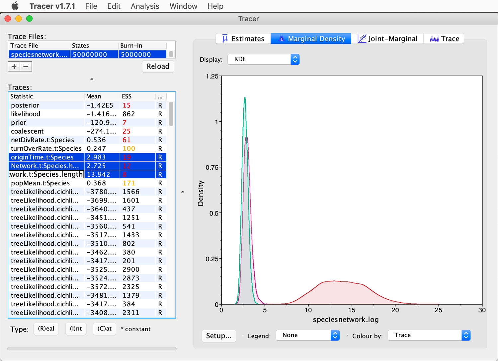

# Bayesian Inference of Species Networks

A tutorial on Bayesian phylogenetic inference of species networks 
By [Michael Matschiner](https://evoinformatics.group/team.html#michaelmatschiner)

## Summary

In addition to tools employing the maximum-likelihood framework like PhyloNet, Bayesian methods for the inference of species networks have also been developed. In this context, the application of Bayesian methods may be even more relevant than in the inference of non-reticulating trees, given that many different histories of divergence and introgression can produce highly similar genomic datasets and these datasets therefore often have too little power to identify the exact evolutionary history. Bayesian inference share these difficulties in identifying the true evolutionary history in such situations, but in contrast to maximum-likelihood methods, Bayesian methods will not just produce one single result but can show the range of plausible histories through their estimated posterior distributions. While Bayesian methods for the inference of species networks are computationally still very demanding, their continued development is likely going to have a strong impact on the field of phylogenomics.

## Table of contents

* [Outline](#outline)
* [Dataset](#dataset)
* [Requirements](#requirements)
* [Bayesian analysis of species networks with BEAST2](#speciesnetworks)

## Outline

In this tutorial I am going to present the use of SpeciesNetwork ([Zhang et al. 2017](https://doi.org/10.1093/molbev/msx307)), which is implemented as an add-on package for [BEAST2](https://www.beast2.org) ([Bouckaert et al. 2019](https://doi.org/10.1371/journal.pcbi.1006650)) and allows the joint Bayesian inference of species relationships and possible hybridization events among them.

## Dataset

The dataset used in this tutorial is a set of 40 alignments that will be extracted from the whole genome alignment produced in tutorial [Whole-Genome Alignment](../whole_genome_alignment/README.md). After removing outgroup sequences, these 40 alignments will contain gene sequences of five species of the cichlid genus *Neolamprologus* of Lake Tanganyika: *Neolamprologus brichardi* ("neobri"), *Neolamprologus gracilis* ("neogra") *Neolamprologus marunguensis* ("neomar"), *Neolamprologus olivaceous* ("neooli"), and *Neolamprologus pulcher* ("neopul"). The alignments will all have a length of 2,500 bp.

## Requirements

This tutorial requires **BEAST2** and **Tracer** to be installed. Details about the installation of these tools can be found in tutorial [Bayesian Phylogenetic Inference](../bayesian_phylogeny_inference/README.md).

The following tool is required additionally:

* **SpeciesNetwork:** [SpeciesNetwork](https://github.com/zhangchicool/speciesnetwork) ([Zhang et al. 2017](https://doi.org/10.1093/molbev/msx307)) is an add-on package for BEAST2 that combines the multi-species coalescent model with a model of reticulation, where reticulation events can be seen as instances of hybrid speciation. Like StarBEAST2 or other packages, the SpeciesNetwork package can be installed using the BEAST2 Package Manager, and this should be done both locally and on Saga, since SpeciesNetwork also influences both the appearance of the BEAUti GUI and BEAST2. To install this package locally, open the BEAST2 Package Manager through the BEAUti GUI as described for StarBEAST2, select the SpeciesNetwork package, and click "Install/Upgrade", followed by "OK". For the installation on Saga, use the following commands:

		module purge
		module load Beast/2.6.4-GCC-9.3.0
		packagemanager -add SpeciesNetwork

## Bayesian analysis of species networks with BEAST2

We are going to estimate the relationships among the five *Neolamprologus* species together with possible hybridization events using the SpeciesNetwork model for BEAST2.

* Make sure that you still have the script `make_alignments_from_maf.py`, which was used in tutorial [Maximum-Likelihood Inference of Species Networks](../ml_inference_of_species_networks/README.md), in your current directory on Saga. If not, copy it from `/cluster/projects/nn9458k/phylogenomics/week2/src` or  download it from GitHub with one of the following two commands:

		cp /cluster/projects/nn9458k/phylogenomics/week2/src/make_alignments_from_maf.py .
		
	or

		wget https://raw.githubusercontent.com/ForBioPhylogenomics/tutorials/main/week2_src/make_alignments_from_maf.py

* Also make sure that the whole-genome alignment file `cichlids_chr5.maf` is still in your current directory. If the file should be missing, copy it from `/cluster/projects/nn9458k/phylogenomics/week2/data`:

		cp /cluster/projects/nn9458k/phylogenomics/week2/cichlids_chr5.maf .

Unlike in tutorial [Maximum-Likelihood Inference of Species Networks](../ml_inference_of_species_networks/README.md), we are here going to use no more than 40 alignments to limit the run time of SpeciesNetwork. As in the other tutorial, these alignments will be extracted from the whole-genome alignment in MAF format `cichlids_chr5.maf` that was produced in tutorial [Whole-Genome Alignment](../whole_genome_alignment/README.md), but this time they need to be written in Nexus format so that they can be read by BEAUti.

* Execute the script `make_alignments_from_maf.py` to extract 40 alignments (`-n 40`) in Nexus format (`-f nexus`) from the whole-genome alignment `cichlids_chr5.maf`. All of these alignments should contain sequences for all six species included in the whole-genome alignment (`-x 6`), have a length of exactly 2,500 bp (`-l 2500 -k 2500`), a completeness of at least 95% (`-c 0.95`), and at least 20 polymorphic sites (`-m 20`):

		module load Python/3.8.2-GCCcore-9.3.0
		srun --ntasks=1 --mem-per-cpu=1G --time=00:05:00 --account=nn9458k --pty python make_alignments_from_maf.py cichlids_chr5.maf cichlids -n 40 -x 6 -l 2500 -k 2500 -c 0.95 -m 20 -p alignments -f nexus

* Make sure that 40 alignments in Nexus format have been written to the directory `alignments`:

		ls alignments/*.nex | wc -l

To limit the run time of SpeciesNetwork, we will exclude the outgroup species, Nile tilapia (*Oreochromis niloticus*; "orenil"), from all alignments.

* Make sure that the script `convert.py` is still in your current directory (it was last used in tutorial [Maximum-Likelihood Species-Tree Inference](../ml_species_tree_inference/README.md)). If it should not be present, download it from GitHub:

		wget https://raw.githubusercontent.com/mmatschiner/anguilla/master/radseq/src/convert.py

	Even though we do not need to convert the file format, we are going to use this script to exclude the outgroup from all alignments.

* Write a new script, for example named `exclude_orenil.sh`, in your current directory on Saga. The script should have the following content:

		module load Python/3.8.2-GCCcore-9.3.0
		for nex in alignments/*.nex
		do
			python convert.py ${nex} tmp.nex -f nexus -x orenil
			mv -f tmp.nex ${nex}
		done

	This script will replace each of the 40 Nexus files with a version of the alignment that excludes the outgroup.
	
* Execute the script `exclude_orenil.sh` with `srun`:

		srun --ntasks=1 --mem-per-cpu=1G --time=00:05:00 --account=nn9458k --pty bash exclude_orenil.sh

* Download the 40 alignments in Nexus format from Saga to your local computer with `scp`.

* Open BEAUti and select the "SpeciesNetwork" template from BEAUti's "File" menu as shown in the next screenshot.

 This should add two new tabs to the BEAUti window named "Taxon sets" and "Gene Ploidy".

* Click "Import Alignment" in the "File" menu and select and open all 40 alignments in Nexus format. If a pop-up window should appear asking about the type of data, select "all are nucleotide" and click "OK". The "Partitions" tab should then look as shown in the next screenshot.

* Select all 40 partitions and click on "Link Clock Models" so that a single model of rate variation is used for all partitions jointly (each partition will still be given a rate multiplier that is going to be estimated, to account for slower or faster-evolving genes).

* Then, click on the "Taxon sets" tab. Just like StarBEAST2 in tutorial [Bayesian Species-Tree Inference](../bayesian_species_tree_inference/README.md), SpeciesNetwork also allows sequences from multiple samples per species, and the "Taxon sets" tab can be used to assign samples to the different species. In our case, however, the dataset contains sequences of only a single sample per species; thus, no particular assignment needs to be done. Nevertheless, the IDs used for samples and species are not allowed to be identical. Therefore, name the species with the sample name plus a suffix such as "\_spc", as shown in the screenshot below.

* As in tutorial [Bayesian Species-Tree Inference](../bayesian_species_tree_inference/README.md), the "Gene Ploidy" tab can be skipped since all sequences of our dataset are nuclear and the correct ploidy for nuclear sequences, 2, is the default setting. Thus, continue to the "Site Model" tab where the substitution model is to be specified. Ideally, we would use model averaging bModelTest, and separate such models for the three different codon positions of each gene, as in some of the other tutorials. However, this will be far too computationally demanding for the analysis with SpeciesNetwork. As a reasonable compromise between computational demand and flexibility, we'll use the HKY model of sequence evolution ([Hasegawa et al. 1985](https://doi.org/10.1007/BF02101694)) without rate variation for each gene, and we'll assume that the empirical nucleotide frequencies in each alignment correspond to their stationary frequencies so that these do not need to be estimated. Thus, select "Gamma Site Model" from the first drop-down menu, "HKY" from the second drop-down menu, and "Empirical" from the last drop-down menu next to "Frequencies", as shown in the next screenshot. Make sure that the gamma category count is set to 0 to disable among-site rate variation. Finally, set a tick in the checkbox next to "estimate" to the right of "Substitution Rate" to allow a rate multiplier for the selected gene.

* Then, select all 40 genes simultaneously from the list at the left of the window (make sure to scroll down to select all), and click "OK" to clone the settings from the first gene to all other genes.

* Continue to the "Clock Model" tab. Select the "Strict Clock" model from the drop-down menu to disable branch-rate variation. As in the analyses with the multi-species coalescent model in tutorial [Bayesian Species-Tree Inference](../bayesian_species_tree_inference/README.md), this is justified given that the species included in the dataset are closely related and have a similiar lifestyle, suggesting that their substitution rates should in fact be very comparable. As a starting value for the clock rate we can use the substitution rate estimated in tutorial [Bayesian Species-Tree Inference](../bayesian_species_tree_inference/README.md), as the analysis in that tutorial was performed with a similar set of nuclear alignments and an overlapping set of species. To use this estimate from the previous analysis as a starting value, specify "5.4E-4" in the field next to "Clock.rate". Importantly, set a tick in the checkbox at the right as shown in the below screenshot, so that a prior distribution can be placed on this rate. 

* In the "Priors" tab, you should see a long list of lognormally distributed priors for the transition/transversion (kappa) ratios of each gene. Keep the default settings for these, but scroll to the bottom of the list to change the priors for other parameters.

 At the bottom of the list, you'll find the "networkPrior", the prior of the SpeciesNetwork model, among other priors, as shown in the next screenshot.

* Click on the black triangle to the left of "networkPrior" to see the parameters of this prior. You'll see that it includes three parameters, as shown in the next screenshot: the "Net Diversification", the "Turn Over", and the "Beta Shape".

 Of these, the "Net Diversification" and the "Turn Over" should not be confused with the net diversification and turnover in other BEAST2 analyses, where the net diversification rate is the difference between the speciation rate and the extinction rate and the turnover is the ratio of the extinction rate over the speciation rate. In the SpeciesNetwork model, extinction is not included; however, hybridization has a similar effect to extinction because it reduces the number of species when two lineages merge through hybridization. Thus, the "Net Diversification" in the SpeciesNetwork model is the difference between the speciation rate and the hybridization rate, and the "Turn Over" is the ratio of the hybridization rate over the speciation rate. The "Beta Shape" parameter is the shape parameter of a beta-distributed prior density on the proportion of the genome that is transferred in a hybridization event. With the default setting, this prior density is equivalent to a uniform probability between 0 and 1. We'll keep the default setting for this prior density.

* If you extend the window to the right or scroll to the right, you'll see three checkboxes, the first two of which should be ticked. This means that the parameters "Net Diversification" and "Turn Over" of the species-network prior are themselves going to be estimated, meaning that hyper-priors are placed on them. 

These two hyper-priors are named "netDivRate.t:Species" and "turnOverRate.t:Species" and you'll see them above the "networkPrior" and at the very end of the list of priors when you scroll back to the left. Before we change these two priors, first change the starting value for the "Turn Over" to 0.1, as shown in the next screenshot.

.

* Then, click on the black triangle to the left of "netDivRate.t:Species" to set a prior distribution on the net diversification rate. An exponentially distributed prior density with a mean of 1.0 might be a reasonable choice for this prior, because the number of lineages among the sampled *Neolamprologus* species may in fact double approximately once per time unit (= 1 million years). Specify this prior density as shown in the next screenshot. 

* Next, click on the triangle to the left of "turnOverRate.t:Species". This is possibly the most influential prior of the model, as it determines the probability of hybridization. Because the turnover is the ratio of the hybridization rate over the speciation rate, it is bound to lie between 0 and 1. This is a general property of beta distributions; therefore, beta-distributed prior densities are well suited to express prior belief in the turnover rate. For example, with a beta distribution parameterized with alpha = 1.0 and beta = 3.0, the prior probability is highest for a turnover of 0 (meaning no hybridization at all) and gradually declines until it becomes zero for a turnover of 1 (which would mean an infinite amount of hybridization). Thus, choose "Beta" as the distribution type, and then set "Alpha" to 1.0 and "Beta" to 3.0 as shown in the next screenshot to parameterize the prior density in this way.

* Three more prior densities should still be optimized; these are "originTime.t:Species" for the age of the network, "popMean.t:Species" for the mean population size, and "strictClockRate.c:ENSDARG..." for the substitution rate (recall that we ticked the checkbox to estimate this parameter in tab "Clock Model"). The parameter on the age of the network may need some explanation: In a species network, estimating its age is not as simple as in a time calibrated tree, because the network could theoretically be much older than all or most of the variation among the sampled species. This is because new species could have branched off many times from the most ancestral branches only to merge again with them in hybridization events. Thus, none or very little of the genetic variation resulting from the very first splits in the network might still be observable in the extant species. For this reason, the prior on the age of the network should not be confused with a prior on the divergence time of the root as used in tutorial [Bayesian Species-Tree Inference](../bayesian_species_tree_inference/README.md). In fact, such calibrations on divergence times can not even be applied in the context of a species network because different parts of the genomes of the species might have diverged in different speciation events. For the specification of the prior density on the age of the network, it is important that this prior density extends to ages older than the divergence times estimated with other methods, so that the possibility of previous speciation and hybridization events can be accomodated. In our case, the divergence of the five *Neolamprologus* species was estimated at around 0.70 Ma (with an 95% HPD interval ranging from 0.50 to 0.91 Ma) with the multi-species coalescent model of SNAPP in tutorial [Divergence-Time Estimation with SNP Data](../divergence_time_estimation_with_snp_data/README.md). Thus a prior density that allows a network origin some time between 0.5 and, say, 2.0 Ma could be appropriate. To implement such a prior density, choose a lognormally-distributed density with a mean of 1.1 and a standard deviation (in real space; make sure to set the tick in the checkbox for "Mean in Real Space") of 0.35, as shown in the next screenshot.

.

* In the SpeciesNetwork model, the population sizes are allowed to vary on different branches, but instead of estimating each of these population sizes, BEAST2 integrates over all possible population sizes when calculating the posterior probability of a network. Nevertheless, the mean over all population sizes is estimated in the model, and a prior density is required for this mean population size. To specify this prior density, we can re-use the population-size estimate from the species-tree analysis based on SNP data in tutorial [Divergence-Time Estimation with SNP Data](../divergence_time_estimation_with_snp_data/README.md). In that tutorial, the mean population-size estimate was 1.1 &times; 105 with a 95% HPD interval ranging from 8.4 &times; 104 to 1.5 &times; 105. To use this estimate as the prior on "popMean.t:Species", the effective population size must again (as in tutorial [Bayesian Species-Tree Inference](bayesian_species_tree_inference/README.md)) be divided by the number of generations per time unit. With a time unit of 1 million years and a generation time of 3 years, the mean of the prior density on "popMean.t:Species" should be around 1.1 &times; 105 &div; 333333 &asymp; 0.33. We'll use a normally-distributed prior density for "popMean.t:Species" with this mean and with a standard deviation of 0.05 to approximate the 95% HPD interval of the population-size estimate from the species-tree analysis in tutorial [Divergence-Time Estimation with SNP Data](../divergence_time_estimation_with_snp_data/README.md). Thus, specify the normally-distributed prior density with the mean of 0.33 and the standard deviation of 0.05 as shown in the next screenshot.

* Finally, we need to specify a prior on the rate of the strict clock (= the mean substitution rate across all genes). This is particularly important because, as explained above, age priors on divergence times can not be used with SpeciesNetwork and a constraint on the clock rate is therefore the only way to calibrate the species network in units of absolute time. To do so, we are going to re-use the estimate for the clock rate from the analysis with the multi-species-coalescent model in tutorial [Bayesian Species-Tree Inference](../bayesian_species_tree_inference/README.md). In that analysis, the strict-clock rate for twelve nuclear genes was estimated as 5.4 &times; 10-4 substitutions per site and time unit of 1 million years, with a 95% HPD interval ranging from 4.4 to 6.4 &times; 10-4. To implement this mean and the range of uncertainty in a prior density for the strict-clock-rate parameter "strictClockRate.c:ENSDARG...", use a lognormally-distributed density with a mean (in real space) of 5.4 &times; 10-4 (specify as "5.4E-4") and a standard deviation of 0.09, as shown in the next screenshot.

* In preliminary analyses I found that the MCMC chain of this analysis approaches stationarity faster when the estimates for the per-gene substitution-rate multipliers are updated more often than they are by default. The frequency at which they are operated can be tuned either directly in the XML file, or through the hidden "Operators" panel in BEAUti. To show this hidden panel, click on "Show Operators panel" in BEAUti's "View" menu. This should add a new tab as shown in the screenshot below.

* Scroll down the list of operators until you see the the operator named "Delta Exchange: mutationRate..." shown in the next screenshot.

* Once you found the operator named "Delta Exchange: mutationRate..." you may have to scroll to the right or extend the width of the window to be able to specify a weight for this operator. The currently specified weight should be the default of 2.0. Increase this weight to 40.0 as shown in the next screenshot.

* Then, continue to the "MCMC" tab. There, you may keep all default values for the MCMC chain length as well as log frequencies and file names. Save the file by clicking "Save" in BEAUti's "File" menu, and name it `speciesnetwork.xml`.

* Copy to the file `speciesnetwork.xml` from your local computer to Saga using `scp`.

* Write a new Slurm script named `run_speciesnetwork.slurm` on Saga to run the SpeciesNetwork analysis. This file should have the following content:

		#!/bin/bash

		# Job name:
		#SBATCH --job-name=speciesnetwork
		#
		# Wall clock limit:
		#SBATCH --time=30:00:00
		#
		# Processor and memory usage:
		#SBATCH --ntasks=1
		#SBATCH --mem-per-cpu=10G
		#
		# Accounting:
		#SBATCH --account=nn9458k
		#
		# Output:
		#SBATCH --output=run_speciesnetwork.out

		# Set up job environment.
		set -o errexit  # Exit the script on any error
		set -o nounset  # Treat any unset variables as an error
		module --quiet purge  # Reset the modules to the system default

		# Load the beast2 module.
		module load Beast/2.6.4-GCC-9.3.0 

		# Run speciesnetwork.
		beast speciesnetwork.xml

* The SpeciesNetwork analysis run through this script is going to produce 40 files with names that begin with `cichlids_NC_031970_` and end with `.trees` in your current directory. To be able to distinguish these files from output files of previous analyses, first make sure that no files with that names are already present in your directory (this could be the case if you copied tree files made in tutorial [Maximum-Likelihood Species-Tree Inference](../ml_inference_of_species_networks/README.md) out of the `alignments` directory):

		ls cichlids_NC_031970_*.trees | wc -l
		
	This should write the number "0" to the screen; if not, you should remove these files from the current directory.

* Then, submit Slurm script `run_speciesnetwork.slurm` on Saga with `sbatch`:

		sbatch run_speciesnetwork.slurm

This analysis is going to take about 20-25 hours of run time and is therefore supposed to be run overnight.
	
* Once the BEAST2 analysis has completed, download the log file `speciesnetwork.log` from Saga to your local computer with `scp`.

* Inspect the degree of the stationarity of the MCMC chain by opening the log file `speciesnetwork.log` in Tracer. You should see that while most ESS values are sufficiently high (above 200) to indicate stationarity, the ESS values of the posterior, the prior, and the parameters "originTime.t:Species", "Network.t:Species.height", and "Network.t.Species.length" are far from sufficient, as shown in the next screenshot.

* Have a closer look at the parameter with the lowest ESS value, which is likely to be the "Network.t:Species.height" or the "Network.t:Species.length" parameter. Both are highly correlated with the parameter "originTime.t:Species"; therefore it is not surprising that this parameter also has a similarly low ESS value. Click on the "Trace" tab to see a plot of the trace of "Network.t:Species.length", as shown in the next screenshot.

 There's no doubt that the MCMC chain should have been run for more iterations if this analysis was to be published (and that at least a second analysis should have been run in parallel to see if both converge on the same posterior distribution). Nevertheless, we'll assume here that the stationarity of the chain is sufficient for our interpretation.

* To understand the difference between the three parameters "Network.t:Species.height", "originTime.t:Species", and "Network.t:Species.length", select all three in the list of parameters and click the tab for "Marginal Prob Distribution", which should show the smoothed posterior distributions as in the next screenshot.

 The black density represents the posterior estimates for "originTime.t:Species", which corresponds roughly to the lognormally-distributed prior density that we defined for this parameter with a mean age 1.1 and a standard deviation of 0.35. A little shifted to the left, and thus about 0.2 million years younger is the density for "Network.t:Species.height". The difference between the two parameters is that "Network.t:Species.height" represents the age of the earliest speciation event in the network whereas "originTime.t:Species" is a node that may be even older (this is well illustrated in Fig. 9 of [Zhang et al. 2017](https://doi.org/10.1093/molbev/msx307)). The third parameter, "Network.t:Species.length", is the sum of all branch lengths in the network.

* Have a look at the first 30 or so lines of the output file `speciesnetwork.trees`, using for example the following command:

		head -n 30 speciesnetwork.trees
		
	You might notice that some of the lines contain the label "#H1" and therefore code for species networks in extended Newick format.

As in tutorial [Maximum-Likelihood Inference of Species Networks](../ml_inference_of_species_networks/README.md), we'll use the tree viewer [IcyTree](https://icytree.org) ([Vaughan 2017](https://doi.org/10.1093/bioinformatics/btx155)) that, unlike FigTree, is also capable of displaying species networks.

* Open the [IcyTree webpage](https://icytree.org) in a browser.

* To get a feeling for the posterior distribution of networks in file `speciesnetwork.trees`, load this file in IcyTree and use the arrows at the bottom left of the window to browse through the networks of the posterior distribution. You might want to type "1000" in the field between the left and right arrows to skip the burnin and jump directly to the 1,000th sampled network. While you browse through the posterior distribution of networks, you'll probably see some that look as shown in the next screenshot.

 As in the above example, some networks of the posterior distribution can be rather complex and even include "bubbles" as shown in the above screenshot on the branch leading to *Neolamprologus brichardi* ("neobri\_spc"), where a speciation event is followed by a hybridization event that effectively reverses the speciation. These "bubbles" are allowed in the model; however, it is impossible to obtain strong support for them as they do not influence the likelihood of the data.

* As in other tutorials, it would be convenient to summarize the posterior distribution of species networks into something equivalent to the MCC trees generated by TreeAnnotator. However, TreeAnnotator unfortunately can not summarize species networks. Instead, we can use another very short BEAST2 analysis to identify the unique network topologies included in file `speciesnetwork.trees`, quantify their posterior probabilities, and then calculate the mean ages of speciation and hybridization events from each set of posterior networks that share the same topology. To do so, we'll need to write another short XML input file for BEAST2 on Saga, that could be named `speciesnetwork_sum.xml` and should contain the following text:

		<?xml version="1.0" encoding="UTF-8"?>
		<beast namespace="beast.core:beast.app" version="2.6">
			<run id="network.summary" spec="speciesnetwork.tools.SummarizePosterior" inputFileName="speciesnetwork.trees" outputFileName="speciesnetwork_sum.trees" burnin="1000"/>
		</beast>

	With the above XML code, we specify that file `speciesnetwork.trees` should be used as input, that output summarizing the species networks should be written to a new file named `speciesnetwork_sum.trees`, and that the first 1,000 networks (= 10%) from file `speciesnetwork.trees` should be discarded as burnin.
	
* Process the file `speciesnetwork_sum.xml` with BEAST2 with the following commands on Saga:

		module load Beast/2.6.4-GCC-9.3.0
		srun --ntasks=1 --mem-per-cpu=1G --time=00:01:00 --account=nn9458k --pty beast speciesnetwork_sum.xml

	This BEAST2 analysis should finish within a few seconds.

* Download the file `speciesnetwork_sum.trees` from Saga to your local computer with `scp`.

* Then, on your local computer, load the new file `speciesnetwork_sum.trees` in IcyTree, and make sure that the first network is shown by typing "1" in the field between the arrows at the bottom left of the window, as in the next screenshot.

	The networks in this file are now in the order of decreasing posterior probability for the respective unique network topology, so the network topology that is shown after you typed "1" is in the bottom left is the one that is most strongly supported.
	
	**Question 1:** Would you say this topology looks reliable? [(see answer)](#q1)
	
* To see the posterior probability of the first network topology, click "Internal node text" > "topologySupport" in the "Style" menu, as shown in the below screenshot.

* To limit the number of decimals shown for the topology support, also click "Label precision limit" > "3 sig. figures" also in the "Style" menu, then the topology support should be given on the branch leading to the first speciation event, as in the next screenshot.

	**Question 2:** Is the topology strongly supported? [(see answer)](#q2)

* If you hover with the mouse over the branches of the network, IcyTree will show detailed information for these branches, including the age estimates for the nodes at the beginning and the end of the branch (named "parent" and "child", respectively). If you hover over a branch leading to a black dot that represents a hybridization event, the branch information will also include estimates for gamma, as shown in the next screenshot.

 This gamma estimate represents the proportion of the genome that has been inherited along this branch. In the case shown above, about 10% were inherited along the branch, meaning that the species *Neolamprologus gracilis* ("neogra\_spc") received the remaining 90% through the hybridization event with an ancestral lineage.

* Click the arrow symbol `>` in the bottom left to browse through the next network topologies with decreasing posterior probabilities. You may notice that the "bubbles" observed with file `speciesnetwork.trees` are not present in the set of unique networks of file `speciesnetwork_sum.trees`. This is because those "bubbles" were ignored in the summary analysis with BEAST2. If instead they had been taken into account, the posterior probabilities of the unique networks would be even lower.

	**Question 3:** Despite the low posterior probability of each unique topology, what can we learn from these results? [(see answer)](#q3)

* Finally, we can also visualize the set of gene trees to get a feeling for how concordant or discordant they are. In contrast to the species networks, the  posterior distributions of gene trees can be summarized in the form of MCC trees with TreeAnnotator. To do so for all 40 gene trees, write a new script named `make_mcc_trees.sh` that should contain the following set of commands:

		module load Beast/2.6.4-GCC-9.3.0
		for tre in cichlids_NC_031970_*.trees
		do
			treeannotator -burnin 10 -heights mean ${tre} ${tre%.trees}.tre
		done

* Execute this new script with `srun`:

		srun --ntasks=1 --mem-per-cpu=1G --time=00:10:00 --account=nn9458k --pty bash make_mcc_trees.sh

* The above step should have produced 40 tree files with names starting with `cichlids_NC_031970_` and ending with `.tre`. Make sure that these files are present in the current directory:

		ls cichlids_NC_031970_*.tre | wc -l

* Make sure that you still have the scripts `convert_to_newick.sh` and `convert_to_newick.r` in your current directory:

		ls convert_to_newick.sh
		ls convert_to_newick.r
		
	If one or both of the two files should be missing, have a look at tutorial [Bayesian Species-Tree Inference](../bayesian_species_tree_inference/README.md) to see how they should be written.
		
* Then, slightly modify script `convert_to_newick.sh` so that it has the following content (the only change is on line 2):

		module load R/4.0.0-foss-2020a
		for tre in cichlids_NC_031970_*.tre
		do
			nwk=${tre%.tre}.nwk
			Rscript convert_to_newick.r ${tre} ${nwk}
		done

* Execute script `convert_to_newick.sh` with `srun` to produce a Newick-format counterpart for each of the 40 MCC gene trees in Nexus format:

		srun --ntasks=1 --mem-per-cpu=1G --time=00:02:00 --account=nn9458k --pty bash convert_to_newick.sh	

* Make sure that the last step has produced 40 files with the ending `.nwk`:

		ls cichlids_NC_031970_*.nwk | wc -l

* Combine all of the 40 MCC trees in Newick format into a single file named `speciesnetwork_genetrees.trees`:

		cat cichlids_NC_031970_*.nwk > speciesnetwork_genetrees.trees

* Download the file `speciesnetwork_genetrees.trees` from Saga to your local computer.

* Then, open the new file `speciesnetwork_genetrees.trees` in the program Densitree on your local computer, as in tutorial [Bayesian Species-Tree Inference](../bayesian_species_tree_inference/README.md). If you're uncertain where to find this program: It is part of the BEAST2 distribution and should be located in the same directory as BEAST2. When you open the file `speciesnetwork_genetrees.trees` in Densitree, you should see a visualization of the MCC gene trees as shown in the next screenshot.

	**Question 4:** What does this distribution of gene trees tell us about the relationships of the five species? [(see answer)](#q4)

The interpretation of the results of SpeciesNetwork remains speculative regarding the species-tree topology and the exact hybridization events among the five *Neolamprologus* species. Nevertheless, it is clear that different parts of the genomes of these species have different evolutionary histories, which would be consistent with both incomplete lineage sorting or hybridization. A way to assess to overall support for hybridization would be to perform a second analysis with the same model that only allows incomplete lineage sorting but no hybridization at all (to do so, one could fix parameter "turnOverRate.t:Species" to 0), followed by a Bayes-Factor comparison to assess the relative fit of the two models (more information on this type of model comparison can be found on the [BEAST2 website](https://www.beast2.org/path-sampling/)). The relationships and hybridization events among *Neolamprologus* species will also be further investigated based on SNP data and chromosome-length alignments in tutorials [Analysis of Introgression with SNP Data](../analysis_of_introgression_with_snp_data/README.md) and [Analysis of Introgression with Tree Topologies](analysis_of_introgression_with_tree_topologies/README.md).

 

                   

## Answers

* **Question 1:** If, as in my analysis, the network has a large number of reticulation edges and even reticulation edges that connect with other recticulation edges, it is rather questionable whether this network really represents the true history of the five species. While the true history might in fact have been as complex as the displayed network (or in fact even far more complex), it is rather unlikely that SpeciesNetwork would infer each of the reticulation edges correctly if it was so complex. In any case, I think finding support for a history as complex as the displayed one is a good reminder of how complex the true histories might have been. The fact that this highly complex network received the strongest support in my analysis might be due to the very poor stationarity reached in the analysis. A far longer and more stationary analysis would probably support a more parsimonious network over the displayed one.

* **Question 2:** Even though the topology shown above is the best-supported of all network topologies in the posterior distribution, its probability is very low, around 5%. However, support for a particular topology should not be compared with the support for individual nodes, for example in a species-tree analysis, and particularly with larger numbers of species in the dataset, each individual overall topology usually receives increasingly lower support. This is best exemplified by the species-tree analyses with bird genomes in [Jarvis et al. (2014)](https://doi.org/10.1126/science.1253451), where the exact topology of the summary tree was not found in any of the thousands of gene trees even though almost all nodes received very strong support. To allow a better discrimination among network topologies based on their posterior support, it might help to either perform the analysis with a larger dataset or to reduce the number of all possible topologies by reducing the number of species in the dataset.

* **Question 3:** Obviously it is not easy to pinpoint a particular hybridization event based on the results of the analysis with SpeciesNetwork. Nevertheless, these results are valuable to demonstrate the surprising variety of networks that would be consisitent with the sequence data of the five species. In addition, I would argue that the trio *Neolamprologus brichardi* ("neobri\_spc"), *Neolamprologus olivaceous* ("neooli\_spc"), and *Neolamprologus pulcher* ("neopul\_spc") is found more often than other ones, particularly in networks with few reticulation branches.

* **Question 4:** Clearly there is a wide variety of gene-tree topologies for the five *Neolamprologus* species. Perhaps the clearest grouping is the sister-group relationship between *Neolamprologus pulcher* ("neopul") and *Neolamprologus olivaceous* ("neooli"). It is interesting that the divergence times seem to be less variable for the trees in blue, light green, and red (each of these colors corresponds to one particular topology) than those in dark green (these show all other topologies). Because hybridization leads to younger divergences in the gene trees, the oldest gene trees could be speculated to represent the true species tree, but because multiple topologies are all shown in dark green, it is difficult to tell in this case what the oldest topology is, based on the Densitree visualization. Opening the file `speciesnetwork_genetrees.trees` in FigTree, I could, however, tell that the oldest topology is the one in which *Neolamprologus marunguensis* ("neomar") is the sister group to the four other species and *Neolamprologus brichardi* ("neobri"), *Neolamprologus olivaceous* ("neooli"), and *Neolamprologus pulcher* ("neopul") form a trio. This would be in agreement with the species tree inferred by [Gante et al. (2016)](https://doi.org/10.1111/mec.13767) for the five *Neolamprologus* species.