# Bayesian Phylogenetic Inference

A tutorial on Bayesian inference of time-calibrated phylogenies

## Summary

In contrast to maximum-likelihood inference, Bayesian inference can take into account prior expectations. In the context of phylogenetic inference, this means for example that substitution rate parameters could be constrained towards values that are considered realistic based on the findings of previous studies on the group of interest. More importantly, however, by incorporating prior expecations, Bayesian inference provides a flexible framework for phylogenetic divergence-time estimation as particular divergence times can be constrained according to fossil or biogeographic evidence. In combination with an assumption of a molecular clock, these in turn can then inform the timing in other parts of the phylogeny so that an overall timeline of diversification can be estimated. Conveniently, Bayesian inference also results in confidence intervals that are probabilistic and can thus be directly used for hypothesis testing.

## Table of contents

* [Outline](#outline)
* [Dataset](#dataset)
* [Requirements](#requirements)
* [Bayesian phylogenetic inference with BEAST2](#beast2)
* [Automatic substitution model selection with BEAST2](#bmodeltest)
* [Assessing MCMC stationarity with Tracer](#tracer)
* [Summarizing the posterior tree distribution](#treeannotator)

## Outline

In this tutorial, I will demonstrate how time-calibrated phylogenies can be inferred with programs of the Bayesian software package [BEAST2](https://www.beast2.org) ([Bouckaert et al. 2014](http://journals.plos.org/ploscompbiol/article?id=10.1371/journal.pcbi.1003537)). The settings for the analysis will be specified with the program BEAUti, the Bayesian analysis itself is going to be conducted with BEAST2, and a summary tree will be generated with the program TreeAnnotator. These three programs are part of the BEAST2 package. In addition, I will present the use of the program [Tracer](http://beast.community/tracer) ([Rambaut et al. 2018](https://academic.oup.com/sysbio/advance-article/doi/10.1093/sysbio/syy032/4989127)) to assess stationarity of the Bayesian analysis. Finally, I am going to demonstrate the use of the very convenient [bModelTest](https://github.com/BEAST2-Dev/bModelTest) ([Bouckaert and Drummond 2017](https://bmcevolbiol.biomedcentral.com/articles/10.1186/s12862-017-0890-6)) add-on package for BEAST2, which removes the requirement of specifying a particular substitution model as it automatically infers the substitution model as part of the phylogenetic analysis and averages over several models if more than one is found to fit the data well. The preparation of input files for BEAST2 and the interpretation of the results will be done with GUI programs on local computers, but the BEAST2 analysis itself will be executed on Saga.

## Dataset

The data used in this tutorial are the sequence alignments for 100 orthologous genes of 41 teleost fishes from the study of [Hughes et al. (2018)](https://doi.org/10.1073/pnas.1719358115) that were already used in the first week of the course. This dataset will be further reduced to 10 genes for the 20 species listed below, to limit the run times of the Bayesian analyses with BEAST2.

| ID      | Species                       | Common name               | Group                 |
|---------|-------------------------------|---------------------------|-----------------------|
| danrer  | *Danio rerio*                 | Zebrafish                 | Otomorpha             |
| salsal  | *Salmo salar*                 | Atlantic salmon           | Protacanthopterygii   |
| borant  | *Borostomias antarcticus*     | Snaggletooth              | Stomiati              |
| bengla  | *Benthosema glaciale*         | Glacier lantern fish      | Myctophata            |
| poljap  | *Polymixia japonica*          | Silver eye                | Polymixiipterygii     |
| zeufab  | *Zeus faber*                  | John dory                 | Zeiariae              |
| gadmor  | *Gadus morhua*                | Atlantic cod              | Gadariae              |
| lamgut  | *Lampris guttatus*            | Opah                      | Lampripterygii        |
| monjap  | *Monocentris japonica*        | Japanese pineapplefish    | Trachichthyiformes    |
| myrjac  | *Myripristis jacobus*         | Blackbar soldierfish      | Holocentrimorphaceae  |
| berspl  | *Beryx splendens*             | Splendid alfonsino        | Beryciformes          |
| brobar  | *Brotula barbata*             | Bearded brotula           | Ophidiaria            |
| chamel  | *Chatrabus melanurus*         | Pony toadfish             | Batrachoidaria        |
| thualb  | *Thunnus albacares*           | Yellowfin tuna            | Pelagiaria            |
| takrub  | *Takifugu rubripes*           | Japanese puffer           | Tetraodontiformes     |
| gasacu  | *Gasterosteus aculeatus*      | Three-spined stickleback  | Perciformes           |
| cynlae  | *Cynoglossus semilaevis*      | Tongue sole               | Pleuronectiformes     |
| ampcit  | *Amphilophus citrinellus*     | Midas cichlid             | Cichlinae             |
| orenil  | *Oreochromis niloticus*       | Nile tilapia              | Pseudocrenilabrinae   |
| astbur  | *Astatotilapia burtoni*       | Burton's mouthbrooder     | Pseudocrenilabrinae   |

Note that *Astatotilapia burtoni* is named *Haplochromis burtoni* in the set of alignments from [Hughes et al. (2018)](https://doi.org/10.1073/pnas.1719358115).

## Requirements

* **BEAST2:** The BEAST2 package, including BEAUti, BEAST2 itself, TreeAnnotator, and other tools can be downloaded from the BEAST2 website [https://www.beast2.org](https://www.beast2.org). As all these programs are written in Java, compilation is not required, and all programs should work on Mac OS X, Linux, and Windows. I recommend downloading, where possible, the program versions that include the Java Runtime Environment, which may prevent conflicts with Java versions that may already be installed on your machine. 

* **bModelTest:** The [bModelTest](https://github.com/BEAST2-Dev/bModelTest) ([Bouckaert and Drummond 2017](https://bmcevolbiol.biomedcentral.com/articles/10.1186/s12862-017-0890-6)) add-on package enables automated substitution model selection as part of BEAST2 analyses. This package needs to be installed both on Saga and on your local computer, because it will be required during the BEAST2 analysis (which will be executed on Saga) and for the interpretation of BEAST2 results (which will be done on the local computer). In both cases, BEAST2's PackageManager tool is used for the installation, but the PackageManager is called differently; from the command line on Saga, and through BEAUti on the local computer.

	To install bModelTest with BEAST2's PackageManager on Saga, use the following commands:

		module purge
		module load Beast/2.6.4-GCC-9.3.0
		packagemanager -add bModelTest

	On your local computer, BEAST2's PackageManager is accessible through BEAUti. To find it, open BEAUti, and click on "Manage Packages" in BEAUti's "File" menu, as shown in the next screenshot.
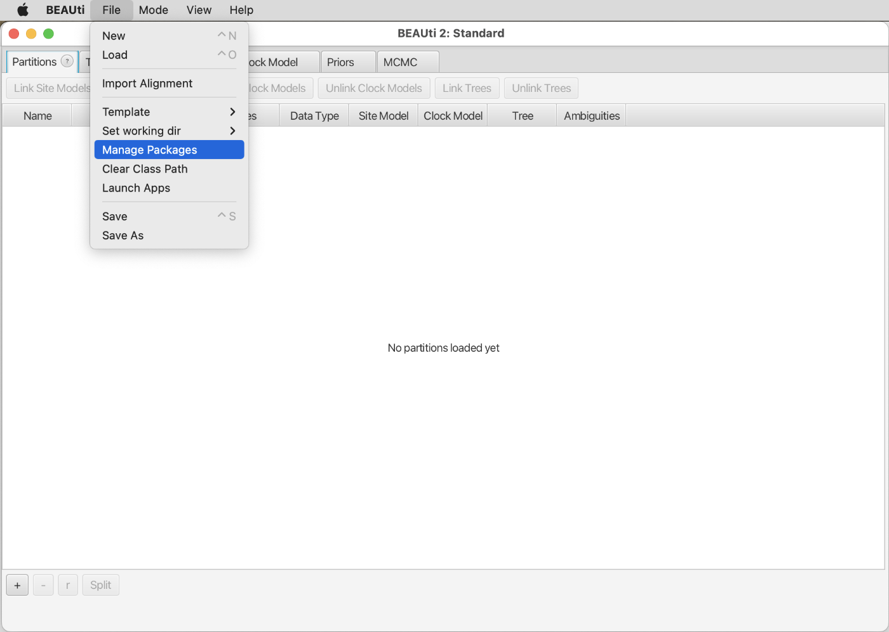

	This will open the BEAST2 Package Manager as shown in the next screenshot. Select "bModelTest" and click on "Install/Upgrade".
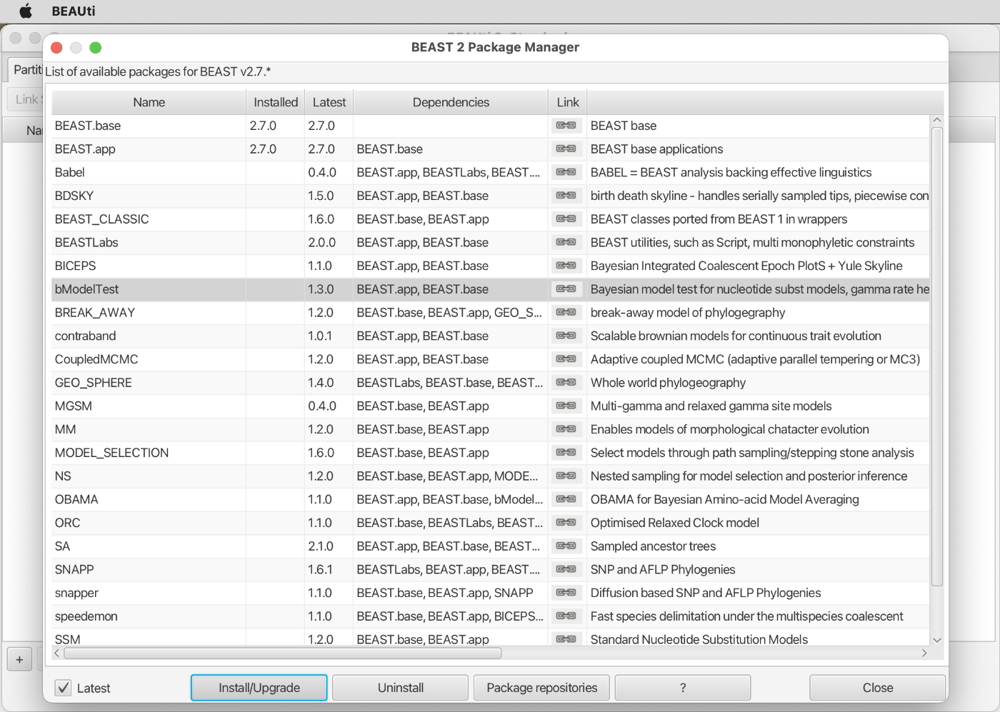
You will see a notice that any changes will only take effect after you restart BEAUti; thus, do so.

* **Tracer:** The program [Tracer](http://beast.community/tracer) greatly facilitates the inspection of output from Bayesian analyses such as those done with BEAST2. It is a GUI program that therefore can not be used on Saga, but it is easy to install on your local computer. Input files for Tracer will thus need to be downloaded from Saga. Executables of Tracer for MacOS, Linux, and Window can be found on [https://github.com/beast-dev/tracer/releases](https://github.com/beast-dev/tracer/releases). Download the file [Tracer.v1.7.2.dmg](https://github.com/beast-dev/tracer/releases/download/v1.7.2/Tracer.v1.7.2.dmg) if your local computer is running MacOS, [Tracer_v1.7.2.tgz](https://github.com/beast-dev/tracer/releases/download/v1.7.2/Tracer_v1.7.2.tgz) if it is running Linux, and [Tracer_v1.7.2.tgz](https://github.com/beast-dev/tracer/releases/download/v1.7.2/Tracer_v1.7.2.tgz) if it is running Windows.

* **FigTree:** The program [FigTree](http://tree.bio.ed.ac.uk/software/figtree/) is a very intuitive and useful tool for the visualization and (to a limited extent) manipulation of phylogenies encoded in [Newick](http://evolution.genetics.washington.edu/phylip/newicktree.html) format. Being a GUI program, FigTree can not be run on Saga, but needs to be installed and used on your local computer. Input files for FigTree will thus need to be downloaded from Saga. Executables of FigTree for Mac OS X, Linux, and Windows are provided on [https://github.com/rambaut/figtree/releases](https://github.com/rambaut/figtree/releases). Download the file [FigTree.v1.4.4.dmg](https://github.com/rambaut/figtree/releases/download/v1.4.4/FigTree.v1.4.4.dmg) if your local computer is running MacOS, [FigTree_v1.4.4.tgz](https://github.com/rambaut/figtree/releases/download/v1.4.4/FigTree_v1.4.4.tgz) if it is running Linux, and [FigTree.v1.4.4.zip](https://github.com/rambaut/figtree/releases/download/v1.4.4/FigTree.v1.4.4.zip) if it is running Windows.

## Dataset preparation

As a first step, we will need to reduce the dataset consisting of 100 alignments with gene sequences from 41 teleost species to a set comprising 10 alignments with sequences from 20 species. In principle it would be feasible to analyse all 100 alignments and all 41 species with BEAST2; however, this analysis could take many days to complete. Of course, if we would run an analysis for a publication, we should show enough patience to perform such a more extensive analysis, but to keep the run time short for this tutorial, the dataset reduction will be necessary.

This part of the tutorial is easiest done on Saga. The dataset of 100 alignments can be found in directory `/cluster/projects/nn9458k/phylogenomics/week2/data` on Saga as well as online in the [GitHub repository](https://github.com/ForBioPhylogenomics/tutorials/blob/main/week2_data/hughes_etal_100_orthologs.tgz).

* Either copy the dataset from the data directory on Saga or download it from GitHub. To copy, use this command:

		cp /cluster/projects/nn9458k/phylogenomics/week2/data/hughes_etal_100_orthologs.tgz .
		
	To download, use `wget`:
	
		wget https://github.com/ForBioPhylogenomics/tutorials/raw/main/week2_data/hughes_etal_100_orthologs.tgz	
* Uncompress the dataset:

		tar -xzf hughes_etal_100_orthologs.tgz

* Make a new directory for the reduced dataset.

		mkdir hughes_etal_10_orthologs
		
* Copy the first ten alignments into this new directory.

		cp hughes_etal_100_orthologs/locus_000?.nexus hughes_etal_10_orthologs
		cp hughes_etal_100_orthologs/locus_0010.nexus hughes_etal_10_orthologs

* Make yet another new directory named `hughes_etal_10_orthologs_20_species` for reduced alignments with only 20 species:

		mkdir hughes_etal_10_orthologs_20_species

* Download the Python script `convert.py`:

		wget https://raw.githubusercontent.com/mmatschiner/anguilla/master/radseq/src/convert.py

* Have a look at the help text of the Python script, after loading the Python module:

		module load Python/3.8.2-GCCcore-9.3.0
		python convert.py -h
		
	You'll see that this script is primarily for conversion between alignment formats. However, option `-p` allows the specification of certain IDs that should be included in the output. We are going to use this option to specify that only sequences from the 20 target species should be written to new output files.

* Open a new file named `convert_alignments.sh` on Saga, using a text editor available on Saga, such as Emacs, Vim, or Nano. You could also write the file with a GUI text editor on a local computer, but then the file would need to be copied to Saga afterwards, e.g. with `scp`. When using Emacs to open the new file, type the following command (for other text editors, simply replace "emacs" with "vim" or "nano"):

		emacs reduce_alignments.sh
		
* Write the following content to the new file:

		id_string="Danio_rerio \
		Salmo_salar \
		Borostomias_antarcticus \
		Benthosema_glaciale \
		Polymixia_japonica \
		Zeus_faber \
		Gadus_morhua \
		Lampris_guttatus \
		Monocentris_japonica \
		Myripristis_jacobus \
		Beryx_splendens \
		Brotula_barbata \
		Chatrabus_melanurus \
		Thunnus_albacares \
		Takifugu_rubripes \
		Gasterosteus_aculeatus \
		Cynoglossus_semilaevis \
		Amphilophus_citrinellus \
		Oreochromis_niloticus \
		Haplochromis_burtoni"
		for in_nex in hughes_etal_10_orthologs/*.nexus
		do
			in_nex_base=`basename ${in_nex}`
			echo -n "Reducing file ${in_nex_base}..."
			out_nex=hughes_etal_10_orthologs_20_species/${in_nex_base%.nexus}.nex
			python convert.py -p ${id_string} -f nexus ${in_nex} ${out_nex}
			echo " done."
		done

* Save and close the script (if using Emacs, the rather complicated key combination to do so is Ctrl-X Ctrl-S Ctrl-X Ctrl-C).

* Execute the script `reduce_alignments.sh`. Usually, this would be done with `bash reduce_alignments.sh`. However; when using Saga, any script executions should be done either inside Slurm scripts or through the `srun` command. Some more information about the latter can be found in the [Saga documentation](https://documentation.sigma2.no/jobs/interactive_jobs.html). Specifying that we need a single thread (`--ntasks=1`), a maximum memory requirement of 1 GB (`--mem-per-cpu=1G`), a maximum run time of 1 minute (`--time=00:01:00`), and the account number for the ForBio course is "nn9458k" (`--account=nn9458k`), we can execute the script with the following command:

		srun --ntasks=1 --mem-per-cpu=1G --time=00:01:00 --account=nn9458k --pty bash reduce_alignments.sh

* The directory `hughes_etal_10_orthologs_20_species` should then contain 10 alignment files that each contain 20 sequencing. Make sure that this is the case, using `ls` and `less`:

		ls -l hughes_etal_10_orthologs_20_species
		less -S hughes_etal_10_orthologs_20_species/locus_0001.nex
		

## Bayesian phylogenetic inference with BEAST2

In this part of the tutorial, we will run a basic Bayesian phylogenetic analysis with a dataset of 10 gene alignments, using the programs of the BEAST2 software package. In this analysis, we are going to assume that all genes share the same evolutionary history and that this history is also identical to the evolutionary history of the 20 teleost fish species from which the sequences were obtained. In other words, we are going to assume that all "gene trees" are identical and that they also are identical to the "species tree".

* If you're not familiar yet with Bayesian analyses and Markov-Chain Monte Carlo methods in general, you might be overwhelmed at first by the complexities of this type of analyses. Thus, it might be worth noting the many resources made available by BEAST2 authors that provide a wealth of information, that, even if you don't need them right now, could prove to be useful at a later stage. You might want to take a moment to explore the [BEAST2 website](https://www.beast2.org) and quickly browse through the [glossary of terms related to BEAST2 analyses](https://www.beast2.org/glossary/index.html). Note that the BEAST2 website also provides a [wide range of tutorials and manuals](https://www.beast2.org/tutorials/index.html). In addition, you can find many further tutorials on the [Taming the BEAST](https://taming-the-beast.org) website, where you will also find information about the excellent [Taming-the-BEAST workshops](https://taming-the-beast.org/workshops/). Finally, if you have further questions regarding BEAST2, you could have a look if somebody else already asked those questions on the very active [user forum](https://groups.google.com/forum/#!forum/beast-users), or you could ask these questions there yourself.

* Download the 10 alignments from Saga to your local computer, for example with `scp`. If the alignments should be located on Saga in the directory `/cluster/projects/nn9458k/phylogenomics/USERNAME/hughes_etal_10_orthologs_20_species`, you could use this `scp` command (you will have to replace "USERNAME"):

		scp -r USERNAME@saga.sigma2.no:/cluster/projects/nn9458k/phylogenomics/USERNAME/hughes_etal_10_orthologs_20_species

* Open the program BEAUti from the BEAST2 package, and import all ten alignments. To do so, click "Import Alignment" from the "File" menu and select the ten Nexus files `locus_0001.nex` to `locus_0010.nex`. The BEAUti window should then look as shown in the screenshot below.
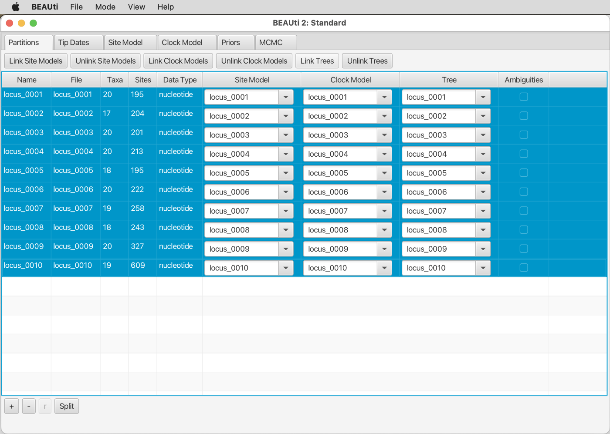

	Note that the BEAUti interface has six different tabs, of which (at the top of the window), the first one named "Partitions" is currently selected. We will browse through the other tabs later, but first need to specify settings regarding the partitioning in the currently open tab. Currently, a separate partition has been assigned to each of the 10 genes, meaning that for example separate substitution models could be used for each of them. It could make sense to further split each gene into three partitions for each codon position, given that these are known to evolve at different rates. If we wanted to do that, we would select all partitions and then click on the "Split" button at the bottom of the BEAUti window. However, to keep the run time of the BEAST2 analysis in this tutorial manageable, don't use this option and use just one partition for each of the genes.
	
* To estimate a single tree for all species, we have to select all partitions and click on "Link Trees" near the top of the BEAUti window. This should lead to the same label (e.g. "locus\_0001") being used for all partitions in the "Tree" column at the right of the BEAUti window. However, as the next screenshot shows, this is not the case.

	Apparently, only the trees of partitions "locus\_0001", "locus\_0003", "locus\_0004", "locus\_0006", and "locus\_0009" are linked (they have the same label, "locus\_0001", in the "Tree" column), while all other partitions still have individual labels in the "Tree" column". The problem lies in missing sequences in half of the partitions. As the number of taxa listed in the "Taxa" column indicates, the partition "locus\_0002" is missing three sequences, "locus\_0005" and "locus\_0008" are missing two sequences, and "locus\_0007" and "locus\_0010" are missing one sequence.
	
* Have a look at the alignment in file `locus_0002.nex` to verify that the alignment only contains 17 and not 20 sequences, for example with `less -S` (on Saga):

		less -S hughes_etal_10_orthologs_20_species/locus_0002.nex
		
	You'll see that this is the case. So apparently, each of the 20 species needs to be included in each alignment to allow the estimation of a single tree for all species with BEAST2. To achieve this, we could manually add sequences that contain only missing data to all those alignments that have less than 20 sequences, but there are also other and easier ways to do this.

* On Saga, download a Ruby script to concatenate alignments:

		wget https://raw.githubusercontent.com/mmatschiner/anguilla/master/radseq/src/concatenate.rb
		
* Have a look at the help text of this script:

		module load Ruby/2.7.2-GCCcore-9.3.0
		ruby concatenate.rb -h

	You'll see that besides options `-i`, `-o`, and `-f` for the input and output file names and the output format, the script also has an option (`-p`) to write a partitions block for output files in Nexus and Phylip format.
	
* Use this script to concatenate all alignment files into a single file named `hughes_etal_10_orthologs_20_species.nex`, and specify that this output file should also be in Nexus format (`-f nexus`) and have a partitions block (`-p`):

		srun --ntasks=1 --mem-per-cpu=1G --time=00:01:00 --account=nn9458k --pty ruby concatenate.rb -i hughes_etal_10_orthologs_20_species/*.nex -o hughes_etal_10_orthologs_20_species.nex -f nexus -p

* Then, have a look at file `hughes_etal_10_orthologs_20_species.nex` with `less -S`:

		less -S hughes_etal_10_orthologs_20_species.nex

	As you'll see, there is now just a single concateated alignment in this file, with a total length of 2,667 sites (this is specified on the fourth line with `nchar=`). However, the information about the boundaries of each original alignment is not lost, but instead stored in the partitions block at the bottom of the file: The first 195 sites came from "locus\_0001", the sites 196 to 399 came from "locus\_0002", and so on.
	
* Download file `hughes_etal_10_orthologs_20_species.nex` again to your local computer.

* In BEAUti, remove all partitions by selecting them and clicking the small button with a "-" symbol at the bottom left of the window.

* Then, import the alignment file `hughes_etal_10_orthologs_20_species.nex` into BEAUti. The partitions panel should then look as shown in the next screenshot.
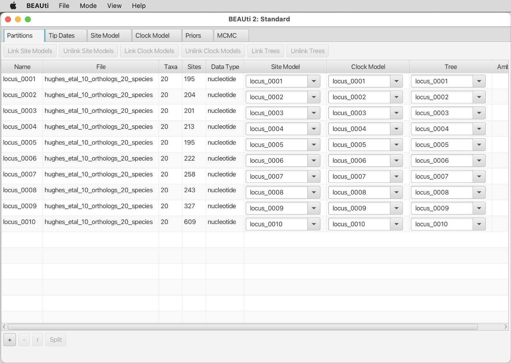

	You should notice that even though we imported only a single alignment, BEAUti has recognized 20 partitions, namely because it was able to read the partitions block at the end of the Nexus file. You should also notice that each partition now has 20 sequences, indicated by the number "20" in the "Taxa" column for each partition. We have thus found a work-around for the issue of missing sequences.
	
* Now, try again to link the trees of all partitions by selecting them all and clicking on "Link Trees" near the top of the BEAUti window. This time, the label "locus\_0001" should appear in the "Tree" colum for all partitions, meaning that all their trees are now linked.
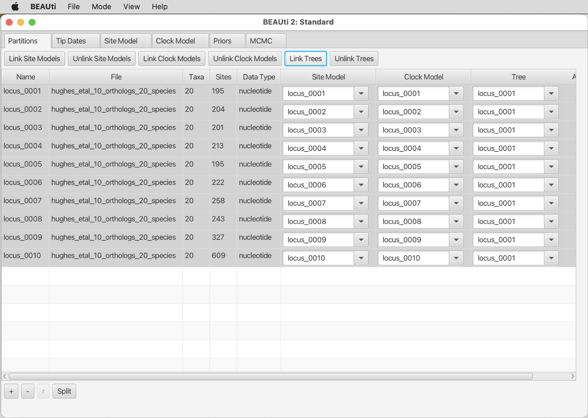

	The linking of the trees of all partitions means that we will assume that all gene trees are identical to each other and that they are also identical to the species tree. As other tutorials will demonstrate, this assumption can lead to bias in the phylogenetic inference, particularly if young and rapidly-diverging groups of taxa are investigated. However, in this first introduction to phylogenetic inference with BEAST2, we will ignore this potential issue.

* With all partitions still selected, also click on "Link Clock Models". This means that the clock model that we will select will apply to all partitions equally.

	With the relaxed clock model that we will select, this means that some branches are allowed to evolve faster than other branches (= to have higher substitution rates than others), but that this variation in rates is not inferred separately for each gene. Thus, branches that are inferred to have a comparatively high rate in partition will also receive a comparatively high rate for each of the other partitions. Vice versa, a branch that is inferred to evolve comparatively slowly is assumed to evolve slowly for all partitions. However, this branch will still be allowed to have a higher absolute rate in one partition compared to another partition because the branch rates specified by the clock model (one rate per branch) will still be multiplied by a partition-specific rate multiplier (so that in total we then have ten rates per branch: one for each partition). A good justification for this linking of clock models is that in nature, the speed of the molecular clock often depends on factors that are species-specific, such as metabolism and generation time ([Moorjani et al. 2016](http://www.pnas.org/content/113/38/10607.long)). This means that a species with a short generation time will be expected to have a comparatively slow rate not only in one gene but in all its genes. A more practical justification for the linking is that it reduces the run time substantially.

	After clicking on "Link Clock Models", the BEAUti window should look as shown in the screenshot below. Note that all cells in the "Clock Model" column now have the label "locus\_0001".
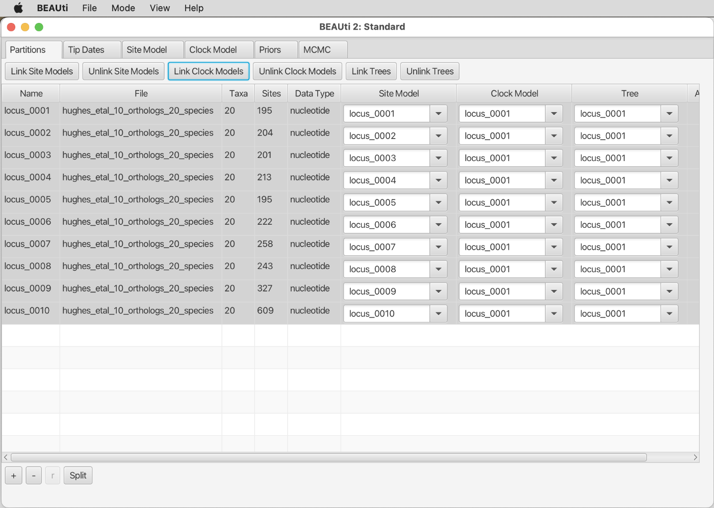

* The settings in the "Partitions" tab are now complete. Skip the next tab called "Tip Dates". This tab could be used to specify the times at which samples were taken, which allows time-calibration of viral phylogenies. But compared to the time scales over which the 20 fish species have diverged, the small difference in sampling times (a few years) is completely negligible, so we can safely ignore these. Thus, click on the "Site Model" tab next. In this tab we can specify the substitution models for all four partitions. Select the "locus\_0001" partition in the panel at the left and click on the drop-down menu that currently says "JC69". Instead of the Jukes-Cantor model, use the GTR model, which allows different substitution rates for all transitions and transversions. Also specify "4" in the field for the "Gamma Category Count" two lines above, to use a gamma model of rate variation with four rate categories. Finally, set a tick in the checkbox to the right of "Substitution Rate" so that this rate will be estimated. The BEAUti window should then look as shown in the screenshot below.
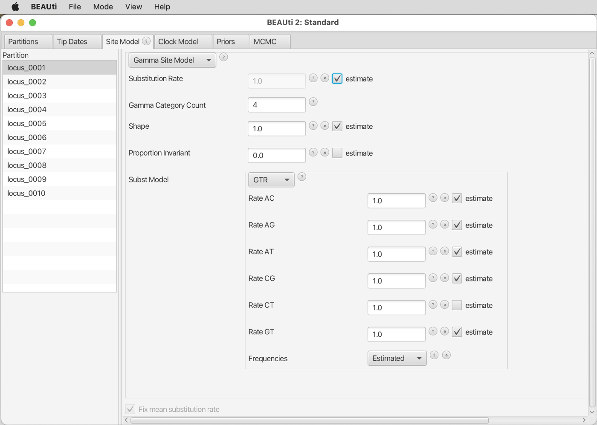

* Still in the "Site Model" tab, select all ten partitions in the panel at the left of the window. The main part of the window should then show the option "Clone from locus\_0001" as in the screenshot below. Click "OK" to use the same site model as for "locus\_0001" for all partitions.

* Next, click on the "Clock Model" tab. From the drop-down menu that currently says "Strict Clock", choose "Relaxed Clock Log Normal" instead. This is the most commonly used relaxed clock model in which substitution rates of individual branches are drawn from a lognormal distribution. Also set a tick in the checkbox on the right side of the window. If this checkbox appears gray and you are unable to set it, you'll need to click on "Automatic set clock rate" in BEAUti's "Mode" menu. The mean and standard deviation of this lognormal distribution will be estimated as part of the MCMC search. The model is described in [Drummond et al. (2006)](http://journals.plos.org/plosbiology/article?id=10.1371/journal.pbio.0040088); there it is named the "UCLN" model. Ignore the additional options ("Number of Discrete Rates" etc.) that appear after selecting the model.
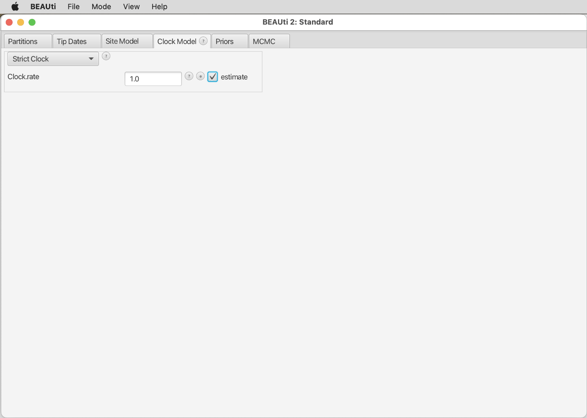

* Click on the "Priors" tab. From the drop-down menu at the very top of the window, select "Birth Death Model" instead of "Yule Model". By doing so we add a parameter to the model for the extinction rate. If we would choose the alternative Yule model ([Yule 1925](http://rstb.royalsocietypublishing.org/content/213/402-410/21?intcmp=trendmd)), we would assume that no extinction ever occurred in the history of teleost fishes. As this seems rather unrealistic, the birth-death model ([Gernhard 2008](https://www.sciencedirect.com/science/article/pii/S0022519308001811)) is in most cases the more appropriate choice. Nevertheless, results are in practice rather rarely affected by the choice of this prior.
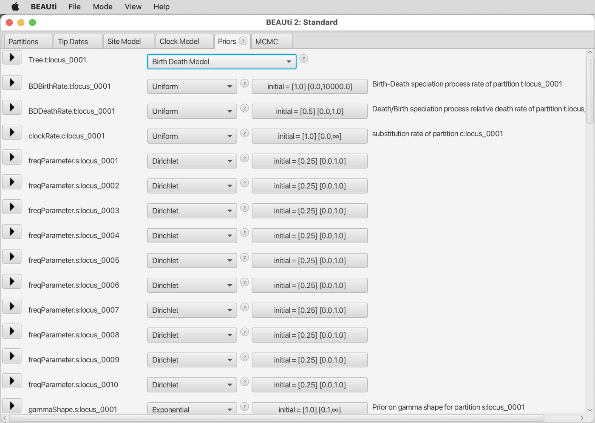

* Most of the other items shown in the "Prior" panel correspond to prior densities placed on the parameters of the substitution models for the ten partitions. You may keep the default priors for each of these parameters. However, to allow time calibration of the phylogeny, a prior density still needs to be specified for at least one divergence time, otherwise BEAST2 would have very little information (only from the priors on speciation and mutation rates) to estimate branch lengths according to an absolute time scale. But before prior densities can be placed on the divergence of certain clades, these clades must first be defined. This can be done at the bottom of the "Priors" tab. Thus, scroll down to the end of the list until you see the "+ Add Prior" button, as shown in the below screenshot.
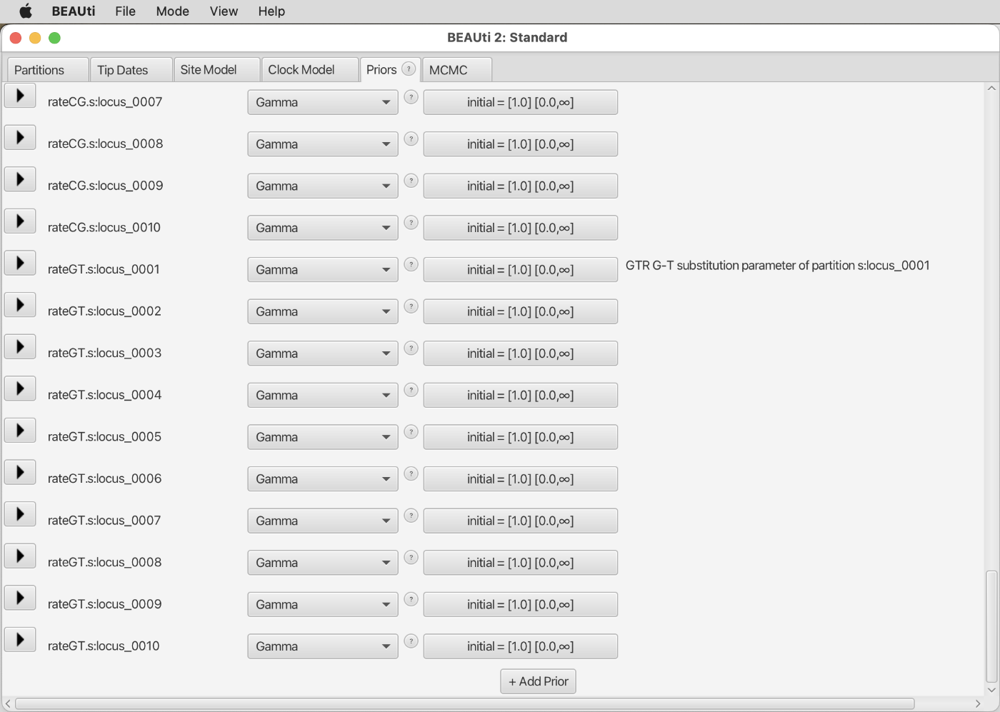

* Click on the "+ Add Prior" button. When prompted "Which prior do you want to add", click "OK" to select the default option "MRCA prior" (a prior on the most recent common ancestor of a clade). This should open the "Taxon set editor" pop-up window. Select all taxa from the list on the left of that window, and click the double-right-arrow symbol (`>>`) to shift them to the right side of the window. Then, click on the ID for <!--XXX Update number species--> zebrafish ("Teleost_Otophysa_Cypriniformes_Danionidae_Danio_rerio") to shift it back to the left with the double-left-arrow symbol (`<<`). This way, the ingroup, including all taxa except zebrafish is defined as a clade, so that the divergence of this clade can later be used for time calibration. The clade currently selected corresponds to the taxonomic group of "Euteleosteomorpha" ([Betancur-R. et al. 2017](https://bmcevolbiol.biomedcentral.com/articles/10.1186/s12862-017-0958-3)); thus, enter this name at the top of the pop-up window as the "Taxon set label", as shown in the below screenshot. Then, click "OK".
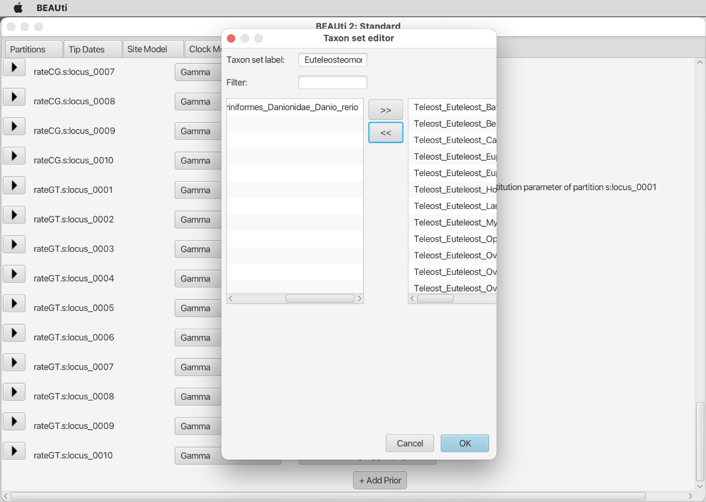

* For now, we will simply constrain this divergence between "Euteleosteomorpha" and zebrafish according to the results of a previous publication rather than placing several constraints according to the fossil record of teleost fishes. In [Betancur-R. et al. (2013)](http://currents.plos.org/treeoflife/article/the-tree-of-life-and-a-new-classification-of-bony-fishes/), the divergence of Euteleosteomorpha and Otomorpha (a clade that includes zebrafish) was estimated to have occurred around 250 million years ago (Ma), thus, we will here place a prior density centered on that time on the same divergence. To time calibrate this divergence, click on the drop-down menu to the right of the button for "Euteleosteomorpha.prior" that currently says "[none]", and select "Log Normal" as shown in the next screenshot.
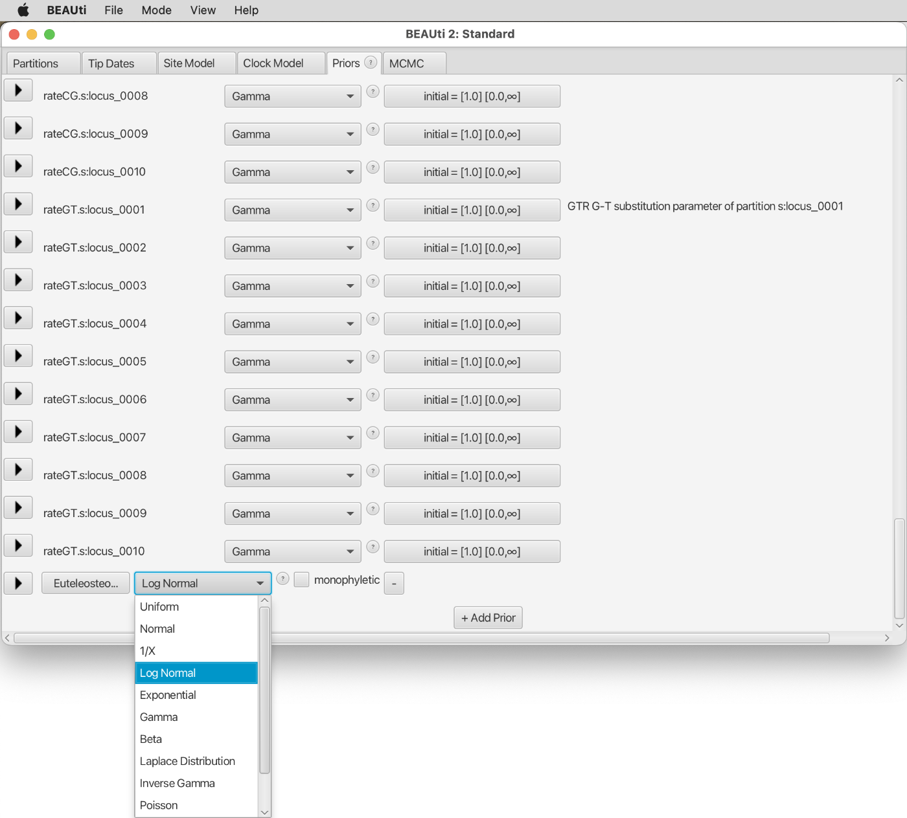

* Then, click on the black triangle to the left of the button for "Euteleosteomorpha.prior". Specify "10.0" as the value for "M" (that is the mean of the prior density) and "0.5" as the value for "S" (that is the standard deviation). Importantly, set a tick in the checkbox for "Mean in Real Space"; otherwise, the specified value for the mean will be considered to be in log space (meaning that its exponent would be used). Next, specify "240" as the offset”. In the plot to the right, you should then see that the density is centered around 250, with a hard minimum boundary at 240 and a "soft" maximum boundary (a tail of decreasing probability). Make sure to activate the checkbox for "Use Originate" a bit further below to specify that the divergence time of this clade from this sister clade should be constrained, not the time when the lineages within this clade began to diverge. Finally, also set a tick in the checkbox for "monophyletic" to the right of the drop-down menu in which "Log Normal" is now selected. By doing so, we constrain the specified ingroup clade of "Euteleosteomorpha" to be monophyletic. The BEAUti window should then look as shown in the below screenshot.
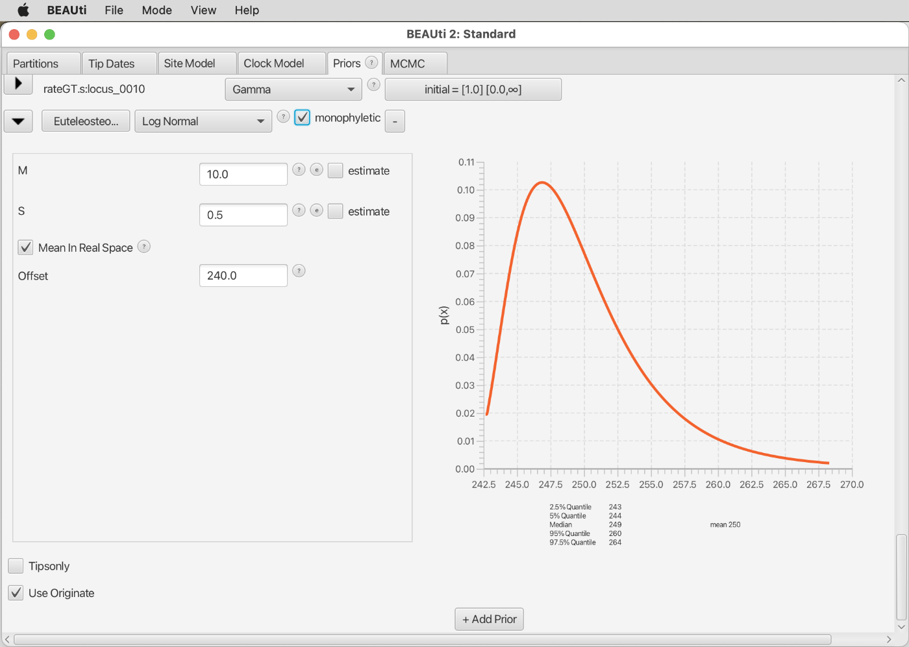

* Also constrain the monophyly of some other clades that were found to be well-supported in the phylogenetic analyses of the first week of the course. This will limit the parameter space that BEAST2 will have to search, and thus it will speed up the Bayesian analysis. In addition to Euteleosteomorpha, constrain the following clades:

	* "Neoteleostei": Select all taxa, then exclude zebrafish (*Danio rerio*) and Atlantic salmon (*Salmo salar*) again.
	* "Ctenosquamata": Select all taxa, then exclude zebrafish (*Danio rerio*), Atlantic salmon (*Salmo salar*), and snaggletooth (*Borostomias antarcticus*) again.
	* "Acanthomorphata": Select all taxa, then exclude zebrafish (*Danio rerio*), Atlantic salmon (*Salmo salar*), snaggletooth (*Borostomias antarcticus*), and Glacier lantern fish (*Benthosema glaciale*) again.
	* "Percomorpha": Include bearded brotula (*Brotula barbata*), pony toadfish (*Chatrabus melanurus*), yellowfin tuna (*Thunnus albacares*), Japanese puffer (*Takifugu rubripes*), three-spined stickleback (*Gasterosteus aculeatus*), tongue sole (*Cynoglossus semilaevis*), Midas cichlid (*Amphilophus citrinellus*), Nile tilapia (*Oreochromis niloticus*), and Burton's mouthbrooder (*Astatotilapia burtoni*; named *Haplochromis burtoni* in the alignments from Hughes et al. (2018)).
	* "Cichlidae": Include the three cichlids Midas cichlid (*Amphilophus citrinellus*), Nile tilapia (*Oreochromis niloticus*), and Burton's mouthbrooder (*Astatotilapia burtoni*; named *Haplochromis burtoni* in the alignments from Hughes et al. (2018)).
		
	Specify that all of these clades should be monophyletic, using the checkbox at the right of the row corresponding to each clade. The bottom part of the list in the "Prior" tab should then look as in the below screenshot.
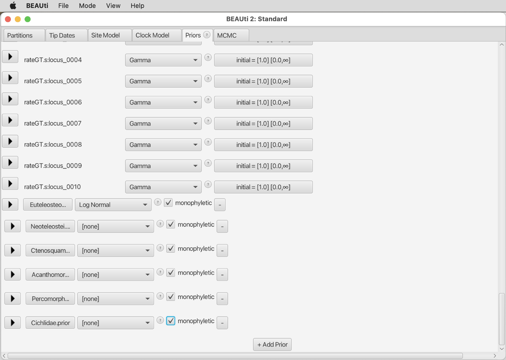

		
* Continue to the "MCMC" tab, where you can specify the run length. This analysis will require around <!--XXX Check if true XXX--> 50 million iterations before the analysis is fully complete, which would take several hours of run time. For the purpose of this tutorial, however, it will be sufficient to use 10 million iterations, so just keep the default value of "10000000" in the field to the right of "Chain Length".

* Change the names of the output files: Click on the triangle to the left of "tracelog" and specify "beast2.log" as the name of the log file. In the next field for "Log Every", set the number to "5000" (instead of the default 1,000) so that only every 5,000th MCMC state is written to the log file. Click on the triangle again, then click on the black triangle to the left of "treelog". Specify "beast2.trees" as the name of the tree file and again use "5000" as the number in the field for "Log Every".

* When the window looks as in the below screenshot, click on "Save" in BEAUti's "File" menu, and name the resulting file in XML format `beast2.xml`.
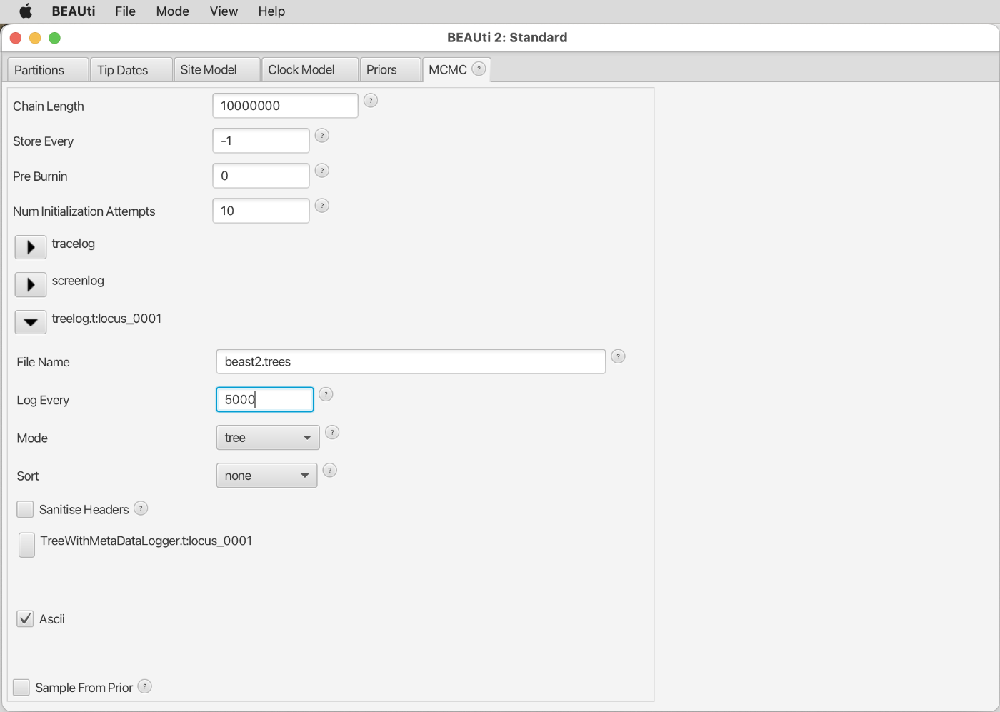

* Upload the XML input file form BEAST2 to Saga using `scp`.

	If anything should have gone wrong during the preparation of the XML input file `beast2.xml` with BEAUti, you can alternatively find a prepared version of the file in directory `/cluster/projects/nn9458k/phylogenomics/week2/res` on Saga, or download it from GitHub with `wget https://raw.githubusercontent.com/ForBioPhylogenomics/tutorials/main/week2_res/beast2.xml`.

* To run BEAST2 on Saga, we will still need to write a Slurm script so that we can submit the analysis for execution on the cluster. Thus, open a new file named `run_beast2.slurm` with a text editor available on Saga, such as Emacs:

		emacs run_beast2.slurm
		
* Write the following commands to the new file:

		#!/bin/bash

		# Job name:
		#SBATCH --job-name=beast2
		#
		# Wall clock limit:
		#SBATCH --time=2:00:00
		#
		# Processor and memory usage:
		#SBATCH --ntasks=1
		#SBATCH --mem-per-cpu=1G
		#
		# Accounting:
		#SBATCH --account=nn9458k
		#
		# Output:
		#SBATCH --output=run_beast2.out

		# Set up job environment.
		set -o errexit  # Exit the script on any error
		set -o nounset  # Treat any unset variables as an error
		module --quiet purge  # Reset the modules to the system default

		# Load the beast2 module.
		module load Beast/2.6.4-GCC-9.3.0

		# Run beast2.
		beast beast2.xml

To assess completeness of BEAST2 (or generally Bayesian) analyses, it is important to run multiple replicate analyses with the same input file. Only when these show the same result can the analysis be considered "converged". An easy way to set up multiple replicate analyses with the same input file is to copy the input file and the corresponding Slurm script into two or more subdirectories, and then submit the Slurm scripts individually in each of them.

* Set up a directory structure for replicate BEAST2 analyses with the same input file:

		mkdir r01
		mkdir r02
		
* Copy the XML input file and the Slurm script to both directories for replicate analyses:

		cp beast2.xml r01
		cp run_beast2.slurm r01
		cp beast2.xml r02
		cp run_beast2.slurm r02
		

* Submit the Slurm script in both directories with `sbatch`:

		cd r01
		sbatch beast2.slurm
		cd ..
		cd r02
		sbatch beast2.slurm
		cd ..
		

* Monitor how the submitted analyses are added to the queue and executed by repeatedly calling `squeue` with option `-u` followed by your username. If you're unsure about your username, you can always find it with `whoami`. You can also combine both commands by placing the latter one inside of backticks:

		squeue -u `whoami`

	You can tell from the fifth and sixth columns of the output of the above command whether your analysis is running: The fifth column shows an "R" as soon as the analysis started, and the sixth column shows the elapsed run time.

While the two BEAST2 analyses are running, you may continue with the next part of this tutorial. The results of these analyses and of the analysis described below will be investigated and compared after all analyses have completed.

## Automatic substitution model selection with BEAST2

In the above phylogenetic inference, we assumed that the GTR substitution model with gamma-distributed rate variation would be an appropriate model of evolution for each partition. Instead of making this assumption, it would be more convenient if we would not have to specify a substitution model at all *a priori*, and if during the Bayesian analysis, one could average over multiple substitution models according to their relative fit to the data. This is made possible by the [bModelTest](https://github.com/BEAST2-Dev/bModelTest) ([Bouckaert and Drummond 2017](https://bmcevolbiol.biomedcentral.com/articles/10.1186/s12862-017-0890-6)) add-on package for BEAST2, which we will use in this part of the tutorial. For further information, note that an excellent tutorial on the use of bModelTest is available at the [Taming the BEAST](https://taming-the-beast.org/tutorials/Substitution-model-averaging/) website.

* If you closed the BEAUti window after saving the XML input file, reopen BEAUti click "Load" in the "File" menu to reload the file `beast2.xml`. If the BEAUti window is still open, this is not required.

* Go to the "Site Model" tab. There, click on the drop-down menu at the top of the window, where currently "Gamma Site Model" is selected. If the bModelTest add-on package has been loaded correctly (see [Requirements](#requirements)), the drop-down menu has a second option named "BEAST Model Test", as shown in the screenshot below.
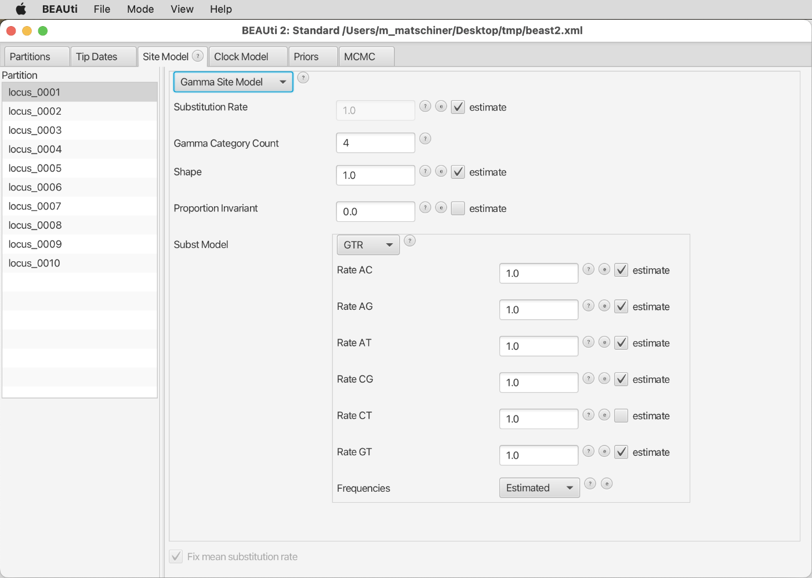

* Click on "BEAST Model Test" to select this model. The window should then show a different set of options.
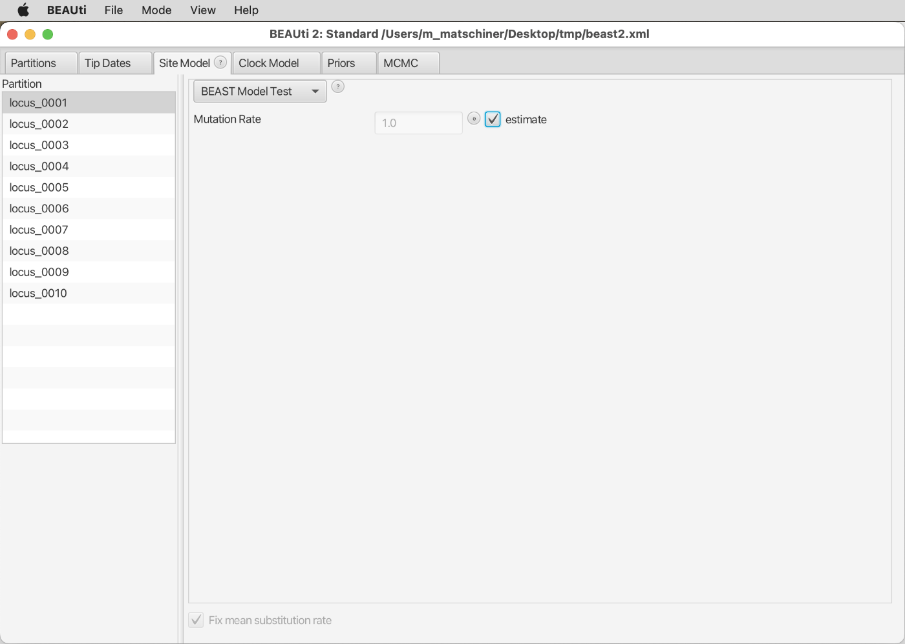

* The drop-down menu in which "transitionsTransversionsSplit" is currently selected allows to specify a set of substitution models that should be considered in the analysis. Which models are included in each set is shown in Fig. 1 of [Bouckaert and Drummond (2017)](https://bmcevolbiol.biomedcentral.com/articles/10.1186/s12862-017-0890-6). In most cases it should be more than sufficient to use a smaller set of models, such as the "namedExtended" set that includes nine different models (and their derivations with or without estimated nucleotide frequencies; see Fig. 1c of [Bouckaert and Drummond 2017](https://bmcevolbiol.biomedcentral.com/articles/10.1186/s12862-017-0890-6)). Thus, select "namedExtended" from this drop-down menu. Leave the checkbox next to "Empirical" unticked to allow estimation of nucleotide frequencies. Then, again set the tick to the right of "Mutation Rate" to specify that this rate should be estimated. The window should then look as in the next screenshot.
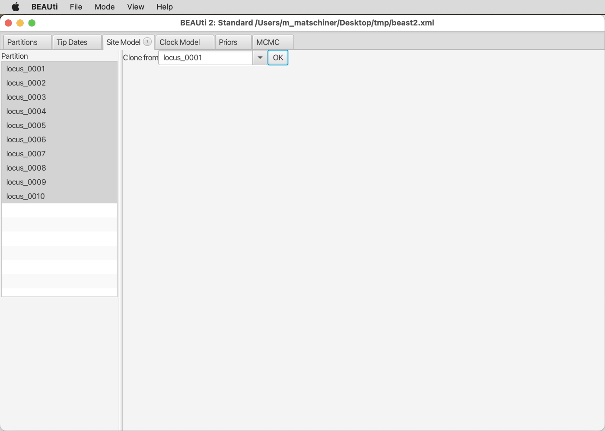

* As before, select all partitions in the panel at the left of the window, and click "OK" to clone the settings from the first partition to all other partitions, as shown in the next screenshot.
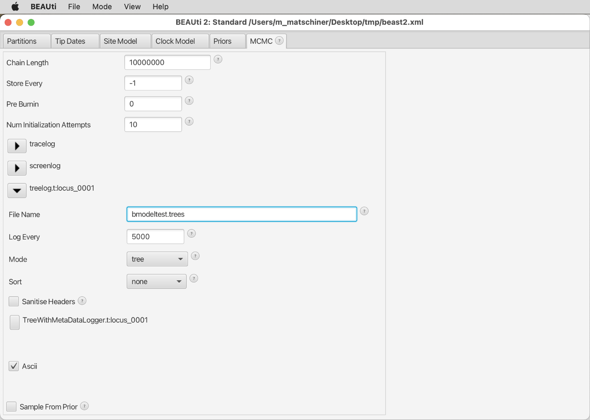

* Leave all settings in the "Clock Model" and "Priors" tabs unchanged, and go to the "MCMC" tab, where the output file names should be changed to avoid overwriting the output of the previous BEAST2 analysis. Click on the black triangle to the left of "tracelog" and specify "bmodeltest.log" as the name of the log output file. Then, click on the triangle next to "treelog" and specify "bmodeltest.trees" as the name of the tree file.

* Finally, click "Save As" in BEAUti's "File" menu and save the analysis settings to a new file named `bmodeltest.xml`.

* Upload this XML input file form BEAST2 to Saga using `scp`.

* To run BEAST2 with the file `bmodeltest.xml`, we'll need a new Slurm script. On Saga, copy the existing Slurm script `run_beast2.slurm` to a new file named `run_bmodeltest.slurm`:

		cp run_beast2.slurm run_bmodeltest.slurm
		
* Open file `run_bmodeltest.slurm` with a text editor available on Saga, such as Emacs:

		emacs run_bmodeltest.slurm
		
* Replace "beast2" with "bmodeltest" on lines 4, 17, and 28, so that file `run_bmodeltest.slurm` has the following content:

		#!/bin/bash

		# Job name:
		#SBATCH --job-name=bmodeltest
		# 
		# Wall clock limit:
		#SBATCH --time=2:00:00
		# 
		# Processor and memory usage:
		#SBATCH --ntasks=1
		#SBATCH --mem-per-cpu=1G
		# 
		# Accounting:
		#SBATCH --account=nn9458k
		# 
		# Output:
		#SBATCH --output=run_bmodeltest.out

		# Set up job environment.
		set -o errexit  # Exit the script on any error
		set -o nounset  # Treat any unset variables as an error
		module --quiet purge  # Reset the modules to the system default

		# Load the beast2 module.
		module load Beast/2.6.4-GCC-9.3.0

		# Run beast2.
		beast bmodeltest.xml

* Then, close and save the text editor, and submit the Slurm script with `sbatch`:

		sbatch run_bmodeltest.slurm

	(we'll run just a single replicate analysis this time).
				
* While the BEAST2 are running for the files `beast2.xml` and `bmodeltest.xml`, have a look at the output that these analyses write to files `r01/run_beast.out`, `r02/run_beast.out`, and `run_bmodeltest.out`:

		less r01/run_beast.out
		less r02/run_beast.out
		less run_bmodeltest.out

	When you scroll to the end any of these output files, you'll find a table written by BEAST2, with information for "Sample", "posterior", "likelihood", "prior", and an estimate of the run time per million samples. Here "sample" refers to the iteration of the MCMC, and the "posterior", "likelihood", and "prior" are the log values of the posterior probability, the likelihood, and the prior probability, respectively, for the corresponding MCMC iteration. These values should initially change rapidly but become stationary after a while. Note that to track the progress of BEAST2, you may have to repeatedly close and open these files, so that you can see the lines that have been added to the end of it since you last opened the file.
	
	 **Question 1:** How long does each analysis require per one million MCMC iterations? Is one of them faster? [(see answer)](#q1)

As soon as the BEAST2 analyses of file `beast2.xml` have finished or at least progressed to a few million MCMC iterations, you can continue with the next section of the tutorial.

## Assessing MCMC completeness

In Bayesian analyses with the software BEAST2, it is rarely possible to tell *a priori* how many MCMC iterations will be required before the analysis can be considered complete. This is because to be considered "complete", any analyses using MCMC should have two properties: They should be "stationary" and "converged". While stationarity can be assessed with a single replicate analysis, convergence can only be assessed when the same analysis has been repeated multiple times; that's why we ran two replicates analyses of file `beast2.xml` (and if this would not just be for a tutorial, we should have done the same for `bmodeltest.xml`).

### Assessing MCMC stationarity with Tracer

There are various ways to assess whether or not an MCMC analysis is "stationary", and in the context of phylogenetic analyses with BEAST2, the most commonly used diagnostic tools are those implemented in [Tracer](http://beast.community/tracer) ([Rambaut et al. 2018](https://academic.oup.com/sysbio/advance-article/doi/10.1093/sysbio/syy032/4989127)) or the R package [coda](https://cran.r-project.org/web/packages/coda/index.html) ([Plummer et al. 2006](https://cran.r-project.org/doc/Rnews/Rnews_2006-1.pdf#page=7)). Here, we are going to investigate MCMC stationary with Tracer. The easiest ways to do this in Tracer are:

1. Calculation of "effective sample sizes" (ESS). Because consecutive MCMC iterations are always highly correlated, the number of effectively independent samples obtained for each parameter is generally much lower than the total number of sampled iterations. Calculating ESS values for each parameter is a way to assess the number of independent samples that would be equivalent to the much larger number of auto-correlated samples drawn for these parameters. These ESS values are automatically calculated for each parameter by Tracer. As a rule of thumb, the ESS values of all model parameters, or at least of all parameters of interest, should be above 200.
2. Visual investigation of trace plots. The traces of all parameter estimates, or at least of those parameters with low ESS values should be visually inspected to assess MCMC stationarity. A good indicator of stationarity is when the trace plot has similarities to a "hairy caterpillar". While this comparison might sound odd, you'll clearly understand its meaning when you see such a trace plot in Tracer.

Thus, both the calculation of ESS values as well as the visual inspection of trace plots should indicate stationarity of the MCMC chain; if this is not the case, the run should be resumed. For BEAST2 analyses, resuming a chain is possible with the `-resume` option of BEAST2.

* Download file `beast2.log` from the `r01` directory on Saga to your local computer, using `scp`.

* Open this file in the program Tracer. The Tracer window should then look more or less as shown in the next screenshot
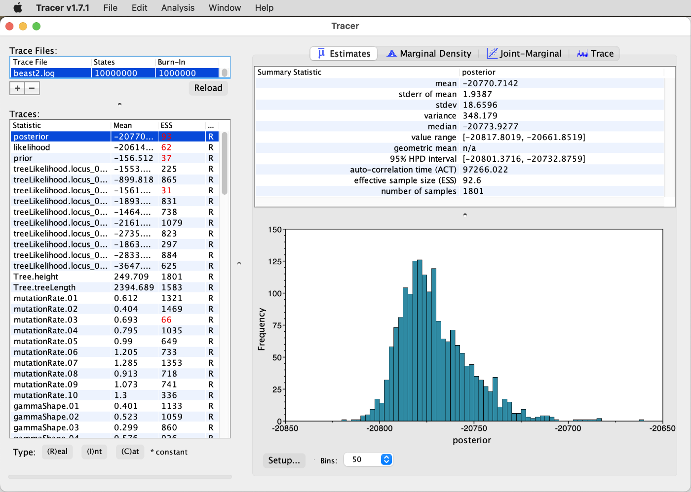
In the top left part of the Tracer window, you'll see a list of the loaded log files, which currently is just the single file `beast2.log`. This part of the window also specifies the number of states found in this file, and the burn-in to be cut from the beginning of the MCMC chain. Cutting away a burn-in removes the initial period of the MCMC chain during which it may not have sampled from the true posterior distribution yet.

	In the bottom left part of the Tracer window, you'll see statistics for the estimate of the posterior probability (just named "posterior"), the likelihood, and the prior probability (just named "prior"), as well as for the parameters estimated during the analysis (except the phylogeny, which also represents a set of parameters). The second column in this part shows the mean estimates for each parameter and their ESS values. **Question 2:** Do the ESS values of all parameters indicate stationarity? [(see answer)](#q2)

	In the top right part of the Tracer window, you will see more detailed statistics for the parameter currently selected in the bottom left part of the window. Finally, in the bottom right, you will see a visualization of the samples taken during the MCMC search. By default, these are shown in the form of a histogram as in the above screenshot.

* With the posterior probability still being selected in the list at the bottom left, click on the tab for "Trace" (at the very top right). You will see how the posterior probability changed over the course of the MCMC. This trace plot should ideally have the form of a "hairy caterpillar", but as you can see from the next screenshot, this is not the case for the posterior probability.
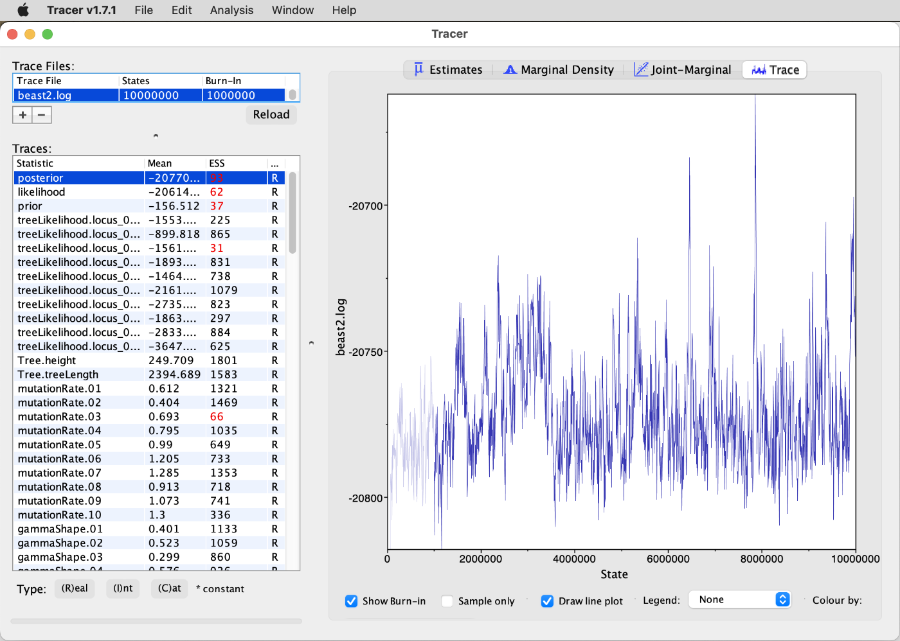

* Now, click on the prior probability in the list at the bottom left of the window. You'll note that the trace looks very similar to that of the posterior, which may not be surprising given that the posterior probability is a (normalized) product of the prior probability and the likelihood. Thus, the auto-correlation in the prior probability seems to drive the auto-correlation in the posterior probability. Another way to visualize this is to select both the posterior and the prior probability at the same time (you may have to shift-click to do so) and then click on the "Joint-Marginal" tab next to the "Trace" tab. Also remove the tick from the checkbox for "Sample only" at the bottom of the window. The plot should then clearly show that the two measures are strongly correlated.
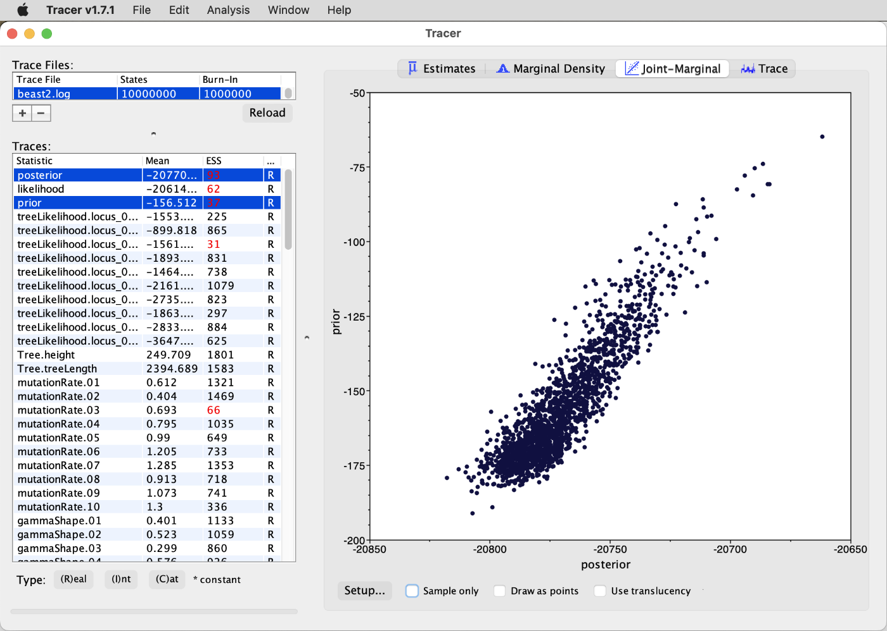

* Have a look at the list of ESS values in the bottom left again. **Question 3:** Besides the prior and posterior probabilities, which parameter has the lowest ESS value? [(see answer)](#q3) **Question 4:** Could this parameter be responsible for the low ESS value of the prior probability? [(see answer)](#q4)

* Download 

* Calculate the number of sites in the 16S alignment at which each pair of nucleotides co-occur, using the Ruby script [`count_substitutions.rb`](src/count_substitutions.rb):

		ruby count_substitutions.rb 16s_filtered.nex

	**Question 5:** Which types of substitutions appear to be particularly rare in the 16S alignment - do these correspond to the substitution rate parameters with particularly low ESS values? [(see answer)](#q5)

* Next, also open file [`combined_bmodeltest.log`](res/combined_bmodeltest.log) in Tracer. The trace plot for the posterior probability in this analysis with the bModelTest model should look much more like a "hairy caterpillar", as shown in the next screenshot.
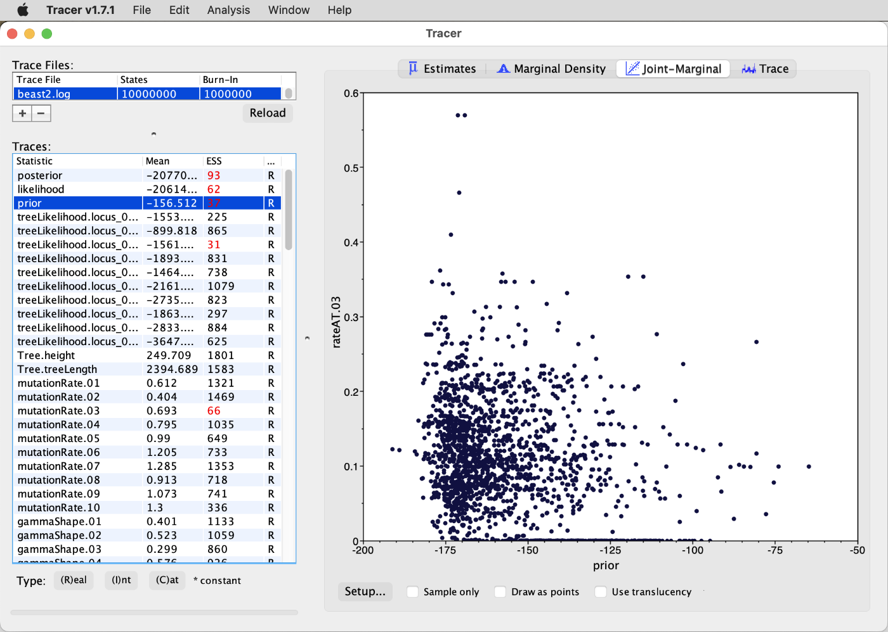
Nevertheless, some auto-correlation is apparent also in the above trace plot, indicating that this analysis, too, should be continued if it were to be used in a publication.

* Scroll down in the list of parameters at the bottom left of the window to see if any parameters still have low ESS values. You'll see that this is indeed the case for some parameters of the bModelTest model, as shown in the next screenshot.
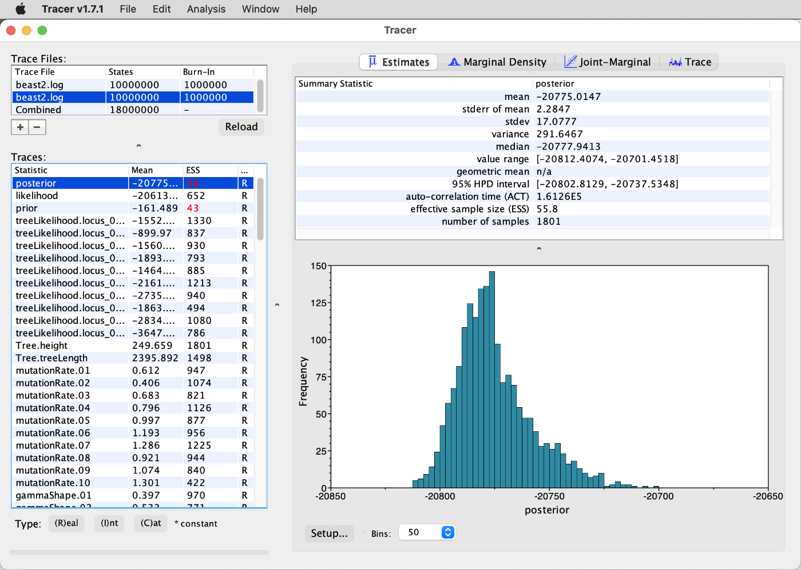
The parameters named "hasEqualFreqs..." shown in the above plot indicate if nucleotide frequencies should be estimated (then the parameter state is "0") or if they they should be assumed to be all equal (then the parameter state is "1"). Whenever during the MCMC analysis bModelTest switches between a model that includes estimation of nucleotide frequencies and a model that doesn't, these parameters switch from "1" to "0" or vice versa. I would argue that these parameters named "hasEqualFreqs..." as well as some other parameters of the bModelTest model are not directly of interest and that these should therefore be excepted from the rule that parameters should have ESS values above 200.

* To see which substitution models have been used in the analysis by bModelTest, we can use the BModelAnalyser App that comes with the bModelTest installation. It can be opened with the program AppLauncher that you should find in the same directory as BEAST2 and BEAUti. After double-clicking on the AppLauncher icon, you'll see the window shown below.
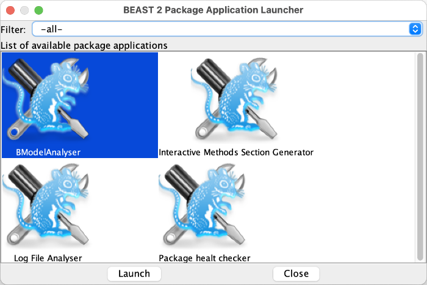

* Click "Launch". A second window will open where you can specify the log file of the BEAST2 analysis with the bModelTest model. Select file [`combined_bmodeltest.log`](res/combined_bmodeltest.log) as in the next screenshot. Also set the drop-down menu to the right of "Model Set" to "namedExtended", the model set used in our analysis.

* Click "OK" to close the window. This will open an output window as shown in the below screenshot, which lists the relative frequency at which the different substitution models were used for each partition. The models are encoded with six numbers that indicate which of the six subsitution rates (in this order: A &rarr; C, A &rarr; G, A &rarr; T, C &rarr; G, C &rarr; T, G &rarr; T) are linked in this model. For example the GTR model in which all rates are unlinked is encoded by the numbers "123456", the HKY model in which all transitions and all transversions are linked is encoded by "121121", and the Jukes-Cantor model in which all rates are linked is encoded by "111111". Codes for other models are listed in the Supplementary Material of [Bouckaert and Drummond (2017)](https://bmcevolbiol.biomedcentral.com/articles/10.1186/s12862-017-0890-6).

	The output in the below screenshot lists two percentages for each model of each of the four partitions; the first of these indicates the frequency of this model and the second indicates the cumulative frequency of this and all models listed above it. **Question 6:** Which models are most frequently used for the four partitions? [(see answer)](#q6)

As you'll see, the BModelAnalyser App will also have opened four browser tabs with visualizations of these frequencies as well as the ways in which the different models are connected.

From the above comparison of the log files resulting from BEAST2 analyses with and without the bModelTest model, we have learned that the bModelTest model has led to a roughly acceptable degree of MCMC stationarity after 100 million iterations whereas the analysis without this model still appears to be far from stationary after the same number of iterations. Given that the bModelTest model also required hardly any more time per iteration, I generally recommend the use of the bModelTest model.

## Summarizing the posterior tree distribution

So far, we have only used the log files produced by the two BEAST2 analyses to assess run completeness, but we have not yet looked into the results that are usually of greater interest: the phylogenetic trees inferred by BEAST2. We will do so in this part of the tutorial.

* Open the tree file resulting from the analysis with the bModelTest model, file [`combined_bmodeltest.trees`](res/combined_bmodeltest.trees) in the program FigTree. If you're not familiar with the software yet, you may want to have a look at tutorial [Maximum-Likelihood Phylogenetic Inference](../ml_phylogeny_inference/README.md) where the basic features of FigTree are explained. Once the tree file is opened (it might take a short while to load), the FigTree window should look more or less as shown in the next screenshot.
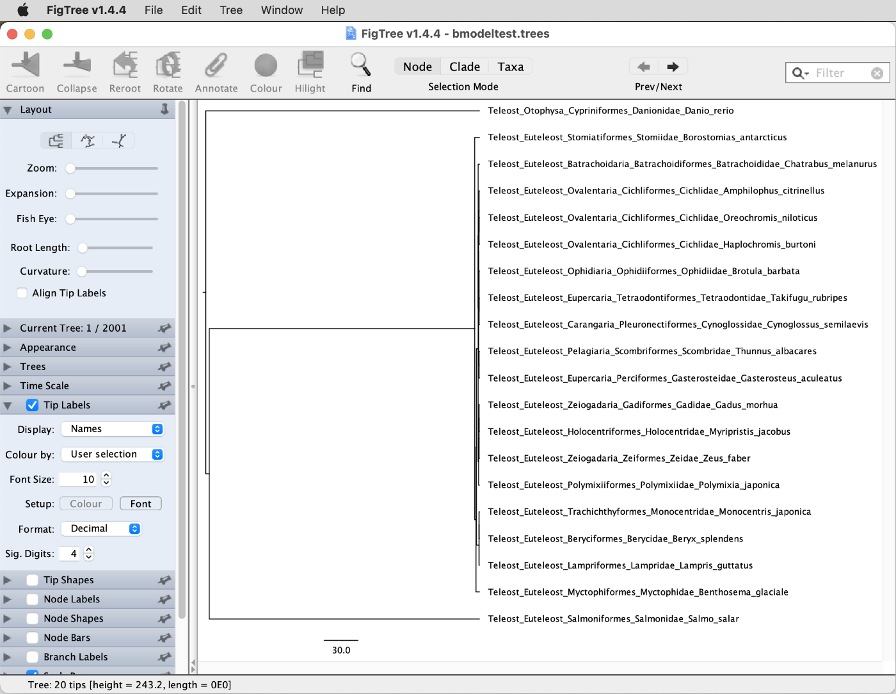
Note that in contrast to the trees shown in tutorial [Maximum-Likelihood Phylogenetic Inference](../ml_phylogeny_inference/README.md), this tree now is ultrametric, meaning that all tips are lined up and equally distant from the root. This is because the branch lengths in this tree represent time and all samples were taken (nearly) at the same time.

* Display node ages by clicking the triangle next to "Node Labels" in the panel on the left of the window. You'll see that the age of the root is over a hundred (that is in millions of years), while most other divergence are younger than 10, as in the next screenshot.
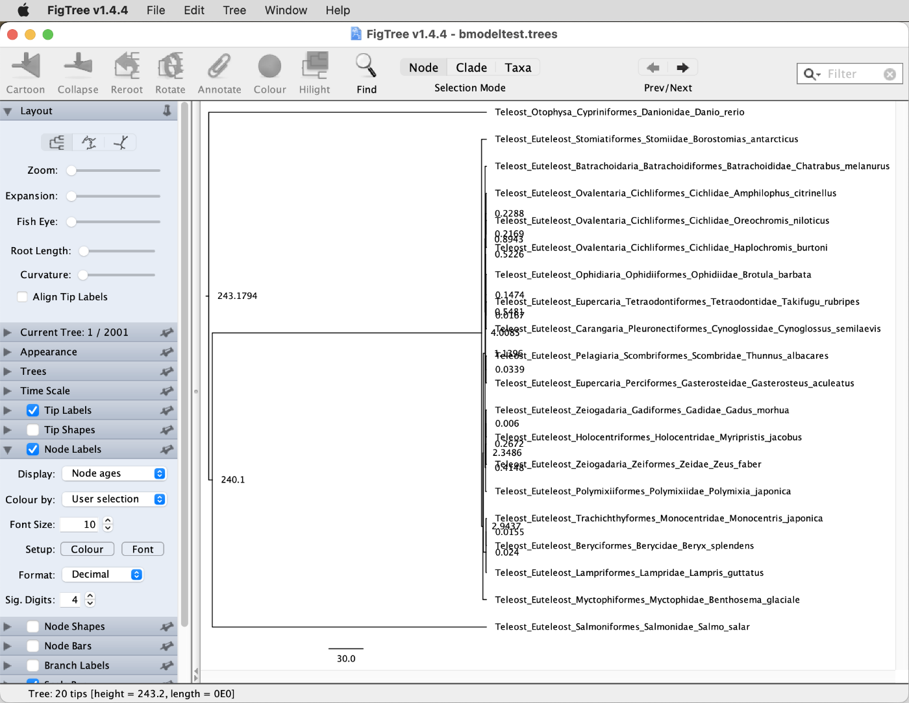
The reason why this phylogeny looks rather unexpected is that it is not the final tree estimate, but only the first phylogeny sampled during the MCMC analysis, and as you can see in the panel on the left (where it says "Current Tree: 1 / 10001"), there are several thousands of phylogenies in this file. This currently displayed phylogeny is in fact the starting tree that was randomly generated by BEAST2 to initiate the MCMC chain. At the right of the top menu, you'll see two buttons for "Prev/Next". If you click on the symbol for "Next" repeatedly, you can see how the sampled phylogenies have changed troughout the course of the MCMC search (FigTree is a bit slow with this many trees in memory). As you can see, the root age quickly moves towards the age that we had specified in BEAUti, 250 million years. Instead of clicking on this icon for "Next" 10,000 times to see the last phylogeny, click on the triangle to the left of "Current Tree: X / 10001" in the menu at the left. This will open a field where you can directly enter the number of the tree that you'ld like to see. Type "10000" and hit enter. You should then see a phylogeny that looks much more realistic than the very first sampled phylogeny. But note that this is only the last sampled phylogeny, it may not be representative for the entire collection of phylogenies sampled during the MCMC; the "posterior tree distribution".

* To generate a more representative phylogeny summarizing the information from the posterior tree distribution, open the program TreeAnnotator that you downloaded as part of the BEAST2 package. You should see a window as shown below.

* Specify a burnin percentage of 10, in agreement with the trace plots that we inspected earlier in Tracer, which looked stationary after the first 10% of the chain. Leave the default options for "Posterior probability limit" and "Target tree type" to generate a "Maximum clade credibility tree" (this is the most commonly used type of summary tree for Bayesian analyses; described in [Heled and Bouckaert 2013](https://bmcevolbiol.biomedcentral.com/articles/10.1186/1471-2148-13-221)). However, as "Node heights", choose "Mean heights" rather than the default "Common Ancestor heights". As input file, select [`combined_bmodeltest.trees`](res/combined_bmodeltest.trees) and specify `combined_bmodeltest.tre` (note the different extension) as the output file. When the window looks as shown in the next screenshot, click "Run".

* When TreeAnnotator has finished (after a few seconds), close the program and open the new file `combined_bmodeltest.tre` in FigTree. To see the support values for each node, set a tick next to "Node Labels" in the menu on the left, and click on the triangle next to it. Then choose "posterior" from the drop-down menu to the right of "Display". The posterior node support values represent our confidence that a given node is monophyletic, under the assumption that the employed model is correct. As shown in the next screenshot, not many clades are well-supported besides those that we constrained to be monophyletic (the constrained clades necessarily have a node support of 1).
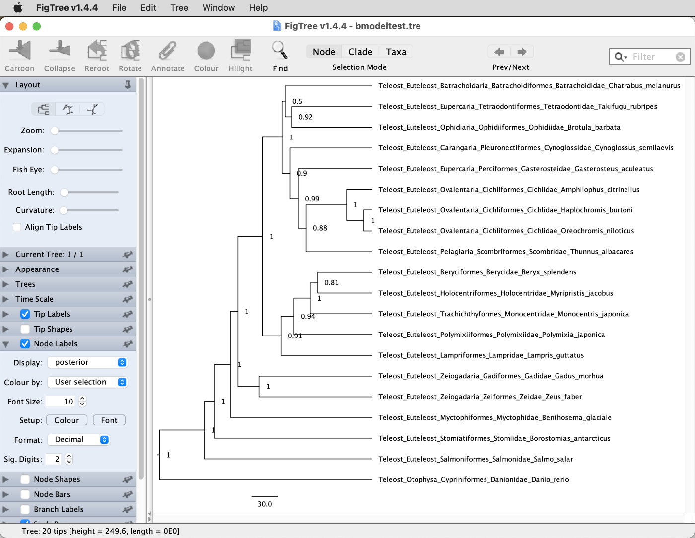

* To add a time scale to the phylogeny, set a tick next to "Scale Axis" in the menu on the left. Also click the triangle next to it, remove the tick next to "Show grid" in the newly opened menu field, but set a tick next to "Reverse axis" instead. The result is shown in the next screenshot.
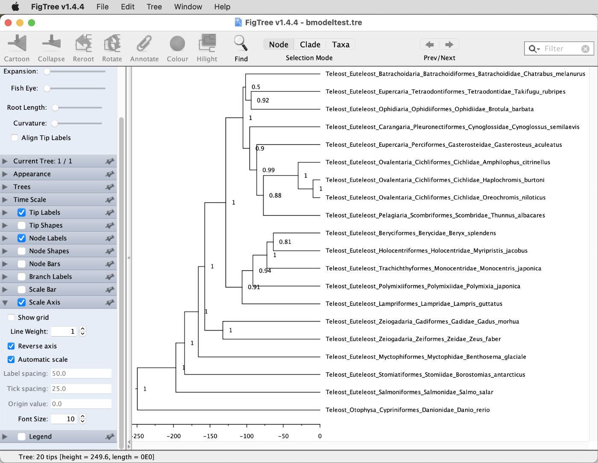

* To also see the confidence intervals for the age estimates, click on the triangle next to "Node Bars" in the menu on the left. Also set a tick in the checkbox for "Node Bars". Choose the first item from the drop-down menu for "Display", the "height_95%_HPD" ("HPD" = "highest posterior density"; this is the most common measure of the confidence interval in a Bayesian analysis). You should then see blue bars on each node, these indicate the age range within which the node lies with 95% certainty. The phylogeny should then look as shown below.
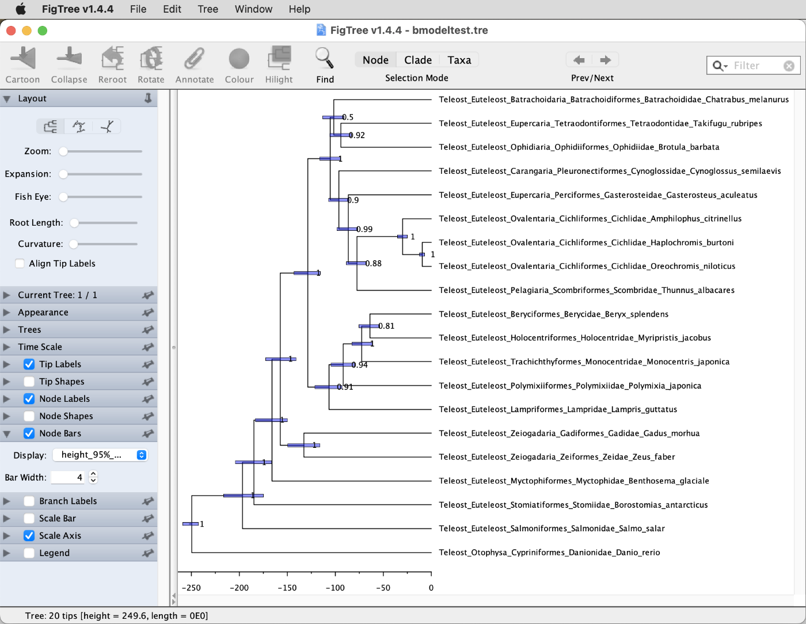

The timeline resulting from the BEAST2 analysis based on the 16S and *RAG1* alignments suggests that African and Neotrocial cichlid fishes diverged about 35 million years ago. However, the reliability of these estimates may be questioned, given that we used sequences of only two markers, and particularly because we calibrated the phylogeny with only a single constraint on the root node, which was taken from the results of another study rather than based on our own interpretation of the fossil record.
([Betancur-R. et al. 2013](http://currents.plos.org/treeoflife/article/the-tree-of-life-and-a-new-classification-of-bony-fishes/)).

 

                   

## Answers

* **Question 1:** As you should be able to see from the fifth column of the output, the times required per one million iterations should be very comparable between the three analyses. About 5 minutes should be required in all cases, with the analysis of file `bmodeltest.xml` perhaps being slightly faster. Thus, to complete the 10 million iterations specified in both XML files, run times of about 50 minutes will be required.

* **Question 2:** The low ESS values for the posterior and the prior probabilities clearly show that the chain can not be considered stationary yet. Even though the posterior and the prior probabilities are not themselves parameters of the model, their ESS values should also be above 200 (or ideally much higher) before the analysis can be considered stationary.

* **Question 3:** This may differ a bit each time that the analysis is run, but the parameter with the lowest ESS value is probably one of the substitution rates. In my analysis, the parameter with the lowest ESS value was the rate of A &rarr; T substitutions for the second partition (named "rateAT.02"), with an ESS of 16.
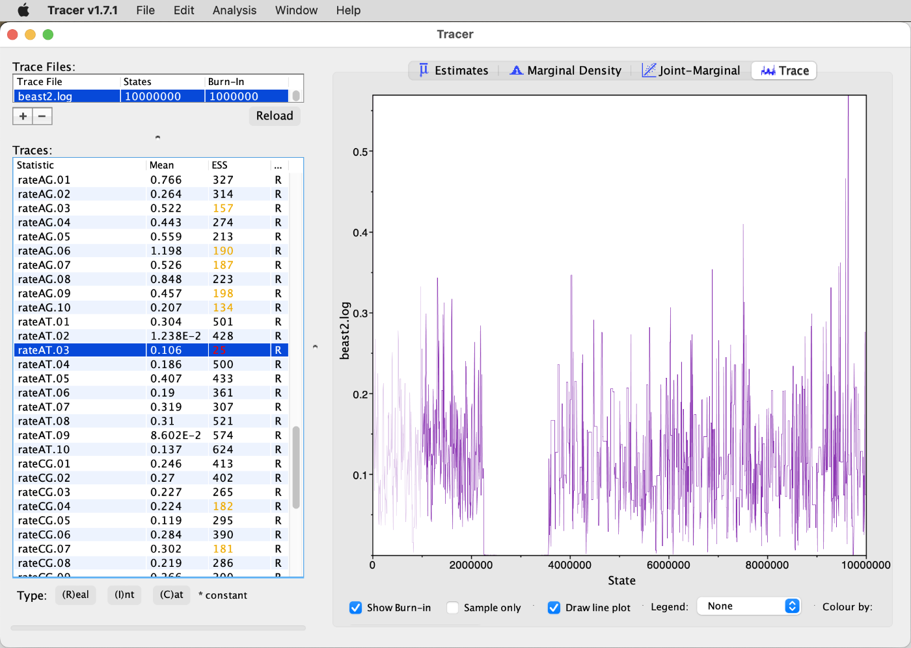

* **Question 4:** In my analysis (file `beast2.log`), the parameter for the rate of A &rarr; T substitutions in the second partition in fact seems to influence the prior probability. This is suggested by the apparently coinciding shifts in both traces, as shown in the next two screenshots.

The correlation between the A &rarr; T rate parameter for the second partition and the prior probability is also apparent when the two values are plotted against each other, by again selecting both of them and clicking the "Joint-Marginal" tab. The prior probability is particularly high when the substitution rate is extremely close to zero.

This strong effect of the A &rarr; T substitution rate parameter on the overall prior probability can be explained when we look at the prior-probability density that we had placed on this parameter (just like on other substitution rates; this is a default prior-probability density for all rates when using the GTR model in BEAST2): This prior-probability density is specified in file `beast2.xml` as follows:

		<prior id="RateATPrior.s:locus_0002" name="distribution" x="@rateAT.s:locus_0002">
			<Gamma id="Gamma.2.locus_0002" name="distr">
				<parameter id="RealParameter.14.locus_0002" spec="parameter.RealParameter" estimate="false" name="alpha">0.05</parameter>
				<parameter id="RealParameter.15.locus_0002" spec="parameter.RealParameter" estimate="false" name="beta">10.0</parameter>
			</Gamma>
		</prior>

	The above code specifies a gamma-distributed prior-probability density for the C &rarr; G substitution rate parameter, and the distribution parameters are alpha=0.05 and beta=10.0. The prior probability is therefore distributed as shown below:
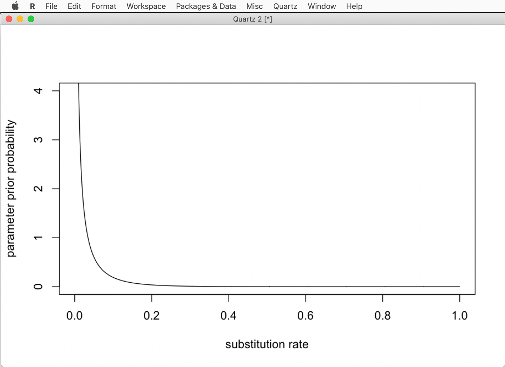
As shown in the above plot, the prior-probability density for the rate parameter grows towards infinity when the rate is very close to zero. This is fine as long as the sequence data supports a non-zero substitution rate strongly enough to pull the estimate away from zero. If one particular alignment partition, however, has very few substitutions of a particular type, the parameter estimate may be pulled towards zero by the increasing prior probability for this parameter, which then may have a strong influence on the overall prior probability.
	

* **Question 5:** The nucleotides C and G co-occur at only 41 sites in the 16S alignment and G and T co-occur at only 40 sites; thus, the subsitution rates C &rarr; G and G &rarr; T are likely harder to estimate than those for other types of substitutions. This is the reason why the rate parameters for these two substitutions are estimated very close to zero, which in turn has a strong influence on the overall prior probability and causes the absence of stationarity in the MCMC analysis for file `beast2.xml`.

* **Question 6:** The GTR model is most frequently used (99.78%) for the 16S partition, and the TVM model in which all transversions are unlinked but the transversions A &rarr; G and C &rarr; T are linked is used most frequently for all three *RAG1* partitions (66.55%, 31.50%, and 91.65%). So even though the GTR model is used almost exclusively for the 16S partition, and thus the C &rarr; G and G &rarr; T substitution rates are again (as in the previous analysis without the bModelTest model) estimated individually, the analysis with the bModelTest model does not seem to run into the issues that led to strong auto-correlation in the previous analysis (see the [answer to Question 4](#q4)). A possible explanation for this is that the bModelTest model might internally use a different prior-probability density for substitution rates, instead of the gamma distribution that is used without the bModelTest model.