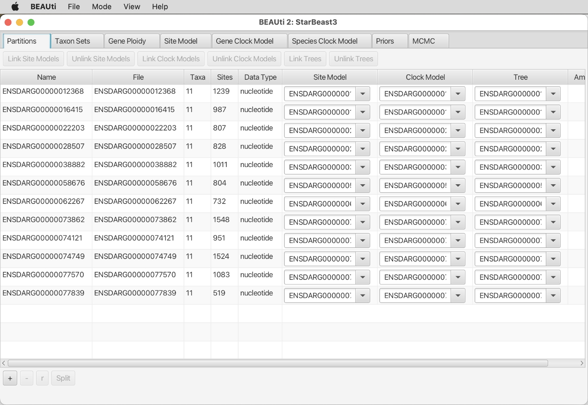
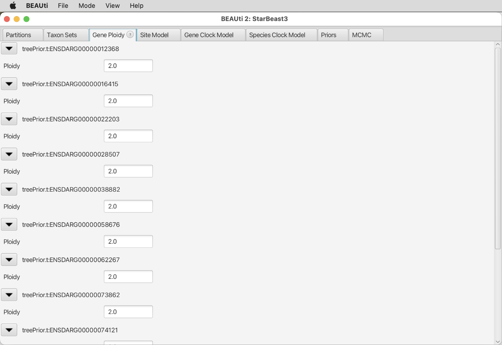
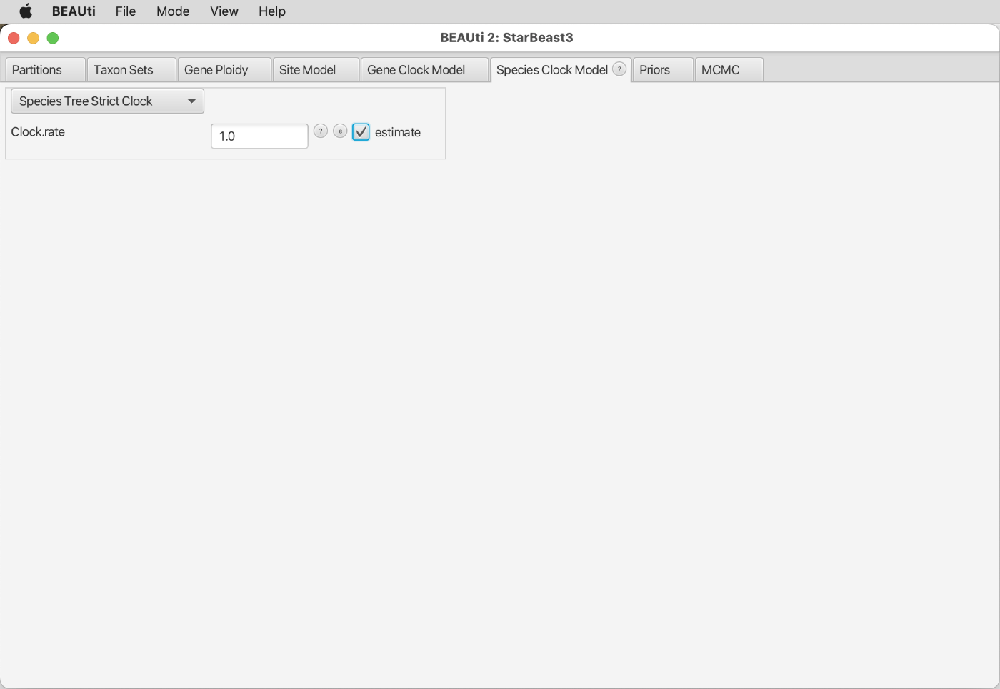
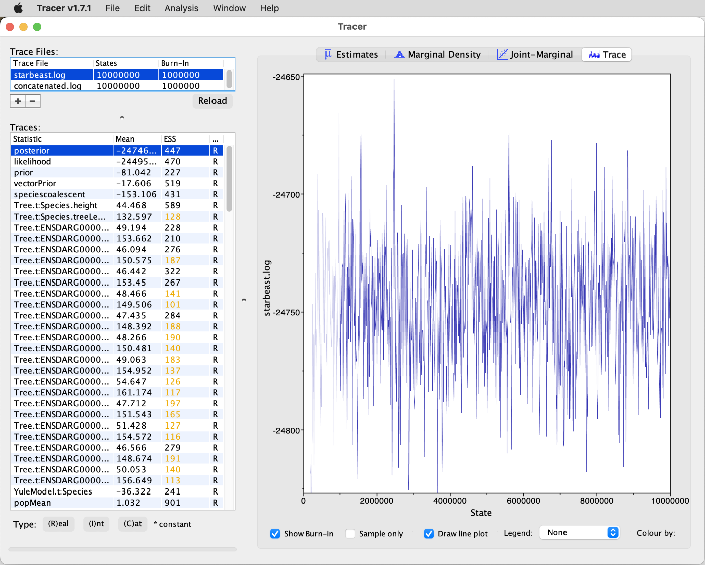
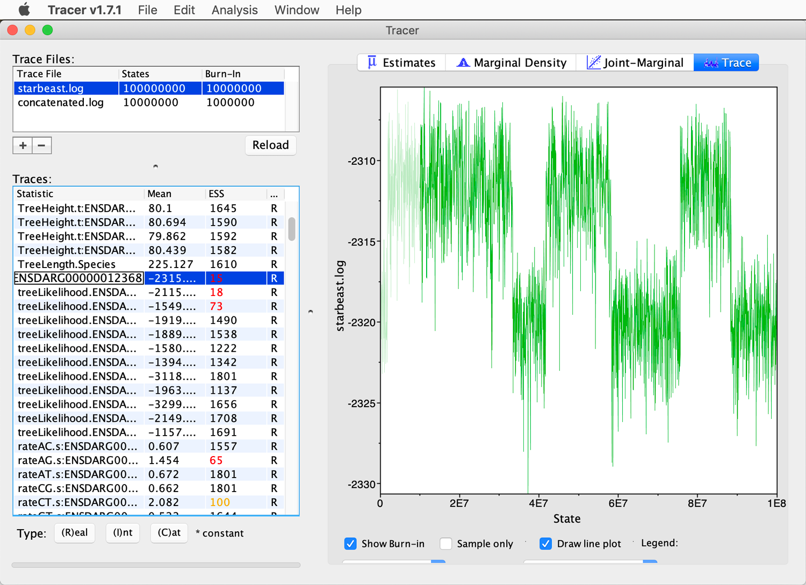

# Bayesian Species-Tree Inference

A tutorial on Bayesian inference of time-calibrated species trees 
By [Michael Matschiner](https://evoinformatics.group/team.html#michaelmatschiner)

## Summary

Most approaches for species-tree inference based on the multi-species coalescent model use sets of gene trees as input and assume that these gene trees are known without error. Unfortunately, this is rarely the case and misleading estimates can result if gene trees are in fact incorrect due to poor phylogenetic signal or other reasons. This problem can be avoided when gene trees and species trees are co-estimated in one and the same analysis, and when this is done in a Bayesian framework. One of the most popular tools implementing this approach is StarBEAST2, which, as an add-on package for the software BEAST2, also has the advantage that it allows the estimation of accurate divergence times under the multi-species coalescent model.

## Table of contents

* [Outline](#outline)
* [Dataset](#dataset)
* [Requirements](#requirements)
* [Bayesian species-tree inference with StarBEAST2](#starbeast2)
* [Bayesian species-tree inference with concatenation](#concatenation)
* [Comparing species trees estimated with StarBEAST2 and concatenation](#comparison)

## Outline

In this tutorial, I am going to present how a time-calibrated species tree can be inferred from a set of alignments with the multi-species-coalescent model implemented in StarBEAST2 ([Ogilvie et al. 2017](https://doi.org/10.1093/molbev/msx126)), an add-on package for the program BEAST2. For comparison, the species tree will also be inferred based on concatenation, and differences between the divergence times estimated with both approaches will be investigated and discussed.

## Dataset

As in tutorial [Maximum-Likelihood Species-Tree Inference](../ml_species_tree_inference/README.md), the dataset used here is the set of alignments for 72 genes extracted from published assemblies through an ortholog detection approach. This dataset includes sequences for eleven cichlid species, two of which represent Neotropical cichlids while the remaining nine species are from Africa. The focus of the taxon set is on cichlids of the rapid radiations in the East African lakes Tanganyika, Malawi, and Victoria. The table below lists all species included in the set of alignments. Note, however, that the sequence data for *Ophthalmotilapia ventralis* were extracted from a transcriptome assembly whereas genome assemblies were available for all other species.

| ID     | Species                         | Tribe          | Distribution    |
|--------|---------------------------------|----------------|-----------------|
| ampcit | *Amphilophus citrinellus*       | Heroini        | Neotropics      |
| andcoe | *Andinoacara coeruleopunctatus* | Cichlasomatini | Neotropics      |
| orenil | *Oreochromis nilotiucs*         | Oreochromini   | African rivers  |
| ophven | *Ophthalmotilapia ventralis*    | Ectodini       | Lake Tanganyika |
| astbur | *Astatotilapia burtoni*         | Haplochromini  | Lake Tanganyika |
| metzeb | *Metriaclima zebra*             | Haplochromini  | Lake Malawi     |
| punnye | *Pundamilia nyererei*           | Haplochromini  | Lake Victoria   |
| neobri | *Neolamprologus brichardi*      | Lamprologini   | Lake Tanganyika |
| neomar | *Neolamprologus marunguensis*   | Lamprologini   | Lake Tanganyika |
| neogra | *Neolamprologus gracilis*       | Lamprologini   | Lake Tanganyika |
| neooli | *Neolamprologus olivaceous*     | Lamprologini   | Lake Tanganyika |

## Requirements

This tutorial requires **BEAST2**, **bModelTest**, **Tracer**, and **FigTree** to be installed. Details about the installation of these tools can be found in tutorial [Bayesian Phylogenetic Inference](../bayesian_phylogeny_inference/README.md).

The following tools are required additionally:

* **StarBEAST2:** Like bModelTest, [StarBEAST2](https://github.com/genomescale/starbeast2) ([Ogilvie et al. 2017](https://doi.org/10.1093/molbev/msx126)) is an add-on package for BEAST2. It needs to be installed both on Saga and on the local computer.

	To install the StarBEAST2 package on Saga, use the following command:
	
		module purge
		module load Beast/2.6.4-GCC-9.3.0
		packagemanager -add starbeast2
		
	On your local computer, use BEAST2's PackageManager to install the StarBEAST2 package, as described in tutorial [Bayesian Phylogenetic Inference](../bayesian_phylogeny_inference/README.md) for the bModelTest package.

## Bayesian species-tree inference with StarBEAST2

In this part of the tutorial, we are going to use the multi-species-coalescent model implementation of StarBEAST2 ([Ogilvie et al. 2017](https://doi.org/10.1093/molbev/msx126)) to estimating a time-calibrated species tree from the set of twelve alignments.

* If you don't have the directory `72_genes`, which was used in tutorial [Maximum-Likelihood Species-Tree Inference](../ml_species_tree_inference/README.md), in your current directory on Saga anymore, copy or download the compressed directory `72_genes.tgz` once again with one of the following two commands:

		cp /cluster/projects/nn9458k/phylogenomics/week2/data/72_genes.tgz .
		
	or
		
		wget https://github.com/ForBioPhylogenomics/tutorials/raw/main/week2_data/72_genes.tgz

* If you had to re-download the compressed directory, uncompress it on Saga:

		tar -xzf 72_genes.tgz

As analyses with StarBEAST2 are relatively computationally demanding, we are going to limit the dataset to those alignments that contain sequence information for all of the eleven cichlid species. This is not the case for most of the 72 alignments in directory `72_genes` because sequences for many genes were apparently not included in the transcriptome assembly for *Ophthalmotilapia ventralis* generated by [Baldo et al. (2011)](https://doi.org/10.1093/gbe/evr047). To remove these alignments without sequence information for *Ophthalmotilapia ventralis*, we can use the Ruby script `filter_genes_by_missing_data.rb`.

* Get the script `filter_genes_by_missing_data.rb` either by copying it from `/cluster/projects/nn9458k/phylogenomics/week2/src` or by downloading it from GitHub, using one of the following two commands:

		cp /cluster/projects/nn9458k/phylogenomics/week2/src/filter_genes_by_missing_data.rb
		
	or
	
		wget https://raw.githubusercontent.com/ForBioPhylogenomics/tutorials/main/week2_src/filter_genes_by_missing_data.rb

	The first two command-line arguments required by this script are the names of a directory with sequence alignments and the name of another directory to which the filtered alignments should be written. In addition, a third arguments is required for the number of sequences per alignment that may be completely missing. In our case, this number should be 0 to ensure that all alignments contain at least partial sequence information for all species. Thus, execute the script with `srun` using the following commands:

		module load Ruby/2.7.2-GCCcore-9.3.0
		srun --ntasks=1 --mem-per-cpu=1G --time=00:01:00 --account=nn9458k --pty ruby filter_genes_by_missing_data.rb 72_genes 72_genes_red 0

	**Question 1:** How many alignments are left after this filtering step? [(see answer)](#q1)

* Download the directory `72_genes_red` from Saga to your local computer, using `scp` (you'll the `-r` option to download a directory).

* Open BEAUti. You may notice that even though you had installed the StarBEAST2 package, the interface of BEAUti apparently has not yet changed. This is because you still need to load one of several BEAUti templates that are provided by StarBEAST2. If you hover with the mouse over "Template" in BEAUti's "File" menu, you'll see that several templates are now available that apparently are connected to StarBEAST2, as shown in the next screenshot.

The templates provided by StarBEAST2 are "SpeciesTreeUCED", "SpeciesTreeRLC", "StarBeast2", "AIM", and "SpeciesTreeUCLN" (the template named "StarBeast" refers to the older version of StarBEAST that is installed by default). Of the five templates for StarBEAST2, the one named "StarBeast2" implements a strict-clock model, the two templates named "SpeciesTreeUCED" and "SpeciesTreeUCLN" implement relaxed-clock models with exponentially or lognormally distributed rate variation, respectively, and the template named "SpeciesTreeRLC" implements a random local clock. The template named "AIM" implements the isolation-with-migration model that allows the co-estimation of gene flow rates (a tutorial is available at [https://taming-the-beast.org/tutorials/AIM-Tutorial/](https://taming-the-beast.org/tutorials/AIM-Tutorial/)). In contrast to the first version of StarBEAST (\*BEAST), rate variation is modelled in StarBEAST2 as a species trait that applies to all genes instead of being estimated individually for each gene; this is one of the reasons why StarBEAST2 is much faster than StarBEAST (\*BEAST). The different clock models and their implementations are described in detail in [Ogilvie et al. (2017)](https://doi.org/10.1093/molbev/msx126).

	Because we are here investigating relationships of rather closely related species with comparable lifestyle and habitat, we'll assume that differences in their evolutionary rates are negligible. This choice will also be the more convenient one for this tutorial as relaxed-clock models would be computationally more demanding. Thus, select the template named "StarBeast2" to use the strict-clock model. Note, however, that if the analysis would be for a publication, it would be worth also exploring models of rate variation.

	After clicking on the "StarBeast2" template, you should see that the tabs "Taxon sets", "Gene Ploidy", and "Population Model" have been added to the BEAUti window, as shown in the next screenshot.

* Click on "Import Alignment" in the "File" menu and select the twelve alignment files from directory `72_genes_red`.  If you're asked to choose the datatype of the alignments, select "all are nucleotide". The window should then look as shown below.

* Select all partitions and click on "Link Clock Models" in the menu bar above the partitions table. However, unlike in tutorial [Bayesian Phylogenetic Inference](../bayesian_phylogeny_inference/README.md), leave the tree models unlinked.

* Move on to the tab named "Taxon sets". To allow the estimation of population sizes, StarBEAST2 analyses are usually performed with sequences of more than one individual per species, and the table in tab "Taxon sets" then allows one to specify which individuals belong to which species. Here, however, our dataset includes only sequences from a single individual of each species (this means that with our dataset we are unable to estimate population sizes reliably but we will avoid this problem by using a fixed population size, as will be described below). Nevertheless, it is required that we specify a species name for each taxon in our phylogeny, and these species names must not be identical to the names of the individuals. A simple solution is to reuse the names assigned to individuals also for the species and add a suffix such as "_spc" to the end of each name, as shown in the screenshot below.

* We'll ignore the "Tip Dates" tab as in tutorial [Bayesian Phylogenetic Inference](../bayesian_phylogeny_inference/README.md). Have a look at the "Gene Ploidy" tab instead. This is where you can specify the ploidy for each gene, which would have to be adjusted if we had mitochondrial markers. Given that all genes are from the nuclear genome (and assuming that none are from sex chromosomes), the default ploidy of 2 is correct; thus, don't change anything in this tab.

* Move on to the tab named "Population Model". As you can see from the selection in the drop-down menu at the top of this window, the default setting for the population model is "Analytical Population Size Integration". This default is a good option when multiple individuals are used per species; however, because our dataset includes only a single individual for each species, we should fix the population size to a reasonable estimate instead. To do so, select "Constant Populations" from the drop-down menu. In the field to the right of "Population Sizes", just leave the default value of 1.0. Even though unintuitive, this value does not directly specify the effective population size. Instead, this value needs to be scaled by the number of generations per time unit. Given that we will use 1 million years as the time unit in our analysis (as in the other tutorials), and assuming a generation time of 3 years for cichlids ([Malinsky et al. 2015](https://doi.org/10.1126/science.aac9927)), there are 333,333 generations per time unit. Thus the value of 1.0 specified for the population size in fact translates to an assumed effective population size of 333,333, which is comparable to the population sizes estimated for African cichlid fishes in [Meyer et al. (2017)](https://doi.org/10.1093/sysbio/syw069). Make sure to remove the tick from the checkbox to the left of "estimate" at the right of the window so that the specified population size is in fact fixed. The window should then look as in the screenshot below.

* Continue to the "Site Model" tab. As in the other tutorials, select the "BEAST Model Test" model from the first drop-down menu to average over a set of substitution models, and choose the "namedExtended" set of substitution models from the second drop-down menu. Make sure to set a tick in the checkbox next to "estimate" at the right of the window to estimate the mutation rate of the first partition relative to those of other partitions. The BEAUti window should then look as shown in the next screenshot.

* Still in the "Site Model" tab, select all partitions from the list at the left of the window as shown below, and click "OK" to copy the settings for the first partition also to all other partitions.

* Move on to the "Clock Model" tab. The "Strict Clock" model should already be selected in the drop-down menu; don't change this selection. However, we are going to estimate the rate of the clock through a calibration on the root of the phylogeny (this will be described below). To enable this estimation of the clock rate, set a tick next to "estimate" at the right of the window, as shown in the next screenshot.

* Continue to the "Priors" tab. At the very top of the list, select the "Birth Death Model" from the first drop-down menu next to "Tree.t:Species" to allow the possibility that extinction occurred during the evolution of cichlid fishes, as shown in the screenshot below.

* Then, scroll to the bottom of the list in the "Priors" tab. To specify a time calibration, click the "+ Add Prior" button at the very bottom. This should open a pop-up window as shown in the next screenshot. Keep the selection of "MRCA prior" in the drop-down menu and click "OK".

* This should open another pop-up window in which you should select a tree to which the calibration should be applied. Unfortunately, the window lists the names of all gene trees next to each other and thus may be wider than the computer screen. The button for the selection of the species tree, named "Tree.t:Species", is located at the very right of the window, as shown in the screenshot below. Thus, to select the species tree, you might have to move the window to the left until you can click on this button.

* Once you clicked the button, yet another pop-up window should open in which you can specify the ingroup of the clade that is to be time calibrated. We are going to calibrate the divergence between the Neotropical cichlid subfamily Cichlinae and the African subfamily Pseudocrenilabrinae according to the results obtained in tutorial [Phylogenetic Divergence-Time Estimation](../divergence_time_estimation/README.md). And since the dataset used in the current tutorial contains no species besides Neotropical and African cichlid fishes, their divergence represents the root of the phylogeny. Thus, to constrain the age of the root, select all species names from the left side of the pop-up window and click the `>>` button to move all of them into the ingroup on the right-hand side of the pop-up window. In the field at the top of the pop-up window next to "Taxon set label", specify "All" as the name of this group, as shown in the screenshot below. Then, click "OK".

* In tutorial [Phylogenetic Divergence-Time Estimation](../divergence_time_estimation/README.md), the age of the divergence of Neotropical and African cichlid fishes was estimated as 86 Ma, with a confidence interval from 68 to 101 Ma (in the analysis with file `cladeage2.xml`). To implement this age as a calibration for the current phylogeny, we can select a lognormally distributed prior density with a mean of 86 and a standard deviation of 0.1. To do so, choose "Log Normal" from the drop-down menu to the right of "All.prior" and write "86" and "8.5" in the fields to the right of "M" and "S", as in the screenshot below. Make sure to set the tick for "Mean in Real Space".

* Scroll to the right of the window to see the shape of the specified prior density for the age of the divergence of Cichlinae and Pseudocrenilabrinae, as shown in the next screenshot.

As listed in the summary statistics below the density plot, the 2.5% quantile is at 70.3 Ma and the 97% quantile is at 104 Ma; thus 95% of the prior mass lie between these values.

* Finally, continue to the "MCMC" tab. Set the chain length to 100 million as shown in the next screenshot. Set the value for "Store Every" to 50,000. Click on the black triangle to the left of "tracelog" to open the settings for the log file, and keep the default "starbeast.log" as the file name and specify 50,000 as the log frequency (to the right of "Log Every") as shown in the screenshot below.

* Click on the next black triangle to see the settings for the species-tree log file. Set the name of this file to "starbeast_species.trees" and the log frequency again to 50,000 as in the next screenshot.

* The settings for the log output to the screen ("screenlog") do not need to be changed. But click on the triangle below it to open the settings for the log file for the first gene tree, named "t:ENSDARG00000028507". Here, add "starbeast_" before the default "$(tree).trees", and specify again a log frequency of 50,000 as shown in the screenshot below.

* Repeat the above step also for the log files of all other gene trees.

* Then, save the file using "Save As" in BEAUti's "File" menu and name it "starbeast.xml".

* Copy file `starbeast.xml` to Saga using `scp`.

* On Saga, write a Slurm script named `run_starbeast.slurm` with the following content to submit the StarBEAST2 analysis:

		#!/bin/bash

		# Job name:
		#SBATCH --job-name=starbeast
		#
		# Wall clock limit:
		#SBATCH --time=2:00:00
		#
		# Processor and memory usage:
		#SBATCH --ntasks=1
		#SBATCH --mem-per-cpu=1G
		#
		# Accounting:
		#SBATCH --account=nn9458k
		#
		# Output:
		#SBATCH --output=run_starbeast.out

		# Set up job environment.
		set -o errexit  # Exit the script on any error
		set -o nounset  # Treat any unset variables as an error
		module --quiet purge  # Reset the modules to the system default

		# Load the beast2 module.
		module load Beast/2.6.4-GCC-9.3.0 

		# Run starbeast2.
		beast starbeast.xml

* Submit the StarBEAST2 analysis with `sbatch`:

		sbatch run_starbeast.slurm
 
This analysis should take around 50 minutes. Instead of waiting for the analysis to finish, you could already continue with the next part of the tutorial.

## Bayesian species-tree inference with concatenation

For comparison only, we are also going to repeat the above analysis not with the multi-species-coalescent model of StarBEAST2, but with BEAST2 based on concatenation. Several studies have already suggested that concatenation may not only lead to strong support for incorrect topologies ([Kubatko and Degnan 2007](https://doi.org/10.1080/10635150601146041)), but that it might also bias divergence times towards overestimation ([Ogilvie et al. 2017](https://doi.org/10.1093/molbev/msx126)). To see how this effect might influence divergence-time estimates of the eleven cichlid species, we are here going to analyze the dataset of twelve gene alignments also with concatenation and we will afterwards compare the results to those of the analysis with the multi-species-coalescent model.

* Open BEAUti once again on your local computer and do not load a template this time.

* Import the same twelve alignments again. If you're asked to choose the datatype of the alignments, select "all are nucleotide" as before.

* Select again all partitions, and this time click on both "Link Trees" and "Link Clock Models".

* In the "Site Model" tab, select again the "BEAST Model Test" model to average over a set of substitution models, and choose the set of "namedExtended" models for this. Also set the tick in the checkbox next to "estimate" to allow estimation of the mutation rate of the first partition compared to other partitions. The window should then look as shown in the screenshot below.

* As before, select all partitions in the list on the left-hand side of the window and click "OK" to copy the settings from the first partition to all other partitions.

* In the "Clock Model" tab, again select the strict-clock model. If the checkbox next to "estimate" at the right of the screen should be inactive, click on "Automatic set clock rate" in BEAUti's "Mode" menu to activate it. Then, set a tick in this checkbox, as shown in the next screenshot, to enable estimation of the clock rate.

* In the "Priors" tab, select again the "Birth Death Model" from the first drop-down menu.

* Then, scroll again to the bottom of the list shown in the "Priors" tab and click the "+ Add Prior" button to add a calibration for the age of the root of the phylogeny as we did before for the StarBEAST2 analysis. Use again a lognormally distributed prior density with a mean of 86 and a standard deviation of 0.1 (make sure to set the tick for "Mean in Real Space"). The BEAUti window should then look as shown in the next screenshot.

* For some reason, the default prior density for the clock rate is different when the StarBeast template is not used. Therefore, to keep the two two analyses as comparable as possible, we'll change the currently selected prior density for the clock rate so that it matches the one that we used in the the analysis with the multi-species-coalescent model. In that earlier analysis, the default prior density for the clock rate was lognormally distributed with a mean of 1 and a standard deviation (in real space) of 1. To use the same density here again, select "Log Normal" from the drop-down menu to the right of  "clockRate.c:ENSDARG000..." and click on the black triangle to the left of it. Then, specify "1.0" in the fields to the right of "M" (the mean) and "S" (the standard deviation). Also make sure to set a tick for "Mean In Real Space", as shown in the screenshot below.

* Continue to the "MCMC" tab and specify a chain length of 10 million MCMC iterations. Specify a frequency of 5,000 in the field to the right of "Store Every", name the log output file "concatenated.log", and also specify a log frequency of 5,000 as shown in the next screenshot.

Finally, set the name of the tree file to "concatenated.trees" and again use a log frequency of 5,000 as shown below.

* Then, use "Save As" in BEAUti's "File" menu to save the settings to a file named `concatenated.xml`.
 
* Copy file `concatenated.xml` to Saga using `scp`.

* On Saga, copy the Slurm script `run_starbeast.slurm` to a new file named `run_concatenated.slurm`:

		cp run_starbeast.slurm run_concatenated.slurm
		
* Open the file `run_concatenated.slurm` in a text editor available on Saga, and replace `starbeast` with `concatenated` on lines 4, 17, and 28.

* Then, submit the new Slurm script with `sbatch` to run the BEAST2 analysis based on concatenation:

		sbatch run_concatenated.slurm
 
This analysis should run for about 25 minutes.

## Comparing species trees estimated with StarBEAST2 and concatenation

We are now going to compare the time-calibrated species trees estimated with the multi-species coalescent model and with concatenation. Recall that both analyses used the same sequence data, the same time calibration, and the same substitution and clock models. The difference between the two approaches is only that the multi-species coalescent model estimates the species tree and all gene trees separately whereas just a single tree is estimated based on concatenation.

* First, we'll assess the stationarity of the MCMC analyses once again with the software Tracer. Thus, download the log files resulting from both analyses, `starbeast.log` and `concatenated.log` from Saga to your local computer.

* Open both log files in Tracer. The trace plot for the posterior of the StarBEAST2 analysis should look more or less as shown in the next screenshot.

The ESS value for the likelihood is below 200, suggesting that the analysis should ideally have run even longer. Nevertheless, the current results are sufficient to allow a comparison of the divergence times obtained with the two models.

* Have a look at the estimates for the parameters named "TreeHeight.Species" or "TreeHeight.t:ENSDAR...". These are the mean age estimates for the roots of the species tree and all gene trees.

	**Question 2:** What is the average age difference between the root of the species tree and those of the gene trees; and could we have expected this difference? [(see answer)](#q2)

* Note the estimate for the mean substitution rate across all genes. The parameter for this substitution rate is named "strictClockRate.c:ENS..." and you'll find it near the end of the list of parameters. This estimate should be around 5.4 &times; 10-4 per million years (5.378 &times; 10-4 in my analysis). It will be used again for time calibration of a Bayesian species network of Lake Tanganyika ciclid species in tutorial [Bayesian Analysis of Species Networks](bayesian_species_tree_inference/README.md).

* Scroll down the list of parameters to check the other ESS values. You'll notice that particularly the ESS values for some of the gene-tree likelihoods are rather poor.

* Have a look if the histograms for any of the the gene-tree likelihoods with low ESS values have bimodal distributions similar to that shown in the next screenshot.

The trace plot for the same gene-tree likelihood shows that the MCMC chain seems to have switched back and forth between two different states, as shown below.

	**Question 3:** Can you figure out what might cause these switches? [(see answer)](#q3)

* Next, check the stationarity of the chain for the concatenated analysis. You'll probably find that the degree of stationarity for this analysis (after 10 million MCMC iterations) is quite comparable or slightly lower than that of the analysis with the multi-species-coalescent model (after 100 million iterations). It is not surprising that the analysis with the multi-species coalescent model requires more iterations to reach a similar level of stationarity, given that twelve gene trees and a species tree need to be optimized by that model wheras only a single tree is estimated based on concatenation.

* Next, use TreeAnnotator on Saga to generate MCC summary trees for the species tree of the analysis with the multi-species-coalescent model (file `starbeast_species.trees`) and for the tree based on concatenation (file `concatenated.trees`). To do so, use a burnin percentage of 10, specify that node ages in the summary tree should be according to mean age estimates, Select first `starbeast_species.trees` and then `concatenated.trees` as input tree file and name the output file accordingly `starbeast_species.tre` or `concatenated.tre`:

		module load Beast/2.6.4-GCC-9.3.0
		srun --ntasks=1 --mem-per-cpu=1G --time=00:01:00 --account=nn9458k --pty treeannotator -burnin 10 -heights mean starbeast_species.trees starbeast_species.tre
		srun --ntasks=1 --mem-per-cpu=1G --time=00:01:00 --account=nn9458k --pty treeannotator -burnin 10 -heights mean concatenated.trees concatenated.tre

* Download the two MCC tree files `starbeast_species.tre` and `concatenated.tre` to your local computer.

* Open both files in FigTree, select "Node ages" to be displayed as node labels, and compare these between the two trees. The two summary trees should look similar to those shown in the next two screenshots.

	**Question 4:** What do you notice? [(see answer)](#q4)

* If you display the "posterior" instead of the node ages as the node labels in both trees, you'll see that generally the support values are higher when based on concatenation.

	**Question 5:** Given these differences, which phylogeny do you consider more reliable? [(see answer)](#q5)

To visualize the variation among the gene trees, we'll also generate maximum-clade-credibility summary trees for each of the twelve gene trees.

* Open a new file named `summarize_gene_trees.sh` on Saga, and write the following content to it:

		module load Beast/2.6.4-GCC-9.3.0
		for trees in starbeast_ENSDARG*.trees
		do
			tre=${trees%.trees}.tre
			treeannotator -burnin 10 -heights mean ${trees} ${tre}
		done

* Execute the script with `srun`:

		srun --ntasks=1 --mem-per-cpu=1G --time=00:05:00 --account=nn9458k --pty bash summarize_gene_trees.sh

* You should then have twelve MCC tree files ending in `.tre`. To see if this is the case, you could do a quick check with

		ls starbeast_ENSDARG*.tre | wc -l
		
To visualize the summary trees for all genes jointly with the species tree from the analysis with the multi-species-coalescent model, we can use the program Densitree ([Bouckaert 2010](https://academic.oup.com/bioinformatics/article/26/10/1372/192963)) that is distributed as part of the BEAST2 package. Thus, you will find it in the same directory as BEAST2, BEAUti, and TreeAnnotator. However, before we can open all summary trees jointly in Densitree, we'll need to prepare a single file containing all of them. The easiest way to do so is to use the Python script `logcombiner.py` on Saga. This script accepts a list with the names of tree files as input and produces a single tree file with these trees as output.

* Generate a file on Saga with a list of the names of the summary-tree files for the species tree as well as the gene trees from the analysis with the multi-species-coalescent mode:

		ls starbeast_species.tre starbeast_ENSDARG*.tre > starbeast_trees.txt

* Get the script `logcombiner.py` either by copying it from `/cluster/projects/nn9458k/phylogenomics/week2/src` or by downloading it from GitHub, using one of the following two commands on Saga:

		cp /cluster/projects/nn9458k/phylogenomics/week2/src/logcombiner.py .

	or

		wget https://raw.githubusercontent.com/ForBioPhylogenomics/tutorials/main/week2_src/logcombiner.py

* Before running the Python script, the Biopython library for Python needs to be installed. Do so with `pip`:

		module load Python/3.8.2-GCCcore-9.3.0
		pip install --user Bio

* Use the file with a list of tree file names as input for the script `logcombiner.py` and specify `starbeast.trees` as the name of the output file:
	
		srun --ntasks=1 --mem-per-cpu=1G --time=00:05:00 --account=nn9458k --pty python3 logcombiner.py starbeast_trees.txt starbeast.trees
		
	(there will be a warning message but you can ignore it).

* Download file `starbeast.trees` to your local computer using `scp`.

* Open file `starbeast.trees` in the software Densitree. After rotating some nodes to match the node order of the FigTree screenshots above (click "Show Edit Tree" in DensiTree's "Edit" menu to do this), the set of trees should look as shown in the next screenshot.

	**Question 6:** Can you tell which of the trees shown in DensiTree is the species tree? [(see answer)](#q6)

	As you'll see from the DensiTree visualization, there is much variation in the topologies of the gene trees. This could either only appear to be so due to a lack of phylogenetic signal or it could reflect real gene-tree discordance due to incomplete lineage sorting. To find out which of the two possibilities is responsible for the displayed variation, we can check if discordant relationships are strongly supported in different gene trees.

* Download the MCC trees for the genes ENSDARG00000058676 and ENSDARG00000062267 (files `starbeast_ENSDARG00000058676.tre` and `starbeast_ENSDARG00000062267.tre` from Saga to your local computer using `scp`.

* Open both MCC tree files in FigTree and select the "posterior" to be displayed as node labels in both trees. The two FigTree windows should then look more or less like the two screenshots below.

You'll see that many relationships in these two trees are strongly supported but nevertheless disagree between the two genes. For example, a sister-group relationship between *Metriaclima zebra* ("metzeb")and *Pundamilia nyererei* ("punnye") is strongly supported (Bayesian posterior probability = 1.0) by gene ENSDARG00000058676 whereas gene ENSDARG00000062267 gives the same strong support to a sister-group relationship between *Astatotilapia burtoni* ("astbur") and *Pundamilia nyererei* ("punnye"). Moreover, none of the relationships among the species of genus *Neolamprologus* ("neobri", "neogra", "neomar", and "neooli") agree between the two trees and yet all are very strongly supported. These well-supported conflicts are strong evidence for either incomplete lineage sorting or hybridization, two processes that would result in misleading estimates when concatenation is used for phylogenetic inference.

By accounting for incomplete lineage sorting, our analysis with the multi-species coalescent model has now generated a timeline of cichlid divergences that may be considered relatively robust (assuming that it is not overly biased by unaccounted hybridization and gene flow). Notably, the first divergences among cichlid species from Lake Tanganyika occurred around 8 Ma according to the timeline inferred with StarBEAST2 and are thus younger than the estimated age of the lake of 9-12 million years ([Cohen et al. 1993](https://doi.org/10.1130/0091-7613(1993)021%3C0511:ETAOFO%3E2.3.CO;2)). Additionally, the timeline places the diversification of the four *Neolamprologus* species from Lake Tanganyika within the last one million years, indicating that this group speciated very rapidly.

 

                   

## Answers

* **Question 1:** After removing alignments that do not contain sequence information for all eleven cichlid species, twelve sequence alignments remain in the dataset, as can be shown with this command:

		ls 72_genes_red/*.fasta | wc -l
		

* **Question 2:** In my file `starbeast.log`, the age of the species tree is 78.213 and the ages of gene trees are 80.179, 79.543, 79.719, 80.365, 80.033, 80.292, 80.357, 81.812, 80.1, 80.694, 79.862, and 80.439 Ma. The mean of these ages is 80.283 Ma, a little more than 2 million years older than the age of the species tree. This is pretty much what we could have expected, because the expected coalescent time for two alleles in a panmictic population is 2 &times; <i>N</i>e &times; <i>g</i>, where <i>N</i>e is the effective population size and <i>g</i> is the generation time (note that in the model, the ancestral population is assumed to be panmictic before the species divergence). Recall that we had fixed the population-size value in the "Population Model" tab in BEAUti to 1.0, because we assumed a population size of 333,333, equal to the number of generations per million year if we assume a generation time of 3 years for cichlids. With the same assumed values for the population size and generation time, the expected time to coalescence is 2 &times; 333,333 * 3 = 2,000,000, very much in line with the observed age difference between the species tree and the gene trees.

* **Question 3:** The reason for the switches in the likelihood of the first gene tree are actually not very obvious. Usually, such patterns can arise when rare topological changes of the species tree occur during the MCMC chain, that increase the likelihood of one gene tree while decreasing the likelihood of another gene tree so that the overall likelihood remains more or less constant. However, this is not the case here. Examining the tree files for the first gene tree [`starbeast_ENSDARG00000012368.trees`) with FigTree shows that the topology changes much more frequently than the switches in the likelihood occur. Instead, it is possible that the changes in the likelihood are driven by variation in substitution-rate estimates. At least a comparison of the first gene-tree likelihood with the rate of A &rarr; G substitutions in the first alignment indicates that both correlate, as shown in the next screenshot. Regardless of the underlying cause it appears that running the chain with more iterations (perhaps ten times longer) might allow to average adequately over both states so that the chain can eventually be considered stationary despite the switches between the two states.

* **Question 4:** You should be able to see that particularly the young divergence times are proportionally very different between the two trees. In the extreme case, the divergence of youngest divergence event is estimated around 0.6 Ma with the multi-species-coalescent model, but four times older, around 2.2 Ma based on concatenation. Note, however, that the two species involved in this divergence are not identical in the two trees, the two divergence times are therefore not directly comparable. Nevertheless, age estimates are also very different for strongly supported nodes that are only slightly older: The first divergence among the species of the genus *Neolamprologus* is estimated at around 1.2 Ma with the multi-species coalescent model, but around 3.2 Ma (still more than twice as old!) with concatenation.

* **Question 5:** It is well known that concatenation can lead to inflated node support (e.g. [Kubatko and Degnan 2007](https://doi.org/10.1080/10635150601146041); [Degnan and Rosenberg 2009](https://doi.org/10.1016/j.tree.2009.01.009)), so the higher node-support values based on concatenation are not unexpected and they should not be trusted. In addition, the divergence-time estimates based on concatenation should also be seen with caution, as simulations have shown in several studies (e.g. [Ogilvie et al. 2017](https://doi.org/10.1093/molbev/msx126); [Stange et al. 2018](https://doi.org/10.1093/sysbio/syy006)) that these can be overestimated. The multi-species-coalescent model, on the other hand, accounts for variation in gene trees due to incomplete lineage sorting and recombination, and thus should be robust to one of the most important sources of potential bias. However, it should be noted that the multi-species-coalescent model also does not account for other processes that might influence the reliability of the phylogenetic estimates, such as within-gene recombination, hybridization and gene flow, or ancestral population structure.

* **Question 6:** Even though it is difficult to see, one can tell that the species tree is shown in dark green. This is because necessarily all divergences in the species tree are younger than the corresponding divergences in the gene tree, and this is the case for the tree shown in dark green. The opposite, gene tree divergences younger than species tree divergences, could only be possible through hybridization and gene flow; however, since hybridization is not included in the the multi-species-coalescent model used for this analysis, gene trees must be older than the species tree.