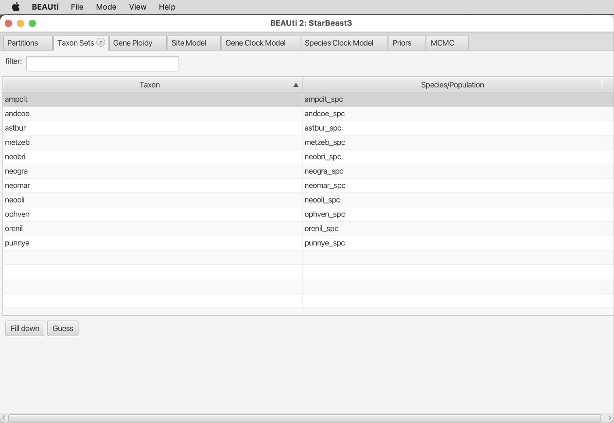
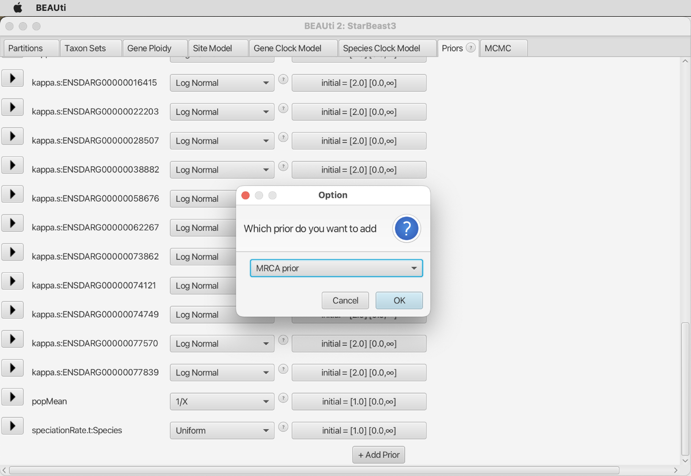
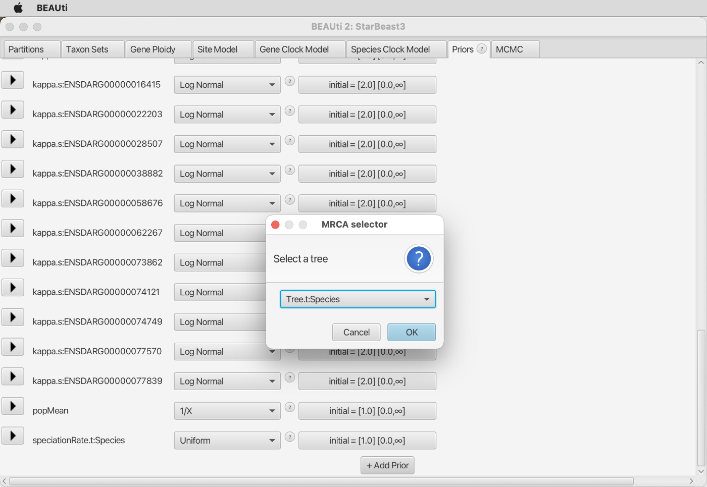
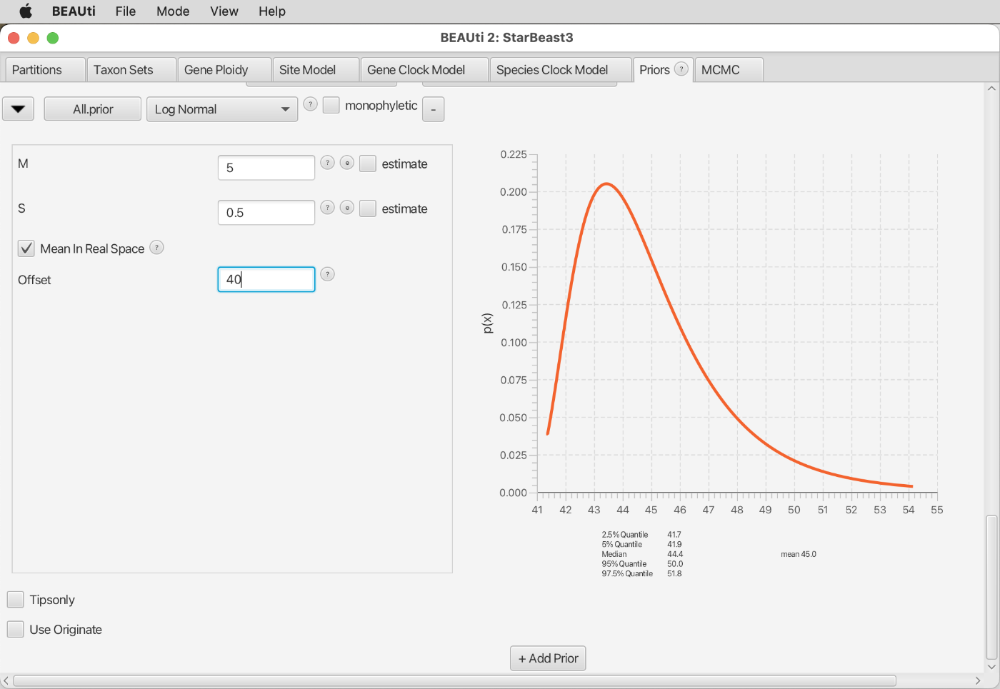
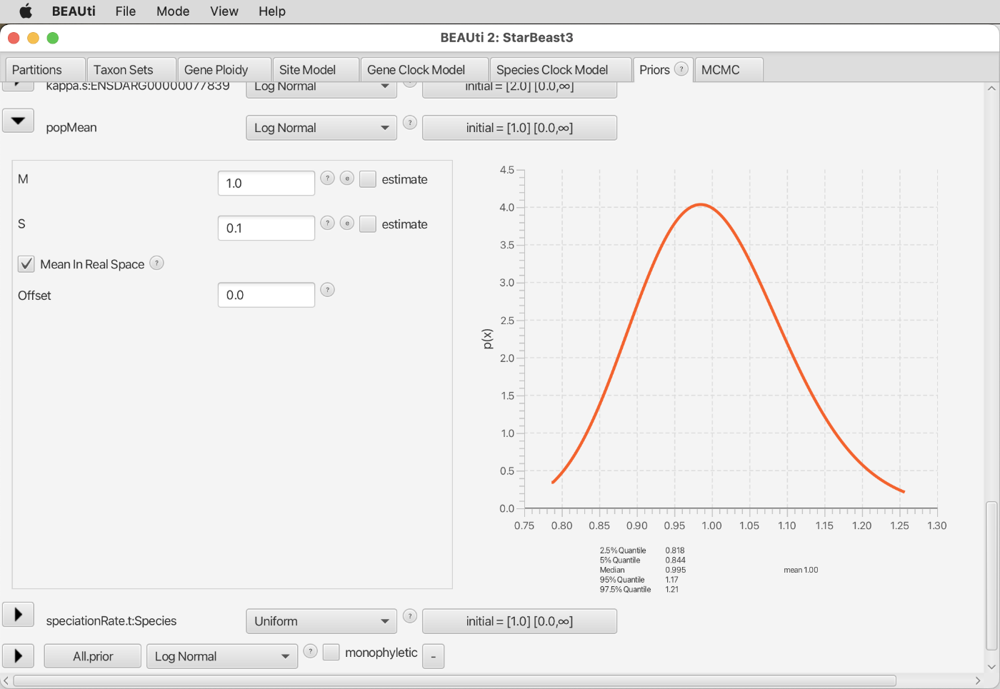
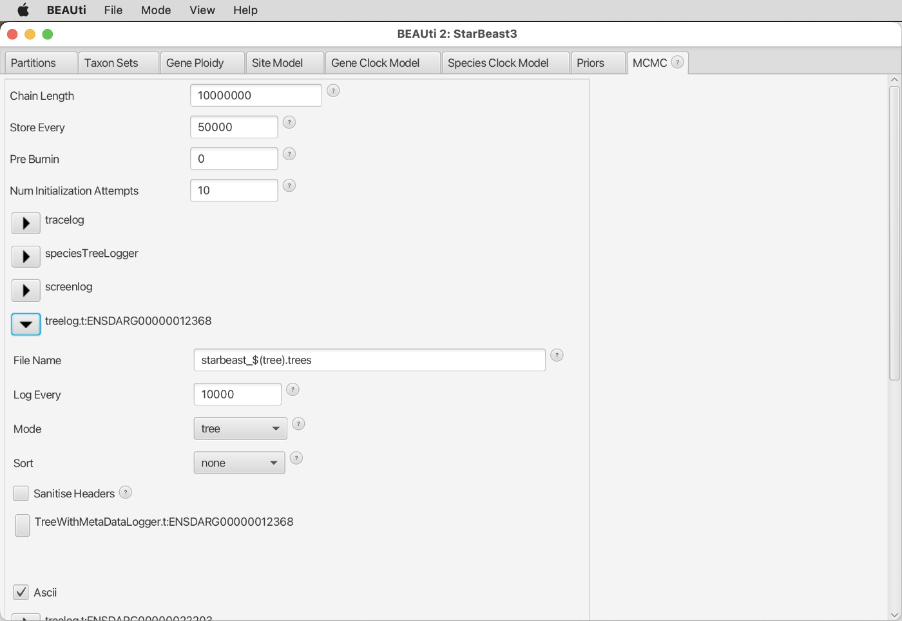
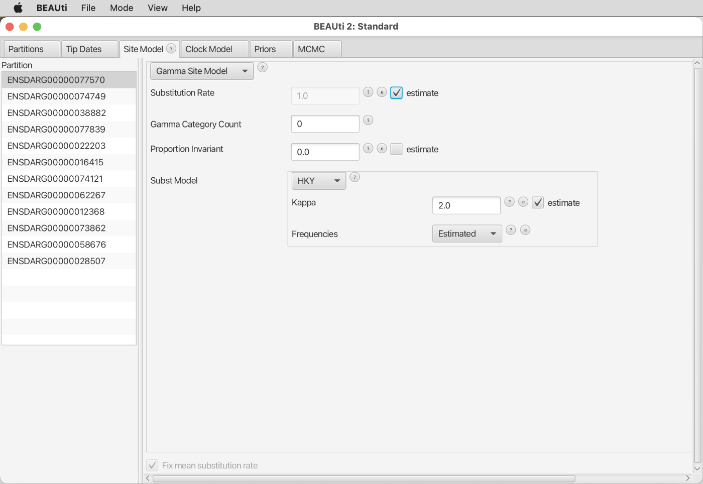
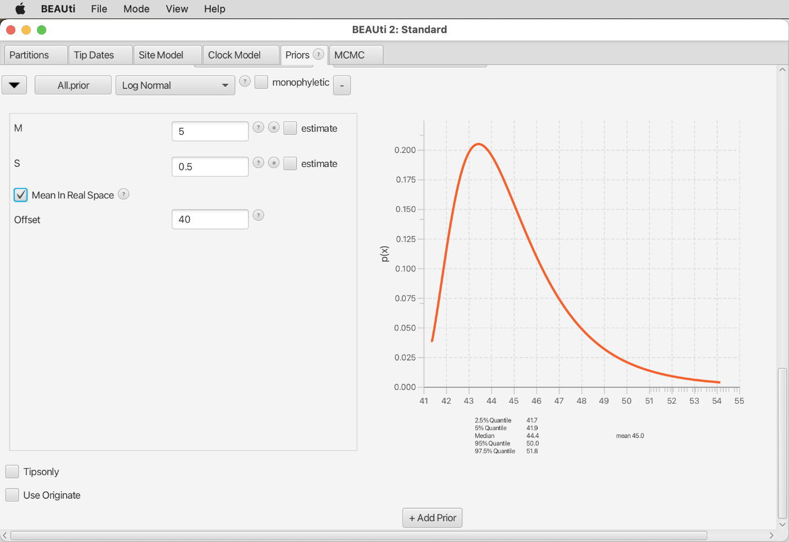
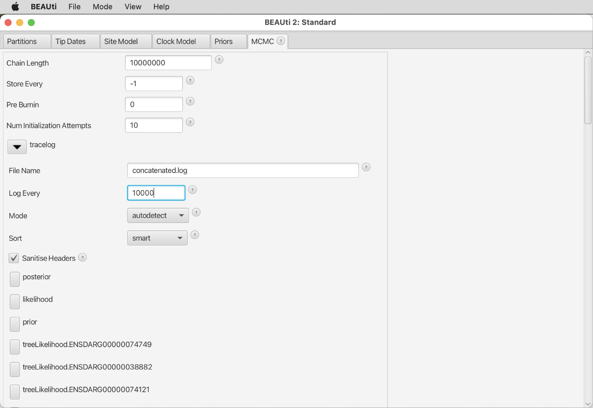
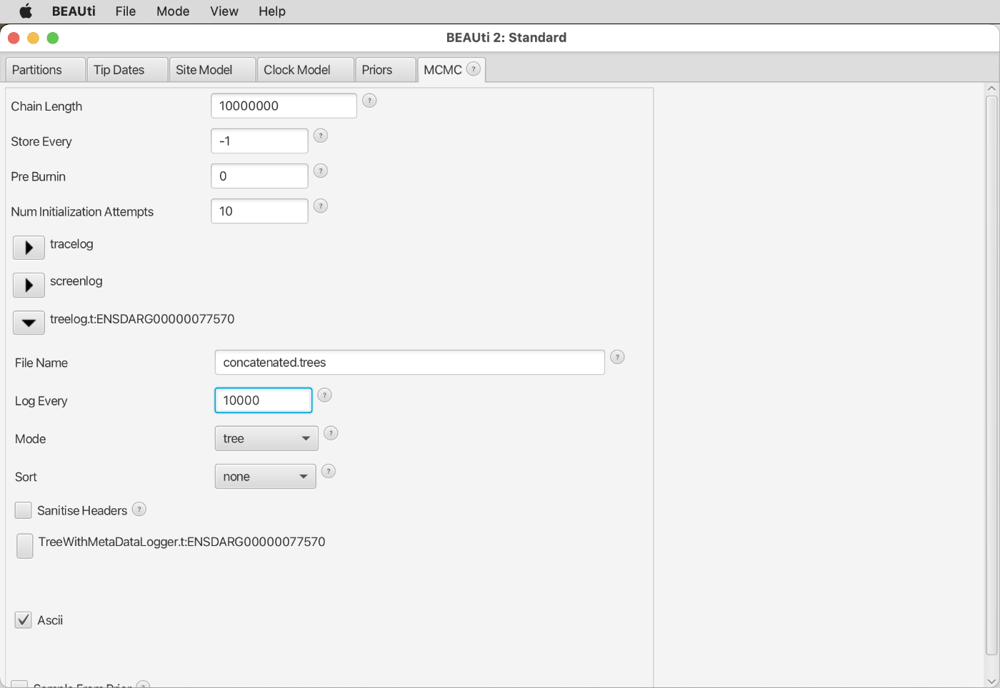

# Bayesian Species-Tree Inference

A tutorial on Bayesian inference of time-calibrated species trees 
By [Michael Matschiner](https://evoinformatics.group/team.html#michaelmatschiner)

## Summary

Most approaches for species-tree inference based on the multi-species coalescent model use sets of gene trees as input and assume that these gene trees are known without error. Unfortunately, this is rarely the case and misleading estimates can result if gene trees are in fact incorrect due to poor phylogenetic signal or other reasons. This problem can be avoided when gene trees and species trees are co-estimated in one and the same analysis, and when this is done in a Bayesian framework. One of the most popular tools implementing this approach is StarBeast3, which, as an add-on package for the software BEAST2, also has the advantage that it allows the estimation of accurate divergence times under the multi-species coalescent model.

## Table of contents

* [Outline](#outline)
* [Dataset](#dataset)
* [Requirements](#requirements)
* [Bayesian species-tree inference with StarBeast3](#starbeast3)
* [Bayesian species-tree inference with concatenation](#concatenation)
* [Comparing species trees estimated with StarBeast3 and concatenation](#comparison)

## Outline

In this tutorial, I am going to present how a time-calibrated species tree can be inferred from a set of alignments with the multi-species-coalescent model implemented in StarBeast3 ([Douglas et al. 2022](https://doi.org/10.1093/sysbio/syac010)), an add-on package for the program BEAST2. For comparison, the species tree will also be inferred based on concatenation, and differences between the divergence times estimated with both approaches will be investigated and discussed.

## Dataset

As in tutorial [Maximum-Likelihood Species-Tree Inference](../ml_species_tree_inference/README.md), the dataset used here is the set of alignments for 72 genes extracted from published assemblies through an ortholog detection approach. This dataset includes sequences for eleven cichlid species, two of which represent Neotropical cichlids while the remaining nine species are from Africa. The focus of the taxon set is on cichlids of the rapid radiations in the East African lakes Tanganyika, Malawi, and Victoria. The table below lists all species included in the set of alignments. Note, however, that the sequence data for *Ophthalmotilapia ventralis* were extracted from a transcriptome assembly whereas genome assemblies were available for all other species.

| ID     | Species                         | Tribe          | Distribution    |
|--------|---------------------------------|----------------|-----------------|
| ampcit | *Amphilophus citrinellus*       | Heroini        | Neotropics      |
| andcoe | *Andinoacara coeruleopunctatus* | Cichlasomatini | Neotropics      |
| orenil | *Oreochromis nilotiucs*         | Oreochromini   | African rivers  |
| ophven | *Ophthalmotilapia ventralis*    | Ectodini       | Lake Tanganyika |
| astbur | *Astatotilapia burtoni*         | Haplochromini  | Lake Tanganyika |
| metzeb | *Metriaclima zebra*             | Haplochromini  | Lake Malawi     |
| punnye | *Pundamilia nyererei*           | Haplochromini  | Lake Victoria   |
| neobri | *Neolamprologus brichardi*      | Lamprologini   | Lake Tanganyika |
| neomar | *Neolamprologus marunguensis*   | Lamprologini   | Lake Tanganyika |
| neogra | *Neolamprologus gracilis*       | Lamprologini   | Lake Tanganyika |
| neooli | *Neolamprologus olivaceous*     | Lamprologini   | Lake Tanganyika |

## Requirements

This tutorial requires **BEAST2**, **bModelTest**, **Tracer**, and **FigTree** to be installed. Details about the installation of these tools can be found in tutorial [Bayesian Phylogenetic Inference](../bayesian_phylogeny_inference/README.md).

The following tools are required additionally:

* **StarBeast3:** Like bModelTest, [StarBeast3](https://github.com/genomescale/starbeast3) ([Douglas et al. 2022](https://doi.org/10.1093/sysbio/syac010)) is an add-on package for BEAST2. It needs to be installed both on Saga and on the local computer.

	To install the StarBeast3 package on Saga, use the following command:
	
		module purge
		module load Beast/2.7.0-GCC-11.3.0-CUDA-11.7.0
		packagemanager -add starbeast3
		
	On your local computer, use BEAST2's PackageManager to install the StarBeast3 package, as described in tutorial [Bayesian Phylogenetic Inference](../bayesian_phylogeny_inference/README.md) for the bModelTest package.

* **ape:** [ape](http://ape-package.ird.fr) ([Paradis 2004](https://doi.org/10.1093/bioinformatics/btg412)) is an R package that serves as a multitool for basic phylogenetic analyses and handling of phylogenetic trees. To install it on Saga, use the following commands:

		module purge
		module load R/4.2.1-foss-2022a
		R
		install.packages("ape", repos='http://cran.us.r-project.org')
		quit(save="no")

	If asked whether you "would you like to use a personal library?", type "yes".

## Bayesian species-tree inference with StarBeast3

In this part of the tutorial, we are going to use the multi-species-coalescent model implementation of StarBeast3 ([Douglas et al. 2022](https://doi.org/10.1093/sysbio/syac010)) to estimate a time-calibrated species tree from the set of twelve alignments.

* If you don't have the directory `72_genes`, which was used in tutorial [Maximum-Likelihood Species-Tree Inference](../ml_species_tree_inference/README.md), in your current directory on Saga anymore, copy or download the compressed directory `72_genes.tgz` once again with one of the following two commands:

		cp /cluster/projects/nn9458k/phylogenomics/week2/data/72_genes.tgz .
		
	or
		
		wget https://github.com/ForBioPhylogenomics/tutorials/raw/main/week2_data/72_genes.tgz

* If you had to re-download the compressed directory, uncompress it on Saga:

		tar -xzf 72_genes.tgz

As analyses with StarBeast3 are relatively computationally demanding, we are going to limit the dataset to those alignments that contain sequence information for all of the eleven cichlid species. This is not the case for most of the 72 alignments in directory `72_genes` because sequences for many genes were apparently not included in the transcriptome assembly for *Ophthalmotilapia ventralis* generated by [Baldo et al. (2011)](https://doi.org/10.1093/gbe/evr047). To remove these alignments without sequence information for *Ophthalmotilapia ventralis*, we can use the Ruby script `filter_genes_by_missing_data.rb`.

* Get the script `filter_genes_by_missing_data.rb` either by copying it from `/cluster/projects/nn9458k/phylogenomics/week2/src` or by downloading it from GitHub, using one of the following two commands:

		cp /cluster/projects/nn9458k/phylogenomics/week2/src/filter_genes_by_missing_data.rb .
		
	or
	
		wget https://raw.githubusercontent.com/ForBioPhylogenomics/tutorials/main/week2_src/filter_genes_by_missing_data.rb

	The first two command-line arguments required by this script are the names of a directory with sequence alignments and the name of another directory to which the filtered alignments should be written. In addition, a third arguments is required for the number of sequences per alignment that may be completely missing. In our case, this number should be 0 to ensure that all alignments contain at least partial sequence information for all species. Thus, execute the script with `srun` using the following commands:

		module purge
		module load Ruby/2.7.2-GCCcore-9.3.0
		srun --ntasks=1 --mem-per-cpu=1G --time=00:01:00 --account=nn9458k --pty ruby filter_genes_by_missing_data.rb 72_genes 72_genes_red 0

	**Question 1:** How many alignments are left after this filtering step? [(see answer)](#q1)

We will also need to convert the remaining alignments from Fasta to Nexus format, the only format that is allowed by BEAST2. We will do so again with the script `convert.py`.

* Because the script `convert.py` was already used in the [Bayesian Phylogenetic  Inference](../bayesian_phylogeny_inference/README.md) tutorial, you probably have this script already. If not, download it from GitHub:

		wget https://raw.githubusercontent.com/mmatschiner/anguilla/master/radseq/src/convert.py

* Open a new file named `convert_alignments.sh` with a text editor available on Saga, such as Emacs:

		emacs convert_alignments.sh

* Write the following content to the new file:

		for fasta in 72_genes_red/*.fasta
		do
			gene_id=`basename ${fasta%.fasta}`
			python convert.py ${fasta} 72_genes_red/${gene_id}.nex -f nexus
		done

* Execute this new script with `srun`:

		module purge
		module load Python/3.8.2-GCCcore-9.3.0
		srun --ntasks=1 --mem-per-cpu=1G --time=00:01:00 --account=nn9458k --pty bash convert_alignments.sh

* Remove the versions of the alignments in Fasta format:

		rm 72_genes_red/*.fasta

* Download the directory `72_genes_red` from Saga to your local computer, using `scp` (you'll need the `-r` option to download a directory).

* Open BEAUti. You may notice that even though you had installed the StarBeast3 package, the interface of BEAUti apparently has not yet changed. This is because you still need to load the BEAUti templates provided by StarBeast3. Hover with the mouse over "Template" in BEAUti's "File" menu, and then click on "StarBeast3", as shown in the next screenshot.

In contrast to the first version of StarBEAST (\*BEAST), rate variation is modelled in StarBeast3 as a species trait that applies to all genes instead of being estimated individually for each gene; this is one of the reasons why StarBeast3 is much faster than the original implementation of StarBEAST (\*BEAST). The different clock models and their implementations are described in detail in [Ogilvie et al. (2017)](https://doi.org/10.1093/molbev/msx126).

	After clicking on the "StarBeast3" template, you should see that the tabs "Taxon sets", "Gene Ploidy", and "Gene Clock Model" and "Species Clock Model" have been added to the BEAUti window, as shown in the next screenshot.

* Click on "Import Alignment" in the "File" menu and select the twelve alignment files from directory `72_genes_red`. The window should then look as shown below.

Unlike in tutorial [Bayesian Phylogenetic Inference](../bayesian_phylogeny_inference/README.md), leave the clock and tree models unlinked.

* Move on to the tab named "Taxon sets". To allow the estimation of population sizes, StarBeast3 analyses are usually performed with sequences of more than one individual per species, and the table in tab "Taxon sets" then allows one to specify which individuals belong to which species. Here, however, our dataset includes only sequences from a single individual of each species (this means that with our dataset we are unable to estimate population sizes reliably but we will avoid this problem by using a fixed population size, as will be described below). Nevertheless, it is required that we specify a species name for each taxon in our phylogeny, and these species names must not be identical to the names of the individuals. A simple solution is to reuse the names assigned to individuals also for the species and add a suffix such as "_spc" to the end of each name, as shown in the screenshot below. After typing a name, hit the Enter key to save it.

* Have a look at the "Gene Ploidy" tab instead. This is where you can specify the ploidy for each gene, which would have to be adjusted if we had mitochondrial markers. Given that all genes are from the nuclear genome (and assuming that none are from sex chromosomes), the default ploidy of 2 is correct; thus, don't change anything in this tab.

* Continue to the "Site Model" tab. To reduce the computational demand of the analysis, select the relatively parameter-poor "HKY" model from the drop-down menu to the right of "Subst Model". Make sure to set a tick in the checkbox to the right of "Kappa" to estimate the transition-transversion ratio. Also select "Estimate" from the drop-down menu to the right of "Frequencies" to estimate the base frequencies. The substitution rates will not be estimated through the site model this time; this will be done with the gene clock model (see below). The BEAUti window should then look as shown in the next screenshot.

* Still in the "Site Model" tab, select all partitions from the list at the left of the window as shown below, select the name of the first partition from the drop-down menu to the right of "Clone from", and click "OK" to copy the settings for the first partition also to all other partitions.

* Move on to the "Gene Clock Model" tab. Make sure that ticks are set to the right of all partition names. This means that the clock rate will be estimated for each gene separately, which is equivalent to estimating the substitution rate through the site model. These clock-rate estimates of each gene will be relative to the clock rate that is estimated for each species (see below), and drawn from a lognormal prior distribution centered at 1. Thus, the clock-rate estimate for any combination of gene and species will be the multiplication of the species-clock rate for that species and the gene-clock rate for that gene.

* Continue to the "Species Clock Model". This is where we can define either a strict-clock model or a relaxed-clock model that allows substitution-rate variation among species. Because we are here investigating relationships of rather closely related species with comparable lifestyle and habitat, we'll assume that differences in their evolutionary rates are negligible, and thus, we'll apply a strict-clock model. This choice will also be the more convenient one for this tutorial as relaxed-clock models would be computationally more demanding. Thus, leave "Species Tree Strict Clock" selected from the drop-down menu, but place a tick in the checkbox to the right of "Clock.rate" to estimate the rate of the strict clock (based on an age constraint that we're still to specify).

Note, however, that if the analysis would be for a publication, it would be worth also exploring models of rate variation.

* Continue to the "Priors" tab. There is no need to change any priors at the top of the list, but we will need to add an age constraint and change the prior for the population size. Scroll down to the end of the list of priors.

* To specify a time calibration, click the "+ Add Prior" button at the very bottom. If a pop-up window opens asking which prior you want to add, select "MRCA prior" from the drop-down menu and click "OK".

* This should open another pop-up window in which you should select a tree to which the calibration should be applied. Keep the selection of "Tree.t:Species" and click on "OK".

* Once you clicked the button, yet another pop-up window should open in which you can specify the ingroup of the clade that is to be time calibrated. We are going to calibrate the divergence between the Neotropical cichlid subfamily Cichlinae and the African subfamily Pseudocrenilabrinae according to results obtained in tutorial [Phylogenetic Divergence-Time Estimation](../divergence_time_estimation/README.md). And since the dataset used in the current tutorial contains no species besides Neotropical and African cichlid fishes, their divergence represents the root of the phylogeny. Thus, to constrain the age of the root, select all species names from the left side of the pop-up window and click the `>>` button to move all of them into the ingroup on the right-hand side of the pop-up window. In the field at the top of the pop-up window next to "Taxon set label", specify "All" as the name of this group, as shown in the screenshot below. Then, click "OK".

* In tutorial [Phylogenetic Divergence-Time Estimation](../divergence_time_estimation/README.md), the age of the divergence of Neotropical and African cichlid fishes was estimated around 45 Ma, with a confidence interval from around 40 to 50 Ma in the analysis with fossil constraints. Note that this age is likely underestimated, as a more thorough analysis suggested an age around 62 Ma ([Matschiner et al. 2020](https://doi.org/10.1038/s41467-020-17827-9)). Nevertheless, we'll implement the age estimate from tutorial [Phylogenetic Divergence-Time Estimation](../divergence_time_estimation/README.md) as a calibration for the current phylogeny, with a lognormally distributed prior density centered at 45. To do so, choose "Log Normal" from the drop-down menu to the right of "All.prior", and specify an offset of 40, a mean of 5, and a standard deviation of 0.5, as in the screenshot below. Make sure to set the tick for "Mean in Real Space".

As you can see below the plotted distribution, the resulting 2.5% and 95% quantiles are 41.7 and 51.8, meaning that 95% of the prior probability mass lie between these two values.

* Scroll back up a bit in the list of priors until you see the parameter named "popMean", representing the mean population size across species. The default prior distribution for this population size is a one-over-x distribution. This distribution is a good option when multiple individuals are used per species; however, because our dataset includes only a single individual for each species, we should constrain the population size to a reasonable estimate instead of having it estimated from a wide and uninformative distribution. As this reasonable estimate, we'll use the value 1. Even though unintuitive, this value does not directly specify the effective population size. Instead, this value needs to be scaled by the number of generations per time unit. Given that we will use 1 million years as the time unit in our analysis (as in the other tutorials), and assuming a generation time of 3 years for cichlids ([Malinsky et al. 2015](https://doi.org/10.1126/science.aac9927)), there are 333,333 generations per time unit. Thus the value of 1.0 specified for the population size in fact translates to an assumed effective population size of 333,333, which is comparable to the population sizes estimated for African cichlid fishes in [Meyer et al. (2017)](https://doi.org/10.1093/sysbio/syw069). To implement this constraint, specify a lognormal prior distribution with an offset of 0, a mean of 1, and a standard deviation of 0.1, as shown in the next screenshot. Again make sure to set the tick for "Mean in Real Space".

* Finally, continue to the "MCMC" tab. Click on the black triangle to the left of "tracelog" to open the settings for the log file, and name this file "starbeast.log" as shown in the screenshot below.

* Click on the next black triangle to see the settings for the species-tree log file. Set the name of this file to "starbeast_species.trees" as in the next screenshot.

* The settings for the log output to the screen ("screenlog") do not need to be changed. But click on the triangle below it to open the settings for the log file for the first gene tree, named "t:ENSDARG00000012368". Here, add "starbeast_" before the default "$(tree).trees" as shown in the screenshot below.

* Repeat the above step also for the log files of all other gene trees.

* Then, save the file using "Save As" in BEAUti's "File" menu and name it "starbeast.xml".

* Copy file `starbeast.xml` to Saga using `scp`.

* On Saga, write a Slurm script named `run_starbeast.slurm` with the following content to submit the StarBeast3 analysis:

		#!/bin/bash

		# Job name:
		#SBATCH --job-name=starbeast
		#
		# Wall clock limit:
		#SBATCH --time=2:00:00
		#
		# Processor and memory usage:
		#SBATCH --ntasks=1
		#SBATCH --mem-per-cpu=1G
		#
		# Accounting:
		#SBATCH --account=nn9458k
		#
		# Output:
		#SBATCH --output=run_starbeast.out

		# Set up job environment.
		set -o errexit  # Exit the script on any error
		set -o nounset  # Treat any unset variables as an error
		module --quiet purge  # Reset the modules to the system default

		# Load the beast2 module.
		module load Beast/2.7.0-GCC-11.3.0-CUDA-11.7.0

		# Run beast2.
		beast starbeast.xml

* Submit the StarBeast3 analysis with `sbatch`:

		sbatch run_starbeast.slurm
 
This analysis should take around 15 minutes. Instead of waiting for the analysis to finish, you could already continue with the next part of the tutorial.

## Bayesian species-tree inference with concatenation

For comparison only, we are also going to repeat the above analysis not with the multi-species-coalescent model of StarBeast3, but with BEAST2 based on concatenation. Several studies have already suggested that concatenation may not only lead to strong support for incorrect topologies ([Kubatko and Degnan 2007](https://doi.org/10.1080/10635150601146041)), but that it might also bias divergence times towards overestimation ([Ogilvie et al. 2017](https://doi.org/10.1093/molbev/msx126)). To see how this effect might influence divergence-time estimates of the eleven cichlid species, we are here going to analyze the dataset of twelve gene alignments also with concatenation and we will afterwards compare the results to those of the analysis with the multi-species-coalescent model.

* Close and reopen BEAUti on your local computer and do not load a template this time.

* Import the same twelve alignments again.

* Select again all partitions, and this time click on both "Link Trees" and "Link Clock Models".

* In the "Site Model" tab, select again the "HKY" model, and set the tick in the checkbox to the right of "Kappa". This time, also set the tick in the checkbox to the right of "Substitution Rate" to estimate this rate. The mean substitution rate across all genes will still be fixed to 1, so the substitution rate of each gene will be estimated only relative to other genes' substitution rates. The window should then look as shown in the screenshot below.

* As before, select all partitions in the list on the left-hand side of the window, select the name of the first partition from the drop-down manu, and click "OK" to copy the settings from the first partition to all other partitions.

* In the "Clock Model" tab, again select the strict-clock model. If the checkbox next to "estimate" at the right of the screen should be inactive, click on "Automatic set clock rate" in BEAUti's "Mode" menu to activate it. Then, set a tick in this checkbox, as shown in the next screenshot, to enable estimation of the clock rate.

* In the "Priors" tab, again scroll to the bottom of the list shown in the "Priors" tab and click the "+ Add Prior" button to add a calibration for the age of the root of the phylogeny as we did before for the StarBeast3 analysis. Use again a lognormally distributed prior density with an offset of 40, a mean of 5 and a standard deviation of 0.5, and make sure to set the tick for "Mean in Real Space". The BEAUti window should then look as shown in the next screenshot.

* For some reason, the default prior density for the clock rate is different when the StarBeast template is not used. Therefore, to keep the two two analyses as comparable as possible, we'll change the currently selected prior density for the clock rate so that it matches the one that we used in the the analysis with the multi-species-coalescent model. In that earlier analysis, the default prior density for the species-clock rate had a one-over-x distribution. To use the same density here again, scroll back up until you see the parameter named "clockRate.c.ENSDARG000...", and select "1/X" from the drop-down menu to the right of it.

* Continue to the "MCMC" tab. Name the log output file "concatenated.log" as shown in the next screenshot.

Finally, set the name of the tree file to "concatenated.trees" as shown below.

* Then, use "Save As" in BEAUti's "File" menu to save the settings to a file named `concatenated.xml`.
 
* Copy file `concatenated.xml` to your working directory on Saga using `scp`.

* On Saga, copy the Slurm script `run_starbeast.slurm` to a new file named `run_concatenated.slurm`:

		cp run_starbeast.slurm run_concatenated.slurm
		
* Open the file `run_concatenated.slurm` in a text editor available on Saga, and replace `starbeast` with `concatenated` on lines 4, 17, and 28.

* Then, submit the new Slurm script with `sbatch` to run the BEAST2 analysis based on concatenation:

		sbatch run_concatenated.slurm
 
This analysis should run for about 15 minutes.

## Comparing species trees estimated with StarBeast3 and concatenation

We are now going to compare the time-calibrated species trees estimated with the multi-species coalescent model and with concatenation. Recall that both analyses used the same sequence data, the same time calibration, and the same substitution and clock models. The difference between the two approaches is only that the multi-species coalescent model estimates the species tree and all gene trees separately whereas just a single tree is estimated based on concatenation.

* First, we'll assess the stationarity of the MCMC analyses once again with the software Tracer. Thus, download the log files resulting from both analyses, `starbeast.log` and `concatenated.log` from Saga to your own computer.

* Open both log files in Tracer. The trace plot for the posterior of the StarBeast3 analysis should look more or less as shown in the next screenshot.

The ESS value for the posterior probability, the likelihood, and the prior probability are above 200, indicating stationarity. However, ESS values of some other parameters may still be low, suggesting that the analysis should ideally be extended.

* Have a look at the estimates for the parameters named "TreeHeight.Species" or "TreeHeight.t:ENSDAR...height". These are the mean age estimates for the roots of the species tree and all gene trees.

	**Question 2:** What is the average age difference between the root of the species tree and those of the gene trees; and could we have expected this difference? [(see answer)](#q2)

* Note the estimate for the mean substitution rate across all genes. The parameter for this substitution rate is named "SpeciesTreeStrictClockRate" and you'll find it in the second half of the list of parameters. This estimate should be around 9.5 &times; 10-4 per million years (9.538 &times; 10-4 in my analysis). It will be used again for time calibration of a Bayesian species network of Lake Tanganyika ciclid species in tutorial [Bayesian Analysis of Species Networks](bayesian_species_tree_inference/README.md).

* Next, check the stationarity of the chain for the concatenated analysis. Most likely, all ESS values are close to or above 200, indicating stationarity.

* Next, use TreeAnnotator on Saga to generate MCC summary trees for the species tree of the analysis with the multi-species-coalescent model (file `starbeast_species.trees`) and for the tree based on concatenation (file `concatenated.trees`). Select first `starbeast_species.trees` and then `concatenated.trees` as input tree file and name the output file accordingly `starbeast_species.tre` or `concatenated.tre`. Apply a burnin percentage of 10 and specify that node ages in the summary tree should be according to mean age estimates:

		module load Beast/2.7.0-GCC-11.3.0-CUDA-11.7.0
		srun --ntasks=1 --mem-per-cpu=1G --time=00:01:00 --account=nn9458k --pty treeannotator -burnin 10 -heights mean starbeast_species.trees starbeast_species.tre
		srun --ntasks=1 --mem-per-cpu=1G --time=00:01:00 --account=nn9458k --pty treeannotator -burnin 10 -heights mean concatenated.trees concatenated.tre

* Download the two MCC tree files `starbeast_species.tre` and `concatenated.tre` to your local computer.

* Open both files in FigTree, select "Node ages" to be displayed as node labels, and compare these between the two trees. The two summary trees should look similar to those shown in the next two screenshots.

	**Question 3:** What do you notice? [(see answer)](#q3)

* If you display the "posterior" instead of the node ages as the node labels in both trees, you'll see that generally the support values are higher when based on concatenation.

	**Question 4:** Given these differences, which phylogeny do you consider more reliable? [(see answer)](#q4)

To visualize the variation among the gene trees, we'll also generate maximum-clade-credibility summary trees for each of the twelve gene trees.

* Open a new file named `summarize_gene_trees.sh` on Saga, and write the following content to it:

		module load Beast/2.7.0-GCC-11.3.0-CUDA-11.7.0
		for trees in starbeast_ENSDARG*.trees
		do
			tre=${trees%.trees}.tre
			treeannotator -burnin 10 -heights mean ${trees} ${tre}
		done

* Execute the script with `srun`:

		srun --ntasks=1 --mem-per-cpu=1G --time=00:05:00 --account=nn9458k --pty bash summarize_gene_trees.sh

* You should then have twelve MCC tree files ending in `.tre`. To see if this is the case, you could do a quick check with

		ls starbeast_ENSDARG*.tre | wc -l
		
To visualize the summary trees for all genes jointly with the species tree from the analysis with the multi-species-coalescent model, we can use the program Densitree ([Bouckaert 2010](https://academic.oup.com/bioinformatics/article/26/10/1372/192963)) that is distributed as part of the BEAST2 package. Thus, you will find it in the same directory as BEAST2, BEAUti, and TreeAnnotator. However, before we can open all summary trees jointly in Densitree, we'll need to prepare a single file containing all of them. The easiest way to do so is to convert the tree files to Newick format with commands from the R library [ape](http://ape-package.ird.fr) ([Paradis 2004](https://doi.org/10.1093/bioinformatics/btg412)) and to then concatenate these Newick-format files into a single tree file.

* To use commands from the ape R library, we'll need to write a short R script on Saga that should be named `convert_to_newick.r` and have the following content:

		# Load the ape library.
		library("ape")
		
		# Get the command-line arguments.
		args <- commandArgs(trailingOnly = TRUE)
		nexus <- args[1]
		nwk <- args[2]
		
		# Read the file with a tree in nexus format.
		tree <- read.nexus(nexus)
		
		# Write a new file with a tree in newick format.
		write.tree(tree, nwk)
		
	When called with a command like `Rscript convert_to_newick.r input.tre output.nwk`, this script will do nothing more than reading the tree in Nexus format from one file and write it again in Newick format to another file.

* Additionally, write a short script named `convert_to_newick.sh` to call the R script `convert_to_newick.r` for each individual MCC tree file. This script should have the following content:

		for tre in starbeast_ENSDARG*.tre
		do
			nwk=${tre%.tre}.nwk
			Rscript convert_to_newick.r ${tre} ${nwk}
		done

* Execute the script `convert_to_newick.sh` with `srun`:

		module purge
		module load R/4.0.0-foss-2020a
		srun --ntasks=1 --mem-per-cpu=1G --time=00:02:00 --account=nn9458k --pty bash convert_to_newick.sh

* Make sure that the last step has produced twelve files with the ending `.nwk`:

		ls starbeast_ENSDARG*.nwk | wc -l

* Combine all of the trees in Newick format into a single file named `starbeast.trees`:

		cat starbeast_ENSDARG*.nwk > starbeast.trees

* Download file `starbeast.trees` to your local computer using `scp`.

* Open file `starbeast.trees` in the software Densitree. After rotating some nodes to match the node order of the FigTree screenshots above (click "Show Edit Tree" in DensiTree's "Edit" menu to do this), the set of trees should look as shown in the next screenshot.

There seems to be a bug in the latest version of Densitree that causes tip labels to be misplaced, but we'll ignore that here.

	As you'll see from the DensiTree visualization, there is much variation in the topologies of the gene trees. This could either only appear to be so due to a lack of phylogenetic signal or it could reflect real gene-tree discordance due to incomplete lineage sorting. To find out which of the two possibilities is responsible for the displayed variation, we can check if discordant relationships are strongly supported in different gene trees.

* Download the MCC trees for the genes ENSDARG00000058676 and ENSDARG00000062267 (files `starbeast_ENSDARG00000058676.tre` and `starbeast_ENSDARG00000062267.tre` from Saga to your local computer using `scp`.

* Open both MCC tree files in FigTree and select the "posterior" to be displayed as node labels in both trees. The two FigTree windows should then look more or less like the two screenshots below.

You'll see that many relationships in these two trees are strongly supported but nevertheless disagree between the two genes. For example, a sister-group relationship between *Metriaclima zebra* ("metzeb")and *Pundamilia nyererei* ("punnye") is strongly supported (Bayesian posterior probability = 1.0) by gene ENSDARG00000058676 whereas gene ENSDARG00000062267 gives the same strong support to a sister-group relationship between *Astatotilapia burtoni* ("astbur") and *Pundamilia nyererei* ("punnye"). Moreover, none of the relationships among the species of genus *Neolamprologus* ("neobri", "neogra", "neomar", and "neooli") agree between the two trees and yet all are very strongly supported. These well-supported conflicts are strong evidence for either incomplete lineage sorting or hybridization, two processes that would result in misleading estimates when concatenation is used for phylogenetic inference.

 

                   

## Answers

* **Question 1:** After removing alignments that do not contain sequence information for all eleven cichlid species, twelve sequence alignments remain in the dataset, as can be shown with this command:

		ls 72_genes_red/*.fasta | wc -l
		

* **Question 2:** In my file `starbeast.log`, the age of the species tree is 44.468 and the ages of gene trees are 49.194, 46.094, 46.442, 48.466, 47.435, 48.266, 49.063, 54.647, 47.712, 51.428, 46.566, and 50.053 Ma. The mean of these ages is 48.781 Ma, a little more than 4 million years older than the age of the species tree. This is a bit more than expected, because the expected coalescence time for two alleles in a panmictic population is 2 &times; <i>N</i>e &times; <i>g</i>, where <i>N</i>e is the effective population size and <i>g</i> is the generation time (note that in the model, the ancestral population is assumed to be panmictic before the species divergence). Recall that we had constrained the population-size value in the "Population Model" tab in BEAUti to close to 1, because we assumed a population size of 333,333, equal to the number of generations per million year if we assume a generation time of 3 years for cichlids. With the same assumed values for the population size and generation time, the expected time to coalescence is 2 &times; 333,333 * 3 = 2,000,000. With an earlier version of StarBeast, this matched the difference between the ages of the species tree and the gene trees (using the same dataset and equivalent settings), and it's not quite clear why this difference is now larger with the latest version of StarBeast.

* **Question 3:** You should be able to see that particularly the young divergence times are proportionally very different between the two trees. In the extreme case, the divergence of youngest divergence event is estimated around 0.4 Ma with the multi-species-coalescent model, but over twice as old, around 1.4 Ma based on concatenation. Note, however, that the two species involved in this divergence are not identical in the two trees, the two divergence times are therefore not directly comparable. Nevertheless, age estimates are also very different for strongly supported nodes that are only slightly older: The first divergence among the species of the genus *Neolamprologus* is estimated at around 0.8 Ma with the multi-species coalescent model, but around 2.0 Ma, still more than twice as old, with concatenation.

* **Question 4:** It is well known that concatenation can lead to inflated node support (e.g. [Kubatko and Degnan 2007](https://doi.org/10.1080/10635150601146041); [Degnan and Rosenberg 2009](https://doi.org/10.1016/j.tree.2009.01.009)), so the higher node-support values based on concatenation are not unexpected and they should not be trusted. In addition, the divergence-time estimates based on concatenation should also be seen with caution, as simulations have shown in several studies (e.g. [Ogilvie et al. 2017](https://doi.org/10.1093/molbev/msx126); [Stange et al. 2018](https://doi.org/10.1093/sysbio/syy006)) that these can be overestimated. The multi-species-coalescent model, on the other hand, accounts for variation in gene trees due to incomplete lineage sorting and recombination, and thus should be robust to one of the most important sources of potential bias. However, it should be noted that the multi-species-coalescent model also does not account for other processes that might influence the reliability of the phylogenetic estimates, such as within-gene recombination, hybridization and gene flow, or ancestral population structure.
