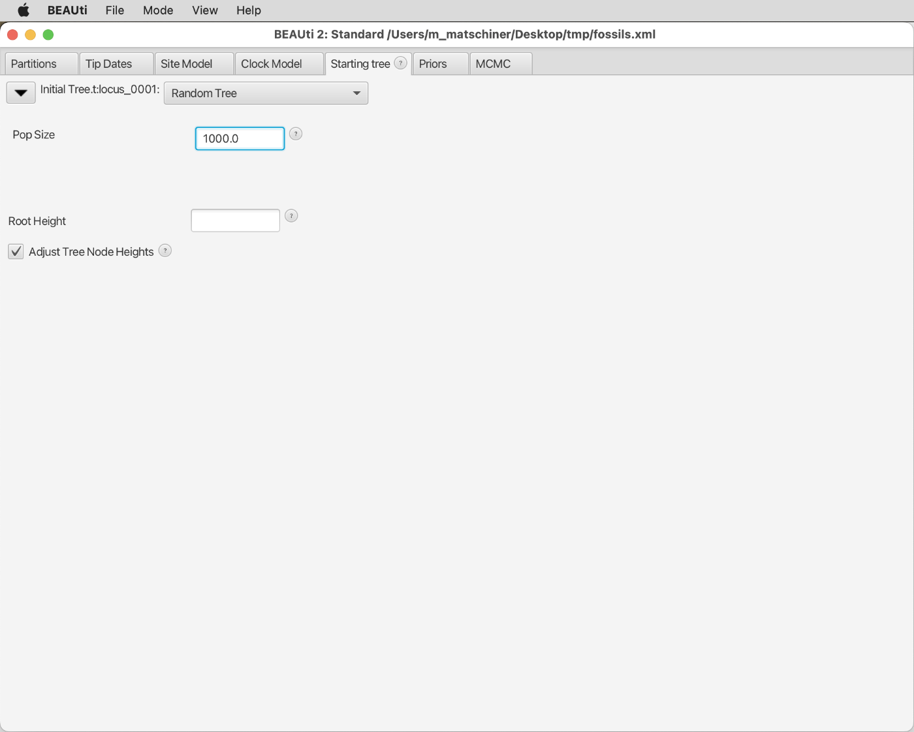
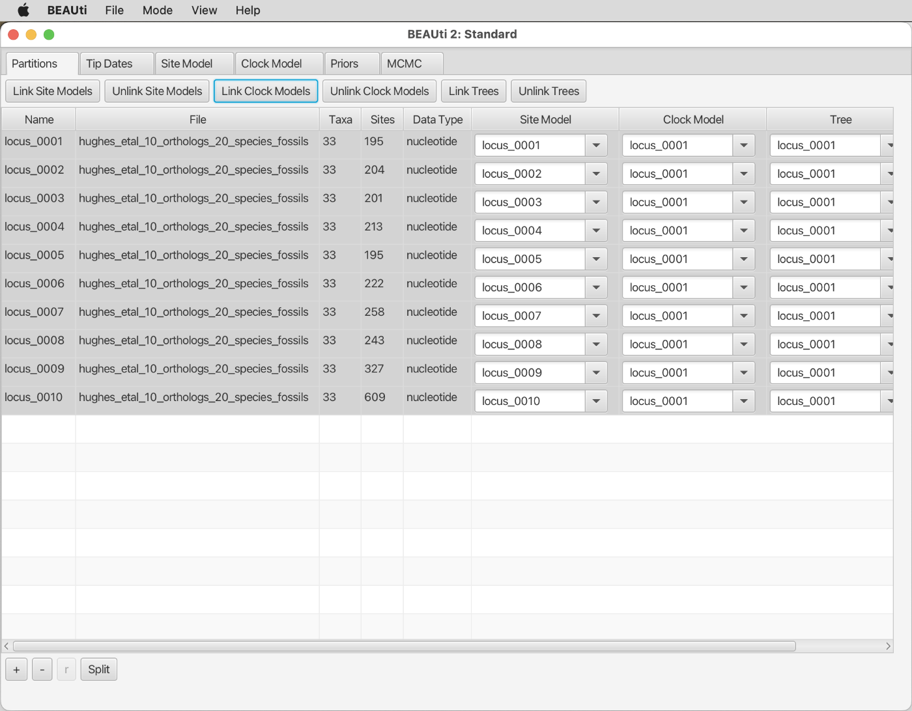
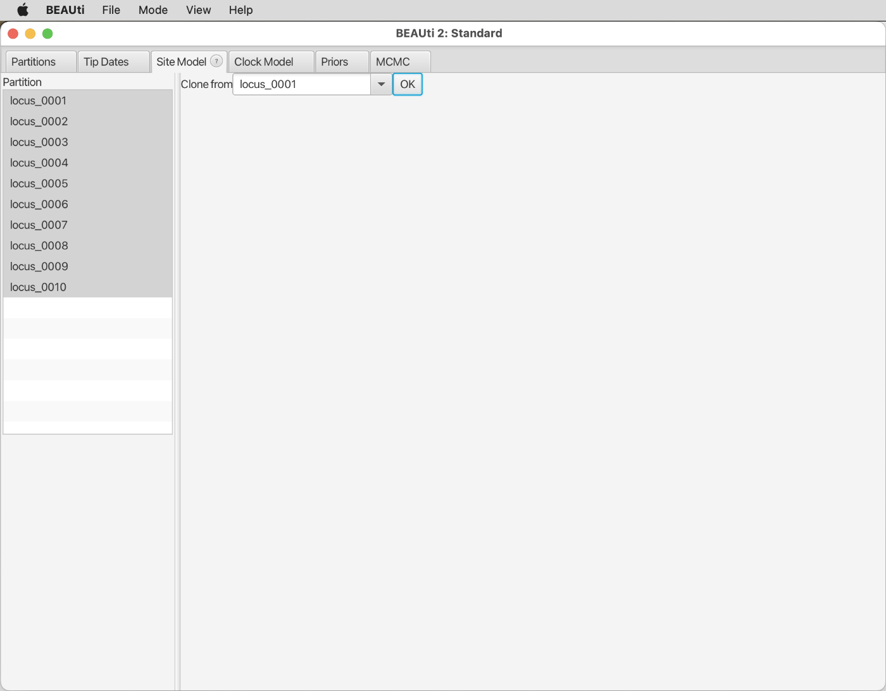
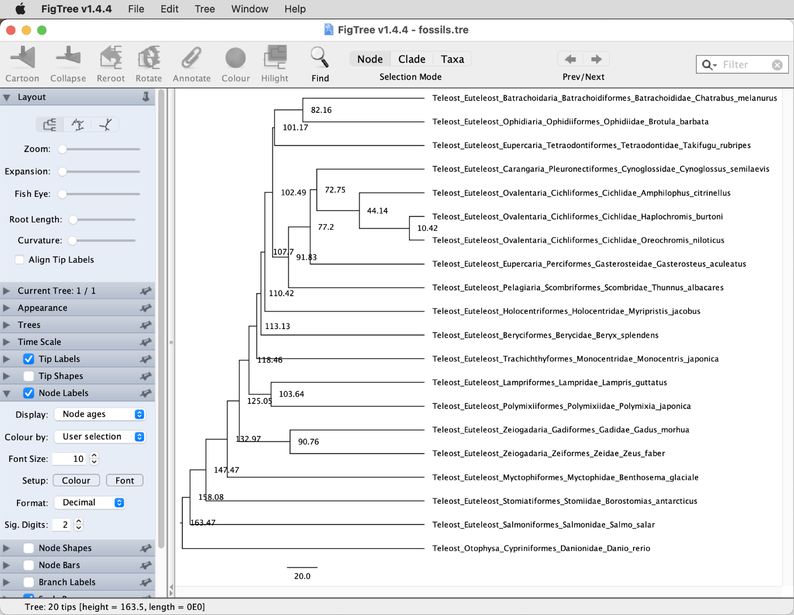
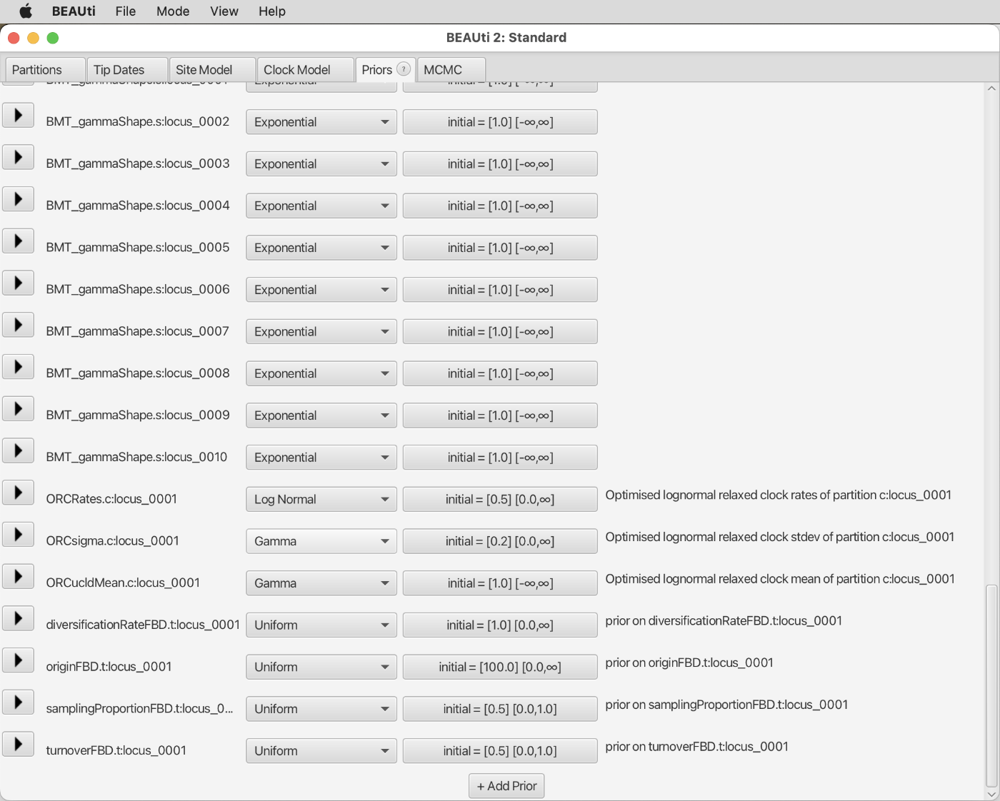
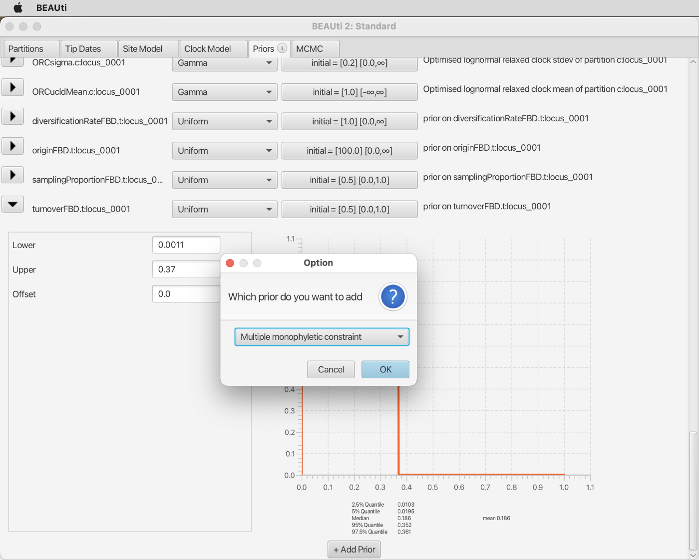
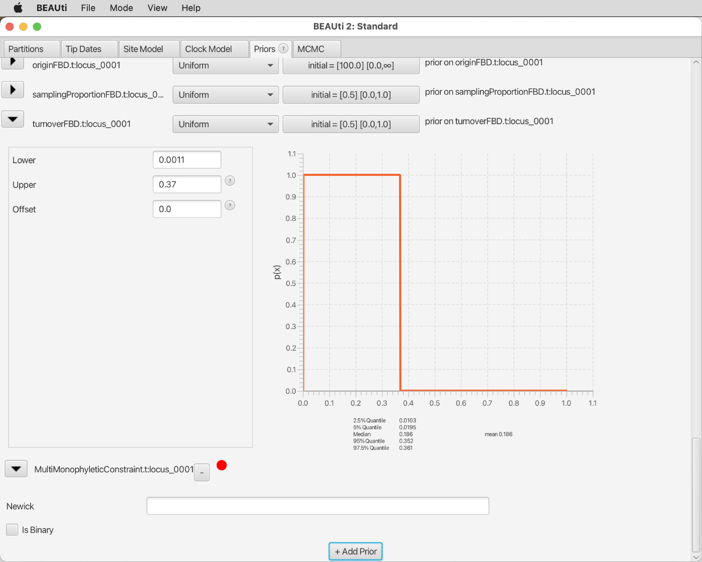
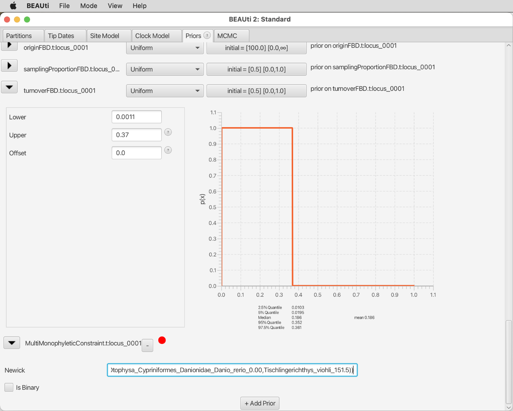
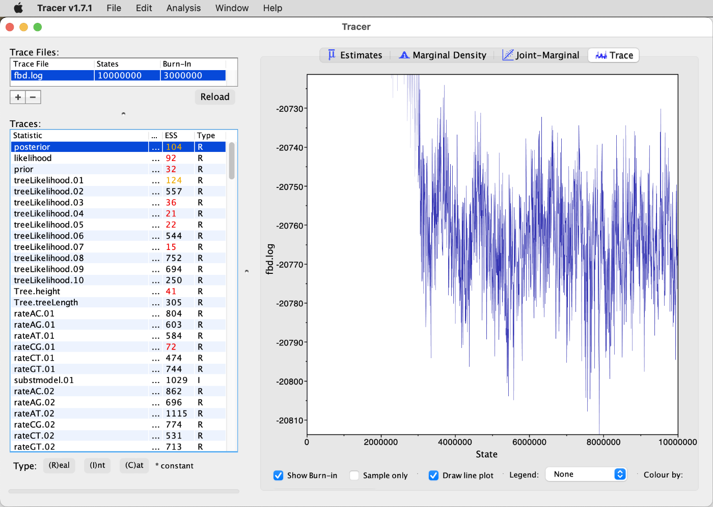

# Phylogenetic Divergence-Time Estimation

A tutorial on phylogenetic divergence-time estimation with with fossils

## Summary

The field of phylogenetic divergence-time estimation has seen tremendous progress over the last two decades, fuelled by increasing availability of molecular data as well as many methodological advances. Some of the most noteworthy advances include the development of Bayesian phylogenetic approaches for divergence-time estimation, the introduction of relaxed-clock models, as well as the implementation of quantitative models of the fossil-sampling process. In particular the latter development promises great improvements in the accuracy of divergence-time estimates as it addresses a major shortcoming of the previously common practice of node dating in which age calibrations were usually specified arbitrarily (and therefore differently by different researchers) due to the absence of quantitative criteria.

## Table of contents

* [Outline](#outline)
* [Dataset](#dataset)
* [Requirements](#requirements)
* [Divergence-time estimation with CladeAge](#cladeage)
	* [Divergence-time estimation with unambiguous fossil assignments](#single_fossil)
	* [Accounting for uncertain fossil assignments](#two_fossils)
* [Divergence-time estimation with the FBD model](#fbd)
* [Interpretation of the inferred timelines](#interpretation)

## Outline

In this tutorial I am going to demonstrate the application of two related approaches for phylogenetic divergence-time estimation based on quantitative models of fossil sampling. Both approaches are implemented in add-on packages for BEAST2; the CA package implementing the CladeAge method of [Matschiner et al. (2017)](https://doi.org/10.1093/sysbio/syw076) and [Matschiner et al. (2020)](https://doi.org/10.1038/s41467-020-17827-9), and the SA package implementing the fossilized birth-death (FBD) model developed by [Stadler (2010)](https://doi.org/10.1016/j.jtbi.2010.09.010), [Heath et al. (2014)](https://doi.org/10.1073/pnas.1319091111), and [Gavryushkina et al. (2017)](https://doi.org/10.1093/sysbio/syw060). Both approaches are going to be applied to the same set of fossil calibrations and the same sequence alignments. Finally, I will discuss possible reasons for differences between the results obtained with both approaches.

## Dataset

The dataset used in this tutorial will be the same as that used in tutorial [Bayesian Phylogenetic Inference](../bayesian_phylogeny_inference/README.md), including sequences for 10 genes from the 20 spiny-rayed fish species listed below.

| ID      | Species                       | Common name               | Group                 |
|---------|-------------------------------|---------------------------|-----------------------|
| danrer  | *Danio rerio*                 | Zebrafish                 | Otomorpha             |
| salsal  | *Salmo salar*                 | Atlantic salmon           | Protacanthopterygii   |
| borant  | *Borostomias antarcticus*     | Snaggletooth              | Stomiati              |
| bengla  | *Benthosema glaciale*         | Glacier lantern fish      | Myctophata            |
| poljap  | *Polymixia japonica*          | Silver eye                | Polymixiipterygii     |
| zeufab  | *Zeus faber*                  | John dory                 | Zeiariae              |
| gadmor  | *Gadus morhua*                | Atlantic cod              | Gadariae              |
| lamgut  | *Lampris guttatus*            | Opah                      | Lampripterygii        |
| monjap  | *Monocentris japonica*        | Japanese pineapplefish    | Trachichthyiformes    |
| myrjac  | *Myripristis jacobus*         | Blackbar soldierfish      | Holocentrimorphaceae  |
| berspl  | *Beryx splendens*             | Splendid alfonsino        | Beryciformes          |
| brobar  | *Brotula barbata*             | Bearded brotula           | Ophidiaria            |
| chamel  | *Chatrabus melanurus*         | Pony toadfish             | Batrachoidaria        |
| thualb  | *Thunnus albacares*           | Yellowfin tuna            | Pelagiaria            |
| takrub  | *Takifugu rubripes*           | Japanese puffer           | Tetraodontiformes     |
| gasacu  | *Gasterosteus aculeatus*      | Three-spined stickleback  | Perciformes           |
| cynlae  | *Cynoglossus semilaevis*      | Tongue sole               | Pleuronectiformes     |
| ampcit  | *Amphilophus citrinellus*     | Midas cichlid             | Cichlinae             |
| orenil  | *Oreochromis niloticus*       | Nile tilapia              | Pseudocrenilabrinae   |
| astbur  | *Astatotilapia burtoni*       | Burton's mouthbrooder     | Pseudocrenilabrinae   |

## Requirements

This tutorial requires **BEAST2**, **bModelTest**, **Tracer**, and **FigTree** to be installed. Details about the installation of these tools can be found in tutorial [Bayesian Phylogenetic Inference](../bayesian_phylogeny_inference/README.md).

The following tools are required additionally:

* **CladeAge (CA):** The [CladeAge](https://evoinformatics.group/cladeage.html) ([Matschiner et al. 2017](https://doi.org/10.1093/sysbio/syw076)) add-on package for BEAST2 allows the definition of prior densities for age constraints on the basis of estimates for the rates of speciation, extinction, and fossil preservation. This package needs to be installed both on Saga and on your local computer, because it will be required during the BEAST2 analysis (which will be executed on Saga) and for the setup and the interpretation of BEAST2 results (which will be done on the local computer). In both cases, BEAST2's PackageManager tool is used for the installation, but the PackageManager is called differently; from the command line on Saga, and through BEAUti on the local computer.

	To install CladeAge with BEAST2's PackageManager on Saga, use the following commands:

		module purge
		module load Beast/2.6.4-GCC-9.3.0
		packagemanager -add CA

	On your local computer, BEAST2's PackageManager is accessible through BEAUti. To find it, open BEAUti, and click on "Manage Packages" in BEAUti's "File" menu. This will open the BEAST2 Package Manager. Select "CA" and click on "Install/Upgrade". You will see a notice that any changes will only take effect after you restart BEAUti; thus, do so.

* **sampled-ancestors (SA):** The [sampled-ancestors](https://github.com/CompEvol/sampled-ancestors) ([Gavryushkina et al. 2017](https://academic.oup.com/sysbio/article/66/1/57/2670056)) add-on package implements the fossilized birth-death model ([Heath et al. 2014](http://www.pnas.org/content/111/29/E2957)) for BEAST2, which allows the use of fossils as tips in a phylogeny and a time calibration based on these. Like the CladeAge package, the sampled-ancestors package needs to be installed both on Saga and on the local computer. In both cases, the installation is similar to that of the CladeAge package.

	To install the sampled-ancestors package on Saga, use the following command:
	
		packagemanager -add SA
		
	On your local computer, use BEAST2's PackageManager as described above for the CladeAge package, but installing the package named "SA" in the PackageManager list.

## Divergence-time estimation with CladeAge

The first of two quantitative approaches for the specification of age constraints that will be applied in this tutorial is the CladeAge approach that I developed together with colleagues in our study [Matschiner et al. (2017)](https://doi.org/10.1093/sysbio/syw076). This approach shares similarities with the more traditional node-dating approach in the sense that prior densities are defined for the ages of different clades, and the minimum ages of these prior densities are provided by the oldest fossils of these clades. However, important differences exist between the CladeAge approach and node dating: First, the shape of age-prior densities is informed by a model of diversification and fossil sampling in the CladeAge approach, whereas in node dating, lognormal or gamma distributions with more or less arbitrarily chosen distribution parameters are usually applied. Second, because of the quantitative model used in the CladeAge approach, the clades used for calibration should also not be chosen at will. Instead, strictly all clades included in the phylogeny that (i) have a fossil record, (ii) are morphologically recognizable, and (iii) have their sister lineage also included in the phylogeny should be constrained according to the age of their oldest fossil. A consequence of this is that clades are constrained even when their known sister lineage has an older fossil record, and that the same fossil may be used to constrain not just one clade, but multiple nested clades, if the more inclusive clades do not have an even older fossil record. More details about these criteria can be found in our paper ([Matschiner et al. 2017](https://doi.org/10.1093/sysbio/syw076)), and further information on using CladeAge is given in our [Rough Guide to CladeAge](https://evoinformatics.group/cladeage.pdf).

The approach implemented in CladeAge initially assumed that the oldest fossil records for clades are unambiguous; that for each clade it is known without doubt whether it has a fossil record, and if so, which fossil is the oldest of the record. However, in practice, fossil assignments to clades are often questionable and while some authors might assign a fossil to a clade, other authors might disagree. To account for the resulting uncertainty in the ages of the oldest fossils, a new versions of CladeAge allows the specification of two alternative oldest fossils for one and the same clade, and weights can be assigned to these to specify their relative reliability. We are going to apply one such constraint for a clade with a particularly controversial fossil record in the second part of this section, after first setting up an analysis with CladeAge that still assumes that all fossil assignments are unambiguous.

### Divergence-time estimation with unambiguous fossil assignments

* Make sure that you have the file `hughes_etal_10_orthologs_20_species.nex`, that was prepared in tutorial [Bayesian Phylogenetic Inference](../bayesian_phylogeny_inference/README.md), in your current directory on Saga:

		ls hughes_etal_10_orthologs_20_species.nex

	If it should be missing, you can get it either by copying it from `/cluster/projects/nn9458k/phylogenomics/week2/data` or by downloading it from GitHub, using one of the following two commands:
	
		cp /cluster/projects/nn9458k/phylogenomics/week2/data/hughes_etal_10_orthologs_20_species.nex .
		
	or
	
		wget https://raw.githubusercontent.com/ForBioPhylogenomics/tutorials/main/week2_data/hughes_etal_10_orthologs_20_species.nex

* Open BEAUti on your local computer, click on "Import Alignment" in the "File" menu, and select file `hughes_etal_10_orthologs_20_species.nex`. As in tutorial [Bayesian Phylogenetic Inference](../bayesian_phylogeny_inference/README.md), BEAUti should recognize the 10 different partitions, and the BEAUti window should then look as shown in the screenshot below.

* Select all partitions, and click "Link Trees" as well as "Link Clock Models", as shown below.

* Go the the "Site Model" tab, and select "BEAST Model Test" from the drop-down menu at the top of the window, as shown below.

* As in tutorial [Bayesian Phylogenetic Inference](../bayesian_phylogeny_inference/README.md), select "namedExtended" from the drop-down menu in which "transitionTransversionSplit" had been selected by default. Leave the checkbox next to "Empirical" unticked to allow estimation of nucleotide frequencies. Then, set the tick to the right of "Mutation Rate" to specify that this rate should be estimated. The window should then look as in the next screenshot.

* Select all partitions in the list at the left of the window, and click "OK" to clone the substitution model from the first partition to all other partitions, as shown below.

* In the "Clock Model" tab, select the "Relaxed Clock Log Normal" clock model, as shown in the next screenshot.

* Because we are going to calibrate the molecular clock with fossil constraints, we should allow the clock rate to be estimated. By default, however, the checkbox that we would need to tick, next to "estimate" at the bottom right, is disabled. To enable this checkbox, click on "Automatic set clock rate" in BEAUti's "Mode" menu, removing the tick next to it as shown in the next screenshot.

* You should then be able to set a tick in the checkbox at the bottom right as shown below to allow the estimation of the clock rate.

* In the "Priors" tab, select the "Birth Death Model" as the tree prior, from the drop-down menu at the very top of the window, as shown below.

* Instead of specifying constraints on monophyly and divergence times in the "Priors" tab as in tutorial [Bayesian Phylogenetic Inference](../bayesian_phylogeny_inference/README.md), this can now be done in the separate tab named "Clade Ages". Open that tab and click on the "+ Add Prior" button, as shown in the next screenshot.

* We will now have to specify a rather long list of constraints to make the best possible use of the information provided by the fossil record and to obtain divergence time estimates that are as reliable as possible given our dataset. We'll start simple by specifying that the origin of African cichlids, the Pseudocrenilabrinae must have occurred at least 45.0-46.0 million years ago (Ma), since this is the age of the oldest fossils of Pseudocrenilabrinae. These are from the genus *Mahengechromis* and were reported from the Mahenge locality in Tanzania by [Murray (2001)](https://doi.org/10.1671/0272-4634(2000)020[0651:ECFFTE]2.0.CO;2). The Pseudocrenilabrinae are represented in our dataset by *Oreochromis niloticus* and *Astatotilapia burtoni*. Thus, specify "Pseudocrenilabrinae" in the field next to "Taxon set label", and select *Oreochromis niloticus* and *Astatotilapia burtoni* (named *Haplochromis burtoni* in the alignments from Hughes et al. (2018)) as the ingroup of this taxon set, as shown below.

* After you click "OK", you'll see the following window, in which you can specify minimum and maximum values for the parameters net-diversification rate, turnover rate, and sampling rate.

Based on these values as well as the fossil age, the CladeAge model is going to automatically determine the optimal shape of the prior density used for each constraint. The CladeAge model thus removes the previous requirement of specifying these densities manually, which in practice was often done rather arbitrarily. This common practice is problematic because the shapes of prior densities for age calibrations are known to have a great influence on the resulting divergence-time estimates, which was the main motivation for me to develop the CladeAge model. However, note that other solutions to the same problem exist, such as the fossilized birth-death model ([Heath et al. 2014](http://www.pnas.org/content/111/29/E2957); [Gavryushkina et al. 2017](https://academic.oup.com/sysbio/article/66/1/57/2670056)) that will also be presented in this tutorial.

* While it might be preferable to estimate the net-diversification rate (speciation minus extinction) and the turnover (extinction divided by speciation) as part of the analysis, this is not implemented in the CladeAge model yet. Instead, the values for the two parameters have to be specified *a priori*, together with the "sampling rate", the rate at which fossils that are eventually sampled by scientists were once deposited in the fossil record. Fortunately, estimates for these three rates can be found in the literature, and the confidence intervals for these estimates can be accounted for by the CladeAge model. Here, as in [Matschiner et al. (2017)](https://doi.org/10.1093/sysbio/syw076) and [Matschiner et al. (2020)](https://doi.org/10.1038/s41467-020-17827-9), we adopt teleost-specific estimates for net-diversification and turnover from [Santini et al. (2009)](https://doi.org/10.1186/1471-2148-9-194), and a sampling-rate estimate for bony fishes from [Foote and Miller (2007)](https://books.google.ch/books/about/Principles_of_Paleontology.html?id=8TsDC2OOvbYC&redir_esc=y). These estimates are 0.041-0.081 for the net-diversification rate, 0.0011-0.37 for the turnover, and 0.0066-0.01806 for the sampling rate. Thus, enter these ranges as shown in the next screenshot.

* While these three rate estimates are going to apply to all fossil constraints, information specific to the fossil constraint still must be added. To do so for the constraint on the age of Heterochromini, click on the triangle to the left of "Pseudocrenilabrinae". You'll see two more fields in which you can specify minimum and maximum values for the "First occurrence age" (the age of the oldest fossil of the clade). Specify the known age of the oldest fossil of Heterochromini in million of years, 45.0-46.0, as shown below:

* It is also possible to preview the shape of the prior densities as calculated by CladeAge based on the specified parameters. To do so, you may have to increase the window size so that you can click on the "Preview" button below the icon on the right. A plot outlining the prior densities should then appear as in the screenshot below.

From this plot, you can see that under the assumption that all specified model parameters are correct, there's a good probability that Pseudocrenilabrinae originated some time between 50 and 90 Ma. While this range is rather wide, it is based on only one fossil; we will obtain more precise estimates when we run the phylogenetic analysis with multiple fossil constraints.

* Click the triangle to the left of "Pseudocrenilabrinae" again to close the section with details on this fossil constraint, and add further fossil constraints for the clades listed below:
	* **"Cichlinae"** Ingroup: *Amphilophus citrinellus* Oldest fossil species: *Plesioheros chauliodus* First occurrence age: 40.0-45.0 Ma
	* **"Cichlidae"** *Amphilophus citrinellus*, *Oreochromis niloticus*, *Astatotilapia burtoni* Oldest fossil species: *Mahengechromis* spp. First occurrence age: 45.0-46.0 Ma
	* **"Tetraodontiformes"** Ingroup: *Takifugu rubripes* Oldest fossil species: *Plectocretacicus clarae* First occurrence age: 98.0-100.5 Ma
	* **"Batrachoidiaria"** Ingroup: *Chatrabus melanurus*  Oldest fossil species: *Louckaichthys novosadi* First occurrence age: 29.6-32.0 Ma
	* **"Ophidiaria"** Ingroup: *Brotula barbata* Oldest fossil species: *Pastorius methenyi* First occurrence age: 69.8-76.4 Ma
	* **"Percomorphaceae"** Ingroup: *Oreochromis niloticus*, *Astatotilapia burtoni*, *Amphilophus citrinellus*, *Takifugu rubripes*, *Gasterosteus aculeatus*, *Cynoglassus semilaevis*, *Thunnus albacares*, *Chatrabus melanurus*, *Brotula barbata* Oldest fossil species: *Plectocretacicus clarae* First occurrence age: 98.0-100.5 Ma
	* **"Holocentrimorphaceae"** Ingroup: *Myripristis jacobus* Oldest fossil species: *Caproberyx pharsus* First occurrence age: 98.0-100.5 Ma
	* **"Acanthopterygii"** Ingroup: *Oreochromis niloticus*, *Astatotilapia burtoni*, *Amphilophus citrinellus*, *Takifugu rubripes*, *Gasterosteus aculeatus*, *Cynoglassus semilaevis*, *Thunnus albacares*, *Chatrabus melanurus*, *Brotula barbata*, *Myripristis jacobus*, *Beryx splendens*, *Monocentris japonica* Oldest fossil species: *Cryptoberyx minimus* and others First occurrence age: 98.0-100.5 Ma
	* **"Polymixiipterygii"** Ingroup: *Polymixia japonica* Oldest fossil species: *Homonotichthys rotundus* First occurrence age: 94.0-97.1 Ma
	* **"Lampripterygii"** Ingroup: *Lampris guttatus* Oldest fossil species: *Aipichthys minor* First occurrence age: 98.0-100.5 Ma
	* **"Zeiariae"** Ingroup: *Zeus faber* Oldest fossil species: *Cretazeus rinaldii* First occurrence age: 83.0-89.8 Ma
	* **"Paracanthopterygii"** Ingroup: *Gadus morhua*, *Zeus faber* Oldest fossil species: *Cretazeus rinaldii* First occurrence age: 83.0-89.8 Ma
	* **"Myctophata"** Ingroup: *Benthosema glaciale* Oldest fossil species: *Sardinioides* spp. First occurrence age: 80.7-81.3 Ma
	* **"Clupeocephala"** Ingroup: All species except *Danio rerio* Oldest fossil species: *Leptolepides haerteisi* First occurrence age: 150.9-152.1 Ma
	* **"Otomorpha"** Ingroup: *Danio rerio* Oldest fossil species: *Tischlingerichthys viohli* First occurrence age: 150.9-152.1 Ma

	If you should be interested in details and references, you can find more information about the above constraints in the Supplementary Material of [Matschiner et al. (2020)](https://doi.org/10.1038/s41467-020-17827-9).
		
	Once all these constraints are added, the BEAUti window should look as shown below.

* It might be worth double-checking that you specified minimum and maximum ages for all constraints, and that the maximum age is always larger than the minimum age.

* Move on to the "MCMC" tab. Specify an MCMC chain length of 10 million iterations, name the log file `cladeage.log` and the tree file `cladeage.trees`, and set the frequency of logging to both to 5,000 (use the fields next to "Log Every" for both). The BEAUti window should then look as in the next screenshot.

* Save the analysis settings to a new file named `cladeage.xml` by clicking "Save As" in BEAUti's "File" menu. Do not close the BEAUti window yet.

* Copy the file `cladeage.xml` to Saga, using `scp`.

* To analyze the file `cladeage.xml` with BEAST2 on Saga, we need to write a Slurm script. To do that, open a new file with a text editor available on Saga, such as Emacs:

		emacs run_cladeage.xml
		
* Write the following text to the new file:

		#!/bin/bash

		# Job name:
		#SBATCH --job-name=cladeage
		#
		# Wall clock limit:
		#SBATCH --time=2:00:00
		#
		# Processor and memory usage:
		#SBATCH --ntasks=1
		#SBATCH --mem-per-cpu=1G
		#
		# Accounting:
		#SBATCH --account=nn9458k
		#
		# Output:
		#SBATCH --output=run_cladeage.out

		# Set up job environment.
		set -o errexit  # Exit the script on any error
		set -o nounset  # Treat any unset variables as an error
		module --quiet purge  # Reset the modules to the system default

		# Load the beast2 module.
		module load Beast/2.6.4-GCC-9.3.0

		# Run beast2.
		beast cladeage.xml

* Then, submit the Slurm script for the BEAST2 analysis of file `cladeage.xml` with `sbatch`:

		sbatch cladeage.xml

* Monitor how the submitted analysis is executed by repeatedly calling `squeue` with option `-u` followed by your username. If you're unsure about your username, you can always find it with `whoami`. You can also combine both commands by placing the latter one inside of backticks:

		squeue -u `whoami`

* As soon as the analysis is no longer listed in the output of the above command, it has stopped. Check the output file `run_cladeage.out` when that is the case, and scroll to the end.

	**Question 1:** Did the BEAST2 analysis finish correctly? [(see answer)](#q1)

As a starting tree for the BEAST2 analysis, it would be convenient if we could use the MCC tree produced with bModelTest in tutorial [Bayesian Phylogenetic Inference](../bayesian_phylogeny_inference/README.md). However, we will have to make a few changes to the tree before we can use it as a starting tree. First, we have to change the format of the tree from Nexus to Newick, and second, we have to extend all terminal branches so that all branches are at least as old as the fossils assigned to them. In the current version of the tree, particularly the divergences of cichlids are too young to agree with the fossil record, given that Cichlinae and Pseudocrenilabrinae diverged around 25 million years ago according to the tree, but both clades have fossil records that are at least 40 million years old.

* Make sure that you still have the file with that tree, named `bmodeltest.tre` on your local computer. If that is not the case, re-download the file from Saga to your local computer, and if it is also not available on Saga anymore, download the tree resulting from my bModelTest analysis from GitHub:

		wget https://raw.githubusercontent.com/ForBioPhylogenomics/tutorials/main/week2_res/bmodeltest.tre
		
* Open file `bmodeltest.tre` on your local computer with FigTree.

* Export the tree from FigTree again by clicking "Export Trees..." in FigTree's "File" menu. Select "Newick" as the tree file format, as shown in the next screenshot.

* Click "OK" and specify "bmodeltest.nwk" as the name of the output tree file.

* Open file `bmodeltest.nwk` in a GUI text editor such as [Sublime Text](https://www.sublimetext.com) or [Atom](https://atom.io) on your local computer.

* Modify the tree string in Newick format by adding 60 to every number that directly follows a species name, only separated by a column. For example, "Chatrabus_melanurus:61.59974" should become "Chatrabus_melanurus:121.59974", and so on. Perhaps the best way to make sure that you don't miss a number is to search for colons, and change the number after the colon only if a species name comes right before the colon. By doing this, you extend all terminal branches by 50 million years, which will make their ages comparable with the fossil records of each clade.

* In the end, copy the whole Newick string and paste it into a new FigTree window.

	**Question 2:** Is the tree ultrametric with terminal branches that all end on a line as the tree in the next screenshot? [(see answer)](#q2)

* Next, the modified tree string needs to be manually inserted into file `cladeage.xml`. Thus, download this file from Saga with `scp`.

* Open file `cladeage.xml` in a text editor on your local computer.

* Find the section in file `cladeage.xml` with the following lines (the "id" and "filter" elements might differ a bit in your file):

			<init id="RandomTree.t:locus_0004" spec="beast.evolution.tree.RandomTree" estimate="false" initial="@Tree.t:locus_0001">
				<taxa id="locus_0004" spec="FilteredAlignment" data="@hughes_etal_10_orthologs_20_species" filter="601-813"/>
				<populationModel id="ConstantPopulation0.t:locus_0004" spec="ConstantPopulation">
					<parameter id="randomPopSize.t:locus_0004" spec="parameter.RealParameter" name="popSize">1.0</parameter>
				</populationModel>
			</init>

* In this text block, delete the three lines from `<populationModel...` to `</populationModel>`.

* Replace `spec="beast.evolution.tree.RandomTree"` on the first line of the block with `spec="beast.util.TreeParser"`.

* Remove `estimate="false"` on the first line of the block.

* At the end of the first line of the block, replace the `>` (greater than) with ` IsLabelledNewick="true" newick="` (note the space at the beginning and the double quotes at the end), then paste the modified Newick string on the same line, and close the line with `">` (double quotes and greater than).
	
* Save the file `cladeage.xml` again with the same name, and copy it to Saga using `scp`.

* Then, submit the Slurm script `run_cladeage.slurm` once again on Saga:

		sbatch run_cladeage.slurm

* Monitor the start of the analysis again as before by repeatedly calling `squeue`:

		squeue -u `whoami`

	This time, the analysis should not stop after a few seconds.
	
* Also monitor how BEAST2 writes output to the file `run_cladeage.out`.

	**Question 3:** How long does BEAST2 take for one million iterations with this file? [(see answer)](#q3)

While the BEAST2 analysis is running, you can continue with the next part of the tutorial in which we repeat the CladeAge analysis with a constraint that accounts for uncertainty in the oldest fossil record of one clade.

### Accounting for uncertain fossil assignments

Unfortunately, the timelines inferred in phylogenetic studies have proven to be highly dependent on the fossils that are considered to belong to certain clades. An extreme example of this is the fossil record of the teleost fish order Tetraodontiformes (puffers and filefishes). The order was long believed to include one of the oldest fossils of the Acanthopterygii, a group that comprises about 15,000 fish species and of which Tetraodontiformes are only a small subgroup. This fossil, named *Plectocretacicus clarae*, is known from the limestone deposits of Haqil in Israel, which are between 98.0 and 100.3 million years old, and has been assigned to Tetraodontiformes by [Tyler and Sorbini (1996)](https://doi.org/10.5479/si.00810266.82.1). However, some researchers have recently questioned this assignment based on a morphological re-evaluation of the fossil, while others still claim that the fossil should remain within the order Tetraodontiformes. The next-oldest fossil that is undoubtedly a member of Tetraodontiformes is *Cretatriacanthus guidottii* from the Calcari di Melissano deposits in Italy, which are only 83.0 to 89.8 million years old. Thus, the true oldest fossil record of Tetraodontiformes is currently unknown, it could be either 83.0-89.8 million years old or 98.0-100.3 million years old. This uncertainty has led some authors ([Musilova et al. 2019](https://doi.org/10.1126/science.aav4632)) to repeat divergence-time estimation twice, once with the younger and once with the older constraint, and their results have shown that this choice of fossils has a strong influence on the results. Thus, a better option would be to account for both possibilities in a Bayesian way.

To allow this option, I have implemented a type of age constraints into the CladeAge package in which the shape of the prior density for the age of the clade is calculated under consideration of both possible oldest records. This new type of constraint has been tested and applied in our study [Matschiner et al. (2020)](https://doi.org/10.1038/s41467-020-17827-9). However, the new type of constraints can not yet be specified with the BEAUti GUI, but needs to be written manually into the XML file.

* To start, copy file `cladeage.xml` to a new file named `cladeage2.xml`, on your local computer (if you do not have this file on your local computer anymore, re-download it from Saga with `scp`):

		cp cladeage.xml cladeage2.xml

* Then, open file `cladeage2.xml` in a text editor on your local computer.

* Find this section in the file (some of the "id" element might differ in your file):

			<distribution id="Tetraodontiformes.fossilprior" spec="beast.math.distributions.FossilPrior" monophyletic="true" tree="@Tree.t:locus_0001">
				<fossilDistr id="FossilCalibration.015" spec="beast.math.distributions.FossilCalibration" maxDivRate="@maxDivRate" maxSamplingRate="@maxSamplingRate" maxTurnoverRate="@maxTurnoverRate" minDivRate="@minDivRate" minSamplingRate="@minSamplingRate" minTurnoverRate="@minTurnoverRate">
					<parameter id="RealParameter.23" spec="parameter.RealParameter" name="minOccuranceAge">83.0</parameter>
					<parameter id="RealParameter.24" spec="parameter.RealParameter" name="maxOccuranceAge">89.8</parameter>
				</fossilDistr>
				<taxonset id="Tetraodontiformes" spec="TaxonSet">
					<taxon idref="Teleost_Euteleost_Eupercaria_Tetraodontiformes_Tetraodontidae_Takifugu_rubripes"/>
				</taxonset>
			</distribution>

* On the first line of this block, replace `beast.math.distributions.FossilPrior` with `beast.math.distributions.DuoFossilPrior`.

* Replace the second to fifth line of the block, between `<fossilDistr...` and `</fossilDistr>` with the following text:

			<duoFossilDistr id="Tetraodontiformes.DuoFossilCalibration"
				minYoungerOccuranceAge="83.0"
          maxYoungerOccuranceAge="89.8"
          minOlderOccuranceAge="98.0"
          maxOlderOccuranceAge="100.5"
          weightYoungerOccurance="1"
          weightOlderOccurance="1"
          minSamplingRate="@minSamplingRate"
          maxSamplingRate="@maxSamplingRate"
          minDivRate="@minDivRate"
          maxDivRate="@maxDivRate"
          minTurnoverRate="@minTurnoverRate"
          maxTurnoverRate="@maxTurnoverRate"
          spec="beast.math.distributions.DuoFossilCalibration"/>

	In this block, we specify that the younger of the two fossils that might be represent the oldest record has a minimum age of 83.0 Ma and a maximum age of 89.8 Ma, and that the older of the two fossils has a minimum age of 98.0 Ma and a maximum age of 100.5 Ma. We also specify that we consider the prior probability that the older fossil is the true oldest record of the clade to be equally high as the prior probability that the younger of the two is in fact the true oldest record of the clade (meaning that the older one is misassigned and not actually a member of the clade).

* Also replace the names of the log files in file `cladeage2.xml`; replace `cladeage.log` with `cladeage2.log` and `cladeage.trees` with `cladeage2.trees` to avoid overwriting the results of the first analysis with CladeAge.

* Copy the file `cladeage2.xml` to Saga, using `scp`.

* On Saga, copy the Slurm script `run_cladeage.slurm` to a new file named `run_cladeage2.slurm`.

* Open the file `run_cladeage2.slurm` with a text editor available on Saga.

* Replace `cladeage` with `cladeage2` on lines 4, 17, and 28 of the Slurm script, so that it has the following content:

		#!/bin/bash

		# Job name:
		#SBATCH --job-name=cladeage2
		#
		# Wall clock limit:
		#SBATCH --time=2:00:00
		#
		# Processor and memory usage:
		#SBATCH --ntasks=1
		#SBATCH --mem-per-cpu=1G
		#
		# Accounting:
		#SBATCH --account=nn9458k
		#
		# Output:
		#SBATCH --output=run_cladeage2.out

		# Set up job environment.
		set -o errexit  # Exit the script on any error
		set -o nounset  # Treat any unset variables as an error
		module --quiet purge  # Reset the modules to the system default

		# Load the beast2 module.
		module load Beast/2.6.4-GCC-9.3.0

		# Run beast2.
		beast cladeage2.xml

* Submit the Slurm script with `sbatch`:

		sbatch run_cladeage2.slurm
		
	Like the first analysis with CladeAge, this one should take roughly 40 to 50 minutes on Saga. In the meantime, you could already continue with the next section of this tutorial.

## Divergence-time estimation with the FBD model

Like the CladeAge approach, the FBD model also assumes a rate at which fossils (the subset of fossils that are eventually found) are deposited in the sediment. However, unlike the CladeAge approach, the FBD approach was not explicitly developed for a dataset of diverse lineages that includes fossil information only for the oldest representatives of these lineages. As a consequence, the FBD approach does not require specification of estimates for the diversification, turnover, and fossil-sampling rates, but it is able to estimate these parameters if the dataset conforms to model expectations. This means that the dataset should contain all known extant and fossil lineages, or a randomly sampled set of these lineages, of the clade descending from the root of the phylogeny. Alternatively, these parameters can also be fixed, in which case the FBD approach has been shown to produce the same results as the CladeAge approach with fixed parameters ([Matschiner et al. 2017](https://doi.org/10.1093/sysbio/syw076)) even if only the oldest fossils of each clade are used. Here, we are going to use the FBD approach with the same dataset of sequences and fossil information that we also used with the CladeAge approach. This dataset violates the model of the FBD process in two ways: First, the included extant species are not randomly sampled from the clade of teleost fishes but instead were chosen because they represent particularly old lineages. Second, of each clade, only the oldest known fossil of the clade is used for calibration. Despite these violations that might lead to bias in the estimation of the diversification and sampling parameters, we are not going to fix these parameters as we do not know their true values. Instead we are going to again specify ranges of uncertainty for these parameters, similar to how we did this in the analyses with the CladeAge approach.

Note that a far more extensive tutorial on divergence-time estimation with the FBD model is available at the [Taming the BEAST](https://taming-the-beast.org/tutorials/FBD-tutorial/FBD-tutorial.pdf) website, which you might find useful if you'ld like to learn more about this type of analysis.

* In contrast to CladeAge, the FBD model considers fossils as tips in the phylogeny that are assumed to result from a joint process of diversification and fossilization, the fossilized birth-death process. This means that fossils should be included as taxa in the Nexus input file, even if no molecular or morphological character information is available for them. In that case, the phylogenetic position of the fossils will be determined exclusively based on taxonomic constraints (which means that, just like in the CladeAge approach, it is assumed that the taxonomic affiliation is known without error).

	As a first step, we therefore need to include the fossil species from the above list of fossil constraints in the Nexus-format alignment file. At the same time, we'll add to each species name the age of this species: For the extant species for which we have sequence data, this age is 0, and for fossil species, the age will be sampled at random from the ranges of uncertainty for the fossil age, as given in the list above. For example, for the fossil species *Plesioheros chauliodus*, the oldest fossil of the cichlid subfamily Cichlinae ([Alano Perez et al. 2010](https://doi.org/10.1590/S1679-62252010000300008)) which is thought to be between 40.0 and 45.0 million years old, an age will be picked at random from this age range. Note, however, that these randomly drawn ages will only be used as starting values for fossil ages in the MCMC; the full range of uncertainty will later be accounted for through prior densities that we will add manually to the XML file.

	To include fossil species as taxa in the Nexus file and at the same time include ages in the names used for extant and fossil taxa, you can use the Ruby script `add_fossils_to_nexus.rb`. As input, this script requires the Nexus-format alignment file `hughes_etal_10_orthologs_20_species.nex` as well as a tab-delimited table of species names and ages for all fossils.

* Get the Ruby script `add_fossils_to_nexus.rb`, either by copying it from directory `/cluster/projects/nn9458k/phylogenomics/week2/src` or by downloading it from GitHub to your current directory on Saga, using one of the following two commands:

		cp /cluster/projects/nn9458k/phylogenomics/week2/src/add_fossils_to_nexus.rb .

	or

		wget https://raw.githubusercontent.com/ForBioPhylogenomics/tutorials/main/week2_src/add_fossils_to_nexus.rb
	
* Open a new file named `fossil_ids.txt` on Saga, and write the following text to it:

		fossil_id	minimum_age maximum_age
		Plesioheros_chauliodus	40.0	45.0
		Mahengechromis_spp	45.0	46.0
		Louckaichthys_novosadi	29.6	32.0
		Pastorius_methenyi	69.8	76.4
		Plectocretacicus_clarae	98.0	100.5
		Caproberyx_pharsus	98.0	100.5
		Cryptoberyx_minimus	98.0	100.5
		Homonotichthys_rotundus	94.0	97.1
		Aipichthys_minor	98.0	100.5
		Cretazeus_rinaldii	83.0	89.8
		Sardinioides_spp	80.7	81.3
		Leptolepides_haerteisi	150.9	152.1
		Tischlingerichthys_viohli	150.9	152.1

* Execute the script `add_fossils_to_nexus.rb` with `srun`, providing the alignment and the file with fossil IDs as input and writing the output to a new file named `hughes_etal_10_orthologs_20_species_fossils.nex`:

		module load Ruby/2.7.2-GCCcore-9.3.0
		srun --ntasks=1 --mem-per-cpu=1G --time=00:01:00 --account=nn9458k --pty ruby add_fossils_to_nexus.rb hughes_etal_10_orthologs_20_species.nex fossil_ids.txt hughes_etal_10_orthologs_20_species_fossils.nex

* Have a brief look at the resulting alignment file `hughes_etal_10_orthologs_20_species_fossils.nex` to understand the changes made by the Ruby script.

* Download file `hughes_etal_10_orthologs_20_species_fossils.nex` from Saga using `scp`.

* Open BEAUti on your local computer. You can uninstall the "CA" add-on package again through the PackageManager, which you can call by clicking "Manage Packages" in BEAUti's "File" menu. Then, close and re-open BEAUti.

* Import the alignment file `hughes_etal_10_orthologs_20_species_fossils.nex` with "Import Alignment" in BEAUti's "File" menu. The "Partitions" tab should then look just as it did previously when you imported the alignment without fossils from file `hughes_etal_10_orthologs_20_species.nex`:

* Again, select all partitions and click on "Link Trees" and "Link Clock Models", as shown below.

* This time, do not skip the "Tip Dates" tab. When you click on it, the window should look as shown in the next screenshot.

* Set a tick in the checkbox for "Use tip dates". The window will then look as shown below.

* We now have to specify the direction and the unit in which the ages of fossil (and extant) species are given. To the right of "Dates specified:", keep the selection of "numerically as ..."; the alternative option of "as dates with format..." would only be useful if we would build a phylogeny of rapidly evolving virus sequences.

	In the drop-down menu to the right of "numerically as ..." use "year" as the unit of time even though the ages are in fact given in millions of years. This will not make a difference as long as we interpret the results also in millions of years.

	In the next drop-down menu, select "Before the present" as shown in the next screenshot.

* Click on the "Auto-configure" button in the top right of the window, which should open a pop-up window as shown below.

* Change the drop-down menu at the top of the pop-up window to "after last", and keep the underscore in the field to the right of it, as shown in the below screenshot. This specifies that BEAUti should interpret the text after the last underscore symbol in each species id as the age of the species

* When you click "OK" and scroll down in the list shown in the "Tip Dates" tab, you should see that the ages ("Height") of all fossil species have been correctly interpretated while the ages of extant species remain at "0.0", as shown below.

* Next, move on to the "Site Model" tab. As before, select "BEAST Model Test" from the first drop-down menu, "namedExtended" from the second drop-down menu, and set a tick in the checkbox at the right to estimate the mutation rate of this partition. The window should then look as shown in the screenshot below.

* Again, select all partitions from the list at the left-hand side of the window and click "OK" to clone the substitution model from the first partition to all other partitions, as shown below.

* In the tab for "Clock Model", select once again the "Relaxed Clock Log Normal" model from the drop-down menu and leave all other settings unchanged, as shown below.

* Move on to the "Priors" tab. This is where we now have to specify, in the first drop-down menu, the "Fossilized Birth Death Model" as the assumed tree-generating process, as shown in the next screenshot.

* Click on the black triangle at the left of the first row, next to "Tree.t:locus\_0001". This will open the settings for the FBD model, as shown below (you may have to increase the window size to see the checkboxes on the right).

As a first step, set the tick next to "Condition on Root" at the left of the window, to indicate that none of the fossils of our phylogeny are placed on the stem branch of the phylogeny. The field next to "Origin" should then be replaced by a drop-down menu that reads "[none]", as shown in the following screenshot.

As you'll see we still have to specify parameter values for the "Diversification Rate", the "Turnover", the "Sampling Proportion", and "Rho". Of these, the parameters "Diversification Rate" and "Turnover" correspond to the net-diversification rate and the turnover as specified in the CladeAge model before. The "Sampling Proportion", however, is not the same as the sampling rate of the CladeAge model. Instead, it is defined as 
*s* = &psi; / (&psi; + &mu;), where &psi; is the sampling rate as used in the CladeAge model and &mu; is the extinction rate ([Gavryushkina et al. 2014; Eqn. 8](https://doi.org/10.1371/journal.pcbi.1003919)). If an estimate of the extinction rate &mu; is not available but the net-diversification rate *d* (*d* = &lambda; - &mu;; with &lambda; being the speciation rate) and the turnover *r* (*r* = &mu; / &lambda;) have been estimated, the sampling proportion can be calculated as *s* = &psi; / (&psi; + *rd* / (1 - *r*) ). Parameter "Rho" is the proportion of the sampled extant species among all extant species descending from the root of the phylogeny.

* For the diversification rate, we'll pick a starting value within the range that we used with the CladeAge model (which was 0.041-0.081). Type "0.06" to the right of "Diversification Rate" as shown below.

* We'll do the same for the turnover, and specify "0.1" to the right of "Turnover" as shown below (recall that we had specified a range of 0.0011-0.37 for the turnover in the CladeAge model).

* To specify an appropriate starting value for the sampling proportion *s* we need to consider the equation given above: *s* = &psi; / (&psi; + *rd* / (1 - *r*) ). For the net-diversification rate (*d*) and turnover (*r*), we can again assume the values 0.06 and 0.1, respectively, as in the last two steps. For the sampling rate &psi;, we can pick a value from the range used for the CladeAge model. As this range was 0.0066-0.01806, use 0.01 as the estimate for the sampling rate &psi; (keep in mind that these rough estimates only serve to calculate a starting value for the sampling proportion; the uncertainty in these estimates will be taken into account when we define prior densities). With &psi; = 0.01, *d* = 0.06, and *r* = 0.1, we then get *s* = 0.01 / (0.01 + 0.1 &times; 0.06 / (1 - 0.1) ) = 0.6. Use this number as the starting value for the sampling proportion, as shown in below.

* In contrast to the last three parameters, we don't have to rely on estimates for the proportion of sampled extant taxa, "Rho", but we can directly calculate it. The root of our phylogeny represents the first diversification event of the crown group of Clupeocephala, an extremely diverse group that comprises almost all of the 30,000 or so teleost fishes. Of these we have sampled 20 for our phylogeny; thus, the proportion of sampled taxa is roughly 20/30000 = 0.0007. Specify this value to the right of "Rho", as shown in the next screenshot.

Make sure that the checkbox next to "estimate" at the very right end of this row is not set, in contrast to the checkboxes above.

* We still have to specify prior densities for the diversification rate, the turnover, and the sampling rate, the three parameters of the FBD model that will be estimated. You'll find these parameters if you scroll to the very bottom of the "Priors" tab, as shown below.

* Click on the triangle to the left of "diversificationRateFBD.t:...". To replicate the settings that we used for the earlier analyses with the CladeAge model, we'll use again the same range for the diversification rate, taken from [Santini et al. (2009)](https://doi.org/10.1186/1471-2148-9-194). Thus, make sure that the drop-down menu to the right of "diversificationRateFBD.t:..." reads "Uniform", indicating that a uniformly distributed prior density is used for this parameter. Then, specify "0.041" as the lower boundary and "0.081" as the upper boundary of this uniform density, as shown in the next screenshot.

* Click on the triangle next to "diversificationRateFBD.t:..." again to close the settings for this parameter. Instead, open the settings for the sampling-proportion parameter, named "samplingProportionFBD.t:...". As described above, the sampling proportion *s* is *s* = &psi; / (&psi; + *rd* / (1 - *r*) ), with &psi; being the sampling rate as used with CladeAge, *d* being the net-diversification rate and *r* being the turnover. The prior density for the sampling proportion *s* therefore needs to take into account the confidence intervals for each of these three parameters. One way to do this is by generating a distribution of *s* values by randomly sampling (many times) values of &psi;, *d*, and *r* from their confidence intervals, and calculating *s* for each of the sampled combinations of these three parameters. This results in a distribution for *s* as shown in the plot below.

	It would be possible to try to approximate this distribution with a similarly shaped prior density; however, given that the assumption of uniform prior densities for &psi;, *d*, and *r* was already very simplistic, the resulting distribution for *s* should maybe not be overinterpreted. We'll simply use a uniform prior density also for *s*, with the lower and upper boundaries according to the 2.5% and 97.5% quantiles of the distribution shown above. These are 0.2 and 0.95, respectively. Thus, specify "0.2" as the lower boundary and "0.95" as the upper boundary of this density, as shown below.

* Close the settings for the sampling-proportion parameter again and open instead those for the turnover parameter. As before, use a uniform prior density, with lower and upper boundaries according to the settings that we used in the analyses with CladeAge: Specify "0.0011" as the lower boundary and "0.37" as the upper boundary of this uniform density, as shown in the below screenshot.

* Finally, we still need to specify taxonomic constraints to assign fossils to clades represented by extant taxa. To do so, click on the "+ Add Prior" button at the very end of the list in the "Priors" tab. When asked "Which prior do you want to add" as in the below screenshot, choose "Multiple monophyletic constraint" from the drop-down menu (alternatively, it would be possible to specify individuals constraints one by one by selecting "MRCA prior"; however, this might take some time with a large number of constraints).

* After clicking "OK", another line will be added to the list of priors named "MultiMonophyleticConstraint.t:locus\_0001" (the 6th from the bottom of the list) as shown below.

Click on the triangle to the left of "MultiMonophyleticConstraint.t:locus\_0001". As shown in the next screenshot, this will open a field in which you can specify a monophyly constraint in Newick format.

* You'll find the string encoding all monophyly constraints in Newick format below. As you'll see, this string is basically a tree string but it does not contain branch-length information and it includes several unresolved nodes.

		(((((Teleost_Euteleost_Batrachoidaria_Batrachoidiformes_Batrachoididae_Chatrabus_melanurus_0.00,Louckaichthys_novosadi_30.8),Teleost_Euteleost_Carangaria_Pleuronectiformes_Cynoglossidae_Cynoglossus_semilaevis_0.00,Teleost_Euteleost_Eupercaria_Perciformes_Gasterosteidae_Gasterosteus_aculeatus_0.00,(Teleost_Euteleost_Eupercaria_Tetraodontiformes_Tetraodontidae_Takifugu_rubripes_0.00,Plectocretacicus_clarae_99.25),(Teleost_Euteleost_Ophidiaria_Ophidiiformes_Ophidiidae_Brotula_barbata_0.00,Pastorius_methenyi_73.1),((Teleost_Euteleost_Ovalentaria_Cichliformes_Cichlidae_Amphilophus_citrinellus_0.00,Plesioheros_chauliodus_42.5),(Teleost_Euteleost_Ovalentaria_Cichliformes_Cichlidae_Haplochromis_burtoni_0.00,Teleost_Euteleost_Ovalentaria_Cichliformes_Cichlidae_Oreochromis_niloticus_0.00,Mahengechromis_spp_45.5)),Teleost_Euteleost_Pelagiaria_Scombriformes_Scombridae_Thunnus_albacares_0.00),Teleost_Euteleost_Beryciformes_Berycidae_Beryx_splendens_0.00,(Teleost_Euteleost_Holocentriformes_Holocentridae_Myripristis_jacobus_0.00,Caproberyx_pharsus_99.25),Teleost_Euteleost_Trachichthyformes_Monocentridae_Monocentris_japonica_0.00,Cryptoberyx_minimus_99.25),(Teleost_Euteleost_Lampriformes_Lampridae_Lampris_guttatus_0.00,Aipichthys_minor_99.25),(Teleost_Euteleost_Myctophiformes_Myctophidae_Benthosema_glaciale_0.00,Sardinioides_spp_81.0),(Teleost_Euteleost_Polymixiiformes_Polymixiidae_Polymixia_japonica_0.00,Homonotichthys_rotundus_95.55),Teleost_Euteleost_Salmoniformes_Salmonidae_Salmo_salar_0.00,Teleost_Euteleost_Stomiatiformes_Stomiidae_Borostomias_antarcticus_0.00,(Teleost_Euteleost_Zeiogadaria_Gadiformes_Gadidae_Gadus_morhua_0.00,(Teleost_Euteleost_Zeiogadaria_Zeiformes_Zeidae_Zeus_faber_0.00,Cretazeus_rinaldii_86.4)),Leptolepides_haerteisi_151.5),(Teleost_Otophysa_Cypriniformes_Danionidae_Danio_rerio_0.00,Tischlingerichthys_viohli_151.5))

	If you copy this string and paste it into a new FigTree window, you'll see a cladogram visualizing all specified monophyly constraints, as shown in the screenshot below. Each resolved branch in this cladogram represents a clade for which the monophyly is constrained. Also note that each pair of sister taxa in this phylogeny groups one extant representative of a clade with the oldest fossil of that clade. The set of monophyly constraints defined by this Newick string is effectively identical to the the assignment of fossil taxa to taxonomic groups as we did it before in the analysis with the CladeAge model.

Thus, copy the Newick string and paste it into the "Newick" field below "MultiMonophyleticConstraint.t:locus\_0001, as in the next screenshot.

* Move on to the "MCMC" tab and specify again a chain length of 10 million generations. Name the log output file `fbd.log` and the tree output file `fbd.trees`. Set the interval for logging of log and tree files each to "5000" in the fields to the right of "Log Every", as shown below.

* Save the settings to a new file named `fbd.xml`, by clicking "Save As" in BEAUti's "File" menu.

Before we start the analysis, there are two changes that we need to make manually to the fbd.xml. First, we need to insert a starting tree once again, because the random generation of a starting tree would most likely fail again as it did in the earlier analyses with the CladeAge model. The difference to when we added the starting tree for the CladeAge analyses is that now the starting tree also has to include all fossil species, and that therefore preparing a Newick string for the starting tree by hand is a bit more tedious. This prepared Newick string is as follows:

		((((((((((((((Teleost_Euteleost_Batrachoidaria_Batrachoidiformes_Batrachoididae_Chatrabus_melanurus_0.00:100,Louckaichthys_novosadi_30.8:69.18):21.59974,(Teleost_Euteleost_Ophidiaria_Ophidiiformes_Ophidiidae_Brotula_barbata_0.00:100,Pastorius_methenyi_73.1:26.88):21.59974):10.416069,(((Teleost_Euteleost_Carangaria_Pleuronectiformes_Cynoglossidae_Cynoglossus_semilaevis_0.00:110.734264,(Teleost_Euteleost_Eupercaria_Perciformes_Gasterosteidae_Gasterosteus_aculeatus_0.00:103.051877,(Teleost_Euteleost_Eupercaria_Tetraodontiformes_Tetraodontidae_Takifugu_rubripes_0.00:100,Plectocretacicus_clarae_99.25:0.748):3.051877):7.682387):5.661272,((Teleost_Euteleost_Ovalentaria_Cichliformes_Cichlidae_Amphilophus_citrinellus_0.00:80,Plesioheros_chauliodus_42.5:37.48):4.527003,((Teleost_Euteleost_Ovalentaria_Cichliformes_Cichlidae_Haplochromis_burtoni_0.00:67.885945,Teleost_Euteleost_Ovalentaria_Cichliformes_Cichlidae_Oreochromis_niloticus_0.00:67.885945):1,Mahengechromis_spp_45.5:23.365945):15.641058):31.868533):6.838544,Teleost_Euteleost_Pelagiaria_Scombriformes_Scombridae_Thunnus_albacares_0.00:123.23408):8.781729):14.743359,(Teleost_Euteleost_Holocentriformes_Holocentridae_Myripristis_jacobus_0.00:100,Caproberyx_pharsus_99.25:0.748):46.759168):5.099154,Teleost_Euteleost_Beryciformes_Berycidae_Beryx_splendens_0.00:151.858322):7.494267,Teleost_Euteleost_Trachichthyformes_Monocentridae_Monocentris_japonica_0.00:159.352589):10,Cryptoberyx_minimus_99.25:70.1):7.511019,((Teleost_Euteleost_Lampriformes_Lampridae_Lampris_guttatus_0.00:100,Aipichthys_minor_99.25:0.748):63.827947,(Teleost_Euteleost_Polymixiiformes_Polymixiidae_Polymixia_japonica_0.00:100,Homonotichthys_rotundus_95.55:4.448):63.827947):13.03566):14.933313,(Teleost_Euteleost_Zeiogadaria_Gadiformes_Gadidae_Gadus_morhua_0.00:163.825767,(Teleost_Euteleost_Zeiogadaria_Zeiformes_Zeidae_Zeus_faber_0.00:100,Cretazeus_rinaldii_86.4:13.6):63.825767):27.971154):16.211033,(Teleost_Euteleost_Myctophiformes_Myctophidae_Benthosema_glaciale_0.00:100,Sardinioides_spp_81.0:19):108.007954):31.095687,Teleost_Euteleost_Stomiatiformes_Stomiidae_Borostomias_antarcticus_0.00:239.103641):24.38244,Teleost_Euteleost_Salmoniformes_Salmonidae_Salmo_salar_0.00:263.486081):26.141923,Leptolepides_haerteisi_151.5:138.128):20,(Teleost_Otophysa_Cypriniformes_Danionidae_Danio_rerio_0.00:200,Tischlingerichthys_viohli_151.5:48.5):109.628004);
		
If curious, you could copy and paste this string into a FigTree window to see how this starting tree with fossils looks like.
	
* Open the file `fbd.xml` in a text editor on your local computer and find this section (again, the "id" and "filter" elements might differ):

			<init id="RandomTree.t:locus_0008" spec="beast.evolution.tree.RandomTree" estimate="false" initial="@Tree.t:locus_0001">
				<taxa id="locus_0008" spec="FilteredAlignment" data="@hughes_etal_10_orthologs_20_species_fossils" filter="1489-1731"/>
				<populationModel id="ConstantPopulation0.t:locus_0008" spec="ConstantPopulation">
					<parameter id="randomPopSize.t:locus_0008" spec="parameter.RealParameter" name="popSize">1.0</parameter>
				</populationModel>
			</init>

* Delete the three lines from `<populationModel...` to `</populationModel>` from this text block.

* Replace `spec="beast.evolution.tree.RandomTree"` on the first line of the block with `spec="beast.util.TreeParser"`.

* Remove `estimate="false"` on the first line of the block.

* At the end of the first line of the block, replace the `>` (greater than) with ` IsLabelledNewick="true" newick="` (note the space at the beginning and the double quotes at the end), then paste the modified Newick string on the same line, and close the line with `">` (double quotes and greater than).

The second change that we might still want to make to file `fbd.xml` is to account for the uncertainties in the ages of all fossils. This is possible by adding a certain type of operator elements to the XML file.

* With file `fbd.xml` still open in a text editor on your local computer, scroll to the line after the last operator element and before the first logger element (this should be around line number 720). You should recognize the following lines:

			<operator id="SATreeRootScalerFBD.t:locus_0001" spec="SAScaleOperator" rootOnly="true" scaleFactor="0.95" tree="@Tree.t:locus_0001" weight="1.0"/>

			<operator id="SATreeScalerFBD.t:locus_0001" spec="SAScaleOperator" scaleFactor="0.95" tree="@Tree.t:locus_0001" weight="3.0"/>

			<logger id="tracelog" spec="Logger" fileName="fbd.log" logEvery="5000" model="@posterior" sanitiseHeaders="true" sort="smart">
				<log idref="posterior"/>
				<log idref="likelihood"/>
				<log idref="prior"/>

	Without deleting any of these lines, add the following code just above the line beginning with `<logger id...`:

		    <operator spec='SampledNodeDateRandomWalker' windowSize="1"  tree="@Tree.t:locus_0001" weight="10">
				<taxonset spec="TaxonSet">
					<taxon id="Plesioheros_chauliodus_42.5" spec="Taxon"/>
					<taxon id="Mahengechromis_spp_45.5" spec="Taxon"/>
					<taxon id="Louckaichthys_novosadi_30.8" spec="Taxon"/>
					<taxon id="Pastorius_methenyi_73.1" spec="Taxon"/>
					<taxon id="Plectocretacicus_clarae_99.25" spec="Taxon"/>
					<taxon id="Caproberyx_pharsus_99.25" spec="Taxon"/>
					<taxon id="Cryptoberyx_minimus_99.25" spec="Taxon"/>
					<taxon id="Homonotichthys_rotundus_95.55" spec="Taxon"/>
					<taxon id="Aipichthys_minor_99.25" spec="Taxon"/>
					<taxon id="Cretazeus_rinaldii_86.4" spec="Taxon"/>
					<taxon id="Sardinioides_spp_81.0" spec="Taxon"/>
					<taxon id="Leptolepides_haerteisi_151.5" spec="Taxon"/>
					<taxon id="Tischlingerichthys_viohli_151.5" spec="Taxon"/>
				</taxonset>
				<samplingDates id="samplingDate1" spec="beast.evolution.tree.SamplingDate" taxon="Plesioheros_chauliodus_42.5" upper="45.0" lower="40.0"/>
				<samplingDates id="samplingDate2" spec="beast.evolution.tree.SamplingDate" taxon="Mahengechromis_spp_45.5" upper="46.0" lower="45.0"/>
				<samplingDates id="samplingDate3" spec="beast.evolution.tree.SamplingDate" taxon="Louckaichthys_novosadi_30.8" upper="32.0" lower="29.6"/>
				<samplingDates id="samplingDate4" spec="beast.evolution.tree.SamplingDate" taxon="Pastorius_methenyi_73.1" upper="76.4" lower="69.8"/>
				<samplingDates id="samplingDate5" spec="beast.evolution.tree.SamplingDate" taxon="Plectocretacicus_clarae_99.25" upper="100.5" lower="89.0"/>
				<samplingDates id="samplingDate6" spec="beast.evolution.tree.SamplingDate" taxon="Caproberyx_pharsus_99.25" upper="100.5" lower="89.0"/>
				<samplingDates id="samplingDate7" spec="beast.evolution.tree.SamplingDate" taxon="Cryptoberyx_minimus_99.25" upper="100.5" lower="89.0"/>
				<samplingDates id="samplingDate8" spec="beast.evolution.tree.SamplingDate" taxon="Homonotichthys_rotundus_95.55" upper="97.1" lower="94.0"/>
				<samplingDates id="samplingDate9" spec="beast.evolution.tree.SamplingDate" taxon="Aipichthys_minor_99.25" upper="100.5" lower="89.0"/>
				<samplingDates id="samplingDate10" spec="beast.evolution.tree.SamplingDate" taxon="Cretazeus_rinaldii_86.4" upper="89.8" lower="83.0"/>
				<samplingDates id="samplingDate11" spec="beast.evolution.tree.SamplingDate" taxon="Sardinioides_spp_81.0" upper="81.3" lower="80.7"/>
				<samplingDates id="samplingDate12" spec="beast.evolution.tree.SamplingDate" taxon="Leptolepides_haerteisi_151.5" upper="152.1" lower="150.9"/>
				<samplingDates id="samplingDate13" spec="beast.evolution.tree.SamplingDate" taxon="Tischlingerichthys_viohli_151.5" upper="152.1" lower="150.9"/>
			</operator>

	In the above code block, the first half does nothing else than define "taxon" elements with the IDs of the fossil species exactly as they are in the Nexus-format alignment file `hughes_etal_10_orthologs_20_species_fossils.nex`. The second half then refers to these definitions and adds a "samplingDates" element for each fossil, with an upper and a lower value that represent the range of uncertainty for the age of that fossil.
	
* Save the XML file again with the same name (`fbd.xml`). This file `fbd.xml` is then ready to be analyzed with BEAST2.

* Copy file `fbd.xml` to Saga using `scp`.

* On Saga, copy the Slurm script `run_cladeage.slurm` to a new file named `run_fbd.slurm`:

		cp run_cladeage.slurm run_fbd.slurm

* Open the Slurm script `run_fbd.slurm` with a text editor available on Saga, such as Emacs, and replace `cladeage` on lines 4, 17, and 28 with `fbd`, so that the script has the following content:

		#!/bin/bash

		# Job name:
		#SBATCH --job-name=fbd
		#
		# Wall clock limit:
		#SBATCH --time=4:00:00
		#
		# Processor and memory usage:
		#SBATCH --ntasks=1
		#SBATCH --mem-per-cpu=1G
		#
		# Accounting:
		#SBATCH --account=nn9458k
		#
		# Output:
		#SBATCH --output=run_fbd.out

		# Set up job environment.
		set -o errexit  # Exit the script on any error
		set -o nounset  # Treat any unset variables as an error
		module --quiet purge  # Reset the modules to the system default

		# Load the beast2 module.
		module load Beast/2.6.4-GCC-9.3.0

		# Run beast2.
		beast fbd.xml

* Close the file and then submit it with `sbatch`:

		sbatch run_fbd.slurm
		
	Like the analyses with CladeAge, this analysis with the FBD model should take around 40 to 50 minutes to finish.

## Interpretation of the inferred timelines

We are now going to use the program Tracer once again (as in tutorial [Bayesian Phylogenetic Inference](../bayesian_phylogeny_inference/README.md)) to assess stationarity of the MCMC chains produced by the analyses with CladeAge and the FBD model, and we will make an interpretation of the differences between these results.

* Download the log files `cladeage.log`, `cladeage2.log`, and `fbd.log` (even if the latter is still not complete) from Saga to your local computer using `scp`.

* Open Tracer and the log file `cladeage.log` resulting from the analysis with CladeAge. The Tracer window should then look as shown in the next screenshot.

* Quickly browse through the long list of parameters to see if any have particularly low ESS values, ignoring the parameters of the bModelTest model named "hasEqualFreqs...".

* For those with low ESS values, have a look at their trace plots, by clicking on the "Trace" tab at the top right of the window. If you see any patterns like the one shown in the screenshot below, the default burnin period of 10% of the MCMC apparently did not cover the full length of the burnin.

* If you find patterns like the one shown above, adjust the burnin by double-clicking on the "1000000" in the top left part of the Tracer window, and writing a larger number, e.g. "2000000". This should improve the ESS values of the parameters that showed the pattern.

	
	After adjusting the burnin, and excluding the parameters named "hasEqualFreqs...", the lowest ESS values are probably around 30, indicating that the chain should definitely be run for more iterations, perhaps five times as many, if the analysis was to be published. Nevertheless, we'll assume that the degree of stationarity is sufficient for our interpretation here.

* Find the "TreeHeight" parameter indicating the root age in the list on the left.
	
	**Question 4:** What is the mean estimate and its confidence interval for the age of the first split in the phylogeny? [(see answer)](#q4)

* Next, find the age of the most recent common ancestor of the cichlids in the dataset. This age is identical to the divergence time between the Neotropical Cichlinae and the African Pseudocrenilabrinae, because no cichlids outside of these two groups were included in the dataset. To find the age estimate, scroll almost to the bottom of the list on the left, select "mrcatime(Cichlidae)". You should see that this divergence event was estimated around 90 Ma, with a range of uncertainty roughly between 70 Ma and 110 Ma, as shown in the next screenshot.

	Given that the confidence interval includes 100 million years, this age estimate is in agreement with the long-held assumption of "Gondwanan vicariance", according to which the two groups diverged when the continents Africa and South America separated.

* Finally, select the speciation-rate parameter named "BDBirthRate" from the list on the left to see the summary statistics for this parameter, as in the next screenshot.

	**Question 5:** How do these estimates compare to those that we used to define prior densities for fossil calibrations with the CladeAge approach? [(see answer)](#q5)

* Next, also open in Tracer the file `cladeage2.log`, from the analysis with the new type of age constraints that accounts for uncertainty in fossil assignments.

* Adjust the burnin if necessary.

* Inspect the estimate for the divergence time between the Neotropical Cichlinae and the African Pseudocrenilabrinae from this analysis.

	**Question 6:** Is this estimate still in agreement with an assumed Gondwanan vicariance of the two groups before 100 Ma? [(see answer)](#q6)

* Also open the log file of the analysis with the FBD model, named `fbd.log`, in Tracer, and adjust the burnin if necessary. The degree of stationarity in the MCMC chain of this analysis may be comparable or slightly lower than that of the analyses with CladeAge.

* Again, find the "TreeHeight" parameter.
	
	**Question 7:** How old is the age of the first divergence event of the phylogeny, as estimated with the FBD model? [(see answer)](#q7)

The divergence time of African and Neotropical cichlids is this time not included in the list of parameters. To see it, you'll need to use the posterior tree distribution.

* On Saga, summarize the posterior tree distribution in file `fbd.trees`. Set the burnin percentage to 10 or higher, depending on the trace patterns that you observed with Tracer. Specify that mean age estimates should be used for nodes in the summary tree and name the output file `fbd.tre`. Thus, run TreeAnnotator with the following command:

		module load Beast/2.6.4-GCC-9.3.0
		srun --ntasks=1 --mem-per-cpu=1G --time=00:01:00 --account=nn9458k --pty treeannotator -burnin 10 -heights mean fbd.trees fbd.tre

* Download the file with the MCC summary tree for the analysis with the FBD model, `fbd.tre`, from Saga using `scp`.

* Open the file `fbd.tre` in FigTree. After orientating the tree, adding a scale axis, and displaying node labels, the tree should appear as in the next screenshot.

Note that the fossil species are included in the tree and that their tip length corresponds to their ages. You'll see that just like the age of the very first divergence, the divergence of cichlids fishes is now also much older than it appeared in the previous analysis with CladeAge. This divergence, shown near the bottom of the tree in the above screenshot, is now estimated around 105 Ma. The confidence interval for this divergence ranges from around 62 Ma to about 145 Ma (to see this, select "height\_95%\_HPD") from the drop-down menu at the left, next to "Display" in the panel that opens when you click the triangle next to "Node Labels").
 
* To figure out the reason for this large difference in age estimates between the CladeAge and FBP approaches, go back to Tracer, scroll to the very bottom of the list of parameters on the left (with file `fbd.log` still open; if not, reopen it), and select the parameter named "diversificationRateFBD" to display the estimate for the net-diversification rate. The Tracer window should then look as shown in the screenshot below.

	**Question 8:** How does this estimate compare to the range of uncertainty that we had specified in both the analysis with CladeAge and the analysis with the FBD model? [(see answer)](#q8)

 

                   

## Answers

* **Question 1:** Most likely, the MCMC analysis is going to crash right at the start with an error message as shown below.

This is a common problem when several fossil constraints are specified: According to the error message, BEAST2 could not find a proper state to initialise. This means that even after several attempts, no starting state of the MCMC chain could be found that had a non-zero probability. Most often, the issue is that the tree that BEAST2 randomly generates to start the chain is in conflict with one or more fossil constraints. The way to fix this issue is to specify a starting tree that is in agreement with the specified fossil constraints. In particular, because all fossil constraints impose hard minimum ages on the origin of the respective clades, these clades must at least be as old as the minimum age in the starting tree. In case of doubt, it is usually safer to make the starting tree too old rather than too young; the course of the MCMC chain should, at least after the burnin, not be influenced by the starting state anymore anyway. Some helpful advice on how to specify starting trees is provided on the [BEAST2](https://www.beast2.org/fix-starting-tree/) webpage. With trees of hundreds of taxa, generating a suitable starting tree can be a tricky task in itself, but with the small number of 20 species used here, writing a starting tree by hand is possible.

* **Question 2:**If the answer is no to that question, then you must have made a mistake in extending one or more terminal branches of the tree. In that case, you could use my modified version of the file `bmodeltest.nwk`, which you can download to your local computer either from the directory `/cluster/projects/nn9458k/phylogenomics/week2/res` on Saga with `scp` or from GitHub with this command:

		wget https://raw.githubusercontent.com/ForBioPhylogenomics/tutorials/main/week2_res/bmodeltest.nwk

* **Question 3:** BEAST2 should require about 4-5 minutes per million iterations. Thus, running the 10 million iterations will take about 40 to 50 minutes.

* **Question 4:** When you select "TreeHeight" in the list on the left and click on the tab for "Estimates" in the top right, your Tracer window should look similar to the this screenshot:

As specified in the summary statistics on the top right part of the window, the mean estimate for the age of the first split should be around 200 Ma. The confidence interval is reported as the "95% HPD interval", the highest-posterior-density interval containing 95% of the posterior distribution. In other words, this is the shortest interval within which 95% of the samples taken by the MCMC can be found. In this case should range from roughly 170 Ma to about 230 Ma.

* **Question 5:** The estimated speciation rate (parameter "BDBirthRate") is far lower than the values that we assumed when we specified prior densities for clade ages with CladeAge. Recall that we had used the estimates for the net-diversification rate from [Santini et al. (2009)](https://doi.org/10.1186/1471-2148-9-194), which were 0.041-0.081 (per millon year). Thus, the estimated speciation of around 0.0009 is more than an order of magnitude lower than the values that we had assumed for the net-diversification rate. This is remarkable because the speciation rate should always be higher than the net-diversification rate, given that the latter is defined as the difference between the speciation and extinction rates. The explanation for this difference is that BEAST2 estimated the speciation rate under the assumption that the species that we included in the phylogeny are in fact all the extant species that descended from the root of the phylogeny. This means that BEAST2 assumed that no teleost fish species besides those 20 included in the phylogeny exist. On the other hand the estimates for the net-diversification rate obtained by [Santini et al. (2009)](https://doi.org/10.1186/1471-2148-9-194) accounted for the fact that only a subset of the living species were included in their phylogeny. Thus, the speciation-rate estimate resulting from our analysis is most certainly a severe underestimate. This underestimate, however, should not lead to strong bias in the timeline inferred in the analysis with CladeAge, because it did not influence the prior densities placed on clade ages.

* **Question 6:** In my analysis of file `cladeage2.xml`, the mean age estimate for the divergence between Cichlinae and Pseudocrenilabrinae is around 86 Ma, with a confidence interval from 68 to 101 Ma. This estimate is just barely still in agreement with the assumption of Gondwanan vicariance, as the confidence interval still includes 100 Ma. Note, however, that more extensive analyses that apply the same model to larger datasets produce shorter confidence intervals that exclude 100 Ma and are thus incompatible with Gondwanan vicariance.

* **Question 7:** You may be surprised to find that the estimate for the age of the first split in the analysis with the FBD model is much older than in the analysis with CladeAge. As shown in the next screenshot, the tree height is now estimated around 255 Ma, with a confidence interval from around 210 Ma to about 305 Ma.

As we will see, this difference most likely results from a biased estimate of the diversification rate due to the way in which the species included in our phylogeny were selected.

* **Question 8:** You may recall that we had adopted the estimates of [Santini et al. (2009)](https://doi.org/10.1186/1471-2148-9-194) for the net-diversification rate, the turnover, and the sampling rate. For the net-diversification rate, the range estimated by Santini et al. (2009) was 0.041-0.081 per million year. As you can see from the histogram shown in Tracer, the posterior distribution for the net-diversification rate (unsuprisingly) falls within this range; however, most of the posterior distribution appears squeezed against the lower boundary of the distribution at 0.041. The mean of the posterior distribution is only slightly larger than the lower boundary, at around 0.042. This appears to be the reason for the much older age estimates with the FBD model: With a lower net-diversification rate, the age constraint imposed by fossils is weaker and thus allows divergence times much older than the age of the fossil.

	The reason why the posterior distribution of net-diversification-rate estimates is so particularly low can also be explained. Recall that we had specified that our dataset contains only a small proportion of the existing species diversity within teleost fishes. Because we had sampled 20 out of 30,000 or so living species, we had specified 0.0007 as the value of parameter "Rho". This should in principle allow to estimate the net-diversification rate without bias, however, only under the assumption that the 20 species included in the phylogeny are randomly sampled from the diversity of 30,000 species. This clearly is not the case in our dataset because the included species were selected to represent the most divergent groups among spiny-rayed fishes. This means that the true ages of the nodes incuded in the phylogeny are older and more concentrated than they would have been if we had sampled species at random (see [Hoehna et al. 2011](https://doi.org/10.1093/molbev/msr095) for a good discussion of this). Nevertheless, the model assumes that the distribution of node ages results from random sampling, and as a result the posterior probability becomes larger when the distribution of node ages is extended compared to when it is as narrow as it actually should be. And because the fossil constraints impose lower boundaries on node ages, extending their distribution is only possible by shifting them upward, leading to bias in age estimates as well as the net-diversification-rate estimate. A more detailed discussion of this issue can be found in [Matschiner (2019)](https://doi.org/10.3389/fgene.2019.01064).