# Phylogenetic Divergence-Time Estimation

A tutorial on phylogenetic divergence-time estimation with with fossils 
By [Michael Matschiner](https://evoinformatics.group/team.html#michaelmatschiner)

## Summary

The field of phylogenetic divergence-time estimation has seen tremendous progress over the last two decades, fuelled by increasing availability of molecular data as well as many methodological advances. Some of the most noteworthy advances include the development of Bayesian phylogenetic approaches for divergence-time estimation, the introduction of relaxed-clock models, as well as the implementation of quantitative models of the fossil-sampling process. Relaxed-clock models are important for accurate age estimation whenever substitution rates can be assumed to be variable among branches. Quantitative models of fossil sampling promises great improvements in the accuracy of divergence-time estimates as they address a major shortcoming of the previously common practice of node dating in which age calibrations were usually specified arbitrarily (and therefore differently by different researchers) due to the absence of quantitative criteria.

## Table of contents

* [Outline](#outline)
* [Dataset](#dataset)
* [Requirements](#requirements)
* [Divergence-time estimation with a relaxed clock](#relaxed)
* [Divergence-time estimation with fossil constraints](#fossils)
* [Divergence-time estimation with the FBD model](#fbd)

## Outline

In this tutorial I am going to demonstrate the application of relaxed-clock models and two approaches for phylogenetic divergence-time estimation based fossil. All analyses will be performed with the BEAST2 suite of programs. The applied relaxed-clock model is a recent improvement over previous models, reaching MCMC stationarity faster than before [Douglas et al. (2021)](https://doi.org/10.1371/journal.pcbi.1008322). Fossils will be used to define age constraints first in a more arbitrary way and then based on a quantitative model of fossil sampling, the fossilized birth-death (FBD) model developed by [Stadler (2010)](https://doi.org/10.1016/j.jtbi.2010.09.010), [Heath et al. (2014)](https://doi.org/10.1073/pnas.1319091111), and [Gavryushkina et al. (2017)](https://doi.org/10.1093/sysbio/syw060). Both approaches are going to be applied to the same set of fossil calibrations and the same sequence alignments. 

## Dataset

The dataset used in this tutorial will be the same as that used in tutorial [Bayesian Phylogenetic Inference](../bayesian_phylogeny_inference/README.md), including sequences for 10 genes from the 20 spiny-rayed fish species listed below.

| ID      | Species                       | Common name               | Group                 |
|---------|-------------------------------|---------------------------|-----------------------|
| danrer  | *Danio rerio*                 | Zebrafish                 | Otomorpha             |
| salsal  | *Salmo salar*                 | Atlantic salmon           | Protacanthopterygii   |
| borant  | *Borostomias antarcticus*     | Snaggletooth              | Stomiati              |
| bengla  | *Benthosema glaciale*         | Glacier lantern fish      | Myctophata            |
| poljap  | *Polymixia japonica*          | Silver eye                | Polymixiipterygii     |
| zeufab  | *Zeus faber*                  | John dory                 | Zeiariae              |
| gadmor  | *Gadus morhua*                | Atlantic cod              | Gadariae              |
| lamgut  | *Lampris guttatus*            | Opah                      | Lampripterygii        |
| monjap  | *Monocentris japonica*        | Japanese pineapplefish    | Trachichthyiformes    |
| myrjac  | *Myripristis jacobus*         | Blackbar soldierfish      | Holocentrimorphaceae  |
| berspl  | *Beryx splendens*             | Splendid alfonsino        | Beryciformes          |
| brobar  | *Brotula barbata*             | Bearded brotula           | Ophidiaria            |
| chamel  | *Chatrabus melanurus*         | Pony toadfish             | Batrachoidaria        |
| thualb  | *Thunnus albacares*           | Yellowfin tuna            | Pelagiaria            |
| takrub  | *Takifugu rubripes*           | Japanese puffer           | Tetraodontiformes     |
| gasacu  | *Gasterosteus aculeatus*      | Three-spined stickleback  | Perciformes           |
| cynlae  | *Cynoglossus semilaevis*      | Tongue sole               | Pleuronectiformes     |
| ampcit  | *Amphilophus citrinellus*     | Midas cichlid             | Cichlinae             |
| orenil  | *Oreochromis niloticus*       | Nile tilapia              | Pseudocrenilabrinae   |
| astbur  | *Astatotilapia burtoni*       | Burton's mouthbrooder     | Pseudocrenilabrinae   |

## Requirements

This tutorial requires **BEAST2**, **bModelTest**, **Tracer**, and **FigTree** to be installed. Details about the installation of these tools can be found in tutorial [Bayesian Phylogenetic Inference](../bayesian_phylogeny_inference/README.md).

The following tools are required additionally:

* **Optimised Relaxed Clock (ORC):** The [ORC](https://github.com/jordandouglas/ORC) ([Douglas et al. 2017](https://doi.org/10.1371/journal.pcbi.1008322)) add-on package for BEAST2 implements a relaxed clock model with optimized operators that speed up MCMC stationarity compared to earlier implementations [Drummond et al. (2006)](https://doi.org/10.1371/journal.pbio.0040088).

	To install the ORC package with BEAST2's PackageManager on Saga, use the following commands:

		module purge
		module load Beast/2.7.0-GCC-11.3.0-CUDA-11.7.0
		packagemanager -add ORC

	On your local computer, BEAST2's PackageManager is accessible through BEAUti. To find it, open BEAUti, and click on "Manage Packages" in BEAUti's "File" menu. This will open the BEAST2 Package Manager. Select "ORC" and click on "Install/Upgrade". You will see a notice that any changes will only take effect after you restart BEAUti; thus, do so.

* **sampled-ancestors (SA):** The [sampled-ancestors](https://github.com/CompEvol/sampled-ancestors) ([Gavryushkina et al. 2017](https://doi.org/10.1093/sysbio/syw060)) add-on package implements the fossilized birth-death model ([Heath et al. 2014](https://doi.org/10.1073/pnas.1319091111)) for BEAST2, which allows the use of fossils as tips in a phylogeny and a time calibration based on these. Like the ORC package, the sampled-ancestors package needs to be installed both on Saga and on the local computer. In both cases, the installation is similar to that of the ORC package.

	To install the sampled-ancestors package on Saga, use the following command:
	
		packagemanager -add SA
		
	On your local computer, use BEAST2's PackageManager as described above for the ORC package, but installing the package named "SA" in the PackageManager list. Don't forget to close and re-open BEAUti afterwards.

## Divergence-time estimation with a relaxed clock

There are many reasons why species may have different substitution rates. For example, generation time ([Moorjani et al. 2016](https://doi.org/10.1073/pnas.1600374113)) and metabolic rate ([Wilson Sayres et al. 2011](https://doi.org/10.1111/j.1558-5646.2011.01337.x)) are known to influence the mutation rate, and thus, whenever species in a phylogeny differ in these traits, they can also be assumed to differ in their substitution rate. By applying a strict-clock model in tutorial [Bayesian Phylogenetic Inference](../bayesian_phylogeny_inference/README.md), we ignored these differences, even though the very divergent groups of spiny-rayed fishes that were included in the phylogeny most certainly had different generation times and metabolic rates. As a result, the ages of slowly-evolving groups might have been underestimated and those of fast-evolving groups could have been overestimated.

* Make sure that you have the file `bmodeltest.xml` that was written in tutorial [Bayesian Phylogenetic Inference](../bayesian_phylogeny_inference/README.md), on your computer. If you should be missing it, you can either download it from GitHub or from Saga. To copy the file from Saga to your working directory, you could use `scp`:
	
		scp USERNAME@saga.sigma2.no:/cluster/projects/nn9458k/phylogenomics/week2/res/bmodeltest.xml .

	To download it from GitHub, use this command:

		wget https://raw.githubusercontent.com/ForBioPhylogenomics/tutorials/main/week2_res/bmodeltest.xml
		
* Reload the file `bmodeltest.xml` into BEAUti, using "Load" in BEAUti's "File" menu.

* Go straight to the "Clock Model" tab.

* Select the "Optimised Relaxed Clock" from the drop-down menu, and set a tick in the checkbox for "estimate", as shown below.

* Leave all settings in the "Priors" tab unchanged, and go to the "MCMC" tab.

* Click on the black triangle to the left of "tracelog" and specify "relaxed.log" as the name of the log output file. Then, click on the triangle next to "treelog" and specify "relaxed.trees" as the name of the tree file.

* Click "Save As" in BEAUti's "File" menu and save the analysis settings to a new file named `relaxed.xml`.

* Upload this input file for BEAST2 to Saga using `scp`.

* To run BEAST2 with the file `relaxed.xml`, write a new Slurm script named `run_relaxed.slurm` with the following content:

		#!/bin/bash

		# Job name:
		#SBATCH --job-name=relaxed
		# 
		# Wall clock limit:
		#SBATCH --time=2:00:00
		# 
		# Processor and memory usage:
		#SBATCH --ntasks=1
		#SBATCH --mem-per-cpu=1G
		# 
		# Accounting:
		#SBATCH --account=nn9458k
		# 
		# Output:
		#SBATCH --output=run_relaxed.out

		# Set up job environment.
		set -o errexit  # Exit the script on any error
		set -o nounset  # Treat any unset variables as an error
		module --quiet purge  # Reset the modules to the system default

		# Load the beast2 module.
		module load Beast/2.7.0-GCC-11.3.0-CUDA-11.7.0

		# Run beast2.
		beast relaxed.xml
		
* Submit the Slurm script with `sbatch`:

		sbatch run_relaxed.slurm

	You can continue with the [next part of the tutorial](#relaxed) while waiting for the BEAST2 analysis to finish. When the analysis is complete, return here for the last steps of this tutorial part.
	
* Download the log file `relaxed.log` to your computer with `scp` and open it in Tracer. Inspect the age estimate for the divergence of African and Neotropical cichlid fishes ("mrca.age(Cichlidae)").

	**Question 1:** Is the age estimate comparable to that obtained with the strict clock model in tutorial [Bayesian Phylogenetic Inference](../bayesian_phylogeny_inference/README.md) (there, this age was estimated around 30 Ma, with a confidence interval ranging from 35 to 25 Ma)? [(see answer)](#q1)
	
* On Saga, use TreeAnnotator again to produce a summary tree from the posterior tree distribution in file `relaxed.trees`, using the following commands:

		module load Beast/2.7.0-GCC-11.3.0-CUDA-11.7.0
		srun --ntasks=1 --mem-per-cpu=1G --time=00:01:00 --account=nn9458k --pty treeannotator -burnin 10 -heights mean relaxed.trees relaxed.tre	

* Download file `relaxed.tre` from Saga to your own computer using `scp`.
 	
* Open file `relaxed.tre` in FigTree. Set a tick in the checkbox next to "Node Bars" in the menu on the left, and click on the black triangle next to it. Select "height\_95%\_HPD" from the drop-down menu.

	**Question 2:** How do the node bars compare between this analysis and the one with the strict clock model in tutorial [Bayesian Phylogenetic Inference](../bayesian_phylogeny_inference/README.md)? [(see answer)](#q2)

* Remove the node bars again, and instead activate the checkbox for "Branch Labels". Click on the black triangle next to it and select "rate" from the drop-down menu next to "Display:".

* To visualize the substitution rate variation, also click on the black triangle next to "Appearance", set the line weight to 5, and select "rate\_median" from the drop-down menu next to "Width by:". The FigTree window should then look as the screenshot below.

	**Question 3:** Was it actually the rate of cichlid fishes that had pushed their age estimate to around 30 Ma in the analysis with the strict clock? [(see answer)](#q3)

## Divergence-time estimation with fossil constraints

The divergence-time estimation that we did so far was not really based on the fossil record, but only on a single calibration taken from a previous publication ([Betancur-R. et al. 2013](https://doi.org/10.1186/s12862-017-0958-3)), in which the divergence between "Euteleosteomorpha" and zebrafish was estimated around 250 Ma (see tutorial [Bayesian Phylogenetic Inference](../bayesian_phylogeny_inference/README.md)). In this part of the activity, we are going to implement additional age constraints based on the fossil record of spiny-rayed fishes. For a number of clades included in the phylogeny, the oldest fossil records are known:

**Cichlinae** 
Ingroup: *Amphilophus citrinellus* 
Oldest fossil species: *Plesioheros chauliodus* 
First occurrence age: 40.0-45.0 Ma 

**Cichlidae** *Amphilophus citrinellus*, *Oreochromis niloticus*, *Astatotilapia burtoni* Oldest fossil species: *Mahengechromis* spp. First occurrence age: 45.0-46.0 Ma

**Tetraodontiformes** Ingroup: *Takifugu rubripes* Oldest fossil species: *Plectocretacicus clarae* First occurrence age: 98.0-100.5 Ma

**Batrachoidiaria** Ingroup: *Chatrabus melanurus*  Oldest fossil species: *Louckaichthys novosadi* First occurrence age: 29.6-32.0 Ma

**Ophidiaria** Ingroup: *Brotula barbata* Oldest fossil species: *Pastorius methenyi* First occurrence age: 69.8-76.4 Ma

**Percomorpha** Ingroup: *Oreochromis niloticus*, *Astatotilapia burtoni*, *Amphilophus citrinellus*, *Takifugu rubripes*, *Gasterosteus aculeatus*, *Cynoglassus semilaevis*, *Thunnus albacares*, *Chatrabus melanurus*, *Brotula barbata* Oldest fossil species: *Plectocretacicus clarae* First occurrence age: 98.0-100.5 Ma

**Holocentrimorphaceae** Ingroup: *Myripristis jacobus* Oldest fossil species: *Caproberyx pharsus* First occurrence age: 98.0-100.5 Ma

**Acanthopterygii** Ingroup: *Oreochromis niloticus*, *Astatotilapia burtoni*, *Amphilophus citrinellus*, *Takifugu rubripes*, *Gasterosteus aculeatus*, *Cynoglassus semilaevis*, *Thunnus albacares*, *Chatrabus melanurus*, *Brotula barbata*, *Myripristis jacobus*, *Beryx splendens*, *Monocentris japonica* Oldest fossil species: *Cryptoberyx minimus* and others First occurrence age: 98.0-100.5 Ma

**Polymixiipterygii** Ingroup: *Polymixia japonica* Oldest fossil species: *Homonotichthys rotundus* First occurrence age: 94.0-97.1 Ma

**Lampripterygii** Ingroup: *Lampris guttatus* Oldest fossil species: *Aipichthys minor* First occurrence age: 98.0-100.5 Ma

**Zeiariae** Ingroup: *Zeus faber* Oldest fossil species: *Cretazeus rinaldii* First occurrence age: 83.0-89.8 Ma

**Paracanthopterygii** Ingroup: *Gadus morhua*, *Zeus faber* Oldest fossil species: *Cretazeus rinaldii* First occurrence age: 83.0-89.8 Ma

**Myctophata** Ingroup: *Benthosema glaciale* Oldest fossil species: *Sardinioides* spp. First occurrence age: 80.7-81.3 Ma

**Euteleosteomorpha** Ingroup: All species except *Danio rerio* Oldest fossil species: *Leptolepides haerteisi* First occurrence age: 150.9-152.1 Ma

**Otomorpha** Ingroup: *Danio rerio* Oldest fossil species: *Tischlingerichthys viohli* First occurrence age: 150.9-152.1 Ma

If you should be interested in details and references, you can find more information about the above constraints in the Supplementary Material of [Matschiner et al. (2020)](https://doi.org/10.1038/s41467-020-17827-9).

So the oldest known fossil assigned to Cichlinae, *Plesioheros chauliodus* with an age of 40.0-45.0 Ma, for example tells us that the branch leading to *Amphilophus citrinellus* (the only member of Cichlinae in our dataset) must extend at least to 40 Ma. Or in other words, *Amphilophus citrinellus* must have diverged from other species in our phylogeny at least 40 Ma. But unfortunately, the fossil does not tell us how long before 40 Ma this divergence occurred. As we will see, this will force us to use rather arbitrary settings when we specify age constraints for these fossils, which is of course not ideal. Nevertheless, we are going to perform an analysis with these arbitrary settings so that we can compare its results to those that we will obtain with the more quantitative approach implemented in the FBD model.

* If you had closed BEAUti, open the program again and reload the file `relaxed.xml` with "Load" in BEAUti's "File" menu.

* Go straight to the "Priors" tab, and scroll to the bottom of the list of priors. You should see the definitions of the six clades that were specified in tutorial [Bayesian Phylogenetic Inference](../bayesian_phylogeny_inference/README.md), as in the next screenshot.

To these clades, we will have to add the remaining clades, so that we can place age constraints on each of them.

* Click on the "+ Add Prior" button. If a small pop-up window appears asking you which prior you want to add, select "MRCA prior" from the drop-down menu and click "OK".

* Use the taxon set editor to define the clade of Cichlinae, with a single member, namely *Amphilophus citrinellus*, as shown below.

Click "OK".

* Find the clade "Cichlinae.prior" in the list of priors, select a lognormal prior distribution for it. Click on the black triangle to the left. Then, specify an offset according to the minimum age of the fossil assigned to this clade, 40 Ma, a mean of 10 million years, and a standard deviation of 1. Make sure to set a tick in the checkbox next to "Mean in Real Space". Also set a tick in the checkbox next to "monophyletic" at the top and one in the checkbox next to "Use Originate" at the bottom left. With the latter option, we specify that the age constraint should apply to the divergence between this clade and its most closely related clade, and not to the crown divergence of the clade itself (which, in the case of Cichlinae would be impossible as we only have a single represetative of the clade). The BEAUti window should then look as shown in the next screenshot.

The distribution shown in red on the right-hand side of the Window shows the prior distribution that will be used as an age constraint. As you can see, this distribution forces the divergence between Cichlinae and their sister lineage to be at least 40 Ma, and most of the prior probability mass lies roughly between 40 and 60 Ma, but a tail of the distribution extends to far older ages. The numbers below this distribution report the mean, the median, and a few quantiles of it. The 2.5% and 97.5% quantiles tell us that 95% percent of the prior probability lies between 40.9 and 83.1 Ma.

With the prior distribution applied to Cichlinae, we assume that this clade most probably diverged some time around 50 Ma (the mean of the distribution), 10 million years before the minimum age of the fossil. This may seem plausible, however, if we're honest, we must admit that we actually have no idea how long before the age of the fossil the divergence occurred. It might have been a week before, or 100 million years before – we can only guess. This guesswork may seem less than ideal; however, this is how Bayesian divergence-time estimation was commonly done for many years, and how it still is performed in many studies. At least, a point may be made that whenever many constraints are defined in this manner, the results become overall more reliable despite the arbitrariness in their parameterization.

* Also specify age constraints for all the other clades with a fossil record. In each case, apply a lognormal prior distribution, and use the minimum age of the fossil to define the offset of this distribution. Again use 10 million years as mean ages and 1 as the standard deviation of each lognormal distribution, and make sure that the ticks are set in the checkboxes next to "Mean in Real Space", "monophyletic", and "Use Originate". Do so also for those of the six previously defined clades that have a fossil record (i.e. for Percomorpha and for Cichlidae). The "Priors" tab should then look as shown below.
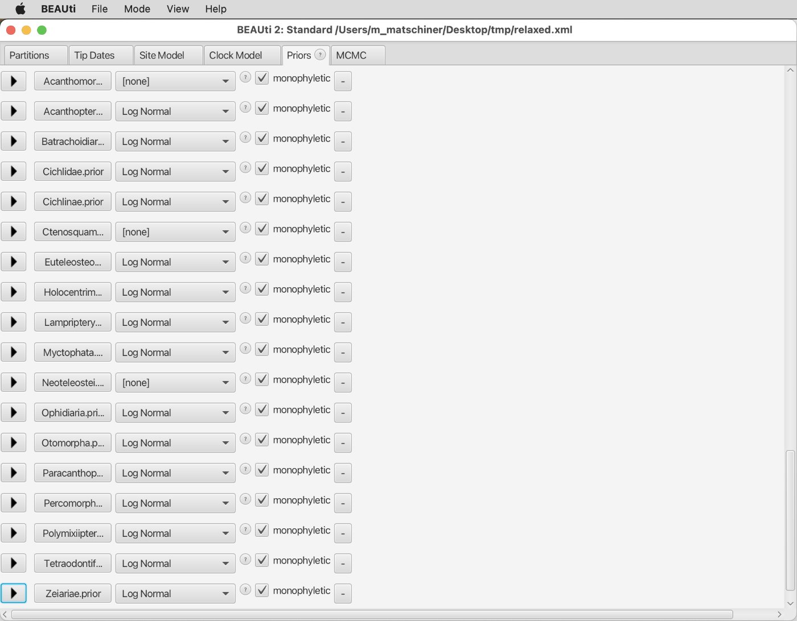

* Continue to the "MCMC" tab, and specify "fossils.log" and "fossils.trees" as the names of the log and tree files.

* Save the settings to a new file named `fossils.xml` by using "Save As" in BEAUti's "File" menu. Do not close BEAUti yet.

* Upload the file `fossils.xml` to your working directory on Saga using `scp`.

* Write a new Slurm script named `run_fossils.slurm` on Saga, by copying the file `run_relaxed.slurm` and replacing all occurrences of "relaxed" with "fossils".

* Submit this script with `sbatch`:

		sbatch run_fossils.slurm

* Monitor the progress of the BEAST2 analysis on Saga, by checking whether the job is running with the `squeue` command:

		squeue -u `whoami`
		
	If you notice that the job disappears from the list after only a few seconds, this indicates that BEAST2 has encountered and issue and quit without running MCMC.
	
* Have a look at the Slurm output file `run_fossils.out`, for example using `less`. You might find the following error message at the end of the file:

		Error detected about here:
			<beast>
				<run id='mcmc' spec='MCMC'>
					<init id='RandomTree.t:locus_0001' spec='RandomTree'>

	Scrolling back up, you might also find this line with more details about the error:
	
		java.lang.RuntimeException: This should never happen! Somehow the current active node is older than the next inactive node!

	This error message is unfortunately rather uninformative, but the next lines gives us a clue how to solve the issue:
	
		One possible solution you can try is to increase the population size of the population model.
		
	The issue encountered here is not too uncommon with BEAST2 analyses. While the error messages are a bit cryptic, they tell us that the MCMC could not be initiated because no starting tree could be generated that was in agreement with all the constraints that we had placed on the monophyly and ages of different clades. One solution is such cases is always to provide a starting tree, either through the BEAUTi interface (clicking "Show Starting tree panel" in the "View" menu), or manually by changing the XML file. The starting tree would have to be written in Newick format, and can be tedious to generate manually for a larger number of taxa. However, in the current case, an easier solution is possible, as suggested by the line copied above.
	
* With BEAUti still open on your own computer, click on "Show Starting tree panel" in its "View" menu, as shown below.
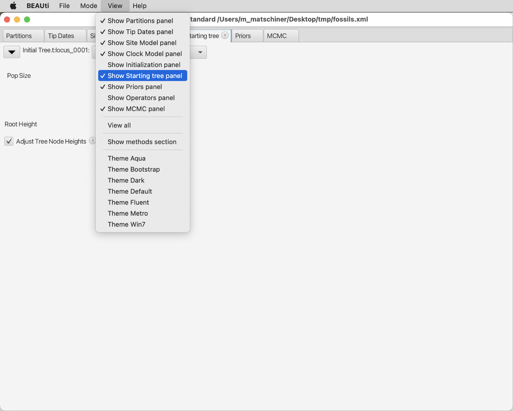

* You should see a drop-down menu in which "Random Tree" is selected, and a field next to "Pop Size" below it. If you would want to provide a manually generated starting tree in Newick format, you would have to select "Newick Tree" from the drop-down menu. But instead, we'll follow the suggestion from BEAST2's error message and increase the population size, by replacing "1.0" with "1000.0" in the field next to "Pop Size".

Note that this parameter is only equivalent to a population size in the model that generates the starting tree, but the BEAST2 analysis will be on the species level witout considering any population sizes.
	
* Save the XML file again under the same name, `fossils.xml`, upload it again to Saga, and once again start the Slurm script `run_fossils.slurm`:

		sbatch run_fossils.slurm

* Monitor the progress of the BEAST2 analysis again as before with `squeue`:

		squeue -u `whoami`
		
	This time, BEAST2 should succeed in initiating the MCMC. You may continue with the [next part of the tutorial](#fbd) while this analysis is running and return here for the last steps of this tutorial when it is complete.
		
* When the BEAST2 analysis has finished, download the log file `fossils.log` from Saga to your computer, and inspect it with Tracer.

	**Question 4:** How does the age estimate for cichlids compare to those from earlier analyses? [(see answer)](#q4)

* On Saga, use TreeAnnotator again to produce a summary tree from the posterior tree distribution in file `fossils.trees`, using the following commands:

		module load Beast/2.7.0-GCC-11.3.0-CUDA-11.7.0
		srun --ntasks=1 --mem-per-cpu=1G --time=00:01:00 --account=nn9458k --pty treeannotator -burnin 10 -heights mean fossils.trees fossils.tre	

* Download file `fossils.tre` from Saga to your own computer using `scp`.
 	
* Open file `fossils.tre` in FigTree. Display node ages again by setting a tick in the checkbox for "Node Labels". You should see that the terminal branch lenghts are now longer than those in the earlier summary trees, even though the age estimate for the root of the tree is far younger than before.

* Note that the age estimate from the entry named "mrca.age(Cichlinae.originate)" in Tracer corresponds to the crown divergence of the three cichlid species in the tree.

* Display again the substitution-rate estimates as branch labels by setting a tick next to "Branch Labels", clicking the triangle to the left of it, and selecting "rate" from the drop-down menu next to "Display".

* Also visualize the substitution-rate estimates as branch widths by clicking on the triangle next to "Appearance", specifying a line weight of 5, and selecting "rate\_median" from the drop-down menu next to "Width by:". You'll see that all terminal branches now have rather similar substitution-rate estimates, and that the highest rate estimate is no longer the one for *Takifugu rubripes*, but instead the one for the short internal branch leading to the clade of percomorph fishes.

	**Question 5:** Does this mean that our molecular dataset really gives us the power to detect substitution-rate changes that occurred over 100 million years ago? [(see answer)](#q5)

## Divergence-time estimation with the FBD model

The FBD model reprsents a major methodological improvement for divergence-time estimation, as it removes the unfortunate requirement to specify age constraints more or less arbitrarily. Instead, the FBD model includes fossils as tips in a phylogeny together with the extant species, and ages are estimated on the basis of the fossil-sampling rate. This rate can be understood as the rate at which fossils are deposited in the sediment, but only those fossils that are eventually discovered by humans are considered in this rate. Estimates for this rate can be found in the palaeontological literature. For example, the sampling rate for bony fishes has been estimated by [Foote and Miller (2007)](https://books.google.ch/books/about/Principles_of_Paleontology.html?id=8TsDC2OOvbYC&redir_esc=y) to be between 0.0066 and 0.01806 per million years. In principle, the sampling rate can also be estimated, rather than specified, in analyses with the FBD model, but this would require all known fossils of all clades of spiny-rayed fishes, and not just the oldest fossils per clade, to be included in the analysis.

Additional to the fossil-sampling rate, the FBD model uses assumptions for the speciation rate and the extinction rate. These rates were also used in the analyses based on fossil constraints; however, we ignored those results in our earlier analyses, and we did not care to place informative priors on these parameters. This was because they could not be considered accurate anyway, as the accurate estimation of these parameters would have required either all extant fish species to be included in the phylogeny, or a random subset of these. However, the way in which species were chosen to be included in the phylogeny was not random, but instead rather followed "diversified sampling scheme" ([Hoehna et al. 2011](https://doi.org/10.1093/molbev/msr095)) in which old lineages have a greater chance to be included even if they have only few extant species (Polymixiiformes with only 10 extant species are one such example). When we are now using the FBD model, however, we have to pay attention to the speciation and extinction rates – the priors that we specify for them as well as the resulting estimates - because these parameters then have a much greater influence on the divergence-time estimates than before. Due to the "diversified sampling scheme" with which species were selected for the dataset, the speciation and extinction rates can not be estimated accurately, but at least we can try to constrain them with reasonable prior distributions.

Note that a far more extensive tutorial on divergence-time estimation with the FBD model is available at the [Taming the BEAST](https://taming-the-beast.org/tutorials/FBD-tutorial/FBD-tutorial.pdf) website, which you might find useful if you'ld like to learn more about this type of analysis.

* Because the FBD model considers fossils as tips in the phylogeny, these should be included as taxa in the Nexus input file, even if no molecular or morphological character information is available for them. In that case, the phylogenetic position of the fossils will be determined exclusively based on taxonomic constraints (which means that the taxonomic affiliation is assumed to be known without error).

	As a first step, we therefore need to include the fossil species from the above list of fossil constraints in the Nexus-format alignment file `hughes_etal_10_orthologs_20_species.nex`. At the same time, we'll add to each species name the age of this species: For the extant species for which we have sequence data, this age is 0, and for fossil species, the age will be sampled at random from the ranges of uncertainty for the fossil age, as given in the list above. For example, for the fossil species *Plesioheros chauliodus*, the oldest fossil of the cichlid subfamily Cichlinae ([Alano Perez et al. 2010](https://doi.org/10.1590/S1679-62252010000300008)) which is thought to be between 40.0 and 45.0 million years old, an age will be picked at random from this age range. Note, however, that these randomly drawn ages will only be used as starting values for fossil ages in the MCMC; the full range of uncertainty will later be accounted for through prior densities that we will add manually to the XML file.

	To include fossil species as taxa in the Nexus file and at the same time include ages in the names used for extant and fossil taxa, you can use the Ruby script `add_fossils_to_nexus.rb`. As input, this script requires the Nexus-format alignment file `hughes_etal_10_orthologs_20_species.nex` as well as a tab-delimited table of species names and ages for all fossils.

* Make sure that you have the file `hughes_etal_10_orthologs_20_species.nex` that was prepared in tutorial [Bayesian Phylogenetic Inference](../bayesian_phylogeny_inference/README.md)). If not, you can copy it on Saga to your work directory or download it from GitHub. To copy it to your work directory, use this command:

		cp /cluster/projects/nn9458k/phylogenomics/week2/data/hughes_etal_10_orthologs_20_species.nex .
		
	To download it from GitHub, use this command:
	
		wget https://raw.githubusercontent.com/ForBioPhylogenomics/tutorials/main/week2_data/hughes_etal_10_orthologs_20_species.nex

* Get the Ruby script `add_fossils_to_nexus.rb`, either by copying it from directory `/cluster/projects/nn9458k/phylogenomics/week2/src` or by downloading it from GitHub to your current directory on Saga, using one of the following two commands:

		cp /cluster/projects/nn9458k/phylogenomics/week2/src/add_fossils_to_nexus.rb .

	or

		wget https://raw.githubusercontent.com/ForBioPhylogenomics/tutorials/main/week2_src/add_fossils_to_nexus.rb
	
* Open a new file named `fossil_ids.txt` on Saga, and write the following text to it:

		fossil_id	minimum_age maximum_age
		Plesioheros_chauliodus	40.0	45.0
		Mahengechromis_spp	45.0	46.0
		Louckaichthys_novosadi	29.6	32.0
		Pastorius_methenyi	69.8	76.4
		Plectocretacicus_clarae	98.0	100.5
		Caproberyx_pharsus	98.0	100.5
		Cryptoberyx_minimus	98.0	100.5
		Homonotichthys_rotundus	94.0	97.1
		Aipichthys_minor	98.0	100.5
		Cretazeus_rinaldii	83.0	89.8
		Sardinioides_spp	80.7	81.3
		Leptolepides_haerteisi	150.9	152.1
		Tischlingerichthys_viohli	150.9	152.1

* Execute the script `add_fossils_to_nexus.rb` with `srun`, providing the alignment and the file with fossil IDs as input and writing the output to a new file named `hughes_etal_10_orthologs_20_species_fossils.nex`:

		module purge
		module load Ruby/2.7.2-GCCcore-9.3.0
		srun --ntasks=1 --mem-per-cpu=1G --time=00:01:00 --account=nn9458k --pty ruby add_fossils_to_nexus.rb hughes_etal_10_orthologs_20_species.nex fossil_ids.txt hughes_etal_10_orthologs_20_species_fossils.nex

* Have a brief look at the resulting alignment file `hughes_etal_10_orthologs_20_species_fossils.nex ` to understand the changes made by the Ruby script, for example with `less -S`:

		less -S hughes_etal_10_orthologs_20_species_fossils.nex

* Download file `hughes_etal_10_orthologs_20_species_fossils.nex` from Saga using `scp`.

* Close (if still open) and reopen BEAUti on your local computer to clear all settings.

* Import the alignment file `hughes_etal_10_orthologs_20_species_fossils.nex` with "Import Alignment" in BEAUti's "File" menu. The "Partitions" tab should then look just as it did previously when you imported the alignment without fossils from file `hughes_etal_10_orthologs_20_species.nex`, but with all alignments having 33 taxa:
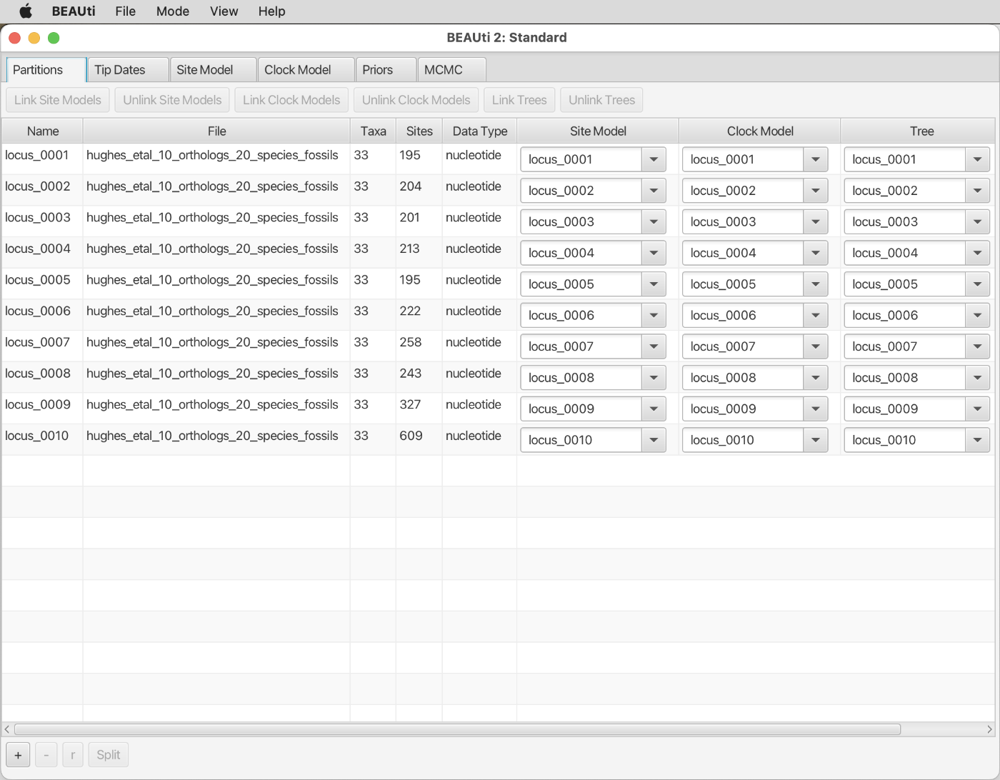

* Again, select all partitions and click on "Link Trees" and "Link Clock Models", as shown below.

* This time, do not skip the "Tip Dates" tab. When you click on it, the window should look as shown in the next screenshot.

* Set a tick in the checkbox for "Use tip dates". The window will then look as shown below.

* We now have to specify the direction and the unit in which the ages of fossil (and extant) species are given. To the right of "Dates specified:", keep the selection of "numerically as ..."; the alternative option of "as dates with format..." would only be useful if we would build a phylogeny of rapidly evolving virus sequences.

	In the drop-down menu to the right of "numerically as ..." use "year" as the unit of time even though the ages are in fact given in millions of years. This will not make a difference as long as we interpret the results also in millions of years.

	In the next drop-down menu, select "Before the present" as shown in the next screenshot.

* Click on the "Auto-configure" button in the top right of the window, which should open a pop-up window as shown below.
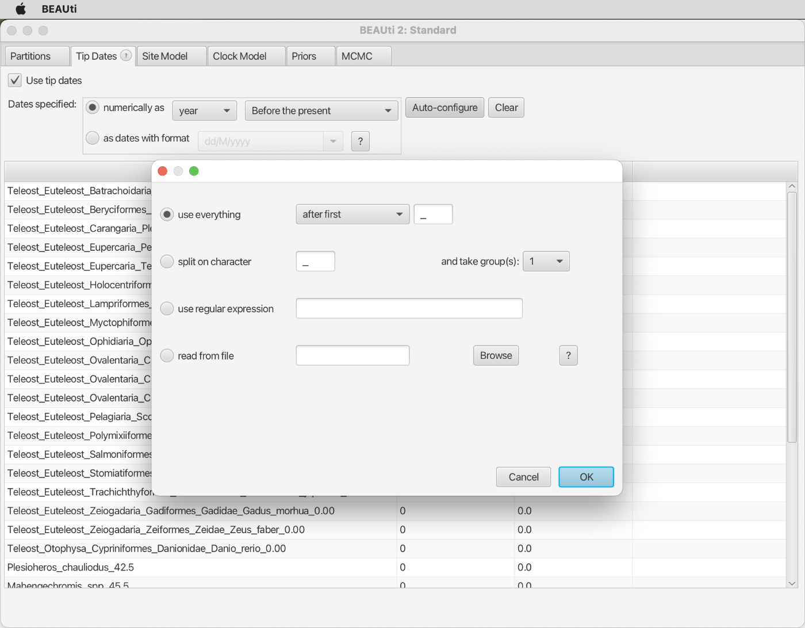

* Change the drop-down menu at the top of the pop-up window to "after last", and keep the underscore in the field to the right of it, as shown in the below screenshot. This specifies that BEAUti should interpret the text after the last underscore symbol in each species id as the age of the species

* When you click "OK" and scroll down in the list shown in the "Tip Dates" tab, you should see that the ages ("Height") of all fossil species have been correctly interpretated while the ages of extant species remain at "0.0", as shown below.

* Next, move on to the "Site Model" tab. As before, select "BEAST Model Test" from the drop-down menu and set a tick in the checkbox at the right to estimate the mutation rate of this partition. The window should then look as shown in the screenshot below.
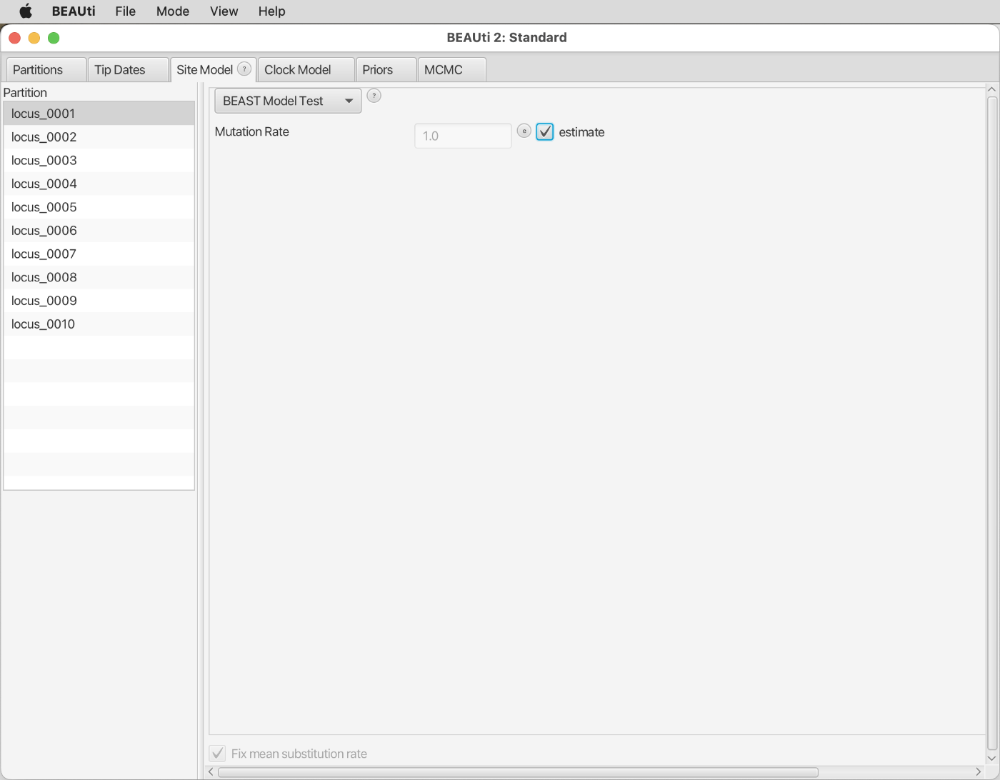

* Again, select all partitions from the list at the left-hand side of the window and click "OK" to clone the substitution model from the first partition to all other partitions, as shown below.

* In the tab for "Clock Model", select once again the "Optimised Relaxed Clock" model from the drop-down menu. Remove the tick for "Automatic set clock rate" in BEAUti's "Mode" menu, and set a tick in the checkbox next to "estimate". The BEAUti window should then look as shown below.

* Move on to the "Priors" tab. This is where we now have to specify, in the first drop-down menu, the "Fossilized Birth Death Model" as the assumed tree-generating process, as shown in the next screenshot.
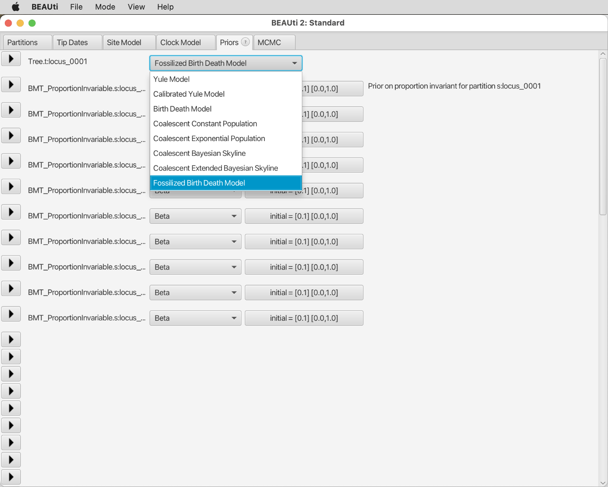

* Click on the black triangle at the left of the first row, next to "Tree.t:locus\_0001". This will open the settings for the FBD model, as shown below.

As a first step, set the tick next to "Condition on Root" at the left of the window, to indicate that none of the fossils of our phylogeny are placed on the stem branch of the phylogeny. As you'll see we still have to specify parameter values for the "Diversification Rate", the "Turnover", the "Sampling Proportion", and "Rho". Of these, the "Diversification Rate" is the difference between speciation and extinction rate, and the "Turnover" is the extinction rate divided by the speciation rate. The "Sampling Proportion" is defined as *s* = &psi; / (&psi; + &mu;), where &psi; is the sampling rate (the rate at those fossils are deposited that are eventually found) and &mu; is the extinction rate ([Gavryushkina et al. 2014; Eqn. 8](https://doi.org/10.1371/journal.pcbi.1003919)). If an estimate of the extinction rate &mu; is not available but the net-diversification rate *d* (*d* = &lambda; - &mu;; with &lambda; being the speciation rate) and the turnover *r* (*r* = &mu; / &lambda;) have been estimated, the sampling proportion can be calculated as *s* = &psi; / (&psi; + *rd* / (1 - *r*) ). Parameter "Rho" is the proportion of the sampled extant species among all extant species descending from the root of the phylogeny.

* For the diversification rate, we'll pick a starting value within the range 0.041-0.081, according to estimates by [Santini et al. (2009)](https://doi.org/10.1186/1471-2148-9-194). Type "0.06" to the right of "Diversification Rate" as shown below.
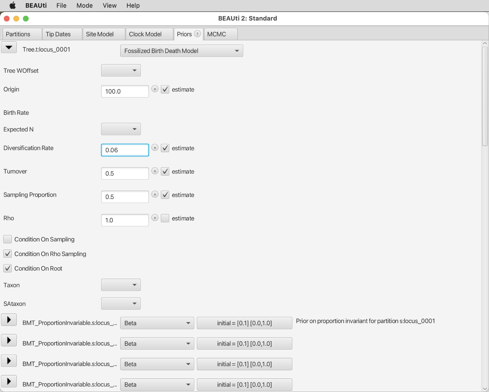

* We'll do the same for the turnover, and specify "0.1" to the right of "Turnover", as a value from the range of 0.0011-0.37 estimated by [Santini et al. (2009)](https://doi.org/10.1186/1471-2148-9-194).

* To specify an appropriate starting value for the sampling proportion *s* we need to consider the equation given above: *s* = &psi; / (&psi; + *rd* / (1 - *r*) ). For the net-diversification rate (*d*) and turnover (*r*), we can again assume the values 0.06 and 0.1, respectively, as in the last two steps. For the sampling rate &psi;, we can pick a value from the range 0.0066-0.01806 (see above), such as 0.01 (keep in mind that these rough estimates only serve to calculate a starting value for the sampling proportion; the uncertainty in these estimates will be taken into account when we define prior densities). With &psi; = 0.01, *d* = 0.06, and *r* = 0.1, we then get *s* = 0.01 / (0.01 + 0.1 &times; 0.06 / (1 - 0.1) ) = 0.6. Use this number as the starting value for the sampling proportion, as shown in below.
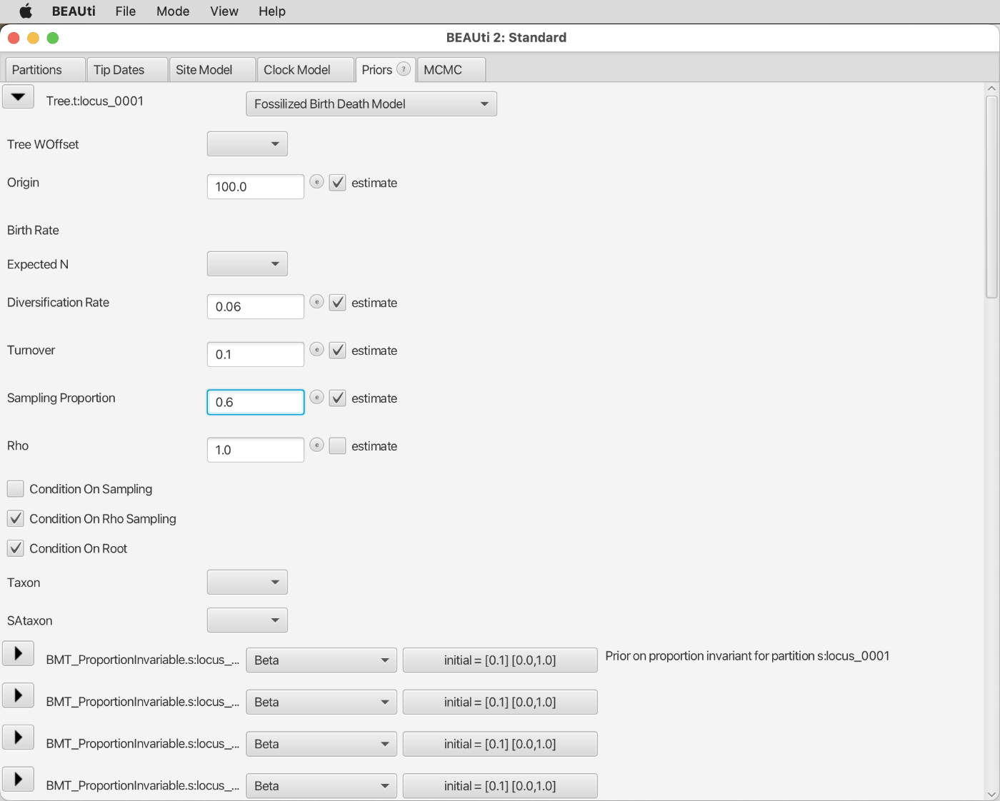

* In contrast to the last three parameters, we don't have to rely on estimates for the proportion of sampled extant taxa, "Rho", but we can directly calculate it. The root of our phylogeny represents the first diversification event of the crown group of Clupeocephala, an extremely diverse group that comprises almost all of the 30,000 or so teleost fishes. Of these we have sampled 20 for our phylogeny; thus, the proportion of sampled taxa is roughly 20/30000 = 0.0007. Specify this value to the right of "Rho", as shown in the next screenshot.

Make sure that the checkbox next to "estimate" at the right is not set, in contrast to the checkboxes above.

* We still have to specify prior densities for the diversification rate, the turnover, and the sampling rate, the three parameters of the FBD model that will be estimated. You'll find these parameters if you scroll to the very bottom of the "Priors" tab, as shown below.

* Click on the triangle to the left of "diversificationRateFBD.t:...". Make sure that the drop-down menu to the right of "diversificationRateFBD.t:..." reads "Uniform", indicating that a uniformly distributed prior density is used for this parameter. Then, specify "0.041" as the lower boundary and "0.081" as the upper boundary of this uniform density, as shown in the next screenshot.
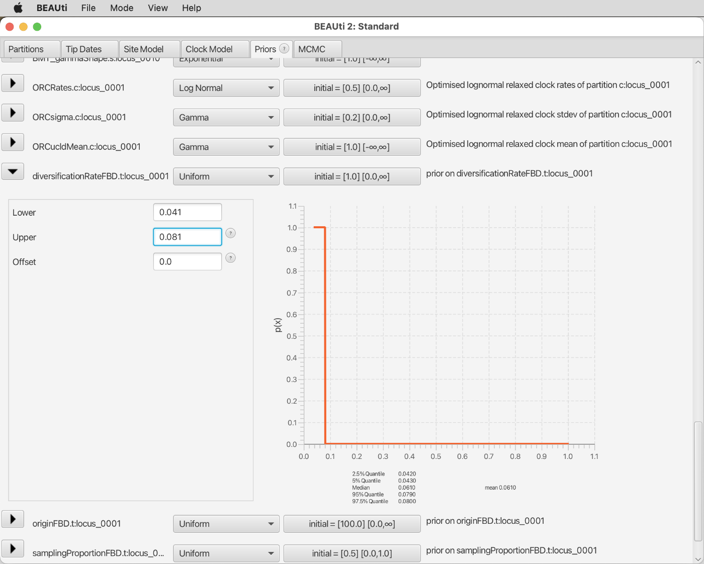

* Click on the triangle next to "diversificationRateFBD.t:..." again to close the settings for this parameter. Instead, open the settings for the sampling-proportion parameter, named "samplingProportionFBD.t:...". As described above, the sampling proportion *s* is *s* = &psi; / (&psi; + *rd* / (1 - *r*) ), with &psi; being the sampling rate, *d* being the net-diversification rate and *r* being the turnover. The prior density for the sampling proportion *s* therefore needs to take into account the confidence intervals for each of these three parameters. One way to do this is by generating a distribution of *s* values by randomly sampling (many times) values of &psi;, *d*, and *r* from their confidence intervals, and calculating *s* for each of the sampled combinations of these three parameters. This results in a distribution for *s* as shown in the plot below.

	It would be possible to try to approximate this distribution with a similarly shaped prior density; however, given that the assumption of uniform prior densities for &psi;, *d*, and *r* was already very simplistic, the resulting distribution for *s* should maybe not be overinterpreted. We'll simply use a uniform prior density also for *s*, with the lower and upper boundaries according to the 2.5% and 97.5% quantiles of the distribution shown above. These are 0.2 and 0.95, respectively. Thus, specify "0.2" as the lower boundary and "0.95" as the upper boundary of this density, as shown below.

* Close the settings for the sampling-proportion parameter again and open instead those for the turnover parameter. As before, use a uniform prior density, with lower and upper boundaries according range estimated by [Santini et al. (2009)](https://doi.org/10.1186/1471-2148-9-194): Specify "0.0011" as the lower boundary and "0.37" as the upper boundary of this uniform density, as shown in the below screenshot.

* Finally, we still need to specify taxonomic constraints to assign fossils to clades represented by extant taxa. To do so, click on the "+ Add Prior" button at the very end of the list in the "Priors" tab. When asked "Which prior do you want to add" as in the below screenshot, choose "Multiple monophyletic constraint" from the drop-down menu (alternatively, it would be possible to specify individuals constraints one by one by selecting "MRCA prior"; however, this might take some time with a large number of constraints).

* After clicking "OK", another line will be added to the list of priors named "MultiMonophyleticConstraint.t:locus\_0001" as shown below. Click on the triangle at the left of this line. As shown in the next screenshot, this will open a field in which you can specify a monophyly constraint in Newick format.

* You'll find the string encoding all monophyly constraints in Newick format below. As you'll see, this string is basically a tree string but it does not contain branch-length information and it includes several unresolved nodes.

		(((((Teleost_Euteleost_Batrachoidaria_Batrachoidiformes_Batrachoididae_Chatrabus_melanurus_0.00,Louckaichthys_novosadi_30.8),Teleost_Euteleost_Carangaria_Pleuronectiformes_Cynoglossidae_Cynoglossus_semilaevis_0.00,Teleost_Euteleost_Eupercaria_Perciformes_Gasterosteidae_Gasterosteus_aculeatus_0.00,(Teleost_Euteleost_Eupercaria_Tetraodontiformes_Tetraodontidae_Takifugu_rubripes_0.00,Plectocretacicus_clarae_99.25),(Teleost_Euteleost_Ophidiaria_Ophidiiformes_Ophidiidae_Brotula_barbata_0.00,Pastorius_methenyi_73.1),((Teleost_Euteleost_Ovalentaria_Cichliformes_Cichlidae_Amphilophus_citrinellus_0.00,Plesioheros_chauliodus_42.5),(Teleost_Euteleost_Ovalentaria_Cichliformes_Cichlidae_Haplochromis_burtoni_0.00,Teleost_Euteleost_Ovalentaria_Cichliformes_Cichlidae_Oreochromis_niloticus_0.00,Mahengechromis_spp_45.5)),Teleost_Euteleost_Pelagiaria_Scombriformes_Scombridae_Thunnus_albacares_0.00),Teleost_Euteleost_Beryciformes_Berycidae_Beryx_splendens_0.00,(Teleost_Euteleost_Holocentriformes_Holocentridae_Myripristis_jacobus_0.00,Caproberyx_pharsus_99.25),Teleost_Euteleost_Trachichthyformes_Monocentridae_Monocentris_japonica_0.00,Cryptoberyx_minimus_99.25),(Teleost_Euteleost_Lampriformes_Lampridae_Lampris_guttatus_0.00,Aipichthys_minor_99.25),(Teleost_Euteleost_Myctophiformes_Myctophidae_Benthosema_glaciale_0.00,Sardinioides_spp_81.0),(Teleost_Euteleost_Polymixiiformes_Polymixiidae_Polymixia_japonica_0.00,Homonotichthys_rotundus_95.55),Teleost_Euteleost_Salmoniformes_Salmonidae_Salmo_salar_0.00,Teleost_Euteleost_Stomiatiformes_Stomiidae_Borostomias_antarcticus_0.00,(Teleost_Euteleost_Zeiogadaria_Gadiformes_Gadidae_Gadus_morhua_0.00,(Teleost_Euteleost_Zeiogadaria_Zeiformes_Zeidae_Zeus_faber_0.00,Cretazeus_rinaldii_86.4)),Leptolepides_haerteisi_151.5),(Teleost_Otophysa_Cypriniformes_Danionidae_Danio_rerio_0.00,Tischlingerichthys_viohli_151.5))

	If you copy this string and paste it into a new FigTree window, you'll see a cladogram visualizing all specified monophyly constraints, as shown in the screenshot below. Each resolved branch in this cladogram represents a clade for which the monophyly is constrained. Also note that each pair of sister taxa in this phylogeny groups one extant representative of a clade with the oldest fossil of that clade. The set of monophyly constraints defined by this Newick string is effectively identical to the the assignment of fossil taxa to taxonomic groups as we did it before in the analysis with the fossil constraints.
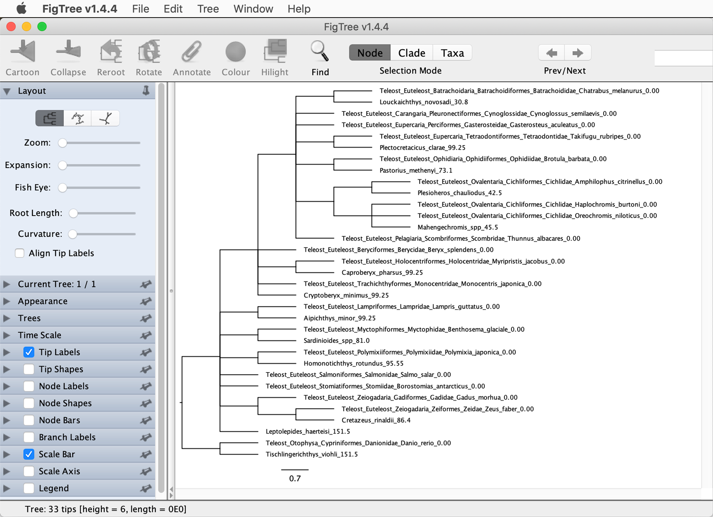
Thus, copy the Newick string and paste it into the "Newick" field below "MultiMonophyleticConstraint.t:locus\_0001, as in the next screenshot.

* Move on to the "MCMC" tab and specify again a chain length of 10 million generations. Name the log output file `fbd.log` and the tree output file `fbd.trees`. Set the interval for logging of log and tree files each to "5000" in the fields to the right of "Log Every", as shown below.

* This time, providing a starting tree will be required, as BEAST2 would not be able to automatically generate a starting tree matching all constraints. To do so through BEAUti, click on "Show starting tree panel" in the "View" menu. Select "Newick Tree" from the drop-down menu in that panel. Then, copy this string into the field to the right of "Newick":

		((((((((((((((Teleost_Euteleost_Batrachoidaria_Batrachoidiformes_Batrachoididae_Chatrabus_melanurus_0.00:100,Louckaichthys_novosadi_30.8:69.18):21.59974,(Teleost_Euteleost_Ophidiaria_Ophidiiformes_Ophidiidae_Brotula_barbata_0.00:100,Pastorius_methenyi_73.1:26.88):21.59974):10.416069,(((Teleost_Euteleost_Carangaria_Pleuronectiformes_Cynoglossidae_Cynoglossus_semilaevis_0.00:110.734264,(Teleost_Euteleost_Eupercaria_Perciformes_Gasterosteidae_Gasterosteus_aculeatus_0.00:103.051877,(Teleost_Euteleost_Eupercaria_Tetraodontiformes_Tetraodontidae_Takifugu_rubripes_0.00:100,Plectocretacicus_clarae_99.25:0.748):3.051877):7.682387):5.661272,((Teleost_Euteleost_Ovalentaria_Cichliformes_Cichlidae_Amphilophus_citrinellus_0.00:80,Plesioheros_chauliodus_42.5:37.48):4.527003,((Teleost_Euteleost_Ovalentaria_Cichliformes_Cichlidae_Haplochromis_burtoni_0.00:67.885945,Teleost_Euteleost_Ovalentaria_Cichliformes_Cichlidae_Oreochromis_niloticus_0.00:67.885945):1,Mahengechromis_spp_45.5:23.365945):15.641058):31.868533):6.838544,Teleost_Euteleost_Pelagiaria_Scombriformes_Scombridae_Thunnus_albacares_0.00:123.23408):8.781729):14.743359,(Teleost_Euteleost_Holocentriformes_Holocentridae_Myripristis_jacobus_0.00:100,Caproberyx_pharsus_99.25:0.748):46.759168):5.099154,Teleost_Euteleost_Beryciformes_Berycidae_Beryx_splendens_0.00:151.858322):7.494267,Teleost_Euteleost_Trachichthyformes_Monocentridae_Monocentris_japonica_0.00:159.352589):10,Cryptoberyx_minimus_99.25:70.1):7.511019,((Teleost_Euteleost_Lampriformes_Lampridae_Lampris_guttatus_0.00:100,Aipichthys_minor_99.25:0.748):63.827947,(Teleost_Euteleost_Polymixiiformes_Polymixiidae_Polymixia_japonica_0.00:100,Homonotichthys_rotundus_95.55:4.448):63.827947):13.03566):14.933313,(Teleost_Euteleost_Zeiogadaria_Gadiformes_Gadidae_Gadus_morhua_0.00:163.825767,(Teleost_Euteleost_Zeiogadaria_Zeiformes_Zeidae_Zeus_faber_0.00:100,Cretazeus_rinaldii_86.4:13.6):63.825767):27.971154):16.211033,(Teleost_Euteleost_Myctophiformes_Myctophidae_Benthosema_glaciale_0.00:100,Sardinioides_spp_81.0:19):108.007954):31.095687,Teleost_Euteleost_Stomiatiformes_Stomiidae_Borostomias_antarcticus_0.00:239.103641):24.38244,Teleost_Euteleost_Salmoniformes_Salmonidae_Salmo_salar_0.00:263.486081):26.141923,Leptolepides_haerteisi_151.5:138.128):20,(Teleost_Otophysa_Cypriniformes_Danionidae_Danio_rerio_0.00:200,Tischlingerichthys_viohli_151.5:48.5):109.628004);
		
	If curious, you could copy and paste this string into a FigTree window to see how this starting tree with fossils looks like.
	
	The BEAUti window should then look as in the screenshot below.

* Save the settings to a new file named `fbd.xml`, by clicking "Save As" in BEAUti's "File" menu.

Before we start the analysis, there is one change that we need to make manually to the file `fbd.xml`, which is required to account for the uncertainties in the ages of all fossils. This is possible by adding a certain type of operator elements to the XML file.

* Open file `fbd.xml` in a text editor on your local computer, scroll to the line after the last operator element and before the first logger element (this should be around line number 720). You should recognize the following lines:

			<operator id="SATreeRootScalerFBD.t:locus_0001" spec="SAScaleOperator" rootOnly="true" scaleFactor="0.95" tree="@Tree.t:locus_0001" weight="1.0"/>

			<operator id="SATreeScalerFBD.t:locus_0001" spec="SAScaleOperator" scaleFactor="0.95" tree="@Tree.t:locus_0001" weight="3.0"/>

			<logger id="tracelog" spec="Logger" fileName="fbd.log" logEvery="5000" model="@posterior" sanitiseHeaders="true" sort="smart">
				<log idref="posterior"/>
				<log idref="likelihood"/>
				<log idref="prior"/>

	Without deleting any of these lines, add the following code just above the line beginning with `<logger id...`:

		    <operator spec='SampledNodeDateRandomWalker' windowSize="1"  tree="@Tree.t:locus_0001" weight="10">
				<taxonset spec="TaxonSet">
					<taxon id="Plesioheros_chauliodus_42.5" spec="Taxon"/>
					<taxon id="Mahengechromis_spp_45.5" spec="Taxon"/>
					<taxon id="Louckaichthys_novosadi_30.8" spec="Taxon"/>
					<taxon id="Pastorius_methenyi_73.1" spec="Taxon"/>
					<taxon id="Plectocretacicus_clarae_99.25" spec="Taxon"/>
					<taxon id="Caproberyx_pharsus_99.25" spec="Taxon"/>
					<taxon id="Cryptoberyx_minimus_99.25" spec="Taxon"/>
					<taxon id="Homonotichthys_rotundus_95.55" spec="Taxon"/>
					<taxon id="Aipichthys_minor_99.25" spec="Taxon"/>
					<taxon id="Cretazeus_rinaldii_86.4" spec="Taxon"/>
					<taxon id="Sardinioides_spp_81.0" spec="Taxon"/>
					<taxon id="Leptolepides_haerteisi_151.5" spec="Taxon"/>
					<taxon id="Tischlingerichthys_viohli_151.5" spec="Taxon"/>
				</taxonset>
				<samplingDates id="samplingDate1" spec="sa.evolution.tree.SamplingDate" taxon="Plesioheros_chauliodus_42.5" upper="45.0" lower="40.0"/>
				<samplingDates id="samplingDate2" spec="sa.evolution.tree.SamplingDate" taxon="Mahengechromis_spp_45.5" upper="46.0" lower="45.0"/>
				<samplingDates id="samplingDate3" spec="sa.evolution.tree.SamplingDate" taxon="Louckaichthys_novosadi_30.8" upper="32.0" lower="29.6"/>
				<samplingDates id="samplingDate4" spec="sa.evolution.tree.SamplingDate" taxon="Pastorius_methenyi_73.1" upper="76.4" lower="69.8"/>
				<samplingDates id="samplingDate5" spec="sa.evolution.tree.SamplingDate" taxon="Plectocretacicus_clarae_99.25" upper="100.5" lower="89.0"/>
				<samplingDates id="samplingDate6" spec="sa.evolution.tree.SamplingDate" taxon="Caproberyx_pharsus_99.25" upper="100.5" lower="89.0"/>
				<samplingDates id="samplingDate7" spec="sa.evolution.tree.SamplingDate" taxon="Cryptoberyx_minimus_99.25" upper="100.5" lower="89.0"/>
				<samplingDates id="samplingDate8" spec="sa.evolution.tree.SamplingDate" taxon="Homonotichthys_rotundus_95.55" upper="97.1" lower="94.0"/>
				<samplingDates id="samplingDate9" spec="sa.evolution.tree.SamplingDate" taxon="Aipichthys_minor_99.25" upper="100.5" lower="89.0"/>
				<samplingDates id="samplingDate10" spec="sa.evolution.tree.SamplingDate" taxon="Cretazeus_rinaldii_86.4" upper="89.8" lower="83.0"/>
				<samplingDates id="samplingDate11" spec="sa.evolution.tree.SamplingDate" taxon="Sardinioides_spp_81.0" upper="81.3" lower="80.7"/>
				<samplingDates id="samplingDate12" spec="sa.evolution.tree.SamplingDate" taxon="Leptolepides_haerteisi_151.5" upper="152.1" lower="150.9"/>
				<samplingDates id="samplingDate13" spec="sa.evolution.tree.SamplingDate" taxon="Tischlingerichthys_viohli_151.5" upper="152.1" lower="150.9"/>
			</operator>

	In the above code block, the first half does nothing else than define "taxon" elements with the IDs of the fossil species exactly as they are in the Nexus-format alignment file `hughes_etal_10_orthologs_20_species_fossils.nex`. The second half then refers to these definitions and adds a "samplingDates" element for each fossil, with an upper and a lower value that represent the range of uncertainty for the age of that fossil.
	
* Finally, a small further change must be made to file `fbd.xml` to correct an obvious bug in the latest version of BEAST2. On the very first line of this file, "likelihoodbeast" must be replaced with "likelihood:beast".
	
* Save the XML file again with the same name (`fbd.xml`). This file `fbd.xml` is then ready to be analyzed with BEAST2.

* Copy file `fbd.xml` to Saga using `scp`.

* On Saga, write a new Slurm script named `run_fossils.slurm` with the following content:

		#!/bin/bash

		# Job name:
		#SBATCH --job-name=fbd
		#
		# Wall clock limit:
		#SBATCH --time=4:00:00
		#
		# Processor and memory usage:
		#SBATCH --ntasks=1
		#SBATCH --mem-per-cpu=1G
		#
		# Accounting:
		#SBATCH --account=nn9458k
		#
		# Output:
		#SBATCH --output=run_fbd.out

		# Set up job environment.
		set -o errexit  # Exit the script on any error
		set -o nounset  # Treat any unset variables as an error
		module --quiet purge  # Reset the modules to the system default

		# Load the beast2 module.
		module load Beast/2.7.0-GCC-11.3.0-CUDA-11.7.0

		# Run beast2.
		beast fbd.xml

* Close the file and then submit it with `sbatch`:

		sbatch run_fbd.slurm
		
	Like the earlier BEAST2 analyses, this analysis with the FBD model should take around 50 minutes to finish.

* Download file `fbd.log` from Saga to your own computer, using `scp`.

* Open file `fbd.log` in Tracer. Select the "posterior" from the list in the panel on the bottom left, and click on the tab for "Trace" on the top right of the window. If the ESS value for the posterior probability is low (remember that it should be above ESS for a complete analysis) and you see an obvious trend in the trace as in the next screenshot, the burnin period should be increased from 10% to a higher percentage of the MCMC.

* If you have to increase the length of the burnin period, click on the number "1000000" below "Burn-In" in the top left panel of the Tracer window, and replace this number with a larger one. For my analysis, setting the burnin period to 3 million iterations seemed appropriate:

Note that most ESS values increase with the extended burnin period. Some ESS values are probably still very low, perhaps below 10, indicating that the analysis should ideally have run for much longer. Nevertheless, we'll assume that the degree of stationarity is sufficient for our interpretation here.

* Find the "TreeHeight" parameter indicating the root age in the list on the left.
	
	**Question 6:** What is the mean estimate and its confidence interval for the age of the first split in the phylogeny? [(see answer)](#q6)

The divergence-time estimate for African and Neotropical cichlids is this time not included in the list of parameters. To see it, you'll need to use the posterior tree distribution.

* On Saga, summarize the posterior tree distribution in file `fbd.trees`. Set the burnin percentage according to your visual inspection of the posterior probability trace in the last step. Specify that mean age estimates should be used for nodes in the summary tree and name the output file `fbd.tre`. Thus, for example with a burnin period of 30%, run TreeAnnotator with the following command:

		module load Beast/2.7.0-GCC-11.3.0-CUDA-11.7.0
		srun --ntasks=1 --mem-per-cpu=1G --time=00:01:00 --account=nn9458k --pty treeannotator -burnin 30 -heights mean fbd.trees fbd.tre

* Download the summary tree file `fbd.tre` to your own computer using `scp`.

* Open file `fbd.tre` in FigTree. Remove the scale bar, and instead display node ages as node labels. The FigTree window should then look as shown below.

Note that the fossil species are included in the tree and that their tip length corresponds to their ages. You'll see that just like the age of the very first divergence, the divergence of cichlids fishes is now also much older than it appeared in the previous analysis. This divergence is now estimated around 105 Ma. The confidence interval for this divergence ranges from around 60 Ma to about 150 Ma (to see this, select "height\_95%\_HPD") from the drop-down menu at the left, next to "Display" in the panel that opens when you click the triangle next to "Node Labels"). Thus, this age estimate would be consistent with the long-held assumption of "Gondwanan vicariance" according to which African and Neotropical cichlid fishes diverged when the continents Africa and South America separated around 100 Ma.

* To figure out the reason for this large difference in age estimates between this analysis and the earlier one with fossil constraints, go back to Tracer, scroll to the very bottom of the list of parameters on the left (with file `fbd.log` still open; if not, reopen it), and select the parameter named "diversificationRateFBD" to display the estimate for the net-diversification rate. The Tracer window should then look as shown in the screenshot below.
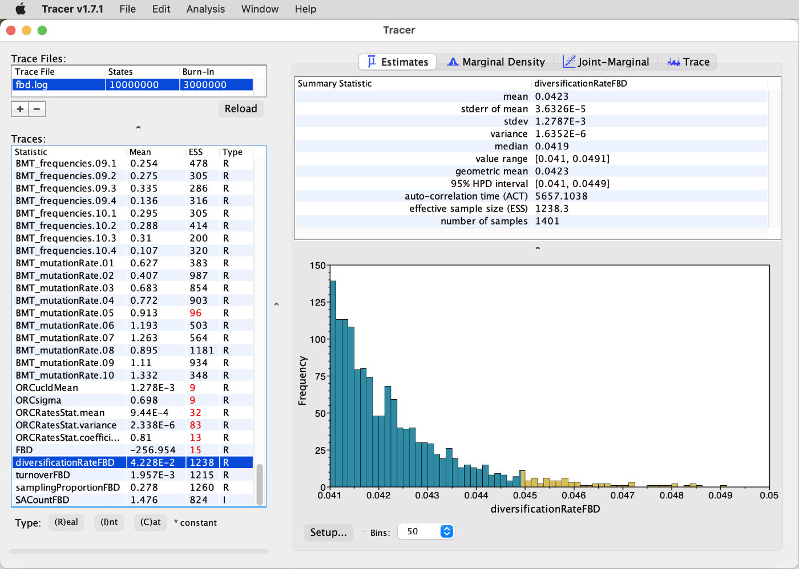

	**Question 7:** How does this estimate compare to the range of uncertainty that we had used when definiting a prior distribution for the net-diversification rate? [(see answer)](#q7)

After now estimating divergence times with a number of different methods and obtaining contrasting results with these, the most obvious conclusion to draw is that divergence-time estimation is difficult. Nevertheless, with some experience of the possible biases, results can still be interpreted. For example, results obtained with the FBD model can usually be considered accurate if the dataset corresponds to the model assumptions – meaning that species as well as fossils are sampled from the clade of interest either completely or randomly. Alternatively, datasets can be composed so that divergences with well-known ages are included, so that these can then be used as secondary calibration points. Further approaches are available but not easily applicable without a good understanding of palaeontology. For example, prior distributions used for fossil calibrations can be designed so that 95% of the probability mass are younger than the next-oldest fossil deposit that one would expect to include fossils of a certain group if these had been present at the time. Additionally, method like my own "CladeAge" method have been developed that automatically generate prior distributions for BEAST2 based on specified parameters for the fossil-sampling rate, the net-diversification rate, and the turnover ([Matschiner et al. 2017](https://doi.org/10.1093/sysbio/syw076)). If these parameters are known for a certain group, the age estimates produced by CladeAge are reliable. Unfortunately, however, the method is not currently easy to use as the latest version of BEAST2 is incompatible with it.

 

                   

## Answers

* **Question 1:** The mean age estimate with the relaxed clock model should be around 26 Ma, and therefore younger than that with the strict clock. This could indicate that the substitution rate of cichlids is above average, and because this difference could not be accounted for with the strict-clock model, their age was overestimated with it. On the other hand, a second difference between the models is that the confidence interval is much wider with the relaxed clock. The 95% HPD interval should roughly range from 40 to 13 Ma. This wider range with a relaxed clock compared to the strict clock is normal, as allowing rate variation gives us a much greater uncertainty in age estimates.

* **Question 2:** If you don't have the summary tree from tutorial [Bayesian Phylogenetic Inference](../bayesian_phylogeny_inference/README.md), you can download it from GitHub using `wget https://raw.githubusercontent.com/ForBioPhylogenomics/tutorials/main/week2_res/bmodeltest.tre`. Comparing the node bars between these two trees should clearly show that the the confidence intervals are far wider in the tree estimated with the relaxed clock model, particularly for nodes with intermediate ages.

* **Question 3:** As the branch widths illustrate, the substitution rate of cichlid fishes is not unusually high or low compared to other species. Instead, the species with the highest rate is *Takifugu rubripes*. Its substitution rate estimate is 0.0041 (per bp per million years), nearly ten times as high as that of the slowest-evolving species, *Monocentris japonica*, with a rate of 0.0006. But because *Takifugu rubripes* is relatively closely related to cichlids, it is likely that the many substitutions that occurred on the branch leading to it did push also the cichlid divergence times towards older ages when the strict-clock model was used.

* **Question 4:** There should be two entries with age information for cichlids, namely "mrca.age(Cichlidae.originate)" and "mrca.age(Cichlinae.originate)". In contrast to the other analyses, these now are estimates of the stem ages of the two clades, not their crown ages (because we specified "Use Originate" when specifying the corresponding age constraints). Thus, the former is the estimated age of divergence between cichlids and their sister group and the latter is the age of  divergence between the subfamily Cichlinae and its sister group. Because that sister group are the remaining cichlid fishes, the latter estimate is the estimate of the divergence between African and Neotropical cichlid fishes, which is the age that was estimated in earlier analyses. In contrast to the earlier analyses without fossil constraints, this age should now be markedly older, around 45 Ma instead of 26-30 Ma, with a confidence interval ranging from around 40 to 50 Ma. This is not surprising, because we had forced this divergence to an age of at least 40.0 Ma, the minimum age of the oldest South American cichlid fossil, *Plesioheros chauliodus*.

* **Question 5:** In principle, ancient substitution-rate changes might leave signatures that could be detected in phylogenetic analyses, when these are well dated with a full and reliable fossil record. However, such signals can also very easily result from the application of too narrow age constraints. In the case of the short branch at the base of Percomorpha, this is likely the case. The lower end of that branch, the beginning of the diversification of percomorph fishes, is constrained to be at least 98 million years old because a number of fossils are of that age have been assigned to Percomorpha. At the same time, the upper end of the branch is constrained to be not much older because relatively narrow lognormal prior distributions have been placed on both the clade of "Percomorpha" itself and the slightly more inclusive clade of "Acanthopterygii". Thus, it is likely that the branch has been artificially compressed, which, as a side-effect, increases the substitution rate estimated for it. A good published example of this effect is – in my opionion – a recent paper by [Daane et al. (2019)](https://doi.org/10.1038/s41559-019-0914-2) on the diversification of Antarctic notothenioid fishes. To avoid this issue, wider distributions could be used for age constraints, or – even better - quantitative approaches like the FBD model should be used.

* **Question 6:** You may be surprised to find that the estimate for the age of the first split in the analysis with the FBD model is much older than in the previous analysis with fossil constraints. As shown in the next screenshot, the tree height is now estimated around 260 Ma, with a confidence interval from around 210 Ma to about 310 Ma.

As we will see, this difference most likely results from a biased estimate of the diversification rate due to the way in which the species included in our phylogeny were selected.

* **Question 7:** You may recall that we had adopted the estimates of [Santini et al. (2009)](https://doi.org/10.1186/1471-2148-9-194) for the net-diversification rate, the turnover, and the sampling rate. For the net-diversification rate, the range estimated by [Santini et al. (2009)](https://doi.org/10.1186/1471-2148-9-194) was 0.041-0.081 per million year. As you can see from the histogram shown in Tracer, the posterior distribution for the net-diversification rate (unsuprisingly) falls within this range; however, most of the posterior distribution appears squeezed against the lower boundary of the distribution at 0.041. The mean of the posterior distribution is only slightly larger than the lower boundary, at around 0.042. This appears to be the reason for the much older age estimates with the FBD model: With a lower net-diversification rate, the age constraint imposed by fossils is weaker and thus allows divergence times much older than the age of the fossil.

	The reason why the posterior distribution of net-diversification-rate estimates is so particularly low can also be explained. Recall that we had specified that our dataset contains only a small proportion of the existing species diversity within teleost fishes. Because we had sampled 20 out of 30,000 or so living species, we had specified 0.0007 as the value of parameter "Rho". This should in principle allow to estimate the net-diversification rate without bias, however, only under the assumption that the 20 species included in the phylogeny are randomly sampled from the diversity of 30,000 species. This clearly is not the case in our dataset because the included species were selected to represent the most divergent groups among spiny-rayed fishes. This means that the true ages of the nodes incuded in the phylogeny are older and more concentrated than they would have been if we had sampled species at random (see [Hoehna et al. 2011](https://doi.org/10.1093/molbev/msr095) for a good discussion of this). Nevertheless, the model assumes that the distribution of node ages results from random sampling, and as a result the posterior probability becomes larger when the distribution of node ages is extended compared to when it is as narrow as it actually should be. And because the fossil constraints impose lower boundaries on node ages, extending their distribution is only possible by shifting them upward, leading to bias in age estimates as well as the net-diversification-rate estimate. A more detailed discussion of this issue can be found in [Matschiner (2019)](https://doi.org/10.3389/fgene.2019.01064).