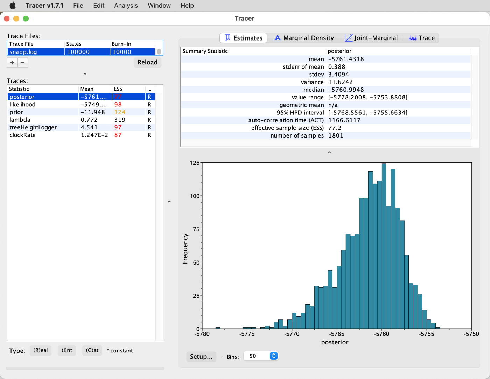
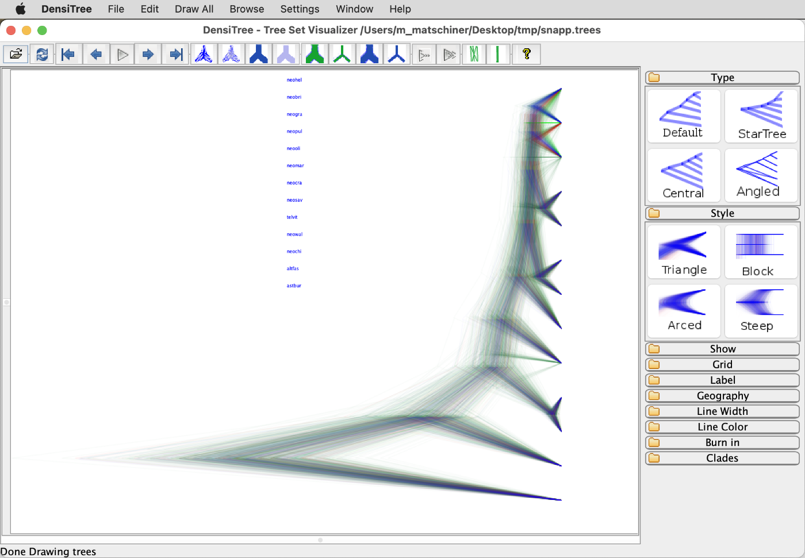

# Divergence-Time Estimation with SNP Data

A tutorial on Bayesian divergence-time estimation with SNP data

## Summary

Besides [SVDQuartets](https://www.asc.ohio-state.edu/kubatko.2/software/SVDquartets/) ([Chifman and Kubatko 2014](https://academic.oup.com/bioinformatics/article/30/23/3317/206559)), another method for phylogenetic inference with the multi-species-coalescent model based on SNP data is implemented in [SNAPP (SNP and AFLP Package for Phylogenetic analysis)](https://www.beast2.org/snapp/) ([Bryant et al. 2012](https://academic.oup.com/mbe/article/29/8/1917/1045283)), an add-on package for the program BEAST2. In principle, SNAPP is similar to the approach of StarBEAST2, only that each single SNP is considered as its own marker and gene trees are not separately inferred for each of these markers. Instead, SNAPP calculates the probability of the species tree without gene trees, by mathematically integrating over all possible gene trees. This approach reduces the parameter space of the model tremendously, which might be expected to reduce the time required for the analysis. Unfortunately, however, the mathematical integration over all possible gene trees is computationally very demanding and SNAPP analyses are therefore only feasible for a relatively small number of species.

Until recently, a limitation in the application of SNAPP has been that the branch lengths reported by SNAPP were in coalescent units rather than in units of time, and that these could not easily be converted into time due to ascertainment bias in the SNP data. However, in the study of [Stange et al. (2018)](https://academic.oup.com/sysbio/advance-article/doi/10.1093/sysbio/syy006/4827616), we tweaked the settings of SNAPP to include a strict-clock model that can be time calibrated based on the fossil record or on information from other phylogenies. In addition, we reduced the run time required for SNAPP analyses by linking all population sizes.

## Table of contents

* [Outline](#outline)
* [Dataset](#dataset)
* [Requirements](#requirements)
* [SNP filtering](#filtering)
* [Divergence-time estimation with SNAPP](#snapp)

## Outline

In this tutorial I am going to present how the BEAST2 add-on package SNAPP XXX and SNAPPER XXX can be used for divergence-time estimation with SNP data. The settings of this model can not be specified through the program BEAUti, but instead we will use the Ruby script [`snapp_prep.rb`](https://raw.githubusercontent.com/mmatschiner/snapp_prep/master/snapp_prep.rb) to generate input files for SNAPP. Differences between the species tree generated here based on SNP data and the species tree generated in tutorial [Bayesian Species-Tree Inference](../bayesian_species_tree_inference/README.md) will be discussed at the end of this tutorial.

## Dataset

The SNP data used in this tutorial is the filtered dataset used for species-tree inference with SVDQuartets in tutorial [Species-Tree Inference with SNP Data](../species_tree_inference_with_snp_data/README.md). You can find more information about the origin of this dataset in the Dataset section of this other tutorial. In brief, the dataset has been filtered to include only bi-allelic SNPs with a low proportion of missing data, for the 26 samples of 13 cichlid species listed in the table below. Only SNPs mapping to chromosome 5 of the tilapia genome assembly ([Conte et al. 2017](https://bmcgenomics.biomedcentral.com/articles/10.1186/s12864-017-3723-5)) are included in the dataset, and these have been thinned so that no pair of SNPs is closer to each other than 100 bp.

| Sample ID | Species ID | Species name                  | Tribe         |
|-----------|------------|-------------------------------|---------------|
| IZA1      | astbur     | *Astatotilapia burtoni*       | Haplochromini |
| IZC5      | astbur     | *Astatotilapia burtoni*       | Haplochromini |
| AUE7      | altfas     | *Altolamprologus fasciatus*   | Lamprologini  |
| AXD5      | altfas     | *Altolamprologus fasciatus*   | Lamprologini  |
| JBD5      | telvit     | *Telmatochromis vittatus*     | Lamprologini  |
| JBD6      | telvit     | *Telmatochromis vittatus*     | Lamprologini  |
| JUH9      | neobri     | *Neolamprologus brichardi*    | Lamprologini  |
| JUI1      | neobri     | *Neolamprologus brichardi*    | Lamprologini  |
| KHA7      | neochi     | *Neolamprologus chitamwebwai* | Lamprologini  |
| KHA9      | neochi     | *Neolamprologus chitamwebwai* | Lamprologini  |
| IVE8      | neocra     | *Neolamprologus crassus*      | Lamprologini  |
| IVF1      | neocra     | *Neolamprologus crassus*      | Lamprologini  |
| JWH1      | neogra     | *Neolamprologus gracilis*     | Lamprologini  |
| JWH2      | neogra     | *Neolamprologus gracilis*     | Lamprologini  |
| JWG8      | neohel     | *Neolamprologus helianthus*   | Lamprologini  |
| JWG9      | neohel     | *Neolamprologus helianthus*   | Lamprologini  |
| JWH3      | neomar     | *Neolamprologus marunguensis* | Lamprologini  |
| JWH4      | neomar     | *Neolamprologus marunguensis* | Lamprologini  |
| JWH5      | neooli     | *Neolamprologus olivaceous*   | Lamprologini  |
| JWH6      | neooli     | *Neolamprologus olivaceous*   | Lamprologini  |
| ISA6      | neopul     | *Neolamprologus pulcher*      | Lamprologini  |
| ISB3      | neopul     | *Neolamprologus pulcher*      | Lamprologini  |
| ISA8      | neosav     | *Neolamprologus savoryi*      | Lamprologini  |
| IYA4      | neosav     | *Neolamprologus savoryi*      | Lamprologini  |
| KFD2      | neowal     | *Neolamprologus walteri*      | Lamprologini  |
| KFD4      | neowal     | *Neolamprologus walteri*      | Lamprologini  |

## Requirements

* **BEAST2:** The [BEAST2](https://www.beast2.org) ([Bouckaert et al. 2019](https://doi.org/10.1371/journal.pcbi.1006650)) package contains a suite of programs for Bayesian phylogenetic inference. It includes BEAST2 itself which implements Markov-chain Monte-Carlo search of tree space and thus represents the heart of the Bayesian workflow; BEAUti, a utility facilitating the preparation of input files for BEAST2; TreeAnnotator, a tool to combine and annotate posterior tree distributions, and other programs. Command-line versions are available for all of these programs and included in the module for BEAST2 on Saga, except for BEAUti, as BEAUti is only useful through it's GUI. The use of BEAUti is required for analyses with the BEAST2 package StarBEAST2; thus, the BEAST2 package needs to be installed on your local computer in order to prepare the StarBEAST2 analysis, even though this analysis itself can then be performed on Saga. Versions of the BEAST2 package can be downloaded from the BEAST2 website [https://www.beast2.org](https://www.beast2.org), with and without bundling the Java Runtime Environment. I recommend to choose the versions with this environment as they may prevent incompatibilities between BEAST2 and other Java versions that may already be installed on your local computer.

* **SNAPP:** The SNAPP method implements a version of the multi-species coalescent model that mathematically integrates over all possible locus trees at biallelic loci, and is therefore particularly well suited for SNP data. SNAPP is an add-on package for BEAST2 and can be installed through the BEAST2 Package Manager. However, since BEAUti will not be used to prepare SNAPP input files, the SNAPP package does not need to be installed on local computers, but only on Saga. Use these commands to do so:

		module purge
		module load Beast/2.6.4-GCC-9.3.0
		packagemanager -add SNAPP

* **SNAPPER:** XXX:

		module purge
		module load Beast/2.6.4-GCC-9.3.0
		packagemanager -add snapper

* **Tracer:** The program [Tracer](http://beast.community/tracer) ([Rambaut et al. 2018](https://doi.org/10.1093/sysbio/syy032)) greatly facilitates the inspection of output from Bayesian analyses such as those done with BEAST2. It is a GUI program that therefore can not be used on Saga, but it is easy to install on your local computer. Input files for Tracer will thus need to be downloaded from Saga. Executables of Tracer for MacOS, Linux, and Window can be found on [https://github.com/beast-dev/tracer/releases](https://github.com/beast-dev/tracer/releases). Download the file [Tracer.v1.7.2.dmg](https://github.com/beast-dev/tracer/releases/download/v1.7.2/Tracer.v1.7.2.dmg) if your local computer is running MacOS, [Tracer_v1.7.2.tgz](https://github.com/beast-dev/tracer/releases/download/v1.7.2/Tracer_v1.7.2.tgz) if it is running Linux, and [Tracer_v1.7.2.tgz](https://github.com/beast-dev/tracer/releases/download/v1.7.2/Tracer_v1.7.2.tgz) if it is running Windows.

* **FigTree:** The program [FigTree](http://tree.bio.ed.ac.uk/software/figtree/) is a very intuitive and useful tool for the visualization and (to a limited extent) manipulation of phylogenies encoded in [Newick](http://evolution.genetics.washington.edu/phylip/newicktree.html) format. Being a GUI program, FigTree can not be run on Saga, but needs to be installed and used on your local computer. Input files for FigTree will thus need to be downloaded from Saga. Executables of FigTree for MacOS, Linux, and Windows are provided on [https://github.com/rambaut/figtree/releases](https://github.com/rambaut/figtree/releases). Download the file [FigTree.v1.4.4.dmg](https://github.com/rambaut/figtree/releases/download/v1.4.4/FigTree.v1.4.4.dmg) if your local computer is running MacOS, [FigTree_v1.4.4.tgz](https://github.com/rambaut/figtree/releases/download/v1.4.4/FigTree_v1.4.4.tgz) if it is running Linux, and [FigTree.v1.4.4.zip](https://github.com/rambaut/figtree/releases/download/v1.4.4/FigTree.v1.4.4.zip) if it is running Windows.

## SNP filtering

Based on simulations, we tested the performance of SNAPP with a range of datasets in [Stange et al. (2018)](https://academic.oup.com/sysbio/advance-article/doi/10.1093/sysbio/syy006/4827616). We found that the run time of SNAPP increases more or less linearly with the number of SNPs included in the dataset, but that the number of samples used per species has an even stronger influence on run time. However, we also found that accurate and strongly supported species can be obtained with dataset containing only around 1,000 SNPs for just a single sample per species. Thus, before preparing the input file for SNAPP, we will first reduce the dataset that was already filtered in tutorial [Species-Tree Inference with SNP Data](../species_tree_inference_with_snp_data/README.md). This further filtering will again be done with bcftools.

* Copy file [`NC_031969.f5.sub4.vcf`](data/NC_031969.f5.sub4.vcf) to your current analysis directory, either from the directory used for tutorial [Species-Tree Inference with SNP Data](../species_tree_inference_with_snp_data/README.md) or by downloading with `wget`:

		wget https://raw.githubusercontent.com/ForBioPhylogenomics/tutorials/main/divergence_time_estimation_with_snp_data/data/NC_031969.f5.sub4.vcf

* As mentioned above and in tutorial [Species-Tree Inference with SNP Data](../species_tree_inference_with_snp_data/README.md), the dataset in file `NC_031969.f5.sub4.vcf` contains SNP data for two samples per species. To reduce the run time for SNAPP, we are going to generate another version of the same dataset that is reduced to only a single sample per species. To exclude the samples "IZA1", "AXD5", "JBD5", "JUI1", "KHA9", "IVF1", "JWH1", "JWG8", "JWH3", "JWH5", "ISA6", "IYA4", and "KFD4" (these were selected because they have more missing data than the other samples of each species) from a new file named `NC_031969.f5.sub5.vcf`, use the following commands:

		module load BCFtools/1.10.2-GCC-9.3.0
		srun --ntasks=1 --mem-per-cpu=1G --time=00:01:00 --account=nn9458k --pty bcftools view -s ^IZA1,AXD5,JBD5,JUI1,KHA9,IVF1,JWH1,JWG8,JWH3,JWH5,ISA6,IYA4,KFD4 -o NC_031969.f5.sub5.vcf NC_031969.f5.sub4.vcf
		
* The reduction of samples in the previous step might have led to some sites becoming monomorphic for either the reference or the alternate allele. Some sites might also have no data left for one or more of the species, given that these are now represented by only one instead of two samples. To exclude these sites again with bcftools, use the following command:

		srun --ntasks=1 --mem-per-cpu=1G --time=00:01:00 --account=nn9458k --pty bcftools view -e 'AC==0 || AC==AN || F_MISSING > 0.0' -o NC_031969.f5.sub6.vcf NC_031969.f5.sub5.vcf
	
	 **Question 1:** How many SNPs are now left in file `NC_031969.f5.sub6.vcf`? [(see answer)](#q1)

## Divergence-time estimation with SNAPP

In this part of the tutorial, we are going to prepare the XML input file for SNAPP with the Ruby script `snapp_prep.rb` so that the model settings of [Stange et al. (2018)](https://academic.oup.com/sysbio/advance-article/doi/10.1093/sysbio/syy006/4827616) are used for divergence-time estimation with SNAPP. In this model, the population sizes of all species are linked and the substitution rate (which is assumed to be according to a strict clock) can be calibrated with age constraints on one or more divergence events.

* First, download the script [`snapp_prep.rb`](https://raw.githubusercontent.com/mmatschiner/snapp_prep/master/snapp_prep.rb) from github, either by clicking on the link or by using the following command:

		wget https://raw.githubusercontent.com/mmatschiner/snapp_prep/master/snapp_prep.rb
		
* Then, to see the options available for generating SNAPP input files with `snapp_prep.rb`, have a look at the help text of the script by using the following commands:

		module load Ruby/2.7.2-GCCcore-9.3.0
		ruby snapp_prep.rb -h
		
	You'll see that `snapp_prep.rb` accepts input either in Phylip (with option `-p`) or VCF (option `-v`) format. In addition, the script requires a table file (option `-t`) in which samples are assigned to species, and a constraint file (option `-c`) in which age constraints for selected divergence events are specified. None of the other options are required, but these can be useful if you need to specify a starting tree (option `-t`) because SNAPP fails to find a suitable starting tree itself, if you want to increase or decrease the default length (500,000 iterations) of the MCMC chain (option `-l`), or if you want to limit the dataset to a certain number of SNPs to reduce the run time (option `-m`). XXX Mention SNAPPER XXX
	
* Examples for the table and constraint files can be found on the [github repository for `snapp_prep.rb`](https://github.com/mmatschiner/snapp_prep). Have a look at these example files; the example table file is named [`example.spc.txt`](https://github.com/mmatschiner/snapp_prep/blob/master/example.spc.txt) and the example constraint file is named [`example.con.txt`](https://github.com/mmatschiner/snapp_prep/blob/master/example.con.txt).

* To prepare the table file assigning samples to species, write the following text to a new file named `samples.txt`:

		species	sample
		astbur	IZC5
		altfas	AUE7
		telvit	JBD6
		neobri	JUH9
		neochi	KHA7
		neocra	IVE8
		neogra	JWH2
		neohel	JWG9
		neomar	JWH4
		neooli	JWH6
		neopul	ISB3
		neosav	ISA8
		neowal	KFD2

* For the constraint file, we'll need to specify at least one age constraint for a divergence among the 13 cichlid species. For this, we can refer to the results of the analysis with the multi-species coalescent model in tutorial [Bayesian Species-Tree Inference](../bayesian_species_tree_inference/README.md). In that tutorial, the divergence of *Astatotilapia burtoni* ("astbur") and the *Neolamprologus* species was estimated at 6.2666 Ma with a 95% HPD interval from 4.8225 to 7.9049 Ma (if you'ld like to look up these results you can find them in file [`starbeast_species.tre`](data/starbeast_species.tre)). We can approximate this mean and confidence interval with a lognormal distribution centered at 6.2666 Ma that has a standard deviation (in real space) of 0.13. In addition, we could also constrain the first divergence among the species *Neolamprologus brichardi* ("neobri"), *Neolamprologus gracilis* ("neogra"), *Neolamprologus marunguensis* ("neomar"), and *Neolamprologus olivaceus* ("neooli") according to the results of this earlier analysis; however, it is likely that this divergence event would be more precisely estimated with the current SNP dataset. Thus, we are only going to constrain the age of a single node: the divergence of *Astatotilapia burtoni* ("astbur") from the species of the tribe Lamprologini.

	To write this single age constraint to a constraint file, write the following text to a new file named `constraints.txt`:

		lognormal(0,6.2666,0.13)	crown	astbur,altfas,telvit,neobri,neochi,neocra,neogra,neohel,neomar,neooli,neopul,neosav,neowal
		
	Note that the above line contains three character strings that are delimited with tab symbols. XXX Check if this is necessary XXX The first of the three character strings specifies that a lognormal distribution with an offset of 0, a mean of 6.2666, and a standard deviation (in real space) of 0.13 should be used for the constraint. The second character string ("crown") specifies that the crown divergence of the clade should be constrained rather than the stem divergence (this would be the time at which the clade diverged from its sister group). Finally, the third character string simply lists all species included in the constrained clade, separated by commas. Because the constraint used here applies to the very first divergence of the phylogeny (the root), all species names are listed in the third character string. **Question 2:** Can you think of a way how the exact same age calibration could be specified differently? [(see answer)](#q2)

* With the VCF file [`NC_031969.f5.sub6.vcf`](res/NC_031969.f5.sub6.vcf), the table file, and the constraints file ready, we can now prepare the input file for SNAPP with the script `snapp_prep.rb`. To limit the dataset to 1,000 randomly selected SNPs and to set a chain length of 100,000 MCMC iterations, we'll use the options `-m 1000` and `-l 100000`, respectively. Thus, use the following command to generate the XML input file for SNAPP:

		srun --ntasks=1 --mem-per-cpu=1G --time=00:01:00 --account=nn9458k --pty ruby snapp_prep.rb -v NC_031969.f5.sub6.vcf -t samples.txt -c constraints.txt -m 1000 -l 100000
		
	You may notice that the chain length of 100,000 MCMC iterations is extremely short compared to those used in the BEAST2 analyses of other tutorials. Using much shorter chain lengths with SNAPP than BEAST2 is quite common, given that the SNAPP model has far fewer model parameters than most models used in other BEAST2 analyses, and that each individual iteration is much slower with SNAPP due to the high computational demand of the integration over all possible gene trees at each SNP.
		
* The script `snapp_prep.rb` should have written a file named `snapp.xml`. You could open that, for example with `less -S snapp.xml` and read some of the annotations if you'ld like to know more about the settings that we are about to use with SNAPP.
		
To "run SNAPP", we actually run BEAST2, either using the GUI on a local computer, or the command-line version on either a local computer or Saga (the latter is recommended). In all cases, the analysis can be sped up by using multiple CPUs, as SNAPP analyses are highly parallelizable. Thus, with e.g. four CPUs available that are all used for the SNAPP analysis, this analysis should take only about a fourth of the time that would be required with a single CPU. When running SNAPP analyses on a server such as Saga, one could even use tens of CPUs simultaneously, which would shorten SNAPP's run times tremendously. To start the analysis for example on four CPUs with the GUI version of BEAST2, you would select "4" from the drop-down menu next to "Thread pool size" as shown in the next screenshot (but this is not needed now; read on).

However, it may be more convenient to use the command-line version of BEAST2 that is installed on Saga. Running the analysis on Saga will also allow us to use eight CPUs to speed up the analysis.

* Write a Slurm script named `run_snapp.slurm` with the following content to prepare the SNAPP analysis:

		#!/bin/bash

		# Job name:
		#SBATCH --job-name=snapp
		#
		# Wall clock limit:
		#SBATCH --time=2:00:00
		#
		# Processor and memory usage:
		#SBATCH --ntasks=8
		#SBATCH --mem-per-cpu=1G
		#
		# Accounting:
		#SBATCH --account=nn9458k
		#
		# Output:
		#SBATCH --output=run_snapp.out
		
		# Set up job environment.
		set -o errexit  # Exit the script on any error
		set -o nounset  # Treat any unset variables as an error
		module --quiet purge  # Reset the modules to the system default
		
		# Load the beast2 module.
		module load Beast/2.6.4-GCC-9.3.0

		# Run snapp.
		beast -threads 8 snapp.xml

* Submit the Slurm script with `sbatch`:

		sbatch run_snapp.slurm
	
* Monitor the file `run_snapp.out` by repeatedly opening it over the course of a few minutes (using, e.g. `less run_snapp.out` or `tail -n 1 run_snapp.out`). **Question 3:** How long is SNAPP going to run to reach the MCMC length of 100,000 iterations that we specified when setting up the XML with `snapp_prep.rb`?

XXX Describe setting up the analysis with SNAPPER while waiting for the results of SNAPP XXX
	
* Once the SNAPP analysis has completed or if you decided to use the results of my analysis instead of generating your own, open file `snapp.log` in Tracer. The Tracer window should then display run statistics similar (or identical if you used the results of my analysis) to those shown in the next screenshot.

You'll see that some low ESS values indicate that the MCMC chain has not yet reached stationarity and that the analysis should ideally have been performed with more MCMC iterations. For our interpretation here, however, we'll assume that the degree of stationarity is sufficient. What you also should notice is that the list of parameters on the left-hand side of the window is now much shorter than it usually is with results of BEAST2 analyses. In fact, only three parameters are shown: The speciation rate ("lambda"), the age of the root of the species tree ("treeHeightLogger"), and the substitution rate ("clockRate"). Note that the substitution rate is not comparable to a genome-wide rate due to ascertainment bias in the SNP dataset, even though SNAPP by default applies an ascertainment-bias correction (see [Bryant et al. 2012](https://academic.oup.com/mbe/article/29/8/1917/1045283) for details). However, one model parameter is not included in the log output yet, namely the population size. Recall that by using script `snapp_prep.rb` to generate the XML file, we implemented a model in which the population sizes of all branches are set to be identical to each other. Thus, if the population sizes had been included in the log file, this file would contain a large number of columns with identical information. To avoid this, the output of the population sizes to the log file has been disabled by `snapp_prep.rb`. However, the population size estimates are still available because they were instead written to the tree file `snapp.trees`, and we can now add them to the log file `snapp.log` using the Ruby script `add_theta_to_log.rb`. Thus, download the script [`add_theta_to_log.rb`](https://raw.githubusercontent.com/mmatschiner/snapp_prep/master/add_theta_to_log.rb) from the github repository for `snapp_prep.rb`, either by clicking the link or with the following command:

		wget https://raw.githubusercontent.com/mmatschiner/snapp_prep/master/add_theta_to_log.rb
		
* Have a look at the available options for `add_theta_to_log.rb`:

		ruby add_theta_to_log.rb -h
		
	You'll see that this script requires four command-line arguments: The names of the log and tree input files, the name of an output file, as well as an estimate for the generation time. The latter is required to calculate an estimate of the effective population size, for which `add_theta_to_log.rb` uses the equation <i>N</i>e = Theta &div; (4 &times; <i>r</i> &div; <i>n</i>g), where <i>r</i> is the substitution-rate estimate (= the rate of the strict clock) and <i>n</i>g is the number of generations per time unit (more details are given in [Stange et al. 2018](https://academic.oup.com/sysbio/advance-article/doi/10.1093/sysbio/syy006/4827616)).
	
* We'll here assume (as in other tutorials) that the generation time of cichlids is three years, and we'll name the output file `snapp_w_popsize.log`. Thus use the following command to run script `add_theta_to_log.rb`:

		ruby add_theta_to_log.rb -l snapp.log -t snapp.trees -g 3 -o snapp_w_popsize.log

* Then, open file `snapp_w_popsize.log` again in Tracer. You should see that "theta" and "population_size" have now been added to the list of parameters, as shown in the next screenshot.

* Select both "clockRate" and "theta" from the list of parameters and click the tab for "Joint-Marginal" at the top right. You should then see that both of these parameters are highly correlated, as shown in the next screenshot.

Note that both of these estimates should not be taken as being representative for the whole genome due to ascertainment bias. Because invariant sites are not included in a SNP dataset, this SNP dataset necessarily appears more variable than the whole-genome dataset from which it was derived, and thus the substitution rate of the SNP data appears to be higher than the rate would be if it was averaged over the entire genome. Nevertheless, our simulations in [Stange et al. (2018)](https://academic.oup.com/sysbio/advance-article/doi/10.1093/sysbio/syy006/4827616) have shown that the population-size estimates of SNAPP are actually reliable.

* Select "population_size" from the list of parameters and click on the "Estimates" tab to see summary information and a histogram for the population-size estimate, as shown in the next screenshot.

	
	**Question 4 (if you already did tutorial Bayesian Species-Tree Inference):** How does this estimate of the population size of Lake Tanganyika cichlid fishes compare to that assumed in tutorial [Bayesian Species-Tree Inference](../bayesian_species_tree_inference/README.md)? [(see answer)](#q3)

* Next, open the file `snapp.trees` in the software Densitree from the BEAST2 package to visualize the full set of posterior trees sampled by SNAPP, as shown in the next screenshot.

 You should see that not all posterior trees share the same topology, indicating remaining uncertainty in the relationships of the 13 cichlid species. In particular, the relationships of *Telmatochromis vittatus* ("telvit") appear ambiguous, as this species is placed next to *Neolamprologus walteri* ("neowal") and *Neolamprologus chitamwebwai* ("neochi") in some of the posterior trees, but apparently closer to the remaining *Neolamprologus* species or ancestral to all of them in the other posterior trees. The relationships among the five species *Neolamprologus brichardi* ("neobri"), *Neolamprologus olivaceous* ("neooli"), *Neolamprologus pulcher* ("neopul"), *Neolamprologus helianthus* ("neohel"), and *Neolamprologus gracilis* ("neogra") also appear uncertain.

* Also quantify the posterior probabilities of clades as node support in a maximum-clade-credibility tree using TreeAnnotator. To do so, open `snapp.trees` in TreeAnnotator, set the burnin percentage to 10, choose "Mean heights" from the drop-down menu next to "Node heights", select "snapp.trees" as the input file, and name the output file "snapp.tre", as shown in the next screenshot. Then, click "Run".

* Finally, open file [`snapp.tre`](res/snapp.tre) in FigTree and display the "posterior" node support values as node labels, as shown in the screenshot below.

 The posterior probabilities for the different clades support the interpretation based on the Densitree plot made above: The position of *Telmatochromis vittatus* ("telvit") is uncertain, as are the relationships among the five species *Neolamprologus brichardi* ("neobri"), *Neolamprologus olivaceous* ("neooli"), *Neolamprologus pulcher* ("neopul"), *Neolamprologus helianthus* ("neohel"), and *Neolamprologus gracilis* ("neogra"). However, the visualization in FigTree also shows that a clade comprising the three species *Neolamprologus brichardi* ("neobri"), *Neolamprologus olivaceous* ("neooli"), and *Neolamprologus pulcher* ("neopul") is actually well supported; this has not been apparent in DensiTree.
	
	**Question 5 (if you already did tutorial Species-Tree Inference with SNP Data):** Is the species-tree topology estimated with SNAPP concordant with that estimated with SVDQuartets in tutorial [Species-Tree Inference with SNP Data](../species_tree_inference_with_snp_data/README.md)? [(see answer)](#q4)
	
	**Question 6 (if you already did tutorial Bayesian Species-Tree Inference):** How does the divergence-time estimate for *Neolamprologus marunguensis* ("neomar"), *Neolamprologus gracilis* ("neogra"), *Neolamprologus brichardi* ("neobri"), and *Neolamprologus olivaceous* ("neooli") compare to that obtained with StarBEAST2 in tutorial [Bayesian Species-Tree Inference](bayesian_species_tree_inference/README.md)? [(see answer)](#q5)

Despite the remaining uncertainty in the relationships among the *Neolamprologus* species, the SNAPP analysis has allowed us to estimate an average population size for species of the tribe Lamprologini, and it has improved the estimates of divergence times within the group.

 

                   

## Answers

* **Question 1:** The reduction from two samples to one sample per species led to a large decrease in the number of bi-allelic SNPs. Only 18,195 SNPs should now remain in the filtered dataset of file `NC_031969.f5.sub6.vcf`, which nevertheless is more than sufficient for a phylogenetic analysis with SNAPP. To see the number of SNPs in this VCF file, you can use the the following command:

		srun --ntasks=1 --mem-per-cpu=1G --time=00:01:00 --account=nn9458k --pty bcftools view -H NC_031969.f5.sub6.vcf | wc -l
		
		

* **Question 2:** Because the crown divergence of a clade is identical to the stem divergences of the two descending clades, we could also specify the same age constraint with the following line:

		lognormal(0,6.2666,0.13)  stem altfas,telvit,neobri,neochi,neocra,neogra,neohel,neomar,neooli,neopul,neosav,neowal
		
	Note that "stem" is now specified as the second character string instead of "crown" and that "astbur" is now missing from the list of species in the third character string.

* **Question 3:** You should be able to estimate the time required for the analysis by comparing the first column of the output in file `run_snapp.out`, which reports the current MCMC iteration, with the time that the analysis has already been running. After about 3 minutes, the MCMC should have reached around iteration 5,000, which means that about an hour will be required to complete the 100,000 iterations that we specified as the length of the MCMC. After about 6,000 iterations, the last column of the output in file `run_snapp.out` should also give an estimate of the run time required for 1 million generations. Dividing this by ten should also result in a projected run time of around 1 hour.

* **Question 4:** Recall that in tutorial [Bayesian Species-Tree Inference](../bayesian_species_tree_inference/README.md), the population-size parameter was fixed in the analysis with the multi-species coalescent model according to an estimate published by [Meyer et al. (2017)](https://academic.oup.com/sysbio/article/66/4/531/2670093). In this study, [Meyer et al. (2017)](https://academic.oup.com/sysbio/article/66/4/531/2670093) reported that "effective population sizes (<i>N</i>e) estimated with the multispecies coalescent model ranged between 3.6 &times; 104 and 8.1 &times; 105, assuming a mean generation times of 3 years for cichlid fishes". Most of these population-size estimates in [Meyer et al. (2017)](https://academic.oup.com/sysbio/article/66/4/531/2670093) were around 3.3 &times; 105, therefore this value was used in tutorial [Bayesian Species-Tree Inference](../bayesian_species_tree_inference/README.md). In comparison to this population size assumed in the other tutorial, the current population-size estimate based on the SNAPP analysis, with a mean of 9.3 &times; 104 and a 95% HPD interval ranging from 6.5 &times; 104 to 1.2 &times; 105, is much smaller.

* **Question 5:** The species trees estimated with SNAPP and SVDQuartets are not fully concordant. If you'ld like to look up the result of the SVDQuartets analysis, open file [`NC_031969.f5.sub4.parts.tre`](data/NC_031969.f5.sub4.parts.tre) in FigTree, and display "label" (these are the bootstrap support values) as node labels. In contrast to SNAPP, SVDQuartets had strongly supported a position of *Telmatochromis vittatus* ("telvit") outside of a monophyletic clade comprising all representatives of the genus *Neolamprologus*. In addition, SVDQuartets had placed *Neolamprologus helianthus* ("neohel") as the sister of species trio *Neolamprologus brichardi* ("neobri"), *Neolamprologus olivaceous* ("neooli"), and *Neolamprologus pulcher* ("neopul") with similarly strong support, whereas *Neolamprologus helianthus* ("neohel") appeared as the sister of *Neolamprologus gracilis* ("neogra") in the SNAPP analysis. Given that in both cases of conflict between the two analyses, the SVDQuartets analyses had inferred strong support based on bootstrapping whereas SNAPP only assigned moderate posterior probabilities, it is likely that the relationships estimated by SVDQuartets are the correct ones. The lower support values in the SNAPP analysis are not surprising, though, given that only a small fraction of the data used with SVDQuartets (over 63,000 SNPs) has been used in the analysis with SNAPP (1,000 SNPs). It may be expected that using a larger number of SNPs with SNAPP would increase the reliability of the resulting species tree.

* **Question 6:** Recall that the divergence time of the four species *Neolamprologus marunguensis* ("neomar"), *Neolamprologus gracilis* ("neogra"), *Neolamprologus brichardi* ("neobri"), and *Neolamprologus olivaceous* ("neooli") was estimated around 0.93 Ma in the analysis with StarBEAST2 in tutorial [Bayesian Species-Tree Inference](bayesian_species_tree_inference/README.md). To look up these results, you could open file [`starbeast_species.tre`](data/starbeast_species.tre) in FigTree and display "Node ages" as node labels. In contrast, the first divergence of the clade comprising these four species was estimated with SNAPP at a more recent time, around 0.60 Ma, as shown in the screenshot below. Moreover, the 95% HPD interval for this age estimate ranges from 0.41 to 0.78 Ma (select "height\_95%\_HPD" instead of "Node ages" from the drop-down menu to see these) and therefore does not even include the older age estimate of the StarBEAST2 analysis. In contrast the 95% HPD interval for this divergence time in the StarBEAST2 analysis was wider and ranged from 0.42 to 1.44 Ma, which thus includes almost the entire 95% HPD interval of the SNAPP analysis. This indicates that the two analyses do not disagree with each other regarding this divergence time but only that the StarBEAST2 analysis was not able to estimate it as precisely as the SNAPP analysis.

