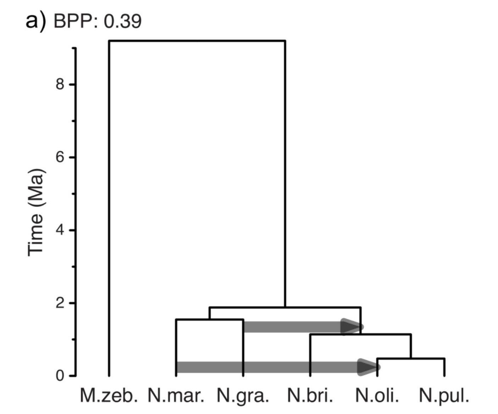
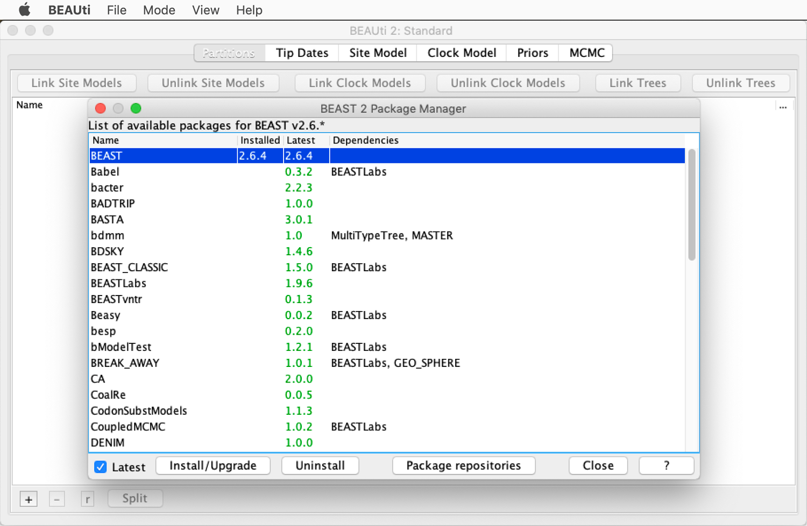
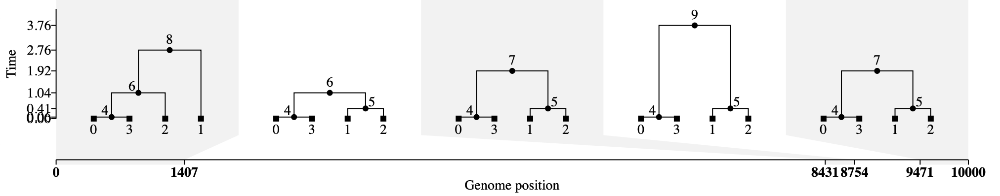
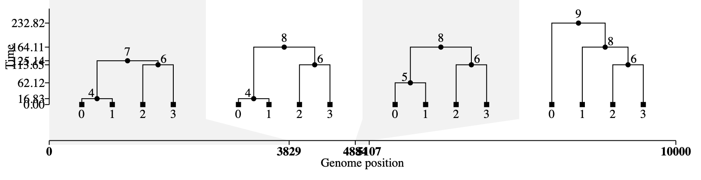
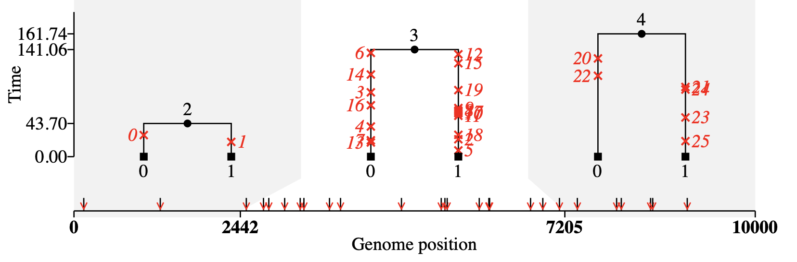
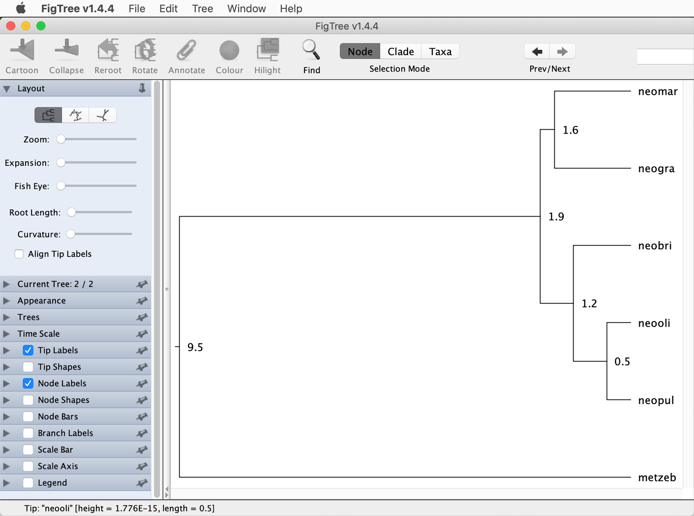
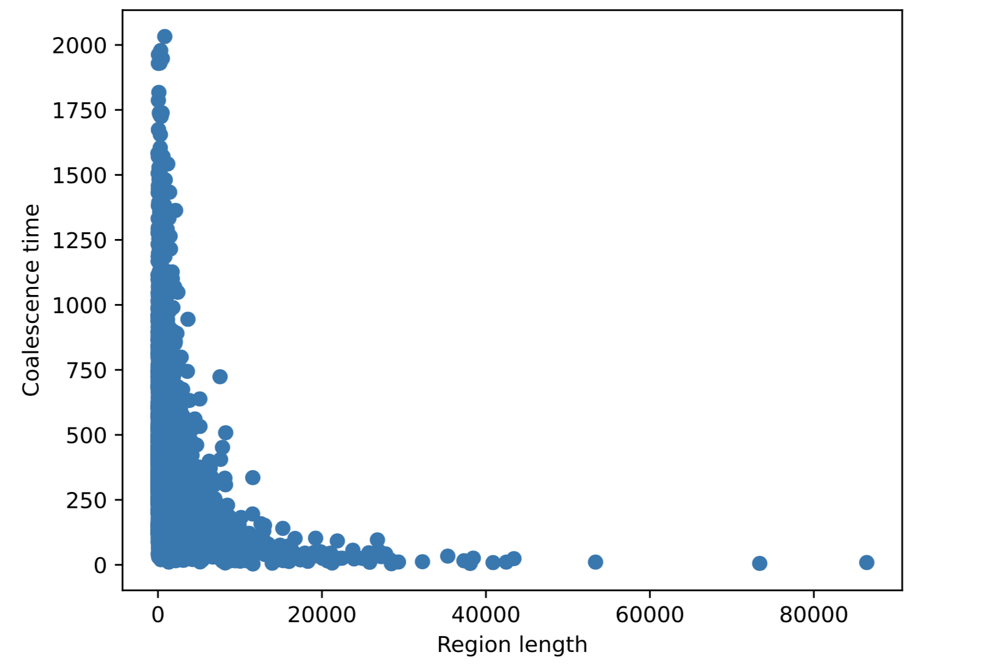

# Inference from simulated data

A tutorial on coalescent simulations of genomic data and inferences from simulated data

## Summary

All methods used for phylogenomic inference have assumptions, and these are often violated in one way or another by empirical data. Thus, even when methods have been shown to perform well when the assumptions are met, it may be questionable how reliable the results are when these assumptions are not met. Fortunately, the effects of model violations can be assessed by comparing results infered from data that has been simulated with and with these violations.

## Table of contents

* [Outline](#outline)
* [Dataset](#dataset)
* [Requirements](#requirements)
* [Coalescent simulations with Msprime](#msprime)
* [Realistic simulations of genomic data](#real_simulations)
* [Inference from simulated data](#inference)

## Outline

In this tutorial I am going to demonstrate how coalescent simulations of genomic data can be used to test the reliability of inference methods when their assumptions are violated. The genomic data will be simulated using the Python library [msprime](https://tskit.dev/msprime/docs/stable/intro.html), and the simulated data will be used for inference of the species tree with methods covered in the tutorials [Maximum-Likelihood Species-Tree Inference](ml_species_tree_inference/README.md), [Bayesian Species-Tree Inference](bayesian_species_tree_inference/README.md), [Species-Tree Inference with SNP Data](species_tree_inference_with_snp_data/README.md), [Divergence-Time Estimation with SNP Data](divergence_time_estimation_with_snp_data/README.md), and [Bayesian Inference of Species Networks](bayesian_analysis_of_species_networks/README.md), as well as inference of introgression signals with methods covered in tutorial [Analysis of Introgression with SNP Data](analysis_of_introgression_with_snp_data/README.md).

## Dataset

The datasets used in this tutorial will be simulated with the Python library [msprime](https://tskit.dev/msprime/docs/stable/intro.html). The simulated datasets will mimick the diversification of the five species of the cichlid genus *Neolamprologus* that were first analyzed with phylogenomic methods by [Gante et al. (2016)](https://doi.org/10.1111/mec.13767), and for which [Bouckaert et al. (2019)](https://doi.org/10.1371/journal.pcbi.1006650) co-estimated the species tree and introgression with the isolation-with-migration model:
*Neolamprologus brichardi* ("neobri"), *Neolamprologus gracilis* ("neogra"), *Neolamprologus marunguensis* ("neomar"), *Neolamprologus olivaceous* ("neooli"), and *Neolamprologus pulcher* ("neopul"). An outgroup will be added in the simulations and placed according to the position of *Metriaclima zebra* ("metzeb") in the species tree inferred by [Bouckaert et al. (2019)](https://doi.org/10.1371/journal.pcbi.1006650). We will assume that the scenario of diversification and introgression that received the strongest support in the analyses of [Bouckaert et al. (2019)](https://doi.org/10.1371/journal.pcbi.1006650) reflects the true evolutionary history of the five species, and we will simulate genomic data according to this scenario while modifying introgression and demographic parameters. Thus, genomic data will be separately simulated without any introgression, with introgression between *N. marunguensis* ("neomar") and *N. olivaceous* ("neooli"), and with additional introgression between *N. gracilis* ("neogra") and the common ancestor of *Neolamprologus brichardi* ("neobri"), *N. olivaceous* ("neooli"), and *N. pulcher* ("neopul"), as shown in Figure 5a of [Bouckaert et al. (2019)](https://doi.org/10.1371/journal.pcbi.1006650):

To also test the effect of population-size variation on the inference methods, a strong bottleneck will be simulated for the common ancestor of *Neolamprologus brichardi* ("neobri"), *N. olivaceous* ("neooli"), and *N. pulcher* ("neopul").

## Requirements

* **Msprime:** The Python library [msprime](https://tskit.dev/msprime/docs/stable/intro.html) ([Kelleher et al. 2016](http://journals.plos.org/ploscompbiol/article?id=10.1371/journal.pcbi.1004842)) will be required for all simulations. The library can be installed with pip for Python 3, using the following commands:

		module purge
		module load Python/3.8.2-GCCcore-9.3.0
		pip install --user msprime
		
	The installation can be tested with this command:
	
		python3 -c 'import msprime'
		
	If this does not produce an error message, the installation has worked.

To infer the species tree and introgression signals from the simulated data, any combination of the methods covered in tutorials [Maximum-Likelihood Species-Tree Inference](ml_species_tree_inference/README.md), [Bayesian Species-Tree Inference](bayesian_species_tree_inference/README.md), [Species-Tree Inference with SNP Data](species_tree_inference_with_snp_data/README.md), [Divergence-Time Estimation with SNP Data](divergence_time_estimation_with_snp_data/README.md), [Bayesian Inference of Species Networks](bayesian_analysis_of_species_networks/README.md), and [Analysis of Introgression with SNP Data](analysis_of_introgression_with_snp_data/README.md) can be used. Thus, the programs listed below are only required if they are chosen for the inference part of the tutorial.

* **ASTRAL:** The program [ASTRAL](https://github.com/smirarab/ASTRAL) ([Zhang et al. 2017](https://link.springer.com/chapter/10.1007%2F978-3-319-67979-2_4)) allows efficient and accurate estimation of the species tree based on a set of gene trees. ASTRAL is not available as a module on Saga, but it can easily be installed simply by placing it in the analysis directory. This can be done with the following commands:

		wget https://github.com/smirarab/ASTRAL/raw/master/Astral.5.7.7.zip
		unzip Astral.5.7.7.zip
		rm Astral.5.7.7.zip
		
	To run ASTRAL, Java is required, and can be loaded with this command:
	
		module purge
		module load Java/11.0.2
		
	The installation can be tested with this command, which should output the help text of ASTRAL:
	
			java -jar Astral/astral.5.7.7.jar

<!--
* **PAUP\*:** The software [PAUP\*](http://paup.phylosolutions.com) is a general-utility program for phylogenetic inference into which the SVDQuartets method, allowing the inference of species trees from SNP data, has been implemented. PAUP\* is available as a Graphical User Interface (GUI) version, which may be easier to use for those not familiar with the program yet, but can not be used on Saga. If you prefer to use the GUI version of PAUP\*, you would thus need to install it on your local computer, and you would need download the input file for PAUP\* from Saga. Unfortunately, this GUI version does not run on MacOS 10.15 (Catalina) or newer, but on other systems, the program can be installed using the instructions and precompiled versions available on [http://phylosolutions.com/paup-test/](http://phylosolutions.com/paup-test/). To alternatively run the command-line version of PAUP\* on Saga, it first needs to be installed in the analysis directory because it is not yet available as a module. This can be done with the following commands:

		wget http://phylosolutions.com/paup-test/paup4a168_centos64.gz
		gunzip paup4a168_centos64.gz
		chmod +x paup4a168_centos64
		mv paup4a168_centos64 paup
		
	The installation can be tested with this command, which should open the program interactively:
	
		./paup
		
	To quit the program, type `quit` and hit enter.
-->

* **BEAST2:** The [BEAST2](https://www.beast2.org) ([Bouckaert et al. 2019](https://doi.org/10.1371/journal.pcbi.1006650)) package contains a suite of programs for Bayesian phylogenetic inference. It includes BEAST2 itself which implements Markov-chain Monte-Carlo search of tree space and thus represents the heart of the Bayesian workflow; BEAUti, a utility facilitating the preparation of input files for BEAST2; TreeAnnotator, a tool to combine and annotate posterior tree distributions, and other programs. Command-line versions are available for all of these programs and included in the module for BEAST2 on Saga, except for BEAUti, as BEAUti is only useful through it's GUI. The use of BEAUti is required for analyses with the BEAST2 package StarBEAST2; thus, the BEAST2 package needs to be installed on your local computer in order to prepare the StarBEAST2 analysis, even though this analysis itself can then be performed on Saga. Versions of the BEAST2 package can be downloaded from the BEAST2 website [https://www.beast2.org](https://www.beast2.org), with and without bundling the Java Runtime Environment. I recommend to choose the versions with this environment as they may prevent incompatibilities between BEAST2 and other Java versions that may already be installed on your local computer.

* **StarBEAST2:** StarBEAST2 is an add-on package for BEAST2 that enables inference with the multi-species coalescent model, and can be installed using the BEAST2 Package Manager. The installation of the StarBEAST2 package influences the BEAUti GUI and both the command-line and GUI interfaces for BEAST2. As we will be using the BEAUti GUI on the local computer but running BEAST2 on Saga, the StarBEAST2 package will need to be installed both locally and on Saga.

	Locally, the BEAST2 Package Manager can be called through the BEAUti GUI by clicking on "Manage Packages" in the "File" menu. This should open a new window as shown in this screenshot:

To install StarBEAST2, scroll down in the list of available packages until you find the package, select it, and click "Install/Upgrade". A message will appear that can be closed by clicking on "OK". Then close and reopen the BEAUti window for the changes to the interface to take effect.

	On Saga, the StarBEAST2 package needs to be installed through the command-line version of the BEAST2 Package Manager. Use the following commands to do so:
	
		module purge
		module load Beast/2.6.4-GCC-9.3.0
		packagemanager -add StarBEAST2

* **SpeciesNetwork:** SpeciesNetwork is an add-on package for BEAST2 that combines the multi-species coalescent model with a model of reticulation, where reticulation events can be seen as instances of hybrid speciation. Like StarBEAST2, the SpeciesNetwork package can be installed using the BEAST2 Package Manager, and this should be done both locally and on Saga, since SpeciesNetwork also influences both the appearance of the BEAUti GUI and BEAST2. To install this package locally, open the BEAST2 Package Manager through the BEAUti GUI as described for StarBEAST2, select the SpeciesNetwork package, and click "Install/Upgrade", followed by "OK". For the installation on Saga, use the following commands:

		module purge
		module load Beast/2.6.4-GCC-9.3.0
		packagemanager -add SpeciesNetwork

* **SNAPP:** The SNAPP method implements a version of the multi-species coalescent model that mathematically integrates over all possible locus trees at biallelic loci, and is therefore particularly well suited for SNP data. Like StarBEAST2 and SpeciesNetwork, SNAPP is an add-on package for BEAST2 and can be installed through the BEAST2 Package Manager. However, since BEAUti will not be used to prepare SNAPP input files, the SNAPP package does not need to be installed on local computers, but only on Saga. Use these commands to do so:

		module purge
		module load Beast/2.6.4-GCC-9.3.0
		packagemanager -add SNAPP

* **Tracer:** The program [Tracer](http://beast.community/tracer) ([Rambaut et al. 2018](https://doi.org/10.1093/sysbio/syy032)) greatly facilitates the inspection of output from Bayesian analyses such as those done with BEAST2. It is a GUI program that therefore can not be used on Saga, but it is easy to install on your local computer. Input files for Tracer will thus need to be downloaded from Saga. Executables of Tracer for MacOS, Linux, and Window can be found on [https://github.com/beast-dev/tracer/releases](https://github.com/beast-dev/tracer/releases). Download the file [Tracer.v1.7.2.dmg](https://github.com/beast-dev/tracer/releases/download/v1.7.2/Tracer.v1.7.2.dmg) if your local computer is running MacOS, [Tracer_v1.7.2.tgz](https://github.com/beast-dev/tracer/releases/download/v1.7.2/Tracer_v1.7.2.tgz) if it is running Linux, and [Tracer_v1.7.2.tgz](https://github.com/beast-dev/tracer/releases/download/v1.7.2/Tracer_v1.7.2.tgz) if it is running Windows.

* **FigTree:** The program [FigTree](http://tree.bio.ed.ac.uk/software/figtree/) is a very intuitive and useful tool for the visualization and (to a limited extent) manipulation of phylogenies encoded in [Newick](http://evolution.genetics.washington.edu/phylip/newicktree.html) format. Being a GUI program, FigTree can not be run on Saga, but needs to be installed and used on your local computer. Input files for FigTree will thus need to be downloaded from Saga. Executables of FigTree for MacOS, Linux, and Windows are provided on [https://github.com/rambaut/figtree/releases](https://github.com/rambaut/figtree/releases). Download the file [FigTree.v1.4.4.dmg](https://github.com/rambaut/figtree/releases/download/v1.4.4/FigTree.v1.4.4.dmg) if your local computer is running MacOS, [FigTree_v1.4.4.tgz](https://github.com/rambaut/figtree/releases/download/v1.4.4/FigTree_v1.4.4.tgz) if it is running Linux, and [FigTree.v1.4.4.zip](https://github.com/rambaut/figtree/releases/download/v1.4.4/FigTree.v1.4.4.zip) if it is running Windows.

<!--
* **Dsuite:** The [Dsuite](https://github.com/millanek/Dsuite) ([Malinsky et al. 2021](https://doi.org/10.1111/1755-0998.13265)) program allows the fast calculation of the *D*-statistic from SNP data in VCF format. The program is particularly useful because it automatically calculates the *D*-statistic for all possible species trios, optionally also in a way that the trios are compatible with a user-provided species tree. Dsuite is not currently available as a module on Saga, but it can be downloaded and compiled in the analysis directory with the following commands:

		module purge
		module load GCCcore/10.2.0
		git clone https://github.com/millanek/Dsuite
		cd Dsuite
		make
		mv Dsuite/Build/Dsuite Dsuite2
		rm -rf Dsuite
		mv Dsuite2 Dsuite

	To test the installation, the help text of Dsuite can be called with this command:
	
		./Dsuite
-->

## Coalescent simulations with Msprime

All of the inference methods used in other tutorials of this course (e.g. [Maximum-Likelihood Species-Tree Inference](ml_species_tree_inference/README.md), [Bayesian Species-Tree Inference](bayesian_species_tree_inference/README.md), [Species-Tree Inference with SNP Data](species_tree_inference_with_snp_data/README.md), [Divergence-Time Estimation with SNP Data](divergence_time_estimation_with_snp_data/README.md), [Bayesian Inference of Species Networks](bayesian_analysis_of_species_networks/README.md), and [Analysis of Introgression with SNP Data](analysis_of_introgression_with_snp_data/README.md)) are based on assumptions that may in fact rarely be met by empirical datasets. For example, ASTRAL, StarBEAST2, and SpeciesNetwork assume the absence of recombination within a locus, ASTRAL, SVDQuartets, StarBEAST2, and SNAPP assume the absence of gene flow, and StarBEAST2 and SNAPP assume constant population sizes (this assumption can be relaxed for StarBEAST2, but it was used in the [Bayesian Species-Tree Inference](bayesian_species_tree_inference/README.md) tutorial). And while Dsuite does not implement a model but only report the *D*-statistic for a set of quartets, the interpretation of the *D*-statistic as support for introgression between two species is based on the assumption (among others) that only this pair of species is affected by introgression and that introgression was direct and not flowing through unsampled species.

To test how the reliability of the inference methods can be affected by model violations, we can deliberately simulate data with such violations and compare results inferred from these data to results inferred from data simulated without model violations.

The most commonly used tool for such simulations of genomic data is currently Msprime, which can be installed and accessed through Python3. Msprime has seen a lot of active development over the last few years by Jerome Kelleher and a large international community, leading to the release of version 1.0 in April 2021 with many new functions that greatly facilitate simulations above the population level; some of which will be used in this tutorial.

To perform simulations with Msprime, we are going to write a script in Python3, and we will execute this script on the command line. The script can be written with a text editor available on Saga such as Emacs, Vim, or Nano, or it can be written with a GUI text editor on a local computer; but then it will always need to be uploaded to Saga before it can be executed. Commands given here assume that Emacs is used as a text editor on Saga; for other text editors, simply replace "emacs" with "vim" or "nano" in the commands given below.

* Start editing a new script named `simulate_data.py` by typing

		emacs simulate_data.py
		
* Then, write the following lines to the new script:

		import msprime
		ts = msprime.sim_ancestry(2)
		
* Save and close the script (if using Emacs, the rather complicated key combination to do so is Ctrl-X Ctrl-S Ctrl-X Ctrl-C).

* Load a module for Python3:

		module purge
		module load Python/3.8.2-GCCcore-9.3.0
		
* Use Python3 to execute the script. Normally, the command to do so would be `python3 simulate_data.py`, but to execute scripts on Saga, we either need to place them inside of Slurm scripts that are submitted with `sbatch`, or we need to use the command `srun` and specify computational requirements and an account number as arguments to that command. To execute the script `simulate_data.py`, use this command:

		srun --ntasks=1 --mem-per-cpu=1G --time=00:01:00 --account=nn9458k --pty python3 simulate_data.py
		
	While this command should not produce an error message, it also doesn't produce any other type of output.
	
* To learn a bit about the simulation result, add a third line to the script so that output is written:

		print(ts)
		
	Close the script again, and then execute it again with Python3. This should produce two output tables that jointly provide information about a "TreeSequence" object. These TreeSequence objects are the primary products of Msprime simulations, and as the name indicates, they represent a sequence of trees along a simulated chromosome. Each of these trees applies to a certain region of the chromosome, and is separated from the trees on adjacent regions by a recombination event. These recombination events always cause slight changes in the topologies or branch lengths between two adjacent trees; therefore any two adjacent trees are never completely independent of each other but instead highly similar. This property is cleverly exploited by Msprime to store TreeSequence objects in a highly compressed format.
	
	In the current case, the first output table informs us that there is a single tree stored in the simulated TreeSequence object, that the sequence (=chromosome) length is 1 bp, and that there are four sampled nodes. The first two of these characteristics are owed to implemented default values for parameters that we did not change yet. There is so far only a single tree in the tree sequence, because the default value for the recombination rate is 0 and we did not change it (and because the sequence length is 1 bp); and the length of the simulated sequence is 1 bp because this is the default, and we did not specify one. The third characteristic, the presence of four sampled nodes, however, is due to our specification of "2" in the parentheses that followed the `msprime.sim_ancestry` command. This number specified the number of diploid samples that should be drawn from the simulated population; which is the first parameter used by the `msprime.sim_ancestry` command. The two diploid individuals have a total of four chromosomes which are represented by what Msprime calls "sampled nodes".
	
	To find out which arguments can be passed to Msprime commands, and in which order or with which keywords, one can always look up the command in the [Msprime API reference](https://tskit.dev/msprime/docs/stable/api.html#), in this case the [msprime.sim_ancestry command reference](https://tskit.dev/msprime/docs/stable/api.html#msprime.sim_ancestry).
	
	Finally, the second table of the output provides some more details, including the total number of edges and nodes in the TreeSequence object. In this case there are six edges and 7 nodes (three internal nodes and the four sampled ones) because there is just a single tree in the TreeSequence.
	**Question 1:** How do the numbers of trees, sampled nodes, total nodes, and edges in the TreeSequence change when you simulate a longer sequence length and recombination? To find out, look up the keywords with which to specify both in the [msprime.sim_ancestry command reference](https://tskit.dev/msprime/docs/stable/api.html#msprime.sim_ancestry). You could try a sequence length of 10,000 bp (specify as "10000") and a recombination rate of 10-4 (specify as "1E-4"). [(see answer)](#q1)

* Msprime also has a function to produce more visual output in the form of a figure in SVG format, which can be helpful to illustrate the tree sequence. The function is called `ts.draw_svg`, but we will need a few more commands to write the figure to a file. To produce such a figure, rewrite the script with this content:

		# Load msprime.
		import msprime
		
		# Generate a tree sequence.
		ts = msprime.sim_ancestry(samples=2, sequence_length=10000, recombination_rate=1E-4, random_seed=2494539)
		
		# Produce a figure in svg format for the tree sequence.
		svg = ts.draw_svg(y_axis=True)
		
		# Open a new file for writing.
		f = open("ts.svg", "w")
		
		# Write the figure to this new file.
		f.write(svg)

* Execute the script again:

		srun --ntasks=1 --mem-per-cpu=1G --time=00:01:00 --account=nn9458k --pty python3 simulate_data.py
		
	This should produce a new file named `ts.svg`.
	
* Download the file `ts.svg`, using e.g. `scp`, and then open the file in a program that is able to display SVG format (e.g. Safari, Firefox, Chrome, Illustrator, or Inkscape). This figure should look as shown in this screenshot:

	As you can see, the tree sequence shown in this figure contains five trees, of which the first one covers positions 0-1406 of the simulated chromosome, the second covers positions 1407-8430, and so on. **Question 2:** Can you identify how recombination has changed the topology between each pair of adjacent trees? [(see answer)](#q2)

	The y-axis of the figure indicates the age of coalescent events, in numbers of generations. In the first tree, all four sequences coalesce 2.76 generations ago; which tells us two things: First, Msprime apparently does not use discrete generations in its simulations (otherwise the ages of coalescence events should have integer numbers like 1, 2, 3...) and second, all coalescence events are very recent. The reason for the latter is that because we also did not specify a population size, msprime used the default population size, which is one single (diploid) individual. Simulating such a tiny population size of course does not make much sense, particularly because we sample two diploid individuals from the population.
	
* To run a more realistic simulation with a larger population size, replace the script content with the following commands (note that the used recombination rate is now smaller to avoid too many trees in the tree sequence):

		# Load msprime.
		import msprime
		
		# Generate a tree sequence.
		ts = msprime.sim_ancestry(samples=2, sequence_length=10000, recombination_rate=1E-6, population_size=100, random_seed=1234)
		
		# Produce a figure in svg format for the tree sequence.
		svg = ts.draw_svg(y_axis=True)
		
		# Open a new file for writing.
		f = open("ts.svg", "w")
		
		# Write the figure to this new file.
		f.write(svg)

	Note that to avoid long lines in the script, commands like the `msprime.sim_ancestry` command can also be written with line breaks, but after each line break within the command, the next line must be indented with a tab:
	
		# Generate a tree sequence.
		ts = msprime.sim_ancestry(
			samples=2,
			sequence_length=10000,
			recombination_rate=1E-6,
			population_size=100,
			random_seed=1234)

* Execute the script again with Python3 and download and open once again the file `ts.svg`. The figure showing the tree sequence should now look like this, with much older ages of coalescent events up to hundreds of generations ago:

	
* The expected time to coalescence between a pair of sequences is 2 times the diploid population size; thus, we would expect an average coalescence time of 200 generations with our population of a size of 100 diploid individuals. Test if this expectation matches the results when the number of samples is set to 1 (thus, one diploid individual that has two sequence) and the recombination rate is doubled to produce some more trees in the tree sequence:

		# Load msprime.
		import msprime
		
		# Generate a tree sequence.
		ts = msprime.sim_ancestry(
			samples=1,
			sequence_length=10000,
			recombination_rate=2E-6,
			population_size=100,
			random_seed=1234)

		# Produce a figure in svg format for the tree sequence.		svg = ts.draw_svg(y_axis=True)
		
		# Open a new file for writing.
		f = open("ts.svg", "w")
		
		# Write the figure to this new file.
		f.write(svg)

* Execute the script again with Python3, and download and open the file `ts.svg` again. **Question 3:** Do the coalescence times match the expectation of being around 200 generations on average? [(see answer)](#q3)

* Next, let's add mutations to the simulations. This can be done with the `msprime.sim_mutations` command, as in the following script:

		# Load msprime.
		import msprime
	
		# Generate a tree sequence.
		ts = msprime.sim_ancestry(
			samples=1,
			sequence_length=10000,
			recombination_rate=2E-6,
			population_size=100,
			random_seed=1234)
			
		# Add mutations to the tree sequence.
		mts = msprime.sim_mutations(ts, rate=0.0001, random_seed=5678)
		
		# Produce a figure in svg format for the tree sequence.
		svg = mts.draw_svg(y_axis=True)
		
		# Open a new file for writing.
		f = open("mts.svg", "w")
		
		# Write the figure to this new file.
		f.write(svg)
		
* Execute once again the script, and download and open the new file `mts.svg`. The figure for the tree sequence with mutations should like like this:

As you can see there are now three trees included in the tree sequence, for the regions from position 0 to 2442, from position 2442 to 7204, and from position 7205 to 10000 of the simulated chromsomes. Mutations have occurred on each of the tree, with the times and positions at which the mutations occurred marked in red on the tree and the x-axis, respectively. As mutations are labelled with numbers from 0 to 25, we know that a total of 26 mutations have occurred.

In order to use the simulated genomic data for inference, we will need to export it in a format that is accepted by the inference methods. Thus, we will need to generate sequence alignments for tools like ASTRAL, StarBEAST2, SpeciesNetwork, and VCF files for SVDQuartets, SNAPP, and Dsuite. Fortunately, Msprime has a very convenient funtion for export in VCF format, named `write_vcf`, but in order to generate sequence alignments, we will need a separate script.

* To test data export in VCF format, try the following script:
	
		# Load msprime.
		import msprime
	
		# Generate a tree sequence.
		ts = msprime.sim_ancestry(
			samples=1,
			sequence_length=10000,
			recombination_rate=2E-6,
			population_size=100,
			random_seed=1234)
			
		# Add mutations to the tree sequence.
		mts = msprime.sim_mutations(ts, rate=0.0001, random_seed=5678)

		# Export genomic data in vcf format.
		with open("simulation.vcf", "w") as vcf:
			mts.write_vcf(vcf)
	
	<!-- Run time: 4 s -->
	
* Run this script again with Python3, and then have a look at the output file named "simulation.vcf", for example with the `less` command: `less simulation.vcf`. This should show that the VCF file in fact has information for 26 variable sites, which are located between positions 144 and 9002 of the simulated chromosome. However, because we specified a sample size of 1 (diploid individual) in our simulations, the VCF file contains only a single column with genotype information.

* Explore how the VCF file changes when you use a sample size of 4 instead of 1. **Question 4:** What do you notice?  [(see answer)](#q4)

The default model for the simulation of mutations is the Jukes-Cantor model, according to which all substitutions occur with the same frequency. As alternatives, a number of other nucleotide subsitution models of are available, including the HKY and GTR models, which can be defined with the `msprime.HKY` and `msprime.GTR` functions, respectively. Each type of model requires the specification of additional parameters, such as the kappa parameter for the HKY model that specifies the relative rate of transitions over transversions. For the GTR model, relative rates are specified by providing a list of values with the `relative_rates` keyword. Thus, the HKY model could for example be defined as `msprime.HKY(kappa=2)` and the GTR model could be defined with `msprime.GTR(relative_rates=[0.3, 0.2, 1.6, 2.4, 0.6, 0.4])` (the order of these rates is described in the [Msprime API reference](https://tskit.dev/msprime/docs/stable/api.html#msprime.GTR)). Additionally, the equilibrium frequencies of the four nucleotides can be specified for both models with the `equilibrium_frequencies` keyword; if these are not specified, equal frequencies will be used by default.A list of the available models can be found in the [Msprime manual](https://tskit.dev/msprime/docs/stable/mutations.html).

* To try out a simulation with the HKY model, replace `mts = msprime.sim_mutations(ts, rate=0.0001, random_seed=5678)` in the current version of the script with these two lines:
		
		hky_model=msprime.HKY(kappa=2)
		mts = msprime.sim_mutations(ts, rate=0.0001, model=hky_model, random_seed=5678)

	<!-- Run time: 4 s -->

	When you execute the script with these settings, however, you may not notice a large difference in the VCF, as the kappa value of 2 only doubles the rate of transitions relative to that of transversions.

* To see how a substantially larger value kappa would affect the result, execute the script once again with `kappa=1000` and have a look again at the output file `simulation.vcf`. This time you should notice that nearly all substitutions that occurred were transitions: The sites in the VCF that have an "A" as the reference allele (column "REF") have an "T" as the alternate allele (column "ALT") and vice versa, and all those that have a "C" as the reference have a "G" as the alternate allele and vice versa.

So far, all the simulations performed were for a single panmictic population from which between one and four diploid individuals were sampled. But since the goal of the simulations in this tutorial is to allow tests of the reliability of methods for the inference of species trees and introgression, we will need to simulate genomic data for multiple species (note that Msprime does not distinguish between species and populations). To do so, we need to set up a demographic model that describes the relationships among the simulated species, and we then need to pass that demographic model to the `msprime.sim_ancestry` command with the keyword `demography`, as in `msprime.sim_mutations(ts, rate=0.0001, demography=demography)`.

The demographic models can be set up very conveniently with the `msprime.Demography.from_species_tree` command that requires only two options, a phylogenetic tree in Newick format, and a value for the population size. We could thus set up a model with a command like this one:

	demography = msprime.Demography.from_species_tree("(A:10,B:10)", 100)
		
This should specify a demographic model in which two species named "A" and "B" have both a population size of 100 and split from each other 10 generations ago. However, when unsure whether the model has been set up correctly, one can use the `DemographyDebugger` by calling `debug` for the demography object:
	
* Try setting up a demographic model and use the `DemographyDebugger` to verify it, using the following script:

		# Load msprime.
		import msprime
	
		# Set up a demographic model.
		demography = msprime.Demography.from_species_tree("(A:1000,B:1000)", 100)
	
		# Use the DemographyDebugger to output details about the model.
		print(demography.debug())

	<!-- Run time: 4 s -->

	Executing this script should output three tables that describe settings for two "epochs", two for an epoch that lasted from 0 to 1000 generations in the past, and one table for a second epoch that lasted from 1000 to infinite generations in the past (this view according to which more recent events are considered before more ancestral ones is common in the context of the coalescent, even though it is admittedly confusing at first). The first of the three tables tells us that between the present and 10 generations in the past, two populations (recall that Msprime does not distinguish between species and populations) existed that were named "A" and "B" and both had a population size of 100, at both the beginng and the end of their existence; therefore the population growth rate is zero. In the last two columns of this table, pairwise migration rates are reported, which are currently all zero because we did not simulate any migration between the populations. The second table reports that there was a population split event at 1000 generations ago, where an ancestral population named "pop2" (the name is chosen by Msprime) split into the descending populations "A" and "B". And finally, the third table reports that between 1000 and infinite generations in the past (or put more simply: prior to 1000 generations ago), a single population existed that was named "pop2" and had an unchanged population size of 100. So all of this information from the `DemographyDebugger` confirms that the model has been set up as we intended.
	
* Next, try to simulate genomic data with this demographic model, using the following script (as you will see, this will produce an error message when you execute it):
	
		# Load msprime.
		import msprime
	
		# Set up a demographic model.
		demography = msprime.Demography.from_species_tree("(A:1000,B:1000)", 100)
		
		# Generate a tree sequence.
		ts = msprime.sim_ancestry(
			samples=1,
			sequence_length=10000,
			recombination_rate=2E-6,
			demography=demography)
			
		# Add mutations to the tree sequence.
		hky_model=msprime.HKY(kappa=2)
		mts = msprime.sim_mutations(ts, rate=0.0001, model=hky_model)

		# Export genomic data in vcf format.
		with open("simulation.vcf", "w") as vcf:
			mts.write_vcf(vcf)

	<!-- Run time: 4 s -->

	As the error message indicates, we need to be more explicit about the sampled individuals when we simulate multiple populations. The error message also informs how this should be done, namely in the form "{pop_id: num_samples}".
	
* Retry running the above script after replacing "samples=1" in the `msprime.sim_ancestry` command with "samples={"A": 1, "B": 1}", indicating that we sample a single diploid individual from both populations. This time, the script should finish without errors. <!-- Run time: 4 s -->

## Realistic simulations of genomic data

Finally, it is time to run a more realistic simulation that mimicks the diversification of the five *Neolamprologus* species and their outgroup, *Metriaclima zebra*. For this, we need a phylogeny in Newick format, an estimate of the population size, as well as a sequence length, and recombination and mutation rates.

For the species tree, we'll use the following Newick string that encodes the phylogeny of the six species that received the strongest support in [Bouckaert et al. (2019)](https://journals.plos.org/ploscompbiol/article?id=10.1371/journal.pcbi.1006650): "(((neomar:1.6,neogra:1.6):0.3,(neobri:1.2,(neooli:0.5,neopul:0.5):0.7):0.7):7.6,metzeb:9.5)". To verify that this Newick string encodes the phylogeny correctly, you could copy it and paste it into a new FigTree window. This should show the following tree:

 In contrast to the Newick string that we had used in the first demographic model for species "A" and "B", the branch lengths of this Newick string are now not in units of generations, but in units of millions of years, according to how the species tree was inferred in Bouckaert et al. (2019). However, we can still use the Newick string as it is; we just need to provide a generation time to Msprime so that Msprime can convert the branch lengths internally.

Reasonable parameters for our simulations may be a generation time of 3 years ([Malinsky et al. 2018](https://doi.org/10.1038/s41559-018-0717-x)), a population size of 9.3 &times; 104 (as inferred with SNAPP in tutorial [Divergence-Time Estimation with SNP Data](../divergence_time_estimation_with_snp_data/README.md)), a sequence length of 5 million bp (a longer one would be unnecessarily computationally demanding), a recombination rate of 3 &times; 10-8 per bp per generation (corresponding to one recombination event per generation on a chromosome that is 33 Mbp long –- a length compararable to those of cichlids), and a mutation rate of 3.5 &times; 10-9 per bp per generation ([Malinsky et al. 2018](https://doi.org/10.1038/s41559-018-0717-x)).

* Set up the demographic model with these parameter values using the following commands, which include calling the `DemographyDebugger` once again to verify the model:

		# Load msprime.
		import msprime
	
		# Set parameter values:
		species_tree = "(((neomar:1.6,neogra:1.6):0.3,(neobri:1.2,(neooli:0.5,neopul:0.5):0.7):0.7):7.6,metzeb:9.5)"
		generation_time = 3
		population_size = 9.3E4
		sequence_length = 5E6
		recombination_rate = 3E-8
		mutation_rate = 3.5E-9
	
		# Set up a demographic model.
		demography = msprime.Demography.from_species_tree(
			species_tree,
			initial_size=population_size,
			time_units="myr",
			generation_time=generation_time)
		
		# Use the DemographyDebugger to output details about the model.
		print(demography.debug())
		
	<!-- Run time: 4 s -->
		
	**Question 5:** How many epochs are now specified, and how long did these epochs last?  [(see answer)](#q5)
	
* Complete the script by adding commands to simulate ancestry and mutations and to export the data in VCF format:

		# Load msprime.
		import msprime
	
		# Set parameter values:
		species_tree = "(((neomar:1.6,neogra:1.6):0.3,(neobri:1.2,(neooli:0.5,neopul:0.5):0.7):0.7):7.6,metzeb:9.5)"
		generation_time = 3
		population_size = 9.3E4
		sequence_length = 5E6
		recombination_rate = 3E-8
		mutation_rate = 3.5E-9
	
		# Set up a demographic model.
		demography = msprime.Demography.from_species_tree(
			species_tree,
			initial_size=population_size,
			time_units="myr",
			generation_time=generation_time)

		# Generate a tree sequence.
		ts = msprime.sim_ancestry(
			samples={"neomar":1, "neogra":1, "neobri":1, "neooli":1, "neopul":1, "metzeb":1},
			sequence_length=sequence_length,
			recombination_rate=recombination_rate,
			demography=demography)
			
		# Add mutations to the tree sequence.
		hky_model=msprime.HKY(kappa=2)
		mts = msprime.sim_mutations(ts, rate=mutation_rate, model=hky_model)

		# Export genomic data in vcf format.
		with open("simulation.vcf", "w") as vcf:
			mts.write_vcf(vcf)

	Executing this script should take about 20 to 30 minutes, which means that instead of executing it with `srun --ntasks=1 --mem-per-cpu=1G --time=00:01:00 --account=nn9458k --pty python3 simulate_data.py`, we now have to write a Slurm script for it, and to submit the Slurm script with `sbatch` (see next point).

* Write a Slurm script with the following content, and name it `simulate_data.slurm`:

		#!/bin/bash                                                                                                                                                                             
		
		# Job name:                                                                                                                                                                             
		#SBATCH --job-name=simdat                                                                                                                                                               
		#                                                                                                                                                                                       
		# Wall clock limit:                                                                                                                                                                     
		#SBATCH --time=2:00:00                                                                                                                                                                  
		#                                                                                                                                                                                       
		# Processor and memory usage:                                                                                                                                                           
		#SBATCH --ntasks=1                                                                                                                                                                      
		#SBATCH --mem-per-cpu=1G                                                                                                                                                                
		#                                                                                                                                                                                       
		# Accounting:                                                                                                                                                                           
		#SBATCH --account=nn9458k                                                                                                                                                               
		#                                                                                                                                                                                       
		# Output:                                                                                                                                                                               
		#SBATCH --output=simulate_data.out                                                                                                                                                      

		# Set up job environment.                                                                                                                                                               
		set -o errexit  # Exit the script on any error                                                                                                                                          
		set -o nounset  # Treat any unset variables as an error                                                                                                                                 
		module --quiet purge  # Reset the modules to the system default                                                                                                                         

		# Load the python3 module.                                                                                                                                                              
		module load Python/3.8.2-GCCcore-9.3.0

		# Execute the script.                                                                                                                                                                   
		python3 simulate_data.py

* Submit the Slurm script using `sbatch`:

		sbatch simulate.slurm

<!-- Run time: 30-40 min -->

* While the above job is running on Saga, we can already prepare another script, with which we simulate genomic data as before, but now with additional introgression between *Neolamprologus marunguensis* (neomar) and *Neolamprologus olivaceous* (neooli), as inferred by [Bouckaert et al. (2019)](https://journals.plos.org/ploscompbiol/article?id=10.1371/journal.pcbi.1006650). To do that, first copy the existing script named `simulate_data.py` to a new file named `simulate_data_introgression1.py`:

		cp simulate_data.py simulate_data_introgression1.py
		
* Open the new file `simulate_data_introgression1.py` in Emacs or another text editor. To simulate genomic data as before but with introgression between *Neolamprologus marunguensis* (neomar) and *Neolamprologus olivaceous* (neooli), we need to modify the demographic model. We'll use the [`set_migration_rate`](https://tskit.dev/msprime/docs/stable/api.html#msprime.Demography.set_migration_rate) command to specify unidirectional introgression between the two species, from *Neolamprologus marunguensis* (neomar) into *Neolamprologus olivaceous* (neooli), as inferred by [Bouckaert et al. (2019)](https://journals.plos.org/ploscompbiol/article?id=10.1371/journal.pcbi.1006650). If we would instead prefer to specify a symmetric rate of introgression, we could do so using the [`set_symmetric_migration_rate`](https://tskit.dev/msprime/docs/stable/api.html?highlight=set_symmetric_migration_rate#msprime.Demography.set_symmetric_migration_rate) command. More information about both commands can be found in the [Msprime manual](https://tskit.dev/msprime/docs/stable/demography.html).

	The command `set_migration_rate` requires the specification of three parameter values with the keywords "source" (the source of introgression), "dest" (the destination of introgression), and "rate" (the introgression rate, measured as the proportion of individuals per generation that move from one population to the other). There is great potential for confusion with the "source" and "dest" parameters, because both are used in the view that is standard in the context of the coalescent; where events are followed from the present back into the past. So if a population is the introgression source when viewed forward in time, it is called the destination of introgression when the population history is traced back in time. This means that if we want to implement the scenario inferred by [Bouckaert et al. (2019)](https://journals.plos.org/ploscompbiol/article?id=10.1371/journal.pcbi.1006650), according to which *Neolamprologus marunguensis* (neomar) is the source of introgression into *Neolamprologus olivaceous* (neooli), we have to specify `source="neooli` and `dest="neomar"`.
	
	As the rate of introgression, please select any value from "1E-1", "1E-2", "1E-3", "1E-4", "1E-5", and "1E-6". The idea is that different course participants select different values and thus a different amount of introgression, so that we can compare the effects of stronger or weaker introgression on inference methods. The `set_migration_rate` command can then be called for example with `demography.set_migration_rate(source="neooli", dest="neomar", rate=1E-4)`. Add this command (or a variation of it with a different rate) to the script, after the command to set up a demographic model (don't execute the script yet).
	
* Before running the simulation, it would again be useful to first verify the demographic model with the `DemographyDebugger`. To do that, remove the part of the script after the `set_migration_rate` command and instead add a line to call the `DemographyDebugger`, as shown below.
	
		# Load msprime.
		import msprime
	
		# Set parameter values:
		species_tree = "(((neomar:1.6,neogra:1.6):0.3,(neobri:1.2,(neooli:0.5,neopul:0.5):0.7):0.7):7.6,metzeb:9.5)"
		generation_time = 3
		population_size = 9.3E4
		sequence_length = 5E6
		recombination_rate = 3E-8
		mutation_rate = 3.5E-9
	
		# Set up a demographic model.
		demography = msprime.Demography.from_species_tree(
			species_tree,
			initial_size=population_size,
			time_units="myr",
			generation_time=generation_time)
		
		# Add migration between neomar and neooli.
		demography.set_migration_rate(source="neooli", dest="neomar", rate=XXX) # Replace "XXX" with "1E-5", "1E-6", "1E-7", or "1E-8".
		
		# Use the DemographyDebugger to output details about the model.
		print(demography.debug())

* Then, execute this script (don't forget to replace "XXX" with an introgression rate):
	
		 srun --ntasks=1 --mem-per-cpu=1G --time=00:01:00 --account=nn9458k --pty python3 simulate_data_introgression1.py

	The first table of the output of the `DemographyDebugger` should indicate that there is now a non-zero introgression rate between "neooli" and "neomar".
	
* Complete the `simulate_data_introgression1.py` script by re-adding the commands for the simulation of ancestry and mutations, and for writing output in VCF format. Note that the `DemographyDebugger` can be removed again, and that `simulation_introgression1.vcf` should be chosen for the VCF output file to avoid overwriting of the previously written VCF file:

		# Load msprime.
		import msprime
	
		# Set parameter values:
		species_tree = "(((neomar:1.6,neogra:1.6):0.3,(neobri:1.2,(neooli:0.5,neopul:0.5):0.7):0.7):7.6,metzeb:9.5)"
		generation_time = 3
		population_size = 9.3E4
		sequence_length = 5E6
		recombination_rate = 3E-8
		mutation_rate = 3.5E-9
	
		# Set up a demographic model.
		demography = msprime.Demography.from_species_tree(
			species_tree,
			initial_size=population_size,
			time_units="myr",
			generation_time=generation_time)
		
		# Add migration between neomar and neooli.
		demography.set_migration_rate(source="neooli", dest="neomar", rate=XXX) # Replace "XXX" with "1E-5", "1E-6", "1E-7", or "1E-8".
		
		# Generate a tree sequence.
		ts = msprime.sim_ancestry(
			samples={"neomar":1, "neogra":1, "neobri":1, "neooli":1, "neopul":1, "metzeb":1},
		sequence_length=sequence_length,
		recombination_rate=recombination_rate,
		demography=demography)

		# Add mutations to the tree sequence.
		hky_model=msprime.HKY(kappa=2)
		mts = msprime.sim_mutations(ts, rate=mutation_rate, model=hky_model)

		# Export genomic data in vcf format.
		with open("simulation_introgression1.vcf", "w") as vcf:
			mts.write_vcf(vcf)

* To execute the new script `simulate_data_introgression1.py` on Saga, a Slurm script is again needed. Copy the first Slurm script to a new file named `simulate_data_introgression1.slurm`:

		cp simulate_data.slurm simulate_data_introgression1.slurm

* Then, open the Slurm script `simulate_data_introgression1.slurm` with Emacs or another text editor, and change the lines specifying the job name (line 4) and the output (line 17) as well as the line on which the script is executed (the last line):

		#!/bin/bash

		# Job name:
		#SBATCH --job-name=simin1
		#
		# Wall clock limit:
		#SBATCH --time=2:00:00
		#
		# Processor and memory usage:
		#SBATCH --ntasks=1
		#SBATCH --mem-per-cpu=1G
		#
		# Accounting:
		#SBATCH --account=nn9458k
		#
		# Output:
		#SBATCH --output=simulate_data_introgression1.out
	
		# Set up job environment.
		set -o errexit  # Exit the script on any error
		set -o nounset  # Treat any unset variables as an error
		module --quiet purge  # Reset the modules to the system default

		# Load the python3 module.
		module load Python/3.8.2-GCCcore-9.3.0

		# Execute the script.
		python3 simulate_data_introgression1.py

* When the this is done, submit `simulate_data_introgression1.slurm` with `sbatch`:

		sbatch simulate_data_introgression1.slurm

<!-- Run time: 30-40 min -->

* Besides the simulations without introgression and those with introgression from *Neolamprologus marunguensis* (neomar) into *Neolamprologus olivaceous* (neooli), we'll also simulate genomic data with additional introgression from *Neolamprologus gracilis* (neogra) into the common ancestor of *Neolamprologus brichardi* (neobri), *Neolamprologus olivaceous* (neooli), and *Neolamprologus pulcher* (neopul), as also inferred by [Bouckaert et al. (2019)](https://journals.plos.org/ploscompbiol/article?id=10.1371/journal.pcbi.1006650). For this, we will need to know the population ID of the common ancestor of the three species. **Question 6:** Can you figure out the population ID of the common ancestor from the last output of the `DemographyDebugger`? [(see answer)](#q6)

* Write a new script named `simulate_data_introgression2.py` with the additional introgression event. The easiest way to do this is to copy file `simulate_data_introgression1.py` to a new file named `simulate_data_introgression2.py`, open that new file in Emacs or another text editor, and add the following line after the first `set_migration_rate` command:

		demography.set_migration_rate(source="pop_8", dest="neogra", rate=XXX) # Replace "XXX" with "1E-5", "1E-6", "1E-7", or "1E-8".

	Replace "XXX" in this command with the same introgression rate that you selected for script `simulate_data_introgression1.py`.
	
* Also make sure to replace the name out the VCF output file specified in the script, `simulation_introgression1.vcf`, with `simulation_introgression2.vcf`.
	
* To execute `simulate_data_introgression2.py` on Saga, we once again need a Slurm script, which can be prepared by copying `simulate_data_introgression1.slurm` to a new file named `simulate_data_introgression2.slurm` and then changing the lines specifying the job name (line 4), the output (line 17), and the name of the script to be executed (the last line):

		#!/bin/bash

		# Job name:
		#SBATCH --job-name=simin2
		#
		# Wall clock limit:
		#SBATCH --time=2:00:00
		#
		# Processor and memory usage:
		#SBATCH --ntasks=1
		#SBATCH --mem-per-cpu=1G
		#                                                                                                                                                                                       
		# Accounting:
		#SBATCH --account=nn9458k
		#
		# Output:
		#SBATCH --output=simulate_data_introgression2.out

		# Set up job environment.
		set -o errexit  # Exit the script on any error
		set -o nounset  # Treat any unset variables as an error
		module --quiet purge  # Reset the modules to the system default                                                                                                                         

		# Load the python3 module.
		module load Python/3.8.2-GCCcore-9.3.0

		# Execute the script.
		python3 simulate_data_introgression2.py

* Also submit the Slurm script `simulate_data_introgression2.slurm` with `sbatch`:

		sbatch simulate_data_introgression2.slurm

<!-- Run time: 30-40 min -->

With the three scripts that have been executed so far (`simulate_data.py`, `simulate_data_introgression1.py`, and `simulate_data_introgression2.py`), we are simulating diversification with and without introgression, but all scripts so far still simulate populations with constant population sizes. To allow us to test how a violation of the assumption of constant population sizes may affect inference methods, we therefore still need a simulation with a time-heterogeneous population size.

There are a number of options to simulate changes in population sizes with Msprime, but possibly the one that is easiest to use is the `add_simple_bottleneck` command, which places a bottleck on a population at a specified time, at which a given proportion of the population coalesces immediately. Thus, this command requires three parameter values to be specified with the keywords "time" (the time at which the bottleneck is placed), "population" (the population to which the bottleneck is applied), and "proportion" (the proportion of individuals from the population that coalesces instantaneaously). To place a bottleneck on the common ancestor of the three *Neolamprologus* species *N. brichardi* (neobri), *N. olivaceous* (neooli), and *N. pulcher* (neopul), we thus need to specify the population ID of that common ancestory ("pop_8"; see above) and a time point at which the common ancestory lived. The common ancestor lived from 1.9 to 1.2 million years ago, or from 633,333 to 400,000 generations ago, thus, we could for example place the bottleneck at 500,000 generations in the past.

* Start preparing a fourth simulation script by copying the `simulate_data.py` script to a new file named `simulate_data_bottleneck.py`:

		cp simulate_data.py simulate_data_bottleneck.py
		
* Open file `simulate_data_bottleneck.py` in Emacs or another text editor, and add a line with the following command, after the command to set up the demographic model:

		demography.add_simple_bottleneck(time=500000, population="pop_8", proportion=XXX) # Replace "XXX" with a value between 0.2 and 0.8.
		
	As the proportion of individuals coalescing in the bottleneck, select a value between 0.2 and 0.8. As for the rate of introgression in the scripts `simulate_data_introgression1.py` and `simulate_data_introgression2.py`, it will be useful if different participants of the course test different values, so that we can afterwards assess the effect of the bottleneck on inference methods.
	
* Add another line to the script after the `add_simple_bottleneck` command, with a command to sort the specified events (the other events are the population splits that are automatically defined by Msprime through the `msprime.Demography.from_species_tree` command) by their time, only because Msprime would throw an error message if events are not sorted by time:

		demography.sort_events()
	
* Remove once again the rest of the script but add the command to call the `DemographyDebugger`. The script should then look like this:

		# Load msprime.
		import msprime
	
		# Set parameter values:
		species_tree = "(((neomar:1.6,neogra:1.6):0.3,(neobri:1.2,(neooli:0.5,neopul:0.5):0.7):0.7):7.6,metzeb:9.5)"
		generation_time = 3
		population_size = 9.3E4
		sequence_length = 1E7
		recombination_rate = 1E-7
		mutation_rate = 3.5E-9
	
		# Set up a demographic model.
		demography = msprime.Demography.from_species_tree(
			species_tree,
			initial_size=population_size,
			time_units="myr",
			generation_time=generation_time)
		
		# Add a bottleneck.
		demography.add_simple_bottleneck(time=500000, population="pop_8", proportion=XXX) # Replace "XXX" with a value between 0.2 and 0.8.
		demography.sort_events()
		
		# Use the DemographyDebugger to output details about the model.
		print(demography.debug())

* Execute the new script `simulate_data_bottleneck.py`:

		srun --ntasks=1 --mem-per-cpu=1G --time=00:01:00 --account=nn9458k --pty python3 simulate_data_bottleneck.py

	The `DemographyDebugger` output should now include the bottleck as an event at generation 5e+05.
	
* Complete the script `simulate_data_bottleneck.py`, as before with script `simulate_data_introgression1.py` by re-adding the commands for the simulation of ancestry and mutations, and for writing output in VCF format. The `DemographyDebugger` can be removed again, and `simulate_data_bottleneck.vcf` should be chosen for the VCF output file to avoid overwriting of the previously written VCF file:
	
		# Load msprime.
		import msprime
	
		# Set parameter values:
		species_tree = "(((neomar:1.6,neogra:1.6):0.3,(neobri:1.2,(neooli:0.5,neopul:0.5):0.7):0.7):7.6,metzeb:9.5)"
		generation_time = 3
		population_size = 9.3E4
		sequence_length = 1E7
		recombination_rate = 1E-7
		mutation_rate = 3.5E-9
	
		# Set up a demographic model.
		demography = msprime.Demography.from_species_tree(
			species_tree,
			initial_size=population_size,
			time_units="myr",
			generation_time=generation_time)
		
		# Add a bottleneck.
		demography.add_simple_bottleneck(time=500000, population="pop_8", proportion=XXX) # Replace "XXX" with a value between 0.2 and 0.8.
		demography.sort_events()
		
		# Generate a tree sequence.
		ts = msprime.sim_ancestry(
			samples={"neomar":1, "neogra":1, "neobri":1, "neooli":1, "neopul":1, "metzeb":1},
		sequence_length=sequence_length,
		recombination_rate=recombination_rate,
		demography=demography)

		# Add mutations to the tree sequence.
		hky_model=msprime.HKY(kappa=2)
		mts = msprime.sim_mutations(ts, rate=mutation_rate, model=hky_model)

		# Export genomic data in vcf format.
		with open("simulation_bottleneck.vcf", "w") as vcf:
			mts.write_vcf(vcf)
	
* To execute `simulate_data_bottleneck.py` on Saga, we need a final Slurm script. Prepare this Slurm script by copying `simulate_data.slurm` to a new file named `simulate_data_bottleneck.slurm` and then change the lines specifying the job name (line 4), the output (line 17), and the name of the script to be executed (the last line):

		#!/bin/bash

		# Job name:
		#SBATCH --job-name=simbot
		#
		# Wall clock limit:
		#SBATCH --time=2:00:00
		#
		# Processor and memory usage:
		#SBATCH --ntasks=1
		#SBATCH --mem-per-cpu=1G
		#                                                                                                                                                                                       
		# Accounting:
		#SBATCH --account=nn9458k
		#
		# Output:
		#SBATCH --output=simulate_data_bottleneck.out

		# Set up job environment.
		set -o errexit  # Exit the script on any error
		set -o nounset  # Treat any unset variables as an error
		module --quiet purge  # Reset the modules to the system default                                                                                                                         

		# Load the python3 module.
		module load Python/3.8.2-GCCcore-9.3.0

		# Execute the script.
		python3 simulate_data_bottleneck.py

* Then, submit the Slurm script `simulate_data_bottleneck.slurm` with `sbatch`:

		sbatch simulate_data_bottleneck.slurm

<!-- Run time: 30-40 min -->

## Inference from simulated data

# VCF:
tsk_0 etc: depending on the order in the species tree.

# Inference with SNAPP
- specimens.txt:

		species specimen
		neomar tsk_0
		neogra tsk_1
		neobri tsk_2
		neooli tsk_3
		neopul tsk_4
		metzeb tsk_5

- constraint:

		lognormal(0,9.5,0.1)        crown    metzeb,neooli,neopul,neobri,neogra,neomar

- `ruby snapp_prep.rb -v simulation.vcf -t specimens.txt -c constraint.txt -q 1000 -m 1000 -l 500000 -o simulation -x simulation.xml`

- Use `#SBATCH --time=3:00:00`
- Use `#SBATCH --ntasks=8`
- Use `beast -threads 8 simulation_introgression1.xml`

- Is the population size correctly estimated?
- Are the age estimates accurate?

# Inference with Dsuite
- sets.txt:

		tsk_0   neomar
		tsk_1   neogra
		tsk_2   neobri
		tsk_3   neooli
		tsk_4   neopul
		tsk_5   Outgroup

Dsuite Dtrios simulation.vcf sets.txt

	

## Simulating recombination with c-genie

One assumption underlying the phylogenetic analyses in this tutorial is that the alignment blocks used for tree inference are free of recombination. If this assumption should be violated, the consequences for the accuracy of the phylogenetic analyses as well as all analyses of introgression based on these phylogenies would be difficult to predict. Given that we excluded alignments with high numbers of hemiplasies, one could probably argue that we minimized the possible effect of recombination sufficiently, so that our conclusions based on the inferred phylogenies may be reliable. However, how certain can we be that recombination is really absent from the alignments? And how would our inference be influenced if it was not? 

These questions are so far rather poorly answered, even though they are actively debated in the recent literature (e.g. [Springer and Gatesy 2016](https://www.sciencedirect.com/science/article/pii/S1055790315002225); [Edwards et al. 2016](https://www.sciencedirect.com/science/article/pii/S1055790315003309?via%3Dihub)). One way to approach the problem is with simulations: We could simulate how probable it would be to actually have not even a single recombination breakpoint in an alignment of a certain length, and simulated sequences could also be used to test the reliability of phylogenetic inference under these conditions. In one such study, [Lanier and Knowles (2012)](https://academic.oup.com/sysbio/article/61/4/691/1637909) concluded that within-alignment recombination had no noticeable effect on species-tree reconstruction; however, the simulations used in this study were for a rather small set of species, and it is not clear if the results would hold for larger phylogenies. Furthermore, the possible effects of within-alignment recombination on phylogenomic tests for introgression have so far not been tested.

To address at least the question of how probable the absence of recombination is in alignment blocks of 5 kbp, we can use the Python program [c-genie](https://github.com/mmatschiner/c-genie) (Malinsky and Matschiner; unpublished). This program simulates phylogenetic histories with recombination and calculates the average length of "c-genes" ("coalescent genes"; [Doyle 1995](https://www.jstor.org/stable/2419811)), genomic regions uninterrupted by recombination. In addition, c-genie also calculates the lengths of "single-topology tracts", fragments sharing the same tree topology even though recombination within these fragments might have led to variable branch lengths in different parts of the fragment. The length of these single-topology tracts might be more relevant for phylogenetic analysis, because one could argue that only those recombination breakpoints that change the tree topology within an aligment have negative consequence for phylogenetic inference while those breakpoints that only change the branch lengths are safe to ignore.

As the probability of recombination depends on many factors, including the recombination rate, the generation time, the length of branches in the species tree, and the population size, c-genie requires estimates for these parameters as input. Conveniently, we can use the species tree as well as the population size estimate inferred by SNAPP in tutorial [Divergence-Time Estimation with SNP Data](../divergence_time_estimation_with_snp_data/README.md) for the simulations with c-genie. In addition, we'll assume (as in other tutorials) again a generation time of 3 years for cichlid fishes and a recombination rate of 2&times;10-8 per generation.

* Start by download the c-genie program from its [github repository](https://github.com/mmatschiner/c-genie), using the following command:

		wget https://raw.githubusercontent.com/mmatschiner/c-genie/master/c-genie

* Make c-genie executable with this command:

		chmod +x c-genie

* Then, have a look at the help text of c-genie with this command (this is only going to work if your `python3` is installed in `/usr/local/bin` - if `python3` is in another location, use `python3 c-genie -h`*):

		./c-genie -h
		
	You'll see that besides calculating the lengths of c-genes and single-topology tracts, c-genie also allows the simulation of alignments with recombination, which can then be used to test the accuracy of phylogenetic methods in the presence of within-alignment recombination. Here, however, we will use c-genie only to find out how plausible the assumed absence of recombination in our 5 kbp-alignment blocks really is.
	
* You may also have noticed from c-genie's help text that a generation time of 3 years and a recombination rate of 2&times;10-8 are already the default values for these two parameters; thus, we only need to specify the species tree and the population size estimate from the SNAPP analysis in tutorial [Divergence-Time Estimation with SNP Data](../divergence_time_estimation_with_snp_data/README.md).

* Run c-genie with file [`snapp.tre`](data/snapp.tre) as the species tree, "lamprologini" as the prefix for the file, and an assumed population size of 100,000, according to the estimate from the SNAPP analysis:

		./c-genie snapp.tre lamprologini -n 100000

	This anaysis should finish within a few minutes.
	
* As you will see from the screen output of c-genie, an output file in HTML format has been written to file [`lamprologini.html`](res/lamprologini.html). Open this HTML file in a web browser such as Firefox and scroll through the plots included in this file.

	**Question 5:** What are the mean lengths of c-genes and single-topology tracts? What is the probability that an alignment of 5 kbp includes just one c-gene or one single-topology tract? [(see answer)](#q5)

* Repeat the simulations with different assumptions for the population size to see how these assumptions inluence the resulting lengths of c-genes and single-topology tracts.

There are some reasons why the lengths of c-genes and single-topology tracts may not be as short in practice as the results of c-genie may suggest. For example, undetected past population bottlenecks would reduce the amount of incomplete lineage sorting, which could extend the length of both types of fragments. In addition, the presence of "recombination deserts" ([Yu et al. 2001](https://www.nature.com/articles/35057185)) could lead to some very large c-genes and single-topology tracts. Nevertheless, it is important to be aware of the possible presence of recombination within the alignments used for phylogenetic inference. While the study of [Lanier and Knowles (2012)](https://academic.oup.com/sysbio/article/61/4/691/1637909) as well as preliminary analyses with c-genie suggest that within-alignment recombination may in fact not have a strong influence on the inference of the species-tree topology, the consequences for divergence-time estimates and downstream analyses of introgression are less clear and should be investigated in future studies.

## Genome-wide genealogy interrogation

When recombination is frequent in genome-length alignments, as suggested for the clade of cichlid fishes by the above simulations, the use of short genomic regions for phylogenetic analyses could help to avoid the issues of within-alignment recombination. Unfortunately, such short regions often do not have sufficient information to provide reliable phylogenies of entire clades; however, they can still be very useful to investigate phylogenetic relationships at one particular node, in a method termed genealogy interrogation by [Arcila et al. (2017)](https://www.nature.com/articles/s41559-016-0020). When using this method, each alignment is used repeatedly in maximum-likelihood phylogenetic analyses, each time with a different topological constraint for a particular relationship. The results of interest in these constrained analyses are then not the inferred phylogenies, but the likelihoods obtained with the different constraints. Even with alignments that are too short to resolve much of the phylogeny, those likelihoods can differ to the extent that it is possible to discriminate the support for the different topological hypotheses, as the hypothesis leading to the highest likelihoods for most alignments could then be considered to correspond to the species-tree topology. Moreover, asymmetry in the likelihood values supporting the two alternative topologies can again indicate whether these alternative topologies result from incomplete lineage sorting and low phylogenetic signal or whether introgression has influenced their frequencies.

In this part of the tutorial, we are going to apply genealogy interrogation to investigate, in more detail than above, the relationship among the three species *Neolamprologus brichardi* ("neobri"), *Neolamprologus pulcher* ("neobri"), and *Neolamprologus olivaceous* ("neooli"). Among these species, introgression between *Neolamprologus brichardi* and *Neolamprologus pulcher* was inferred in the studies of [Gante et al. (2016)](https://onlinelibrary.wiley.com/doi/abs/10.1111/mec.13767) and [Bouckaert et al. (2019)](https://journals.plos.org/ploscompbiol/article?id=10.1371/journal.pcbi.1006650), but did not seem to receive much support in the above analysis of block-topology frequencies.

* Have a look once again at the file [`block_topology_frequencies.txt`](res/block_topology_frequencies.txt) to find the results for the species trio "neobri", "neopul", and "neooli". You could use the following command to do so:

		cat block_topology_frequencies.txt | grep neobri | grep neopul | grep neooli

	This should show that "neooli" and "neopul" are most frequently found as sister species, and that the *D*-statistic equivalent for this trio is around 0.18, with a *p*-value that is close to significance or barely significant. In my analyses, "neopul" and "neobri" formed a pair in 79 phylogenies while the other alternative topology, grouping "neooli" and "neobri", occurred 55 times. The difference between these frequencies of the alternative topologies is not large. Whether or not this difference occurred by chance or resulted from introgression between "neopul" and "neobri" is therefore difficult to tell from these results. To obtain more conclusive evidence for or against introgression among these species, a larger set of alignments might thus be required. While our dataset does not allow the extraction of more alignments of the same size as before, we can extract a larger number of shorter alignments that, even if they would not be sufficiently informative for full phylogenetic analyses, could be useful for genealogy interrogation.

* Use the Ruby script [`extract_blocks.rb`](src/extract_blocks.rb) once again to extract alignment blocks from the chromosome-length alignment `NC_031969.f5.masked.fasta`, this time with a shorter size of 1,000 bp and a maximum proportion of missing data of 0.35:

		ruby extract_blocks.rb NC_031969.f5.masked.fasta short_blocks 1000 0.35

* Check how many alignments were extracted this time, using the following command:

		ls short_blocks/*.nex | wc -l

	This should show that 1,398 alignments were extracted.

* Next, we'll need to specify the three topological hypotheses that we want to compare. For IQ-TREE to understand these hypotheses, we'll need to write them as constraints in Newick format. This is actually rather simple because we only need to write all sample IDs, separated by commas, within parentheses and we need to use one additional pair of parentheses to group the samples of the two species that form a pair in a given hypothesis. For example, the hypothesis that "neooli" and "neopul", represented by samples JWH6 and ISB3, respectively, form a pair can be encoded in Newick format as "(IZC5,AUE7,JBD6,LJC9,KHA7,IVE8,JWH2,JWG9,JWH4,ISA8,KFD2,JUH9,(JWH6,ISB3));". We call this hypothesis "T1" and label the two alternative hypotheses, in which either "neopul" and "neobri" or "neooli" and "neobri" form a pair, "T2" and "T3", resepectively. To save these three hypotheses to files in Newick format named `t1.tre`, `t2.tre`, and `t3.tre`, you could use the three following commands:

		echo "(IZC5,AUE7,JBD6,LJC9,KHA7,IVE8,JWH2,JWG9,JWH4,ISA8,KFD2,JUH9,(JWH6,ISB3));" > t1.tre
		echo "(IZC5,AUE7,JBD6,LJC9,KHA7,IVE8,JWH2,JWG9,JWH4,ISA8,KFD2,JWH6,(JUH9,ISB3));" > t2.tre
		echo "(IZC5,AUE7,JBD6,LJC9,KHA7,IVE8,JWH2,JWG9,JWH4,ISA8,KFD2,ISB3,(JWH6,JUH9));" > t3.tre

* We are then ready to run IQ-TREE with each alignment and each topological constraint. To allow the resulting likelihoods to be comparable, we will ensure that the same substitution model is used in all analyses rather than using IQ-TREE's automatic model selection; therefore, we specify the GTR substitution model with the `-m` option in all analyses. In addition, we need to specify the topological constraint file with the `-g` option, and we turn off the verbose screen output of IQ-TREE with the `--quiet` option. Thus, the set of commands to run IQ-TREE with all alignments and constraints is the following:

		for i in short_blocks/*.nex
		do
			# Run iqtree with the t1 hypothesis.
			iqtree -s ${i} -m GTR -g t1.tre --quiet
			
			# Rename the main output and remove unneeded output files.
			mv ${i}.iqtree ${i%.iqtree}.t1.log
			rm ${i}.*
			
			# Run iqtree with the t2 hypothesis.
			iqtree -s ${i} -m GTR -g t2.tre --quiet
			
			# Rename the main output and remove unneeded output files.
			mv ${i}.iqtree ${i%.iqtree}.t2.log
			rm ${i}.*
			
			# Run iqtree with the t3 hypothesis.
			iqtree -s ${i} -m GTR -g t3.tre --quiet
			
			# Rename the main output and remove unneeded output files.
			mv ${i}.iqtree ${i%.iqtree}.t3.log
			rm ${i}.*
		done

	These analyses should take around half an hour to finish. However, instead of waiting this long, you could also replace your `short_blocks` directory with a version of it in which all IQ-TREE results are already present. If you prefer to do so, download the compressed directory [`short_blocks.tgz`](res/short_blocks.tgz), place it in your analysis directory, and uncompress it with `tar -xzf short_blocks.tgz`.
	
	The `short_blocks` directory should then contain three files with endings `.t1.log`, `.t2.log`, and `.t3.log`.
	
* Have a look one of the files with ending `.t1.log`, e.g. file [`NC_031969.f5.masked_00581001_00581999.t1.log`](res/NC_031969.f5.masked_00581001_00581999.t1.log), using the `less` command:

		less short_blocks/NC_031969.f5.masked_00581001_00581999.t1.log
		
	When you scroll down to just below "MAXIMUM LIKELIHOOD TREE", you should see a line like the following:
	
		Log-likelihood of the tree: -1404.8564 (s.e. 58.5720)
		
	This number, the log-likelihood of -1404.8564, is the only result of this IQ-TREE analysis that we need for genealogy interrogation.
	
* Compare the log-likelihoods among the three different hypotheses for the first alignment, using the following command:

		cat short_blocks/NC_031969.f5.masked_00581001_00581999.t?.log | grep "Log-likelihood"
		
	This should show output similar to the one below:
	
		Log-likelihood of the tree: -1404.8564 (s.e. 58.5720)
		Log-likelihood of the tree: -1404.3751 (s.e. 58.4653)
		Log-likelihood of the tree: -1401.8835 (s.e. 57.5254)
		
	So this means that the first two hypotheses, T1 and T2, had a very similar likelihood while the likelihood of the third hypothesis, T3, was about three log units higher and thus better.
	
* To extract and compare the log-likelihood values from the output files of all IQ-TREE analyses, we can use the BASH script [`summarize_ggi.sh`](src/summarize_ggi.sh). This script expects two arguments, namely the name of a directory in which it can find the files with endings `.t1.log`, `.t2.log`, and `.t3.log`, and the name of a new file to which its output will be written. We'll use `short_blocks_ggi.txt` as the name of this output file; thus, run the script with this command:
	
		bash summarize_ggi.sh short_blocks short_blocks_ggi.txt

* Have a look at the output file [`short_blocks_ggi.txt`](res/short_blocks_ggi.txt). You'll see that each line reports the comparison of likelihoods for one alignment. The second column specifies the hypothesis that received the best likelihood, and the third column indicates the difference between this likelihood and the second-best likelihood, in log units. The last three columns show the log-likelihoods themselves.

* The output in file [`short_blocks_ggi.txt`](res/short_blocks_ggi.txt) can be analyzed and plotted with the Ruby script [`plot_ggi.rb`](src/plot_ggi.rb), specifying [`short_blocks_ggi.txt`](res/short_blocks_ggi.txt) as the name of the input file and `short_blocks_ggi.svg` as the name of the output file to which the plot will be written in SVG format:

		ruby plot_ggi.rb short_blocks_ggi.txt short_blocks_ggi.svg

* Open the output file [`short_blocks_ggi.svg`](res/short_blocks_ggi.svg) with Firefox, Adobe Illustrator, or another program capable of reading SVG format. The plot should look similar to the one shown below:

 In this plot, each dot represents one alignment, and the position of the dot indicates the difference in likelihood support among the three competing hypotheses. If a dot is directly on the dashed line leading towards T1 at the bottom-left, this alignment has the best likelihood when using the T1 hypothesis and identical likelihoods when the other two hypotheses are used as constraints. When the two alternative hypotheses have different likelihoods (but both are lower than the best likelihood), then the dot is not placed directly on a dashed line but in one of the regions between them. A dot in the very center of the plot would represent an alignment that has the exact same likelihood no matter which hypothesis is used; this alignment would therefore be entirely uninformative. The black triangle near the middle of the plot connects the mean likelihoods, drawn on the three axes, of alignments that support the hypothesis corresponding to those axes. Thus, the further the central black triangle points towards the three hypotheses, the more these are supported overall. In the above plot, this central black triangle mostly indicates support for hypotheses T1 and T2 but less for T3. Finally, the numbers outside the plot indicate how many alignments have better support with T1 than with T2 or vice versa (at the bottom), better support with T2 than with T3 or vice versa (at the right), and better support with T1 than with T3 or vice versa (at the left). For example, in the above plot, 690 alignments support T1 over T2, and 594 alignments support T2 over T1.

	Overall, most alignments seem to support T1, followed by T2. Genealogy interrogation therefore supports the hypothesis that *Neolamprologus olivaceous* and *Neolamprologus pulcher* form sister species in the species tree, in line with the results obtained in tutorial [Divergence-Time Estimation with SNP Data](../divergence_time_estimation_with_snp_data/README.md). However, genealogy interrogation further shows that the support for the two alternative topologies T2 and T3 is not balanced, instead 717 alignments support T2 over T3 and only 575 alignments support T3 over T2. This imbalance corroborates the conclusions of [Gante et al. (2016)](https://onlinelibrary.wiley.com/doi/abs/10.1111/mec.13767) and [Bouckaert et al. (2019)](https://journals.plos.org/ploscompbiol/article?id=10.1371/journal.pcbi.1006650), according to which introgression occurred between *Neolamprologus pulcher* and *Neolamprologus brichardi*.

As the analyses in this part of the tutorial have shown, genealogy interrogation can be useful to resolve relationships and identify introgression at one selected node of a phylogeny. The good thing about this type of analysis is that short and rather uninformative alignments can be used, which reduces the degree to which the analyses could be influenced by within-alignment recombination. Importantly, the fact that short alignments are sufficient also means that genealogy interrogation can be applied to datasets that consist exclusively of short alignments, such as RADseq data, opening up new possibilities for phylogenetic analyses and introgression tests in studies based on such datasets.

 

                   

## Answers

* **Question 1:** The numbers of trees, total nodes, and edges should increase, but the number of sampled nodes should remain identical unless you also changed the first argument passed to `msprime.sim_ancestry` that specifies the number of samples (note that `msprime.sim_ancestry(2)` is synonymous to `msprime.sim_ancestry(samples=2)`). If you run the script multiple times, you'll notice that the results can differ each time. This because the simulations contain stochastic elements. To make the script fully reproducible, you could add an arbitrary seed for the random number generator, such as `random_seed=1000`. The full command could then look like this:

		msprime.sim_ancestry(samples=2, sequence_length=10000, recombination_rate=1E-4, random_seed=1000)
		
	With this command included in the script (replacing `msprime.sim_ancestry(2)`), the output should always report four trees in the TreeSequence object with a total of twelve edges and ten nodes.

* **Question 2:** The second tree is identical to the first tree except that the branch leading to the sampled node 1 has been cut and reattached to the branch leading to sampled node 2. The remaining trees differ from each other only in the age of the root node; however, the fifth tree seems to be identical to the third one.

* **Question 3:** Actually, while some coalescence times are younger than 200 generations, most are older, indicating that the mean coalescence time in the simulations is older than the expected 200 generations. Repeating the simulation with a much longer sequence length, to produce a very large number of trees in the TreeSequence, shows that the mean coalescence time across trees is around 370 generations. This can be tested with the following script (to run it, the numpy library may first need to be installed, which can be done with `pip install --user numpy`):

		# Load msprime.
		import msprime

		# Load the numpy package to allow calculating the mean.
		import numpy as np

		# Generate a tree sequence with lots of trees.
		coalescence_times = []
		ts = msprime.sim_ancestry(
			samples=1,
			sequence_length=10000000,
			recombination_rate=2E-6,
			population_size=100)
		for tree in ts.trees():
			coalescence_times.append(tree.tmrca(0,1))

		# Report the mean coalescence time.
		print(np.mean(coalescence_times))

	This deviation is likely due to the regions with older coalescence times being shorter than those with younger coalescence times, which can be demonstrated with the following script (the matplotlib library will need to be installed first in order to run it; this can be done with `pip install --user matplotlib`):
	
		# Load msprime.
		import msprime

		# Load the numpy library to allow calculating the mean.
		import numpy as np

		# Load the matplotlib library to allow plotting.
		import matplotlib.pyplot as plt

		# Generate a tree sequence with lots of trees.
		coalescence_times = []
		ts = msprime.sim_ancestry(
			samples=1,
			sequence_length=10000000,
			recombination_rate=2E-6,
			population_size=100)
		for tree in ts.trees():
			coalescence_times.append(tree.tmrca(0,1))

		# Plot the coalescence time versus the region length.
		plt.scatter(region_lengths, times)
		plt.xlabel("Region length")
		plt.ylabel("Coalescence time")
		plt.savefig('simulation.pdf')

	To see the results of this script, the output file `simulation.pdf` needs to be dowloaded from Saga to a local computer and opened with a PDF viewer. The scatter plot in this output file should show that old coalescence times are only found for short regions:

	
	 To test the expectation that the average coalescence time is 200 generations with a population size of 100, the simulations would therefore need to be done differently. If we simulate a large number of independent trees without recombination, instead of a single tree sequence with recombination, we can get the expected result:

		# Load msprime.
		import msprime
		
		# Load the numpy package to allow calculating the mean.
		import numpy as np
		
		# Generate a single tree multiple times.
		coalescence_times = []
		for _ in range(1000):
			ts = msprime.sim_ancestry(1, population_size=100)
				for tree in ts.trees():
					coalescence_times.append(tree.tmrca(0,1))

		# Report the mean coalescence time.
		print(np.mean(coalescence_times))
		
	The reported value should be around 200.

* **Question 4:** You should notice that besides the additional number of columns with genotype information, the VCF file also has many more rows, due to an increased number of variable sites. This is not surprising, however. Due to the addition of sampled nodes, each tree of the TreeSequence has more branches on which mutations can arise. Therefore, the total number of mutations has increased.

* **Question 5:** The output of the `DemographyDebugger` should indicate that there are now five epochs in the model, of which the first lasted from 0 to 167,000 generations ("1.67e+05"), the second lasted from 167,000 to 400,000 generations, the third lasted from 400,000 to 533,000 generations, the fourth lasted from 533,000 to 633,000 generations, and the fifth lasted from 633,000 to infinite generations. This output indicates that the demographic model has been set up correctly.

* **Question 6:** In the second table of the output of the `DemographyDebugger` you can see that in an event that occurred at generation 1.67e+05, an ancestral population with the ID "pop_7" split into the populations "neooli" and "neopul". Then, in the fourth table, an event that occurred at generation 4e+05 is reported in which an ancestral population labelled "pop_8" split into populations "pop_7" and "neobri". Thus, "pop_8" is the population ID of the common ancestor of the three species.