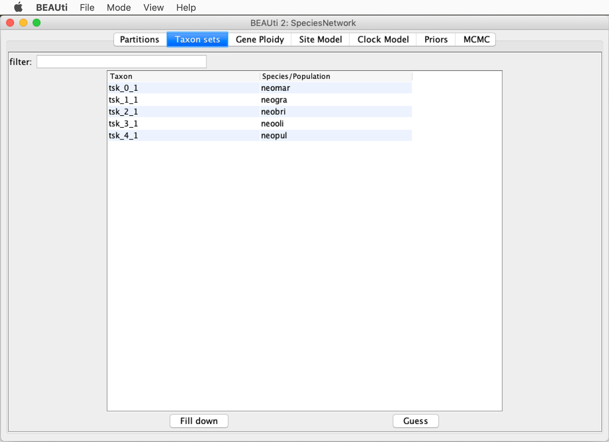
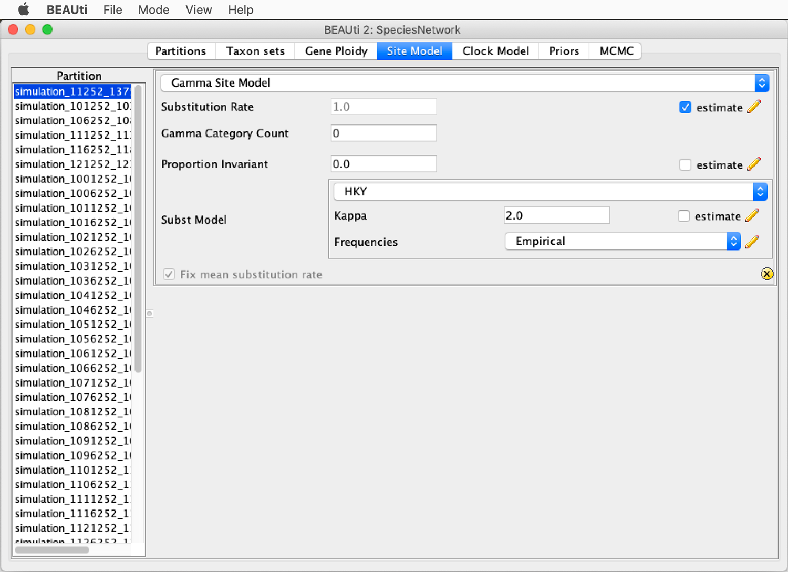
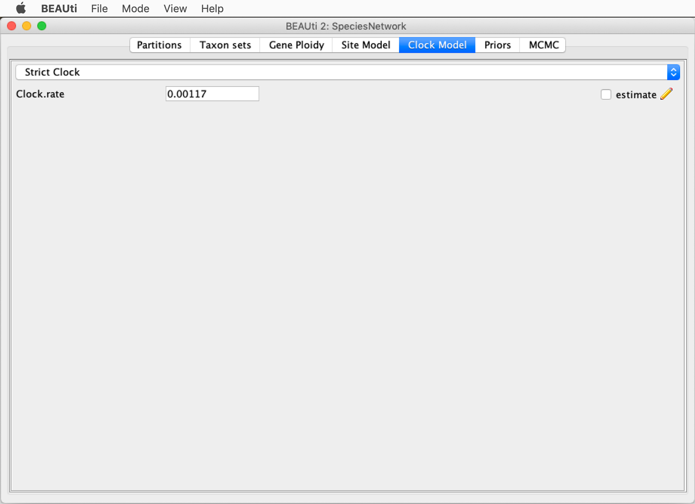
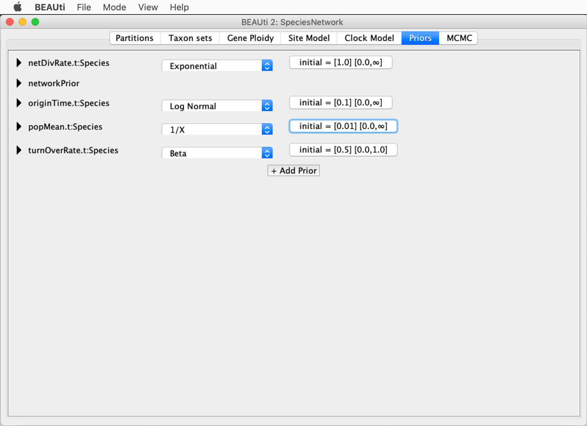
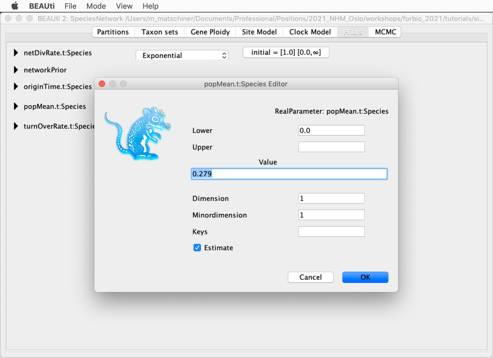
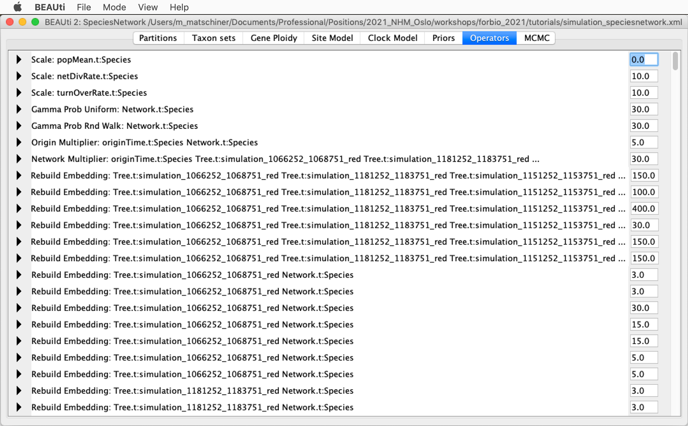

# Inference from Simulated Data

A tutorial on coalescent simulations of genomic data and inferences from simulated data 
By [Michael Matschiner](https://evoinformatics.group/team.html#michaelmatschiner)

## Summary

All methods used for phylogenomic inference have assumptions, and these are often violated in one way or another by empirical data. Thus, even when methods have been shown to perform well when the assumptions are met, it may be questionable how reliable the results are when these assumptions are not met. Fortunately, the effects of model violations can be assessed by comparing results infered from data that has been simulated with and with these violations.

## Table of contents

* [Outline](#outline)
* [Dataset](#dataset)
* [Requirements](#requirements)
* [Coalescent simulations with Msprime](#msprime)
	* [Getting started with Msprime](#start)
	* [Realistic simulations of genomic data](#real_simulations)
* [Inference from simulated data](#inference)
	* [Inference with ASTRAL](#astral)
	* [Inference with StarBEAST2](#starbeast2)
	* [Inference with SVDQuartets](#svdquartets)
	* [Inference with SNAPP](#snapp)
	* [Inference with SNAPPER](#snapper)
	* [Inference with PhyloNet](#phylonet)
	* [Inference with SpeciesNetwork](#speciesnetwork)
	* [Inference with Dsuite](#dsuite)

## Outline

In this tutorial I am going to demonstrate how coalescent simulations of genomic data can be used to test the reliability of inference methods when their assumptions are violated. The genomic data will be simulated using the Python library [msprime](https://tskit.dev/msprime/docs/stable/intro.html), and the simulated data will be used for inference of the species tree with methods covered in the tutorials [Maximum-Likelihood Species-Tree Inference](../ml_species_tree_inference/README.md), [Bayesian Species-Tree Inference](../bayesian_species_tree_inference/README.md), [Species-Tree Inference with SNP Data](../species_tree_inference_with_snp_data/README.md), [Divergence-Time Estimation with SNP Data](../divergence_time_estimation_with_snp_data/README.md), and [Bayesian Inference of Species Networks](../bayesian_inference_of_species_networks/README.md), as well as inference of introgression signals with methods covered in tutorial [Analysis of Introgression with SNP Data](../analysis_of_introgression_with_snp_data/README.md).

## Dataset

The datasets used in this tutorial will be simulated with the Python library [msprime](https://tskit.dev/msprime/docs/stable/intro.html). The simulated datasets will mimick the diversification of the five species of the cichlid genus *Neolamprologus* that were first analyzed with phylogenomic methods by [Gante et al. (2016)](https://doi.org/10.1111/mec.13767), and for which [Bouckaert et al. (2019)](https://doi.org/10.1371/journal.pcbi.1006650) co-estimated the species tree and introgression with the isolation-with-migration model:
*Neolamprologus brichardi* ("neobri"), *Neolamprologus gracilis* ("neogra"), *Neolamprologus marunguensis* ("neomar"), *Neolamprologus olivaceous* ("neooli"), and *Neolamprologus pulcher* ("neopul"). An outgroup will be added in the simulations and placed according to the position of *Metriaclima zebra* ("metzeb") in the species tree inferred by [Bouckaert et al. (2019)](https://doi.org/10.1371/journal.pcbi.1006650). We will assume that the scenario of diversification and introgression that received the strongest support in the analyses of [Bouckaert et al. (2019)](https://doi.org/10.1371/journal.pcbi.1006650) reflects the true evolutionary history of the five species, and we will simulate genomic data according to this scenario while modifying introgression and demographic parameters. Thus, genomic data will be separately simulated without any introgression, with introgression between *N. marunguensis* ("neomar") and *N. olivaceous* ("neooli"), and with additional introgression between *N. gracilis* ("neogra") and the common ancestor of *Neolamprologus brichardi* ("neobri"), *N. olivaceous* ("neooli"), and *N. pulcher* ("neopul"), as shown in Figure 5a of [Bouckaert et al. (2019)](https://doi.org/10.1371/journal.pcbi.1006650):

To also test the effect of population-size variation on the inference methods, a strong bottleneck will be simulated for the common ancestor of *Neolamprologus brichardi* ("neobri"), *N. olivaceous* ("neooli"), and *N. pulcher* ("neopul").

## Requirements

This tutorial requires **BEAST2**, **bModelTest**, **Tracer**, **FigTree**, **ASTRAL**, **PAUP\***, **SNAPP**, **SNAPPER**, **babette**, **ape**, **PhyloNet**, **SpeciesNetwork**, and **Msprime** to be installed. Details about the installation of these tools can be found in tutorials [Bayesian Phylogenetic Inference](../bayesian_phylogeny_inference/README.md), [Maximum-Likelihood Species-Tree Inference](../ml_species_tree_inference/README.md), [Species-Tree Inference with SNP Data](../species_tree_inference_with_snp_data/README.md), [Divergence-Time Estimation with SNP Data](../divergence_time_estimation_with_snp_data/README.md), [Maximum-Likelihood Inference of Species Networks](../ml_inference_of_species_networks/README.md), [Bayesian Inference of Species Networks](../bayesian_inference_of_species_networks/README.md), [Analysis of Introgression with SNP Data](../analysis_of_introgression_with_snp_data/README.md), and [Analysis of Introgression with Tree Topologies](../analysis_of_introgression_with_tree_topologies/README.md).

## Coalescent simulations with Msprime

All of the inference methods used in other tutorials of this course (e.g. [Maximum-Likelihood Species-Tree Inference](../ml_species_tree_inference/README.md), [Bayesian Species-Tree Inference](../bayesian_species_tree_inference/README.md), [Species-Tree Inference with SNP Data](../species_tree_inference_with_snp_data/README.md), [Divergence-Time Estimation with SNP Data](../divergence_time_estimation_with_snp_data/README.md), [Bayesian Inference of Species Networks](../bayesian_inference_of_species_networks/README.md), and [Analysis of Introgression with SNP Data](../analysis_of_introgression_with_snp_data/README.md)) are based on assumptions that may in fact rarely be met by empirical datasets. For example, ASTRAL, StarBEAST2, and SpeciesNetwork assume the absence of recombination within a locus, ASTRAL, SVDQuartets, StarBEAST2, SNAPP, and SNAPPER assume the absence of gene flow, and StarBEAST2, SNAPP, and SNAPPER assume constant population sizes (this assumption can be relaxed for StarBEAST2, but it was used in the [Bayesian Species-Tree Inference](../bayesian_species_tree_inference/README.md) tutorial). And while Dsuite does not implement a model but only report the *D*-statistic for a set of quartets, the interpretation of the *D*-statistic as support for introgression between two species is based on the assumption (among others) that only this pair of species is affected by introgression and that introgression was direct and not flowing through unsampled species.

To test how the reliability of the inference methods can be affected by model violations, we can deliberately simulate data with such violations and compare results inferred from these data to results inferred from data simulated without model violations.

The most commonly used tool for such simulations of genomic data is currently Msprime, which can be installed and accessed through Python. Msprime has seen a lot of active development over the last few years by Jerome Kelleher and a large international community, leading to the release of version 1.0 in April 2021 with many new functions that greatly facilitate simulations above the population level; some of which will be used in this tutorial.

### Getting started with Msprime
	 
To perform simulations with Msprime, we are going to write a script in Python, and we will execute this script on the command line. The script can be written with a text editor available on Saga such as Emacs, Vim, or Nano.

* Write a new script on Saga that is named `simulate_data.py` and has the following content:

		import msprime
		ts = msprime.sim_ancestry(2)

* Load a module for Python:

		module purge
		module load Python/3.8.2-GCCcore-9.3.0
		
* Execute the Python script `simulate_data.py` on Saga with `srun`:

		srun --ntasks=1 --mem-per-cpu=1G --time=00:01:00 --account=nn9458k --pty python simulate_data.py
		
	While this command should not produce an error message, it also doesn't produce any other type of output.
	
* To learn a bit about the simulation result, add a third line to the script so that output is written:

		print(ts)
		
	Close the script again, and then execute it again with Python. This should produce two output tables that jointly provide information about a "TreeSequence" object. These TreeSequence objects are the primary products of Msprime simulations, and as the name indicates, they represent a sequence of trees along a simulated chromosome. Each of these trees applies to a certain region of the chromosome, and is separated from the trees on adjacent regions by a recombination event. These recombination events always cause slight changes in the topologies or branch lengths between two adjacent trees; therefore any two adjacent trees are never completely independent of each other but instead highly similar. This property is cleverly exploited by Msprime to store TreeSequence objects in a highly compressed format.
	
	In the current case, the first output table informs us that there is a single tree stored in the simulated TreeSequence object, that the sequence (=chromosome) length is 1 bp, and that there are four sampled nodes. The first two of these characteristics are owed to implemented default values for parameters that we did not change yet. There is so far only a single tree in the tree sequence, because the default value for the recombination rate is 0 and we did not change it (and because the sequence length is 1 bp); and the length of the simulated sequence is 1 bp because this is the default, and we did not specify one. The third characteristic, the presence of four sampled nodes, however, is due to our specification of "2" in the parentheses that followed the `msprime.sim_ancestry` command. This number specified the number of diploid samples that should be drawn from the simulated population; which is the first parameter used by the `msprime.sim_ancestry` command. The two diploid individuals have a total of four chromosomes which are represented by what Msprime calls "sampled nodes".
	
	To find out which arguments can be passed to Msprime commands, and in which order or with which keywords, one can always look up the command in the [Msprime API reference](https://tskit.dev/msprime/docs/stable/api.html#), in this case the [msprime.sim_ancestry command reference](https://tskit.dev/msprime/docs/stable/api.html#msprime.sim_ancestry).
	
	Finally, the second table of the output provides some more details, including the total number of edges and nodes in the TreeSequence object. In this case there are six edges and 7 nodes (three internal nodes and the four sampled ones) because there is just a single tree in the TreeSequence.

	**Question 1:** How do the numbers of trees, sampled nodes, total nodes, and edges in the TreeSequence change when you simulate a longer sequence length and recombination? To find out, look up the keywords with which to specify both in the [msprime.sim_ancestry command reference](https://tskit.dev/msprime/docs/stable/api.html#msprime.sim_ancestry). You could try a sequence length of 10,000 bp (specify as "10000") and a recombination rate of 10-4 (specify as "1E-4"). [(see answer)](#q1)

* Msprime also has a function to produce more visual output in the form of a figure in SVG format, which can be helpful to illustrate the tree sequence. The function is called `ts.draw_svg`, but we will need a few more commands to write the figure to a file. To produce such a figure, rewrite the script with this content:

		# Load msprime.
		import msprime
		
		# Generate a tree sequence.
		ts = msprime.sim_ancestry(samples=2, sequence_length=10000, recombination_rate=1E-4, random_seed=2494539)
		
		# Produce a figure in svg format for the tree sequence.
		svg = ts.draw_svg(y_axis=True)
		
		# Open a new file for writing.
		f = open("ts.svg", "w")
		
		# Write the figure to this new file.
		f.write(svg)

* Execute the script again:

		srun --ntasks=1 --mem-per-cpu=1G --time=00:01:00 --account=nn9458k --pty python simulate_data.py
		
	This should produce a new file named `ts.svg`.
	
* Download the file `ts.svg`, using e.g. `scp`, and then open the file in a program that is able to display SVG format (e.g. Safari, Firefox, Chrome, Illustrator, or Inkscape). This figure should look as shown in this screenshot:

	As you can see, the tree sequence shown in this figure contains five trees, of which the first one covers positions 0-1406 of the simulated chromosome, the second covers positions 1407-8430, and so on.

	**Question 2:** Can you identify how recombination has changed the topology between each pair of adjacent trees? [(see answer)](#q2)

	The y-axis of the figure indicates the age of coalescent events, in numbers of generations. In the first tree, all four sequences coalesce 2.76 generations ago; which tells us two things: First, Msprime apparently does not use discrete generations in its simulations (otherwise the ages of coalescence events should have integer numbers like 1, 2, 3...) and second, all coalescence events are very recent. The reason for the latter is that because we also did not specify a population size, msprime used the default population size, which is one single (diploid) individual. Simulating such a tiny population size of course does not make much sense, particularly because we sample two diploid individuals from the population.
	
* To run a more realistic simulation with a larger population size, replace the script content with the following commands (note that the used recombination rate is now smaller to avoid too many trees in the tree sequence):

		# Load msprime.
		import msprime
		
		# Generate a tree sequence.
		ts = msprime.sim_ancestry(samples=2, sequence_length=10000, recombination_rate=1E-6, population_size=100, random_seed=1234)
		
		# Produce a figure in svg format for the tree sequence.
		svg = ts.draw_svg(y_axis=True)
		
		# Open a new file for writing.
		f = open("ts.svg", "w")
		
		# Write the figure to this new file.
		f.write(svg)

	Note that to avoid long lines in the script, commands like the `msprime.sim_ancestry` command can also be written with line breaks, but after each line break within the command, the next line must be indented with a tab:
	
		# Generate a tree sequence.
		ts = msprime.sim_ancestry(
			samples=2,
			sequence_length=10000,
			recombination_rate=1E-6,
			population_size=100,
			random_seed=1234)

* Execute the script again with Python and download and open once again the file `ts.svg`. The figure showing the tree sequence should now look like this, with much older ages of coalescent events up to hundreds of generations ago:

	
* The expected time to coalescence between a pair of sequences is 2 times the diploid population size; thus, we would expect an average coalescence time of 200 generations with our population of a size of 100 diploid individuals. Test if this expectation matches the results when the number of samples is set to 1 (thus, one diploid individual that has two sequence) and the recombination rate is doubled to produce some more trees in the tree sequence:

		# Load msprime.
		import msprime
		
		# Generate a tree sequence.
		ts = msprime.sim_ancestry(
			samples=1,
			sequence_length=10000,
			recombination_rate=2E-6,
			population_size=100,
			random_seed=1234)

		# Produce a figure in svg format for the tree sequence.
		svg = ts.draw_svg(y_axis=True)
		
		# Open a new file for writing.
		f = open("ts.svg", "w")
		
		# Write the figure to this new file.
		f.write(svg)

* Execute the script again with Python, and download and open the file `ts.svg` again.

	**Question 3:** Do the coalescence times match the expectation of being around 200 generations on average? [(see answer)](#q3)

* Next, let's add mutations to the simulations. This can be done with the `msprime.sim_mutations` command, as in the following script:

		# Load msprime.
		import msprime
	
		# Generate a tree sequence.
		ts = msprime.sim_ancestry(
			samples=1,
			sequence_length=10000,
			recombination_rate=2E-6,
			population_size=100,
			random_seed=1234)
			
		# Add mutations to the tree sequence.
		mts = msprime.sim_mutations(ts, rate=0.00001, random_seed=5678)
		
		# Produce a figure in svg format for the tree sequence.
		svg = mts.draw_svg(y_axis=True)
		
		# Open a new file for writing.
		f = open("mts.svg", "w")
		
		# Write the figure to this new file.
		f.write(svg)
		
* Execute once again the script, and download and open the new file `mts.svg`. The figure for the tree sequence with mutations should like like this:

As you can see there are now three trees included in the tree sequence, for the regions from position 0 to 2442, from position 2442 to 7204, and from position 7205 to 10000 of the simulated chromsomes. Mutations have occurred on each of the tree, with the times and positions at which the mutations occurred marked in red on the tree and the x-axis, respectively. As mutations are labelled with numbers from 0 to 25, we know that a total of 26 mutations have occurred.

In order to use the simulated genomic data for inference, we will need to export it in a format that is accepted by the inference methods. Thus, we will need to generate sequence alignments for tools like ASTRAL, StarBEAST2, SpeciesNetwork, and VCF files for SVDQuartets, SNAPP, SNAPPER, and Dsuite. Fortunately, Msprime has a very convenient funtion for export in VCF format, named `write_vcf`, but in order to generate sequence alignments, we will need a separate script.

* To test data export in VCF format, try the following script:
	
		# Load msprime.
		import msprime
	
		# Generate a tree sequence.
		ts = msprime.sim_ancestry(
			samples=1,
			sequence_length=10000,
			recombination_rate=2E-6,
			population_size=100,
			random_seed=1234)
			
		# Add mutations to the tree sequence.
		mts = msprime.sim_mutations(ts, rate=0.00001, random_seed=5678)

		# Export genomic data in vcf format.
		with open("simulation.vcf", "w") as vcf:
			mts.write_vcf(vcf)
	
	<!-- Run time: 4 s -->
	
* Run this script again with Python, and then have a look at the output file named "simulation.vcf", for example with the `less` command: `less simulation.vcf`. This should show that the VCF file in fact has information for 26 variable sites, which are located between positions 144 and 9002 of the simulated chromosome. However, because we specified a sample size of 1 (diploid individual) in our simulations, the VCF file contains only a single column with genotype information.

* Explore how the VCF file changes when you use a sample size of 4 instead of 1.

	**Question 4:** What do you notice?  [(see answer)](#q4)

The default model for the simulation of mutations is the Jukes-Cantor model, according to which all substitutions occur with the same frequency. As alternatives, a number of other nucleotide subsitution models of are available, including the HKY and GTR models, which can be defined with the `msprime.HKY` and `msprime.GTR` functions, respectively. Each type of model requires the specification of additional parameters, such as the kappa parameter for the HKY model that specifies the relative rate of transitions over transversions. For the GTR model, relative rates are specified by providing a list of values with the `relative_rates` keyword. Thus, the HKY model could for example be defined as `msprime.HKY(kappa=2)` and the GTR model could be defined with `msprime.GTR(relative_rates=[0.3, 0.2, 1.6, 2.4, 0.6, 0.4])` (the order of these rates is described in the [Msprime API reference](https://tskit.dev/msprime/docs/stable/api.html#msprime.GTR)). Additionally, the equilibrium frequencies of the four nucleotides can be specified for both models with the `equilibrium_frequencies` keyword; if these are not specified, equal frequencies will be used by default.A list of the available models can be found in the [Msprime manual](https://tskit.dev/msprime/docs/stable/mutations.html).

* To try out a simulation with the HKY model, replace `mts = msprime.sim_mutations(ts, rate=0.00001, random_seed=5678)` in the current version of the script with these two lines:
		
		hky_model=msprime.HKY(kappa=2)
		mts = msprime.sim_mutations(ts, rate=0.00001, model=hky_model, random_seed=5678)

	<!-- Run time: 4 s -->

	When you execute the script with these settings, however, you may not notice a large difference in the VCF, as the kappa value of 2 only doubles the rate of transitions relative to that of transversions.

* To see how a substantially larger value kappa would affect the result, execute the script once again with `kappa=1000` and have a look again at the output file `simulation.vcf`. This time you should notice that nearly all substitutions that occurred were transitions: The sites in the VCF that have an "A" as the reference allele (column "REF") have an "T" as the alternate allele (column "ALT") and vice versa, and all those that have a "C" as the reference have a "G" as the alternate allele and vice versa.

So far, all the simulations performed were for a single panmictic population from which between one and four diploid individuals were sampled. But since the goal of the simulations in this tutorial is to allow tests of the reliability of methods for the inference of species trees and introgression, we will need to simulate genomic data for multiple species (note that Msprime does not distinguish between species and populations). To do so, we need to set up a demographic model that describes the relationships among the simulated species, and we then need to pass that demographic model to the `msprime.sim_ancestry` command with the keyword `demography`, as in `msprime.sim_mutations(ts, rate=0.00001, demography=demography)`.

The demographic models can be set up very conveniently with the `msprime.Demography.from_species_tree` command that requires only two options, a phylogenetic tree in Newick format, and a value for the population size. We could thus set up a model with a command like this one:

	demography = msprime.Demography.from_species_tree("(A:10,B:10)", 100)
		
This should specify a demographic model in which two species named "A" and "B" have both a population size of 100 and split from each other 10 generations ago. However, when unsure whether the model has been set up correctly, one can use the `DemographyDebugger` by calling `debug` for the demography object:
	
* Try setting up a demographic model and use the `DemographyDebugger` to verify it, using the following script:

		# Load msprime.
		import msprime
	
		# Set up a demographic model.
		demography = msprime.Demography.from_species_tree("(A:1000,B:1000)", 100)
	
		# Use the DemographyDebugger to output details about the model.
		print(demography.debug())

	<!-- Run time: 4 s -->

	Executing this script should output three tables that describe settings for two "epochs", two for an epoch that lasted from 0 to 1000 generations in the past, and one table for a second epoch that lasted from 1000 to infinite generations in the past (this view according to which more recent events are considered before more ancestral ones is common in the context of the coalescent, even though it is admittedly confusing at first). The first of the three tables tells us that between the present and 10 generations in the past, two populations (recall that Msprime does not distinguish between species and populations) existed that were named "A" and "B" and both had a population size of 100, at both the beginng and the end of their existence; therefore the population growth rate is zero. In the last two columns of this table, pairwise migration rates are reported, which are currently all zero because we did not simulate any migration between the populations. The second table reports that there was a population split event at 1000 generations ago, where an ancestral population named "pop2" (the name is chosen by Msprime) split into the descending populations "A" and "B". And finally, the third table reports that between 1000 and infinite generations in the past (or put more simply: prior to 1000 generations ago), a single population existed that was named "pop2" and had an unchanged population size of 100. So all of this information from the `DemographyDebugger` confirms that the model has been set up as we intended.
	
* Next, try to simulate genomic data with this demographic model, using the following script (as you will see, this will produce an error message when you execute it):
	
		# Load msprime.
		import msprime
	
		# Set up a demographic model.
		demography = msprime.Demography.from_species_tree("(A:1000,B:1000)", 100)
		
		# Generate a tree sequence.
		ts = msprime.sim_ancestry(
			samples=1,
			sequence_length=10000,
			recombination_rate=2E-6,
			demography=demography)
			
		# Add mutations to the tree sequence.
		hky_model=msprime.HKY(kappa=2)
		mts = msprime.sim_mutations(ts, rate=0.00001, model=hky_model)

		# Export genomic data in vcf format.
		with open("simulation.vcf", "w") as vcf:
			mts.write_vcf(vcf)

	<!-- Run time: 4 s -->

	As the error message indicates, we need to be more explicit about the sampled individuals when we simulate multiple populations. The error message also informs how this should be done, namely in the form "{pop_id: num_samples}".
	
* Retry running the above script after replacing "samples=1," in the `msprime.sim_ancestry` command with "samples={"A": 1, "B": 1},", indicating that we sample a single diploid individual from both populations. This time, the script should finish without errors. <!-- Run time: 4 s -->

### Realistic simulations of genomic data

Finally, it is time to run a more realistic simulation that mimicks the diversification of the five *Neolamprologus* species and their outgroup, *Metriaclima zebra*. For this, we need a phylogeny in Newick format, an estimate of the population size, as well as a sequence length, and recombination and mutation rates.

For the species tree, we'll use the following Newick string that encodes the phylogeny of the six species that received the strongest support in [Bouckaert et al. (2019)](https://doi.org/10.1371/journal.pcbi.1006650): "(((neomar:1.6,neogra:1.6):0.3,(neobri:1.2,(neooli:0.5,neopul:0.5):0.7):0.7):7.6,metzeb:9.5)". To verify that this Newick string encodes the phylogeny correctly, you could copy it and paste it into a new FigTree window. This should show the following tree:

 In contrast to the Newick string that we had used in the first demographic model for species "A" and "B", the branch lengths of this Newick string are now not in units of generations, but in units of millions of years, according to how the species tree was inferred in Bouckaert et al. (2019). However, we can still use the Newick string as it is; we just need to provide a generation time to Msprime so that Msprime can convert the branch lengths internally.

Reasonable parameters for our simulations may be a generation time of 3 years ([Malinsky et al. 2018](https://doi.org/10.1038/s41559-018-0717-x)), a population size of 1.1 &times; 105 (as inferred with SNAPP in tutorial [Divergence-Time Estimation with SNP Data](../divergence_time_estimation_with_snp_data/README.md)), a sequence length of 5 million bp (a longer one would be unnecessarily computationally demanding), a recombination rate of 3 &times; 10-8 per bp per generation (corresponding to one recombination event per generation on a chromosome that is 33 Mbp long –- a length compararable to those of cichlids), and a mutation rate of 3.5 &times; 10-9 per bp per generation ([Malinsky et al. 2018](https://doi.org/10.1038/s41559-018-0717-x)).

* Set up the demographic model with these parameter values using the following commands, which include calling the `DemographyDebugger` once again to verify the model:

		# Load msprime.
		import msprime
	
		# Set parameter values:
		species_tree = "(((neomar:1.6,neogra:1.6):0.3,(neobri:1.2,(neooli:0.5,neopul:0.5):0.7):0.7):7.6,metzeb:9.5)"
		generation_time = 3
		population_size = 1.1E5
		sequence_length = 5E6
		recombination_rate = 3E-8
		mutation_rate = 3.5E-9
	
		# Set up a demographic model.
		demography = msprime.Demography.from_species_tree(
			species_tree,
			initial_size=population_size,
			time_units="myr",
			generation_time=generation_time)
		
		# Use the DemographyDebugger to output details about the model.
		print(demography.debug())
		
	<!-- Run time: 4 s -->
		
	**Question 5:** How many epochs are now specified, and how long did these epochs last?  [(see answer)](#q5)
	
* Complete the script by adding commands to simulate ancestry and mutations and to export the data in VCF format:

		# Load msprime.
		import msprime
	
		# Set parameter values:
		species_tree = "(((neomar:1.6,neogra:1.6):0.3,(neobri:1.2,(neooli:0.5,neopul:0.5):0.7):0.7):7.6,metzeb:9.5)"
		generation_time = 3
		population_size = 1.1E5
		sequence_length = 5E6
		recombination_rate = 3E-8
		mutation_rate = 3.5E-9
	
		# Set up a demographic model.
		demography = msprime.Demography.from_species_tree(
			species_tree,
			initial_size=population_size,
			time_units="myr",
			generation_time=generation_time)

		# Generate a tree sequence.
		ts = msprime.sim_ancestry(
			samples={"neomar":1, "neogra":1, "neobri":1, "neooli":1, "neopul":1, "metzeb":1},
			sequence_length=sequence_length,
			recombination_rate=recombination_rate,
			demography=demography)
			
		# Add mutations to the tree sequence.
		hky_model=msprime.HKY(kappa=2)
		mts = msprime.sim_mutations(ts, rate=mutation_rate, model=hky_model)

		# Export genomic data in vcf format.
		with open("simulation.vcf", "w") as vcf:
			mts.write_vcf(vcf)

	Executing this script should take about 20 to 30 minutes, which means that instead of executing it with `srun --ntasks=1 --mem-per-cpu=1G --time=00:01:00 --account=nn9458k --pty python simulate_data.py`, we now have to write a Slurm script for it, and to submit the Slurm script with `sbatch` (see next point).

* Write a Slurm script with the following content, and name it `simulate_data.slurm`:

		#!/bin/bash                                                                                                                                                                             
		
		# Job name:                                                                                                                                                                             
		#SBATCH --job-name=simdat                                                                                                                                                               
		#                                                                                                                                                                                       
		# Wall clock limit:                                                                                                                                                                     
		#SBATCH --time=2:00:00                                                                                                                                                                  
		#                                                                                                                                                                                       
		# Processor and memory usage:                                                                                                                                                           
		#SBATCH --ntasks=1                                                                                                                                                                      
		#SBATCH --mem-per-cpu=1G                                                                                                                                                                
		#                                                                                                                                                                                       
		# Accounting:                                                                                                                                                                           
		#SBATCH --account=nn9458k                                                                                                                                                               
		#                                                                                                                                                                                       
		# Output:                                                                                                                                                                               
		#SBATCH --output=simulate_data.out                                                                                                                                                      

		# Set up job environment.                                                                                                                                                               
		set -o errexit  # Exit the script on any error                                                                                                                                          
		set -o nounset  # Treat any unset variables as an error                                                                                                                                 
		module --quiet purge  # Reset the modules to the system default                                                                                                                         

		# Load the python module.                                                                                                                                                              
		module load Python/3.8.2-GCCcore-9.3.0

		# Execute the script.                                                                                                                                                                   
		python simulate_data.py

* Submit the Slurm script using `sbatch`:

		sbatch simulate.slurm

<!-- Run time: 30-40 min -->

* While the above job is running on Saga, we can already prepare another script, with which we simulate genomic data as before, but now with additional introgression between *Neolamprologus marunguensis* (neomar) and *Neolamprologus olivaceous* (neooli), as inferred by [Bouckaert et al. (2019)](https://doi.org/10.1371/journal.pcbi.1006650). To do that, first copy the existing script named `simulate_data.py` to a new file named `simulate_data_introgression1.py`:

		cp simulate_data.py simulate_data_introgression1.py
		
* Open the new file `simulate_data_introgression1.py` in Emacs or another text editor. To simulate genomic data as before but with introgression between *Neolamprologus marunguensis* (neomar) and *Neolamprologus olivaceous* (neooli), we need to modify the demographic model. We'll use the [`set_migration_rate`](https://tskit.dev/msprime/docs/stable/api.html#msprime.Demography.set_migration_rate) command to specify unidirectional introgression between the two species, from *Neolamprologus marunguensis* (neomar) into *Neolamprologus olivaceous* (neooli), as inferred by [Bouckaert et al. (2019)](https://doi.org/10.1371/journal.pcbi.1006650). If we would instead prefer to specify a symmetric rate of introgression, we could do so using the [`set_symmetric_migration_rate`](https://tskit.dev/msprime/docs/stable/api.html?highlight=set_symmetric_migration_rate#msprime.Demography.set_symmetric_migration_rate) command. More information about both commands can be found in the [Msprime manual](https://tskit.dev/msprime/docs/stable/demography.html).

	The command `set_migration_rate` requires the specification of three parameter values with the keywords "source" (the source of introgression), "dest" (the destination of introgression), and "rate" (the introgression rate, measured as the proportion of individuals per generation that move from one population to the other). There is great potential for confusion with the "source" and "dest" parameters, because both are used in the view that is standard in the context of the coalescent; where events are followed from the present back into the past. So if a population is the introgression source when viewed forward in time, it is called the destination of introgression when the population history is traced back in time. This means that if we want to implement the scenario inferred by [Bouckaert et al. (2019)](https://doi.org/10.1371/journal.pcbi.1006650), according to which *Neolamprologus marunguensis* (neomar) is the source of introgression into *Neolamprologus olivaceous* (neooli), we have to specify `source="neooli` and `dest="neomar"`.
	
	As the rate of introgression, please select any value from "1E-1", "1E-2", "1E-3", "1E-4", "1E-5", and "1E-6". The idea is that different course participants select different values and thus a different amount of introgression, so that we can compare the effects of stronger or weaker introgression on inference methods. The `set_migration_rate` command can then be called for example with `demography.set_migration_rate(source="neooli", dest="neomar", rate=1E-4)`. Add this command (or a variation of it with a different rate) to the script, after the command to set up a demographic model (don't execute the script yet).
	
* Before running the simulation, it would again be useful to first verify the demographic model with the `DemographyDebugger`. To do that, remove the part of the script after the `set_migration_rate` command and instead add a line to call the `DemographyDebugger`, as shown below.
	
		# Load msprime.
		import msprime
	
		# Set parameter values:
		species_tree = "(((neomar:1.6,neogra:1.6):0.3,(neobri:1.2,(neooli:0.5,neopul:0.5):0.7):0.7):7.6,metzeb:9.5)"
		generation_time = 3
		population_size = 1.1E5
		sequence_length = 5E6
		recombination_rate = 3E-8
		mutation_rate = 3.5E-9
	
		# Set up a demographic model.
		demography = msprime.Demography.from_species_tree(
			species_tree,
			initial_size=population_size,
			time_units="myr",
			generation_time=generation_time)
		
		# Add migration between neomar and neooli.
		demography.set_migration_rate(source="neooli", dest="neomar", rate=XXX) # Replace "XXX" with "1E-5", "1E-6", "1E-7", or "1E-8".
		
		# Use the DemographyDebugger to output details about the model.
		print(demography.debug())

* Then, execute this script (don't forget to replace "XXX" with an introgression rate):
	
		 srun --ntasks=1 --mem-per-cpu=1G --time=00:01:00 --account=nn9458k --pty python simulate_data_introgression1.py

	The first table of the output of the `DemographyDebugger` should indicate that there is now a non-zero introgression rate between "neooli" and "neomar".
	
* Complete the `simulate_data_introgression1.py` script by re-adding the commands for the simulation of ancestry and mutations, and for writing output in VCF format. Note that the `DemographyDebugger` can be removed again, and that `simulation_introgression1.vcf` should be chosen for the VCF output file to avoid overwriting of the previously written VCF file:

		# Load msprime.
		import msprime
	
		# Set parameter values:
		species_tree = "(((neomar:1.6,neogra:1.6):0.3,(neobri:1.2,(neooli:0.5,neopul:0.5):0.7):0.7):7.6,metzeb:9.5)"
		generation_time = 3
		population_size = 1.1E5
		sequence_length = 5E6
		recombination_rate = 3E-8
		mutation_rate = 3.5E-9
	
		# Set up a demographic model.
		demography = msprime.Demography.from_species_tree(
			species_tree,
			initial_size=population_size,
			time_units="myr",
			generation_time=generation_time)
		
		# Add migration between neomar and neooli.
		demography.set_migration_rate(source="neooli", dest="neomar", rate=XXX) # Replace "XXX" with "1E-5", "1E-6", "1E-7", or "1E-8".
		
		# Generate a tree sequence.
		ts = msprime.sim_ancestry(
			samples={"neomar":1, "neogra":1, "neobri":1, "neooli":1, "neopul":1, "metzeb":1},
		sequence_length=sequence_length,
		recombination_rate=recombination_rate,
		demography=demography)

		# Add mutations to the tree sequence.
		hky_model=msprime.HKY(kappa=2)
		mts = msprime.sim_mutations(ts, rate=mutation_rate, model=hky_model)

		# Export genomic data in vcf format.
		with open("simulation_introgression1.vcf", "w") as vcf:
			mts.write_vcf(vcf)

* To execute the new script `simulate_data_introgression1.py` on Saga, a Slurm script is again needed. Copy the first Slurm script to a new file named `simulate_data_introgression1.slurm`:

		cp simulate_data.slurm simulate_data_introgression1.slurm

* Then, open the Slurm script `simulate_data_introgression1.slurm` with Emacs or another text editor, and change the lines specifying the job name (line 4) and the output (line 17) as well as the line on which the script is executed (the last line):

		#!/bin/bash

		# Job name:
		#SBATCH --job-name=simin1
		#
		# Wall clock limit:
		#SBATCH --time=2:00:00
		#
		# Processor and memory usage:
		#SBATCH --ntasks=1
		#SBATCH --mem-per-cpu=1G
		#
		# Accounting:
		#SBATCH --account=nn9458k
		#
		# Output:
		#SBATCH --output=simulate_data_introgression1.out
	
		# Set up job environment.
		set -o errexit  # Exit the script on any error
		set -o nounset  # Treat any unset variables as an error
		module --quiet purge  # Reset the modules to the system default

		# Load the python module.
		module load Python/3.8.2-GCCcore-9.3.0

		# Execute the script.
		python simulate_data_introgression1.py

* When the this is done, submit `simulate_data_introgression1.slurm` with `sbatch`:

		sbatch simulate_data_introgression1.slurm

<!-- Run time: 30-40 min -->

* Besides the simulations without introgression and those with introgression from *Neolamprologus marunguensis* (neomar) into *Neolamprologus olivaceous* (neooli), we'll also simulate genomic data with additional introgression from *Neolamprologus gracilis* (neogra) into the common ancestor of *Neolamprologus brichardi* (neobri), *Neolamprologus olivaceous* (neooli), and *Neolamprologus pulcher* (neopul), as also inferred by [Bouckaert et al. (2019)](https://doi.org/10.1371/journal.pcbi.1006650). For this, we will need to know the population ID of the common ancestor of the three species.
	
	**Question 6:** Can you figure out the population ID of the common ancestor from the last output of the `DemographyDebugger`? [(see answer)](#q6)

* Write a new script named `simulate_data_introgression2.py` with the additional introgression event. The easiest way to do this is to copy file `simulate_data_introgression1.py` to a new file named `simulate_data_introgression2.py`, open that new file in Emacs or another text editor, and add the following line after the first `set_migration_rate` command:

		demography.set_migration_rate(source="pop_8", dest="neogra", rate=XXX) # Replace "XXX" with "1E-5", "1E-6", "1E-7", or "1E-8".

	Replace "XXX" in this command with the same introgression rate that you selected for script `simulate_data_introgression1.py`.
	
* Also make sure to replace the name out the VCF output file specified in the script, `simulation_introgression1.vcf`, with `simulation_introgression2.vcf`.
	
* To execute `simulate_data_introgression2.py` on Saga, we once again need a Slurm script, which can be prepared by copying `simulate_data_introgression1.slurm` to a new file named `simulate_data_introgression2.slurm` and then changing the lines specifying the job name (line 4), the output (line 17), and the name of the script to be executed (the last line):

		#!/bin/bash

		# Job name:
		#SBATCH --job-name=simin2
		#
		# Wall clock limit:
		#SBATCH --time=2:00:00
		#
		# Processor and memory usage:
		#SBATCH --ntasks=1
		#SBATCH --mem-per-cpu=1G
		#                                                                                                                                                                                       
		# Accounting:
		#SBATCH --account=nn9458k
		#
		# Output:
		#SBATCH --output=simulate_data_introgression2.out

		# Set up job environment.
		set -o errexit  # Exit the script on any error
		set -o nounset  # Treat any unset variables as an error
		module --quiet purge  # Reset the modules to the system default                                                                                                                         

		# Load the python module.
		module load Python/3.8.2-GCCcore-9.3.0

		# Execute the script.
		python simulate_data_introgression2.py

* Also submit the Slurm script `simulate_data_introgression2.slurm` with `sbatch`:

		sbatch simulate_data_introgression2.slurm

<!-- Run time: 30-40 min -->

With the three scripts that have been executed so far (`simulate_data.py`, `simulate_data_introgression1.py`, and `simulate_data_introgression2.py`), we are simulating diversification with and without introgression, but all scripts so far still simulate populations with constant population sizes. To allow us to test how a violation of the assumption of constant population sizes may affect inference methods, we therefore still need a simulation with a time-heterogeneous population size.

There are a number of options to simulate changes in population sizes with Msprime, but possibly the one that is easiest to use is the `add_simple_bottleneck` command, which places a bottleck on a population at a specified time, at which a given proportion of the population coalesces immediately. Thus, this command requires three parameter values to be specified with the keywords "time" (the time at which the bottleneck is placed), "population" (the population to which the bottleneck is applied), and "proportion" (the proportion of individuals from the population that coalesces instantaneaously). To place a bottleneck on the common ancestor of the three *Neolamprologus* species *N. brichardi* (neobri), *N. olivaceous* (neooli), and *N. pulcher* (neopul), we thus need to specify the population ID of that common ancestory ("pop_8"; see above) and a time point at which the common ancestory lived. The common ancestor lived from 1.9 to 1.2 million years ago, or from 633,333 to 400,000 generations ago, thus, we could for example place the bottleneck at 500,000 generations in the past.

* Start preparing a fourth simulation script by copying the `simulate_data.py` script to a new file named `simulate_data_bottleneck.py`:

		cp simulate_data.py simulate_data_bottleneck.py
		
* Open file `simulate_data_bottleneck.py` in Emacs or another text editor, and add a line with the following command, after the command to set up the demographic model:

		demography.add_simple_bottleneck(time=500000, population="pop_8", proportion=XXX) # Replace "XXX" with a value between 0.2 and 0.8.
		
	As the proportion of individuals coalescing in the bottleneck, select a value between 0.2 and 0.8. As for the rate of introgression in the scripts `simulate_data_introgression1.py` and `simulate_data_introgression2.py`, it will be useful if different participants of the course test different values, so that we can afterwards assess the effect of the bottleneck on inference methods.
	
* Add another line to the script after the `add_simple_bottleneck` command, with a command to sort the specified events (the other events are the population splits that are automatically defined by Msprime through the `msprime.Demography.from_species_tree` command) by their time, only because Msprime would throw an error message if events are not sorted by time:

		demography.sort_events()
	
* Remove once again the rest of the script but add the command to call the `DemographyDebugger`. The script should then look like this:

		# Load msprime.
		import msprime
	
		# Set parameter values:
		species_tree = "(((neomar:1.6,neogra:1.6):0.3,(neobri:1.2,(neooli:0.5,neopul:0.5):0.7):0.7):7.6,metzeb:9.5)"
		generation_time = 3
		population_size = 1.1E5
		sequence_length = 1E7
		recombination_rate = 1E-7
		mutation_rate = 3.5E-9
	
		# Set up a demographic model.
		demography = msprime.Demography.from_species_tree(
			species_tree,
			initial_size=population_size,
			time_units="myr",
			generation_time=generation_time)
		
		# Add a bottleneck.
		demography.add_simple_bottleneck(time=500000, population="pop_8", proportion=XXX) # Replace "XXX" with a value between 0.2 and 0.8.
		demography.sort_events()
		
		# Use the DemographyDebugger to output details about the model.
		print(demography.debug())

* Execute the new script `simulate_data_bottleneck.py`:

		srun --ntasks=1 --mem-per-cpu=1G --time=00:01:00 --account=nn9458k --pty python simulate_data_bottleneck.py

	The `DemographyDebugger` output should now include the bottleck as an event at generation 5e+05.
	
* Complete the script `simulate_data_bottleneck.py`, as before with script `simulate_data_introgression1.py` by re-adding the commands for the simulation of ancestry and mutations, and for writing output in VCF format. The `DemographyDebugger` can be removed again, and `simulate_data_bottleneck.vcf` should be chosen for the VCF output file to avoid overwriting of the previously written VCF file:
	
		# Load msprime.
		import msprime
	
		# Set parameter values:
		species_tree = "(((neomar:1.6,neogra:1.6):0.3,(neobri:1.2,(neooli:0.5,neopul:0.5):0.7):0.7):7.6,metzeb:9.5)"
		generation_time = 3
		population_size = 1.1E5
		sequence_length = 1E7
		recombination_rate = 1E-7
		mutation_rate = 3.5E-9
	
		# Set up a demographic model.
		demography = msprime.Demography.from_species_tree(
			species_tree,
			initial_size=population_size,
			time_units="myr",
			generation_time=generation_time)
		
		# Add a bottleneck.
		demography.add_simple_bottleneck(time=500000, population="pop_8", proportion=XXX) # Replace "XXX" with a value between 0.2 and 0.8.
		demography.sort_events()
		
		# Generate a tree sequence.
		ts = msprime.sim_ancestry(
			samples={"neomar":1, "neogra":1, "neobri":1, "neooli":1, "neopul":1, "metzeb":1},
		sequence_length=sequence_length,
		recombination_rate=recombination_rate,
		demography=demography)

		# Add mutations to the tree sequence.
		hky_model=msprime.HKY(kappa=2)
		mts = msprime.sim_mutations(ts, rate=mutation_rate, model=hky_model)

		# Export genomic data in vcf format.
		with open("simulation_bottleneck.vcf", "w") as vcf:
			mts.write_vcf(vcf)
	
* To execute `simulate_data_bottleneck.py` on Saga, we need a final Slurm script. Prepare this Slurm script by copying `simulate_data.slurm` to a new file named `simulate_data_bottleneck.slurm` and then change the lines specifying the job name (line 4), the output (line 17), and the name of the script to be executed (the last line):

		#!/bin/bash

		# Job name:
		#SBATCH --job-name=simbot
		#
		# Wall clock limit:
		#SBATCH --time=2:00:00
		#
		# Processor and memory usage:
		#SBATCH --ntasks=1
		#SBATCH --mem-per-cpu=1G
		#                                                                                                                                                                                       
		# Accounting:
		#SBATCH --account=nn9458k
		#
		# Output:
		#SBATCH --output=simulate_data_bottleneck.out

		# Set up job environment.
		set -o errexit  # Exit the script on any error
		set -o nounset  # Treat any unset variables as an error
		module --quiet purge  # Reset the modules to the system default                                                                                                                         

		# Load the python module.
		module load Python/3.8.2-GCCcore-9.3.0

		# Execute the script.
		python simulate_data_bottleneck.py

* Then, submit the Slurm script `simulate_data_bottleneck.slurm` with `sbatch`:

		sbatch simulate_data_bottleneck.slurm

<!-- Run time: 30-40 min -->

As some of the inference methods require sequence alignments rather than variant data in VCF format as input, we still need to prepare sequence alignments from the simulated genomic data. This can be done with the Python script `make_alignments_from_vcf.py`, which extracts all variants from a VCF file for a set of regions evenly sampled across the chromosome and adds randomly selected nucleotides for all invariant sites. The script assumes that all variants are phased and thus writes two sequences per sample to each alignment.

* Download the script `make_alignments_from_vcf.py`:

		https://raw.githubusercontent.com/ForBioPhylogenomics/tutorials/main/week2_src/make_alignments_from_vcf.py

* Have a look at the help text of the script:

		python make_alignments_from_vcf.py -h
		
	You'll see that you can specify the number of alignments to extract from the VCF with option `-n` and the length of these alignments with option `-l`. Additionally, you can specify a path to which all alignments should be written with `-p`. The first and second arguments need to be the input file in VCF format and a prefix for all output files, respectively. The length of the chromosome should also be specified with option `-c`, because this information can not always be read from the VCF file. Note that in its current version, this script assumes that the VCF file contains data only for a single chromosome, which is the case in the VCF files generated with Msprime.

* Extract sequence alignments from each of the VCF files generated with Msprime. Extracting a total number of 1,000 alignments that are each 2,500 bp long should produce a set of alignments that is suitable for all alignment-based inference methods, but you could vary these parameters to test the effects of having more or less and longer or shorter alignments:

		srun --ntasks=1 --mem-per-cpu=1G --time=00:10:00 --account=nn9458k --pty python make_alignments_from_vcf.py simulation.vcf simulation -n 1000 -c 5000000 -l 2500 -p simulation_alignments
		srun --ntasks=1 --mem-per-cpu=1G --time=00:10:00 --account=nn9458k --pty python make_alignments_from_vcf.py simulation_introgression1.vcf simulation_introgression1 -n 1000 -c 5000000 -l 2500 -p simulation_introgression1_alignments
		srun --ntasks=1 --mem-per-cpu=1G --time=00:10:00 --account=nn9458k --pty python make_alignments_from_vcf.py simulation_introgression2.vcf simulation_introgression2 -n 1000 -c 5000000 -l 2500 -p simulation_introgression2_alignments
		srun --ntasks=1 --mem-per-cpu=1G --time=00:10:00 --account=nn9458k --pty python make_alignments_from_vcf.py simulation_bottleneck.vcf simulation_bottleneck -n 1000 -c 5000000 -l 2500 -p simulation_bottleneck_alignments

	Perhaps more elegantly, the above commands could alternatively be written as a loop:
	
		for vcf in *.vcf
		do
			vcf_id=${vcf%.vcf}
			srun --ntasks=1 --mem-per-cpu=1G --time=00:10:00 --account=nn9458k --pty python make_alignments_from_vcf.py ${vcf} ${vcf_id} -n 1000 -c 5000000 -l 2500 -p ${vcf_id}_alignments
		done

	You may notice that the file names of the alignments include the start and end position of each alignment on the chromosome, after the specified prefix.

* Make sure the the specified number of alignments has been written to the four new directories `simulation_alignments`, `simulation_introgression1_alignments`, `simulation_introgression2_alignments`, and `simulation_bottleneck_alignments`, for example using `ls simulation_alignments/*.phy | wc -l`.

As you may have noticed, the sample IDs in the VCF files are not those that we used for the six cichlid species ("metzeb", "neomar", "neogra", "neobri", "neooli", and "neopul"), but instead "tsk\_0", "tsk\_1", "tsk\_2", "tsk\_3", "tsk\_4", and "tsk\_5". These IDs correspond to the species in the order in which the species were listed in the Newick string that was supplied to Msprime:
		
| Sample ID | Species ID | Species name                  |
|-----------|------------|-------------------------------|
| tsk_0     | neomar     | *Neolamprologus marunguensis* |
| tsk_1     | neogra     | *Neolamprologus gracilis*     |
| tsk_2     | neobri     | *Neolamprologus brichardi*    |
| tsk_3     | neooli     | *Neolamprologus olivaceous*   |
| tsk_4     | neopul     | *Neolamprologus pulcher*      |
| tsk_5     | metzeb     | *Metriaclima zebra*           |

The IDs used in the alignment files are similar to those used in the VCF files, but end in "\_1" and "\_2", which indicates the first and second of the two sequences per individual.

## Inference from simulated data

You should now have simulated genomic data in the form of four files in VCF format (`simulation.vcf`, `simulation_introgression1.vcf`, `simulation_introgression2.vcf`, and `simulation_bottleneck.vcf`) as well as four sets of files with alignments in Phylip format (in directories `simulation_alignments`, `simulation_introgression1_alignments`, `simulation_introgression2_alignments`, and `simulation_bottleneck_alignments`).

These files can now be used for inference with ASTRAL, StarBEAST2, SVDQuartets, SNAPP, SNAPPER, PhyloNet, SpeciesNetwork, and Dsuite, to find out how these methods are affected by model violations like within-locus recombination, introgression, and population-size variation. The inference should largely follow the instructions given in other tutorials, either using the files in VCF format or the sets of alignments as input, depending on the type of input that is required for the inference methods.

If you should not have enough time to test all of these inference methods, I suggest that phylogenetic inference should be tested with at least one method, in addition to testing inference of introgression with Dsuite. On the other hand, if there is enough time to test different methods for phylogenetic inference, it would make sense to start with the computationally more demanding ones (StarBEAST2, SNAPP, SNAPPER, PhyloNet, SpeciesNetwork) before setting up the faster ones (ASTRAL, SVDQuartets). For each inference method, you could focus on one or two of the simulated datasets (either with or without introgression, and with or without bottleneck) – as long as different course participants select different datasets to analyze, a comparison of the results will allow us to assess the impact of the model violations on each inference method.

### Inference with ASTRAL

* Follow the instructions given in tutorial [Maximum-Likelihood Species-Tree Inference](../ml_species_tree_inference/README.md) to first infer trees for all alignments with IQ-TREE and then use these trees as input for ASTRAL, with the following modifications:

	* In the Slurm script to run IQ-TREE, specify a maximum run time of 20 minutes (`--time=0:20:00`), a maximum of 1 GB of memory (`--mem-per-cpu=1G`), and ask for a single thread (`--ntasks=1`).

	* Instead of testing for the best substitution model with IQ-TREE, use the HKY model (`-m HKY`), given that this model was also used to generate the data.

	* Bootstrapping is not required.

	* Because unlike in tutorial [Maximum-Likelihood Species-Tree Inference](../ml_species_tree_inference/README.md), all trees now contain two tips for the same species, a file with a table connecting species names and individual IDs needs to be prepared and provided to ASTRAL with option `-a`. This file should have the following format and content, and could be named `astral_table.txt`:
	
			neomar:tsk_0_1,tsk_0_2
			neogra:tsk_1_1,tsk_1_2
			neobri:tsk_2_1,tsk_2_2
			neooli:tsk_3_1,tsk_3_2
			neopul:tsk_4_1,tsk_4_2
			metzeb:tsk_5_1,tsk_5_2

	* Run ASTRAL with `srun`, using a command such as this one (replace "XXX.trees" with the actual name of the file containing the trees):
	
			srun --ntasks=1 --mem-per-cpu=1G --time=00:01:00 --account=nn9458k --pty java -jar Astral/astral.5.7.7.jar -i XXX.trees -a astral_table.txt -o simulation_astral.tre

### Inference with StarBEAST2

As an analysis of a complete set of 1,000 alignments would be too computationally demanding, I suggest that you only use a subset of around 50 alignments. These will need to be converted from Phylip to Nexus format because the StarBEAST2 input file will be written with BEAUti, and BEAUti only accepts alignments in Nexus format.

* To convert a set of 50 alignments into Nexus format, you could write a script named `convert_to_nexus.sh` with the following commands (if you want to use another alignment set, simply replace `simulation_alignments` with `simulation_introgression1_alignments`, `simulation_introgression2_alignments`, or `simulation_bottleneck`):

		# Load the python module.
		module load Python/3.8.2-GCCcore-9.3.0
		
		for phy in `ls simulation_alignments/*.phy | head -n 50`
		do
			nex=${phy%.phy}.nex
			python convert.py ${phy} ${nex} -f nexus
		done

* Before executing this script, you will need to download the conversion script `convert.py`:
	
		wget https://raw.githubusercontent.com/mmatschiner/anguilla/master/radseq/src/convert.py
	
* Then you can use this command to execute the script:

		srun --ntasks=1 --mem-per-cpu=1G --time=00:02:00 --account=nn9458k --pty bash convert_to_nexus.sh

	This should have produced 50 files in Nexus format in directory `simulation_alignments`, which you can verify with `ls simulation_alignments/*.nex | wc -l`.

* Download these alignment files in Nexus format to your local computer, e.g. using `scp`. To download only the files in Nexus format from `simulation_alignments`, you could use a command similar to this one (on your local computer; replace "XXX" with the path to your current directory on Saga):

		scp /XXX/simulation_alignments/*.nex .

* Follow the instructions given in tutorial [Bayesian Species-Tree Inference](../bayesian_species_tree_inference/README.md) to set up an XML file for StarBEAST2, with the following modifications:

	* Ignore the step in which the script `filter_genes_by_missing_data.rb` is used.

	* Assign the sequences with IDs "tsk\_0\_1", "tsk\_0\_2", "tsk\_1\_1", etc. to the species IDs "neomar", "neogra", etc. according to the table given above (BEAUti tab "Taxon sets").

	* Use 0.279 as the population size, because this value will correspond to the true population size used in the simulations (9.3 &times; 104) when scaled by the number of generations per time unit (333,333). But since we now have two sequences per species, we can attempt to estimate the population size, rather than fixing it; thus you could keep the tick in the checkbox to estimate the population size (BEAUti tab "Population Model").

	* As the substitution model, specify the HKY model without among-site rate heterogeneity (simply leave the Gamma category count at "0") to match the model used for the simulations (BEAUti tab "Site Model").

	* To simplify the StarBEAST2 analysis, you could also specify equal site frequencies (select "All Equal" from the drop-down menu next to "Frequencies"; BEAUti tab "Site Model").

	* Instead of the birth-death model, you could select the Yule model, given that extinction was not included in the simulations (BEAUti tab "Priors").

	* To time-calibrate the species tree, use a lognormal age constraint with a mean age of 9.5 Ma (the true age used in the simulations) and a standard deviation of 0.1 (make sure to set the tick for "Mean in Real Space"; BEAUti tab "Priors").

	* Use a chain length of 50 million and all log frequencies to 25,000 (BEAUti tab "MCMC").

	* Save the XML file as `simulation_starbeast.xml`, `simulation_introgression1_starbeast.xml`, `simulation_introgression2_starbeast.xml`, or `simulation_bottleneck_starbeast.xml`, depending on the set of alignments that was used.

	* To run StarBEAST2, the following Slurm script could be used:

			#!/bin/bash

			# Job name:
			#SBATCH --job-name=starb
			#
			# Wall clock limit:
			#SBATCH --time=2:00:00
			#
			# Processor and memory usage:
			#SBATCH --ntasks=1
			#SBATCH --mem-per-cpu=1G
			#
			# Accounting:
			#SBATCH --account=nn9458k
			#
			# Output:
			#SBATCH --output=run_simulation_starbeast.out

			# Set up job environment.
			set -o errexit  # Exit the script on any error
			set -o nounset  # Treat any unset variables as an error
			module --quiet purge  # Reset the modules to the system default

			# Load the python module.
			module load Beast/2.6.4-GCC-9.3.0 

			# Run starbeast2.
			beast simulation_starbeast.xml

	<!-- Run time: 50 minutes -->

### Inference with SVDQuartets

* Follow the instructions given in tutorial [Species-Tree Inference with SNP Data](../species_tree_inference_with_snp_data/README.md) to infer a species tree with SVDQuartets, with the following modifications:

	* No individuals need to be filtered with `bcftools`, but the `prune` function of `bcftools` should again be used to ensure a minimum distance of 100 bp between SNPs, with commands similar to the following:

			module purge
			module load BCFtools/1.12-GCC-10.2.0
			srun --ntasks=1 --mem-per-cpu=1G --time=00:01:00 --account=nn9458k --pty bcftools +prune -w 100bp -n 1 -N 1st -o simulation_pruned.vcf simulation.vcf

	* Run only what is called the "second analysis with SVDQuartets" in that tutorial, in which an assignment between individuals and species is made.

	* The number used for the species are different with this simulated dataset, which affects both the content of the file `taxpartitions.txt` and of how the PAUP\*s `outgroup` command is executed. Use again the PAUP\* command `tstatus full` to find out which numbers are used for the six individuals, and compare these to the table given above to assign the numbers to the six species. Then, use these assignments between the numbers and the species when you write the `taxpartitions.txt` file and when you execute the `outgroup` command. Note that you'll need to quit the interactive PAUP\* environment after executing the `tstatus full` command to be able to write the file `taxpartitions.txt` (and to concatenate that file with the Nexus-format alignment file), before you need to enter the PAUP\* interactive environment once again for the rest of the analysis. When writing the new version of the file `taxpartitions.txt`, be careful to place the commas and semi-colons as in the original version of that file.

### Inference with SNAPP

* Follow the instructions given in tutorial [Divergence-Time Estimation with SNP Data](../divergence_time_estimation_with_snp_data/README.md) to first prepare an input file for SNAPP with the script `snapp_prep.rb`, and then analyze this file with SNAPP, with the following modifications:

	* No filtering with `bcftools` is required.

	* The file with a table assigning individuals to species should have the following content:

			species individual
			neomar tsk_0
			neogra tsk_1
			neobri tsk_2
			neooli tsk_3
			neopul tsk_4
			metzeb tsk_5

	* The constraint file should have this content:

			lognormal(0,9.5,0.1)        crown    metzeb,neooli,neopul,neobri,neogra,neomar

	* To generate an input file for SNAPP with `snapp_prep.rb`, use commands like the following:

			module load
			srun --ntasks=1 --mem-per-cpu=1G --time=00:01:00 --account=nn9458k --pty ruby snapp_prep.rb -v simulation.vcf -t individuals.txt -c constraint.txt -q 1000 -m 1000 -l 500000 -o simulation_snapp -x simulation_snapp.xml

	* Adjust the job name, the name of the output file, and the name of the input file for SNAPP in the Slurm script.

### Inference with SNAPPER

* Follow the instructions given in tutorial [Divergence-Time Estimation with SNP Data](../divergence_time_estimation_with_snp_data/README.md) to first prepare an input file for SNAPPER with the script `snapp_prep.rb`, and then analyze this file with SNAPPER, with the modifications listed above in [Inference with SNAPP](#snapp).

### Inference with PhyloNet

As in the [Inference with StarBEAST2](#starbeast2), the use of a full set of 1,000 alignments, with two sequences per species in each alignment, would be too computationally demanding for an analysis with PhyloNet. Additionally, the format of the input files needs to be converted. Thus, a first step is again to write a script for the conversion of a set of alignment files that also removes the outgroup ("metzeb") and one sequence for each ingroup species. This time, 100 alignment files should be converted to Fasta format.

* To convert a set of 100 alignments into Fasta format, and to include only one sequence from each ingroup species, you could write a script named `convert_to_fasta.sh` with the following commands (if you want to use another alignment set, simply replace `simulation_alignments` with `simulation_introgression1_alignments`, `simulation_introgression2_alignments`, or `simulation_bottleneck`). For convenience, the commands below include a step to replace the individual IDs ("tsk\_0\_1", "tsk\_1\_1", etc.) with the corresponding species IDs ("neomar", "neogra", etc.):

		# Load the python module.
		module load Python/3.8.2-GCCcore-9.3.0
		
		for phy in `ls simulation_alignments/*.phy | head -n 100`
		do
			fasta=${phy%.phy}.fasta
			python convert.py ${phy} tmp.fasta -f fasta -p tsk_0_1 tsk_1_1 tsk_2_1 tsk_3_1 tsk_4_1 tsk_5_1
			cat tmp.fasta | sed "s/tsk_0_1/neomar/g" | sed "s/tsk_1_1/neogra/g" | sed "s/tsk_2_1/neobri/g" | sed "s/tsk_3_1/neooli/g" | sed "s/tsk_4_1/neopul/g"  | sed "s/tsk_5_1/metzeb/g" > ${fasta}
			rm -f tmp.phy
		done

* Before executing this script, make sure that you have the file `convert.py` in your current directory (e.g. with `ls convert.py`). If not, download it from GitHub:
	
		wget https://raw.githubusercontent.com/mmatschiner/anguilla/master/radseq/src/convert.py
	
* Then use this command to execute the script:

		srun --ntasks=1 --mem-per-cpu=1G --time=00:02:00 --account=nn9458k --pty bash convert_to_fasta.sh

	This should produce 100 files in Fasta format in the alignment directory (e.g. in `simulation_alignments`).
	
* Make sure that this is the case:

		ls simulation_alignments/*.fasta | wc -l

* Follow the instructions given in tutorial [Maximum-Likelihood Inference of Species Networks](../ml_inference_of_species_networks/README.md) to first infer ultrametric phylogenies for each of the alignments in Fasta format with BEAST2 and then use these phylogenies to infer species networks with PhyloNet.

### Inference with SpeciesNetwork

As for the [Inference with StarBEAST2](#starbeast2), we will need to use a subset of the alignments produced through simulation. However, we now not only need to reduce the set of alignments and convert them to Nexus format, but we should also remove the outgroup species "metzeb" and we should also only use a single sequence per species (recall that we simulated one diploid individual with two sequences for each species), to shorten the run time of SpeciesNetwork as much as possible.

* To convert a set of 50 alignments into Nexus format, and remove both the outgroup and one sequence per species, you could write a script named `convert_to_nexus_and_reduce.sh` with the following commands (if you want to use another alignment set, simply replace `simulation_alignments` with `simulation_introgression1_alignments`, `simulation_introgression2_alignments`, or `simulation_bottleneck`):

		# Load the python module.
		module load Python/3.8.2-GCCcore-9.3.0
				
		for phy in `ls simulation_alignments/*.phy | head -n 50`
		do
			nex=${phy%.phy}_red.nex
			python convert.py ${phy} ${nex} -f nexus -p tsk_0_1 tsk_1_1 tsk_2_1 tsk_3_1 tsk_4_1
		done

* Before executing this script, you will need to download the conversion script `convert.py`:
	
		wget https://raw.githubusercontent.com/mmatschiner/anguilla/master/radseq/src/convert.py
	
* Then you can use this command to execute the script:

		srun --ntasks=1 --mem-per-cpu=1G --time=00:02:00 --account=nn9458k --pty bash convert_to_nexus_and_reduce.sh

	This should have produced 50 files in Nexus format in directory `simulation_alignments`, which you can verify with `ls simulation_alignments/*.nex | wc -l`.

* Download these alignment files in Nexus format to your local computer, e.g. using `scp`. To download only the files in Nexus format from `simulation_alignments`, you could use a command similar to this one (on your local computer; replace "XXX" with the path to your current directory on Saga):

		scp /XXX/simulation_alignments/*_red.nex .

* Follow the instructions given in tutorial [Bayesian Inference of Species Networks](../bayesian_inference_of_species_networks/README.md) to infer species networks with SpeciesNetwork, with the following modifications:

	* Assign the sequences with IDs "tsk\_0\_1", "tsk\_1\_1", etc. to the species IDs "neomar", "neogra", etc. according to the table given above (BEAUti tab "Taxon sets").

	* Instead of estimating the kappa parameter of the HKY model, fix it to 2, the value used in the simulations, by removing the tick in the box to the right of it (BEAUti tab "Site Model"). Make sure to do that before copying the model to all other partitions.

	* Use the mutation rate that was used for simulations, 3.5 &times; 10-9, as the clock rate. Note, however, that the mutation rate was given per generation and per bp, whereas SpeciesNetwork expects a clock rate given per million years and bp. With a generation time of 3 years and thus 333,333 generations per million years, the mutation rate of 3.5 &times; 10-9 translates to 3.5 &times; 10-9 * 333,333 = 0.00117. Thus, use "0.00117" as the clock rate instead of "5.4E-4". Do not set a set tick in the checkbox for "estimate" in the "Clock Model" tab, because this time we do not need to account for uncertainty in the rate (BEAUti tab "Clock Model").

	* Use the population size that was used in the simulations, 9.3 &times; 104, as the population-size parameter for SpeciesNetwork. As in in tutorial [Bayesian Inference of Species Networks](../bayesian_inference_of_species_networks/README.md), this population size must be divided again by the number of generations per million years, so the value to specify for SpeciesNetwork is 9.3 &times; 104 &div; 333,333 = 0.279. It does not seem to be possible to completely fix the population size in BEAUti's "Priors" tab, but we can instead do so in two steps: First, set the initial value of the parameter to "0.279", by clicking on the button saying "initial = [0.01][0.0,&infin;]" to the right of "popMean.t:Species" in the "Priors" tab, as shown in the next screenshot:

 This should open a small pop-up window. In that pop-up window, specify "0.279" in the field below "Value".

 Second, disable the operator for this parameter, after making the "Operators" tab visible (see tutorial [Bayesian Inference of Species Networks](../bayesian_inference_of_species_networks/README.md)). To do this, set the weight of the operator "Scale: popMean.t:Species" to 0, as shown in the next screenshot.

	* The length of the MCMC can be reduced to 5 million iterations (BEAUti tab "MCMC").

### Inference with Dsuite

* Follow the instructions given in tutorial [Analysis of Introgression with SNP Data](../analysis_of_introgression_with_snp_data/README.md) to test for the occurrence of introgression with Dsuite's `Dtrios` and `Fbranch` functions, with the following modifications:

	* The file `snapp_w_neocan.nwk` does not need to be prepared; instead of this file, use a file that contains the true tree used in the simulations with Msprime: "(((neomar:1.6,neogra:1.6):0.3,(neobri:1.2,(neooli:0.5,neopul:0.5):0.7):0.7):7.6,metzeb:9.5)". This file should thus have the following content:

			(((neomar:1.6,neogra:1.6):0.3,(neobri:1.2,(neooli:0.5,neopul:0.5):0.7):0.7):7.6,metzeb:9.5)

	* Instead of the file `individuals_dsuite.txt`, write and use a file that has the following content (as in tutorial [Analysis of Introgression with SNP Data](../analysis_of_introgression_with_snp_data/README.md), make sure that the columns are separated by actual tabs and not other types of whitespace):

			tsk_0	neomar
			tsk_1	neogra
			tsk_2	neobri
			tsk_3	neooli
			tsk_4	neopul
			tsk_5	Outgroup

* Also follow the instructions in tutorial [Analysis of Introgression with SNP Data](../analysis_of_introgression_with_snp_data/README.md) to test if certain regions of the chromosome have elevated signals of introgression, using Dsuite's `Dinvestigate` function and with the following modifications:

	* Run this analysis for the trio that showed the strongest signals of introgression according to Dsuite's `Fbranch` function. Thus, instead of file `test_trios.txt`, use a file that has, for example, this content:

			neobri	neooli	neomar

	* Use a combination of window size and increments that results in about 50 to 200 windows. You could first try `-w 500,100` for this.

 

                   

## Answers

* **Question 1:** The numbers of trees, total nodes, and edges should increase, but the number of sampled nodes should remain identical unless you also changed the first argument passed to `msprime.sim_ancestry` that specifies the number of samples (note that `msprime.sim_ancestry(2)` is synonymous to `msprime.sim_ancestry(samples=2)`). If you run the script multiple times, you'll notice that the results can differ each time. This because the simulations contain stochastic elements. To make the script fully reproducible, you could add an arbitrary seed for the random number generator, such as `random_seed=1000`. The full command could then look like this:

		msprime.sim_ancestry(samples=2, sequence_length=10000, recombination_rate=1E-4, random_seed=1000)
		
	With this command included in the script (replacing `msprime.sim_ancestry(2)`), the output should always report four trees in the TreeSequence object with a total of twelve edges and ten nodes.

* **Question 2:** The second tree is identical to the first tree except that the branch leading to the sampled node 1 has been cut and reattached to the branch leading to sampled node 2. The remaining trees differ from each other only in the age of the root node; however, the fifth tree seems to be identical to the third one.

* **Question 3:** Actually, while some coalescence times are younger than 200 generations, most are older, indicating that the mean coalescence time in the simulations is older than the expected 200 generations. Repeating the simulation with a much longer sequence length, to produce a very large number of trees in the TreeSequence, shows that the mean coalescence time across trees is around 370 generations. This can be tested with the following script (to run it, the numpy library may first need to be installed, which can be done with `pip install --user numpy`):

		# Load msprime.
		import msprime

		# Load the numpy package to allow calculating the mean.
		import numpy as np

		# Generate a tree sequence with lots of trees.
		coalescence_times = []
		ts = msprime.sim_ancestry(
			samples=1,
			sequence_length=10000000,
			recombination_rate=2E-6,
			population_size=100)
		for tree in ts.trees():
			coalescence_times.append(tree.tmrca(0,1))

		# Report the mean coalescence time.
		print(np.mean(coalescence_times))

	This deviation is likely due to the regions with older coalescence times being shorter than those with younger coalescence times, which can be demonstrated with the following script (the matplotlib library will need to be installed first in order to run it; this can be done with `pip install --user matplotlib`):
	
		# Load msprime.
		import msprime

		# Load the numpy library to allow calculating the mean.
		import numpy as np

		# Load the matplotlib library to allow plotting.
		import matplotlib.pyplot as plt

		# Generate a tree sequence with lots of trees.
		coalescence_times = []
		region_lengths = []
		ts = msprime.sim_ancestry(
			samples=1,
			sequence_length=10000000,
			recombination_rate=2E-6,
			population_size=100)
		for tree in ts.trees():
			coalescence_times.append(tree.tmrca(0,1))
			region_lengths.append(tree.span)

		# Plot the coalescence time versus the region length.
		plt.scatter(region_lengths, coalescence_times)
		plt.xlabel("Region length")
		plt.ylabel("Coalescence time")
		plt.savefig('simulation.pdf')

	To see the results of this script, the output file `simulation.pdf` needs to be dowloaded from Saga to a local computer and opened with a PDF viewer. The scatter plot in this output file should show that old coalescence times are only found for short regions:

	
	 To test the expectation that the average coalescence time is 200 generations with a population size of 100, the simulations would therefore need to be done differently. If we simulate a large number of independent trees without recombination, instead of a single tree sequence with recombination, we can get the expected result:

		# Load msprime.
		import msprime
		
		# Load the numpy package to allow calculating the mean.
		import numpy as np
		
		# Generate a single tree multiple times.
		coalescence_times = []
		for _ in range(1000):
			ts = msprime.sim_ancestry(1, population_size=100)
				for tree in ts.trees():
					coalescence_times.append(tree.tmrca(0,1))

		# Report the mean coalescence time.
		print(np.mean(coalescence_times))
		
	The reported value should be around 200.

* **Question 4:** You should notice that besides the additional number of columns with genotype information, the VCF file also has many more rows, due to an increased number of variable sites. This is not surprising, however. Due to the addition of sampled nodes, each tree of the TreeSequence has more branches on which mutations can arise. Therefore, the total number of mutations has increased.

* **Question 5:** The output of the `DemographyDebugger` should indicate that there are now six epochs in the model, of which the first lasted from 0 to 167,000 generations ("1.67e+05"), the second lasted from 167,000 to 400,000 generations, the third lasted from 400,000 to 533,000 generations, the fourth lasted from 533,000 to 633,000 generations, the fifth lasted from 633,000 to 3.17 million generations, and the sixth lasted from 3.17 million generations to infinite generations. This output indicates that the demographic model has been set up correctly.

* **Question 6:** In the second table of the output of the `DemographyDebugger` you can see that in an event that occurred at generation 1.67e+05, an ancestral population with the ID "pop_7" split into the populations "neooli" and "neopul". Then, in the fourth table, an event that occurred at generation 4e+05 is reported in which an ancestral population labelled "pop_8" split into populations "pop_7" and "neobri". Thus, "pop_8" is the population ID of the common ancestor of the three species.