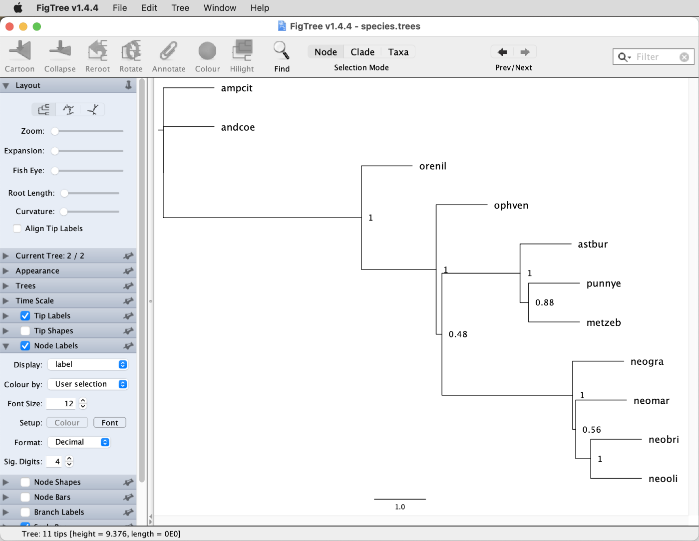
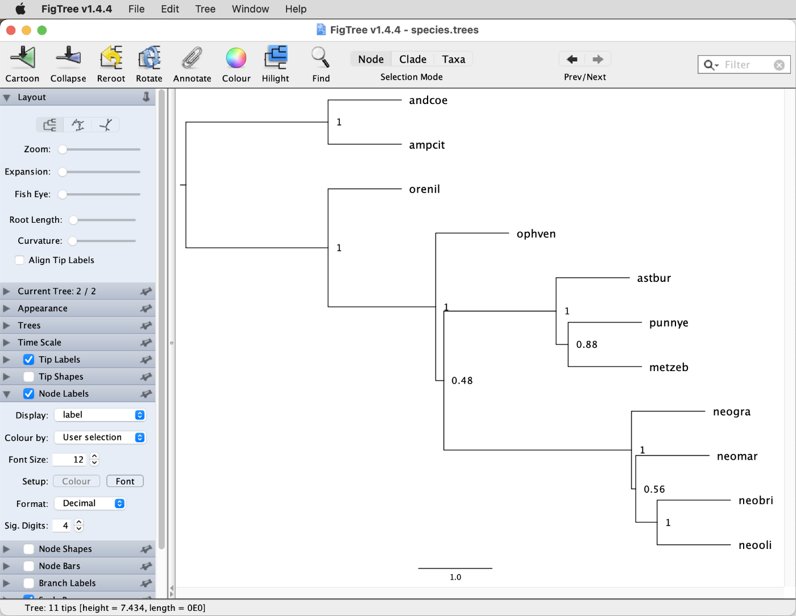
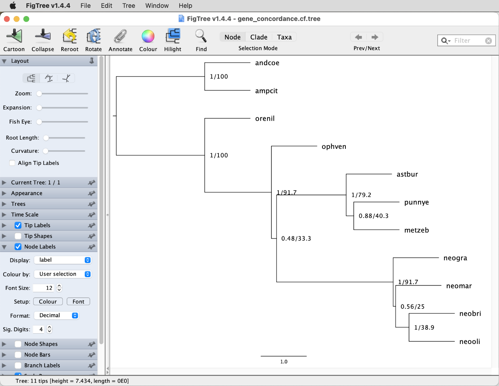

# Maximum-Likelihood Species-Tree Inference

A tutorial on maximum-likelihood species-tree inference based on gene trees 
By [Michael Matschiner](https://evoinformatics.group/team.html#michaelmatschiner)

## Summary

Due to incomplete lineage sorting and recombination, different regions of the genomes of species may differ in their phylogenetic histories. Thus, a set of alignments of sequences from different genomic locations may support not just one but multiple different "gene trees" (this expression is commonly used regardless of whether the sequences actually represent genes or other types of markers). These potential differences among the true gene trees are usually ignored when phylogenetic inference is based on concatenation of multiple alignments. In contrast, differences among gene trees due to incomplete lineage sorting are explicitly accounted for in species-tree inference based on the multi-species-coalescent model. By accounting for these differences, programs implementing the multi-species coalescent model have been shown to be statistically consistent in the presence of incomplete lineage sorting, which is not the case for inference based on concatenation. Thus, phylogeny inference with the multi-species coalescent model is often more reliable than concatenation, particularly when rapidly speciating groups or taxa with large population sizes are investigated.

## Table of contents

* [Outline](#outline)
* [Dataset](#dataset)
* [Requirements](#requirements)
* [Maximum-likelihood gene-tree inference with IQ-TREE](#iqtree)
* [Species-tree inference with ASTRAL](#astral)
* [Concordance analyses with IQ-TREE](#concordance)

## Outline

In this tutorial, I will present how to quickly generate a set of gene trees based on maximum likelihood, using the software [IQ-TREE](http://www.iqtree.org) ([Nguyen et al. 2015](https://doi.org/10.1093/molbev/msu300)). In addition to the maximum-likelihood phylogeny, a set of bootstrap trees will also be generated for each gene. The sets of maximum-likelihood and bootstrap gene trees will then be used jointly for species-tree inference under the multi-species-coalescent model, as implemented in the software [ASTRAL](https://github.com/smirarab/ASTRAL) ([Zhang et al. 2017](https://doi.org/10.1007/978-3-319-67979-2_4)). Finally, the proportion of genes and sites supporting the species tree will be quantified with concordance analyses, again using IQ-TREE.

## Dataset

The dataset used in this tutorial is a set of alignments for 72 genes, extracted from published assemblies through an ortholog detection approach. This dataset includes sequences for eleven cichlid species, two of which represent Neotropical cichlids while the remaining nine species are from Africa. The focus of the taxon set is on cichlids of the rapid radiations in the East African lakes Tanganyika, Malawi, and Victoria. The table below lists all species included in the set of alignments. Note, however, that the sequence data for *Ophthalmotilapia ventralis* were extracted from a transcriptome assembly whereas genome assemblies were available for all other species.

| ID     | Species                         | Tribe          | Distribution    |
|--------|---------------------------------|----------------|-----------------|
| ampcit | *Amphilophus citrinellus*       | Heroini        | Neotropics      |
| andcoe | *Andinoacara coeruleopunctatus* | Cichlasomatini | Neotropics      |
| orenil | *Oreochromis nilotiucs*         | Oreochromini   | African rivers  |
| ophven | *Ophthalmotilapia ventralis*    | Ectodini       | Lake Tanganyika |
| astbur | *Astatotilapia burtoni*         | Haplochromini  | Lake Tanganyika |
| metzeb | *Metriaclima zebra*             | Haplochromini  | Lake Malawi     |
| punnye | *Pundamilia nyererei*           | Haplochromini  | Lake Victoria   |
| neobri | *Neolamprologus brichardi*      | Lamprologini   | Lake Tanganyika |
| neomar | *Neolamprologus marunguensis*   | Lamprologini   | Lake Tanganyika |
| neogra | *Neolamprologus gracilis*       | Lamprologini   | Lake Tanganyika |
| neooli | *Neolamprologus olivaceous*     | Lamprologini   | Lake Tanganyika |

## Requirements

This tutorial requires **FigTree** to be installed. Details about the installation of this tool can be found in tutorial [Bayesian Phylogenetic Inference](../bayesian_phylogeny_inference/README.md).

The following tool is required additionally:

* **ASTRAL:** The program [ASTRAL](https://github.com/smirarab/ASTRAL) ([Zhang et al. 2017](https://doi.org/10.1007/978-3-319-67979-2_4)) allows efficient and accurate estimation of the species tree based on a set of gene trees. ASTRAL is not available as a module on Saga, but it can easily be installed simply by placing it in the analysis directory. This can be done with the following commands:

		wget https://github.com/smirarab/ASTRAL/raw/master/Astral.5.7.7.zip
		unzip Astral.5.7.7.zip
		rm Astral.5.7.7.zip
		
	To run ASTRAL, Java is required, and can be loaded with this command:
	
		module purge
		module load Java/11.0.2
		
	The installation can be tested with this command, which should output the help text of ASTRAL:
	
		java -jar Astral/astral.5.7.7.jar

## Maximum-likelihood gene-tree inference with IQ-TREE

As input for the species-tree analyses with ASTRAL, sets of gene trees are required. These gene trees could be generated with Bayesian approaches such as BEAST2; however, since ASTRAL anyway ignores branch lengths and uses gene-tree topologies only, time calibration of gene trees is not necessary. Thus, we may as well use IQ-TREE to generate gene trees based on maximum likelihood, which is much faster than Bayesian approaches.

* Get the compressed directory `72_genes.tgz` containing the 72 alignments with sequences for the 11 cichlid species, either by copying it from `/cluster/projects/nn9458k/phylogenomics/week2/data` on Saga or by downloading it from GitHub. Thus, use one of these two commands on Saga:

		cp /cluster/projects/nn9458k/phylogenomics/week2/data/72_genes.tgz .
		
	or
	
		wget https://github.com/ForBioPhylogenomics/tutorials/raw/main/week2_data/72_genes.tgz

* Uncompress the directory:

		tar -xzf 72_genes.tgz

* As noted above, sequence data for *Ophthalmotilapia ventralis* ("ophven") was extracted from a transcriptome while all other sequences were from whole-genome assemblies. As it turned out, the transcriptome assembly generated by [Baldo et al. (2011)](https://doi.org/10.1093/gbe/evr047) was rather incomplete. Instead of sequence information, these alignments therefore contain only missing data, coded with the gap symbol "-", for *Ophthalmotilapia ventralis*. Find out how many of the alignments do contain any information for *Ophthalmotilapia ventralis* at all, using the following command:

		cat 72_genes/*.fasta | grep -A 1 ophven | grep -v ophven | grep -e A -e C -e G -e T | wc -l
		
	**Question 1:** How many alignments contain information for *Ophthalmotilapia ventralis*? [(see answer)](#q1)

Since IQ-TREE can not infer the phylogeny from an alignment in which one or more sequences consist only of missing data, we will need to remove the "ophven" sequence from all those alignments in which it contains no information. This means that *Ophthalmotilapia ventralis* will only be included in a subset of the gene trees generated with IQ-TREE; however, this will fortunately not be a problem for the species-tree inference because ASTRAL does not require that all gene trees contain the exact same set of taxa. To remove sequences that contain only missing information from all alignments, and at the same time translate all alignments into Nexus format, we can use the Python script `convert.py`.

* Because the script `convert.py` was already used in the [Bayesian Phylogenetic  Inference](../bayesian_phylogeny_inference/README.md) tutorial, you probably have this script already. If not, download it from GitHub:

		wget https://raw.githubusercontent.com/mmatschiner/anguilla/master/radseq/src/convert.py

* Open a new file named `remove_empty_sequences.sh` with a text editor available on Saga, such as Emacs:

		emacs remove_empty_sequences.sh 

* Write the following content to the new file:

		for fasta in 72_genes/*.fasta
		do
			gene_id=`basename ${fasta%.fasta}`
			python convert.py ${fasta} 72_genes/${gene_id}.nex -f nexus -m 0.9
		done

	(the `-m` option specifies the maximally allowed proportion of missing data per sequence; setting it to 0.9 thus removes all sequences that are less than 10% complete).

* Execute this new script with `srun`:

		module load Python/3.8.2-GCCcore-9.3.0
		srun --ntasks=1 --mem-per-cpu=1G --time=00:01:00 --account=nn9458k --pty bash remove_empty_sequences.sh

	This should have produced a new file in Nexus format for each file in Fasta format in the directory `72_genes`. These new files in Nexus format contain the same sequences as the corresponding files in Fasta format except that completely missing sequences have been removed.
	
* Make sure that directory `72_genes` now contains 72 files in Nexus format:

		ls 72_genes/*.nex | wc -l

We can now use IQ-TREE to generate maximum-likelihood gene trees for all alignments. To be able to later use bootstrapping with ASTRAL, we will also generate sets of trees from bootstrapped gene alignments in the same IQ-TREE analysis, by using the IQ-TREE option `-B`. Instead of specifying a substition model with the `-m` option, we allow IQ-TREE to automatically select the best-fitting model (this is the default when `-m` is not used). We will ensure that the bootstrap trees are actually written to a file, and not just summarized in the output, by specifying the option `--wbt`. To start IQ-TREE in a loop so that it analyzes one gene alignment after the other, we need to write another short script.

* Open a new file named `run_iqtree.sh` and write the following commands to it:

		for nex in 72_genes/*.nex
		do
			iqtree2 -s ${nex} -B 1000 --wbt
		done
		
* Execute this script with `srun`:

		module load IQ-TREE/2.1.2-foss-2020a
		srun --ntasks=1 --mem-per-cpu=1G --time=00:10:00 --account=nn9458k --pty bash run_iqtree.sh

	The 72 IQ-TREE analyses should finish within a few minutes.
	
* The IQ-TREE analyses will have generated a number of files for each gene, containing run info, a distance matrix, starting trees, and so on. The only output files required for our further analyses are those ending in `.treefile` (the maximum-likelihood gene trees with branch lengths) and `.ufboot` (the set of bootstrap trees without branch lengths). To clean up the directory and keep only the important files, use the following commands:

		rm 72_genes/*.bionj
		rm 72_genes/*.ckp.gz
		rm 72_genes/*.contree
		rm 72_genes/*.iqtree
		rm 72_genes/*.log
		rm 72_genes/*.mldist
		rm 72_genes/*.model.gz
		rm 72_genes/*.splits.nex
		rm 72_genes/*.uniqueseq.phy		

* Next, have a look at one of the files containing the maximum-likelihood trees, e.g. with `less`:

		less 72_genes/ENSDARG00000002952.nex.treefile
	
	As you'll see, this file contains only a single line with the maximum-likelihood tree for gene ENSDARG00000002952 in Newick format.
	
* Since ASTRAL will require as input a single file containing all gene trees, combine all files with maximum-likelihood trees into a single file named `ml_best.trees`, using the following command:

		cat 72_genes/*.treefile > ml_best.trees

* To further clean up the directory, you could then also remove all files that contain the maximum-likelihood trees for single genes, using

		rm 72_genes/*.treefile

## Species-Tree Inference with ASTRAL

ASTRAL infers the species tree by searching for the topology that agrees with the largest number of species quartets included in the set of gene trees. In addition, branch lengths are estimated in coalescent units based on the number of quartets that are in conflict with a branch of the species tree. Unlike concatenation, the species-tree approach of ASTRAL has been shown to be statistically consistent under the multi-species coalescent model ([Mirarab et al. 2014](https://doi.org/10.1093/bioinformatics/btu462)), meaning that its species-tree estimate is guaranteed to converge to the correct species tree with increasing size of the dataset. However, this statistical consistency is based on the assumption that gene-tree topologies are inferred without error, which may often not be the case. Thus, one might want to take uncertainty in the gene trees into account, which can be done with the sets of bootstrap trees for each gene. In this case, ASTRAL uses the maximum-likelihood trees to infer the species-tree topology and branch lengths, and additional analyses of the bootstrap trees are used to quantify node support as the proportions of these trees supporting a given node. However, newer versions of ASTRAL are also able to quantify node support completely without bootstrapped trees, based on the maximum-likelihood gene trees alone. Thus, uncertainty in the gene trees is then not taken into account at all. Nevertheless, according to the authors ([Sayyari and Mirarab 2016](https://doi.org/10.1093/molbev/msw079)), simulations have shown that this approach works just as well as or even better than the first approach based on bootstrapped trees. Here, we will test both approaches for quantifying node support with ASTRAL.

* We'll first use the set of bootstrapped trees to estimate node support on the species tree. To do so, ASTRAL requires as input a single file with the names of all the files containing bootstrapped trees. We can generate such a file with the following command:

		ls 72_genes/*.ufboot > ml_boot.txt
		
* We can then run ASTRAL with two input files: The file containing the maximum-likelihood trees for each gene (`ml_best.trees`), and the file containing the names of all files with bootstrapped trees (`ml_boot.txt`). The first of these is to be specified with ASTRAL's option `-i`, and the second should be given with option `-b`. In addition, we'll use option `-o` to set the name of the output file to `species_boot.trees`:

		module load Java/11.0.2
		srun --ntasks=1 --mem-per-cpu=1G --time=00:01:00 --account=nn9458k --pty java -jar Astral/astral.5.7.7.jar -i ml_best.trees -b ml_boot.txt -o species_boot.trees
		
	ASTRAL should finish this analysis within a few seconds.

* Have a look at the output file `species_boot.trees`, e.g. using `less`:

		less species_boot.trees

	You'll see that this files contains trees, one on each line.
	
* Count the number of lines in file `species_boot.trees`:

		cat species_boot.trees | wc -l

	You'll see that it contains 102 lines. The first 100 of these lines represent species trees in Newick format estimated for each the first 100 bootstrapped trees of each gene (by default, ASTRAL uses only these; if we wanted to use more than 100 bootstrap trees per gene we would need to use the `-r` option, e.g. `-r 1000`). On line 101 is a consensus tree for these 100 trees. Finally, the last line contains the species tree estimated from the maximum-likelihood gene trees, annotated with node support based on the bootstrap trees. Thus, the last line contains the species tree that we'll use for interpretation.

* However, before visualizing the species tree in FigTree, first conduct the second ASTRAL analysis based on the maximum-likelihood trees alone. Do so using the following command:

		srun --ntasks=1 --mem-per-cpu=1G --time=00:01:00 --account=nn9458k --pty java -jar Astral/astral.5.7.7.jar -i ml_best.trees -o species_pp.tre
		
	The output file named `species_pp.tre` now contains just a single species tree, annotated with posterior probabilities as node support.
	
* Since we are interested only in the last of the trees from file `species_boot.trees` as well as the tree from file `species_pp.tre`, we'll generate a new file named `species.trees` that contains both of these two trees using the following commands:
		
		tail -n 1 species_boot.trees > species.trees
		cat species_pp.tre >> species.trees
		
* Download the file `species.trees` to your local computer with `scp` and open it in FigTree. When prompted that "The node/branches of the tree are labelled", justclick "OK". This will mean that the  node support values are referred to as "label" in FigTree. Click on "Decreasing Node Order" in the "Tree" menu to orient the tree, set a tick next to "Node Labels", click the triangle next to "Node Labels", and then select "label" from the drop-down menu next to "Display:" to display support values as node labels. The FigTree window should then appear more or less as shown in the next screenshot. Note that depending on the randomly chosen starting points of the IQ-TREE analyses, slightly different gene trees may have been generated in your analysis and may also have led to a species tree that is not exactly identical to the one shown here.

* As you can see in the top left of the window next to "Current Tree:", the displayed tree is the first out of two. The one shown in the screenshot above is the tree with node-support values based on bootstrapping. To see the next tree, click on the "Next" button near the top right of the window. This should display the tree with node-support values based only on the maximum-likelihood gene trees, as shown in the next screenshot.

Unsurprisingly, the phylogeny itself is identical between the two trees, because the species tree is in both cases inferred from the maximum-likelihood gene trees. Perhaps more surprisingly, the node-support values correlate very strongly between the two trees, indicating that ASTRAL in fact does not require bootstrapping to estimate node support.

	**Question 2:** Do the taxonomic groups of cichlids, as listed in the table at the beginning of this tutorial, appear monophyletic in the species tree estimated by ASTRAL? [(see answer)](#q2)

## Concordance analyses with IQ-TREE

Recent versions of IQ-TREE (from v.1.7) ([Minh et al. 2020](https://doi.org/10.1093/molbev/msaa106)) have a useful feature that allows the quick calculation of concordance factors, indicating how well each gene, or each site of the alignments, agrees with a certain topology. A very helpful description of these features can be found on [Robert Lanfear's blog](http://robertlanfear.com/blog/files/concordance_factors.html). In brief, gene-concordance factors (gCF) quantify the proportion of trees of a certain set of gene trees that contain a particular node of a user-provided reference tree. Similarly, site-concordance factors (sCF) indicate the proportion of sites in an alignment that support each node of the reference tree (specifically, at each site, the support for a node is compared with the support for two alternative topologies, and the site is said to support the node if it agrees better with the current topology than with the two alternatives).

* Let's first check how many of the maximum-likelihood gene trees support each individual node in the species tree produced by ASTRAL. This can be done with the following command, in which we specify the reference tree with `-t`, provide a prefix for output files with `--prefix`, and activate the analysis of gene-concordance factors with the `--gcf` option, followed by the name of the file containing gene trees. Execute this command on Saga:

		srun --ntasks=1 --mem-per-cpu=1G --time=00:01:00 --account=nn9458k --pty iqtree2 -t species_pp.tre --gcf ml_best.trees --prefix gene_concordance

	The IQ-TREE output should report that a tree with concordance factors was written to file `gene_concordance.cf.tree`.
	
* Download file `gene_concordance.cf.tree` with `scp`, open it in FigTree, orient the tree, and select "label" to display as node labels. The tree should then appear as shown in the next screenshot.

	You'll see that two types of support values are shown for each node, separated by forward slashes. The first of these values are familiar, these are the posterior probabilities that were calculated by ASTRAL when we ran it with the maximum-likelihood gene trees alone instead of using the bootstrap trees. Thus, these values do not result from the concordance analysis with IQ-TREE, but they are shown because IQ-TREE found them in the reference-tree file `species_pp.tre`. The values after the forward slashes, however, are the gene-concordance factors calculated by IQ-TREE from the set of gene trees in file `ml_best.trees`. As you can see the gCF values appear to correlate with ASTRAL's posterior probabilities but are generally lower. For example, it appears that only about 40% of the gene trees support the sister-group relationship between *Neolamprologus brichardi* ("neobri") and *Neolamprologus olivaceous* ("neooli") even though ASTRAL estimated the posterior probability of this relationship close to 1. This is not necessarily a contradiction, though, because incomplete lineage sorting, which is accounted for by ASTRAL, is expected to lead to disagreement between the species tree and gene trees particularly for rapidly diverging species.
	
* To also calculate site-concordance factors, we'll first need to generate a concatenated version of all gene alignments. We can do that with the Ruby script `concatenate.rb`, which you probably already used in another tutorial. If not, download it from GitHub:

		wget https://raw.githubusercontent.com/mmatschiner/anguilla/master/radseq/src/concatenate.rb

* Concatenate all 72 alignments using the script by executing it with `srun`:

		module load Ruby/2.7.2-GCCcore-9.3.0
		srun --ntasks=1 --mem-per-cpu=1G --time=00:01:00 --account=nn9458k --pty ruby concatenate.rb -i 72_genes/*.nex -o 72_genes.nex -f nexus

	(`-i` specifies the set of gene alignments, `-o` specifies the name of the concatenated output file, and `-f` specifies the format of the output file).
	
* Have a look at the concatenated file `72_genes.nex` using `less`:

		less 72_genes.nex
		
	**Question 3:** How many sites are now included in the concatenated alignment? [(see answer)](#q3)
	
* By specifying the concatenated alignment with the `-s` option and by activating the calculation of site-concordance factors with the `--scf` option, followed by a maximum number of species quartets to be considered in the analysis (100 is by far sufficient), we can now calculate gene and site-concordance factors in the same IQ-TREE analysis with the following command:

		srun --ntasks=1 --mem-per-cpu=1G --time=00:01:00 --account=nn9458k --pty iqtree2 -t species_pp.tre --gcf ml_best.trees -s 72_genes.nex --scf 100 --prefix gene_and_site_concordance

* Download file `gene_and_site_concordance.cf.tree` and open it in FigTree. Again orient the tree and select "label" to display as node labels. The tree should then appear as shown in the next screenshot.

	You'll see that three different support values are now shown for each node, these are the posterior probabilities from ASTRAL, the gene-concordance factors, and the site-concordance factors.  
	
	**Question 4:** Which proportion of sites supports the monophyly of Lamprologini? [(see answer)](#q4)

 

                   

## Answers

* **Question 1:** As you'll see from the screen output of the command, only twelve alignments contain sequence information for *Ophthalmotilapia ventralis*.

* **Question 2:** In fact, all tribes appear monophyletic in the ASTRAL species tree, and so do Neotropical cichlids (comprising *Amphilophus citrinellus*, "ampcit", and *Andinoacara coeruleopunctatus*, "andcoe") as well as African cichlids (all remaining species). However, the ASTRAL species tree does not answer whether or not *Ophthalmotilapia ventralis* ("ophven") is the sister group to Haplochromini plus Lamprologini, or whether it is closer to one of the two tribes. Adding further sequence data for *Ophthalmotilapia ventralis*, for which only twelve gene sequences were used for the analysis, would probably help to infer its position more reliably. The species tree further supports a nested position of Lake Malawi and Lake Victoria species (*Metriaclima zebra*, "metzeb", and *Pundamilia nyererei*, "punnye", respectively) within the Lake Tanganyika radiation, a pattern that has long been known ([Salzburger et al. 2005](https://doi.org/10.1186/1471-2148-5-17)).

* **Question 3:** The number following the "nchar" keyword on the fourth line indicates that 73,623 sites are included in the concatenated alignment.

* **Question 4:** As shown in the table at the beginning of this tutorial, the tribe called Lamprologini is in our dataset represented by four species: *Neolamprologus brichardi* ("neobri"), *Neolamprologus marunguensis* ("neomar"), *Neolamprologus gracilis* ("neogra"), and *Neolamprologus olivaceous* ("neooli"). The most ancestral node among the four species has the label "1/91.7/94.3", meaning that 91.7% of the gene trees (66 of the 72 trees) and 94.3% of the alignment sites support this node.