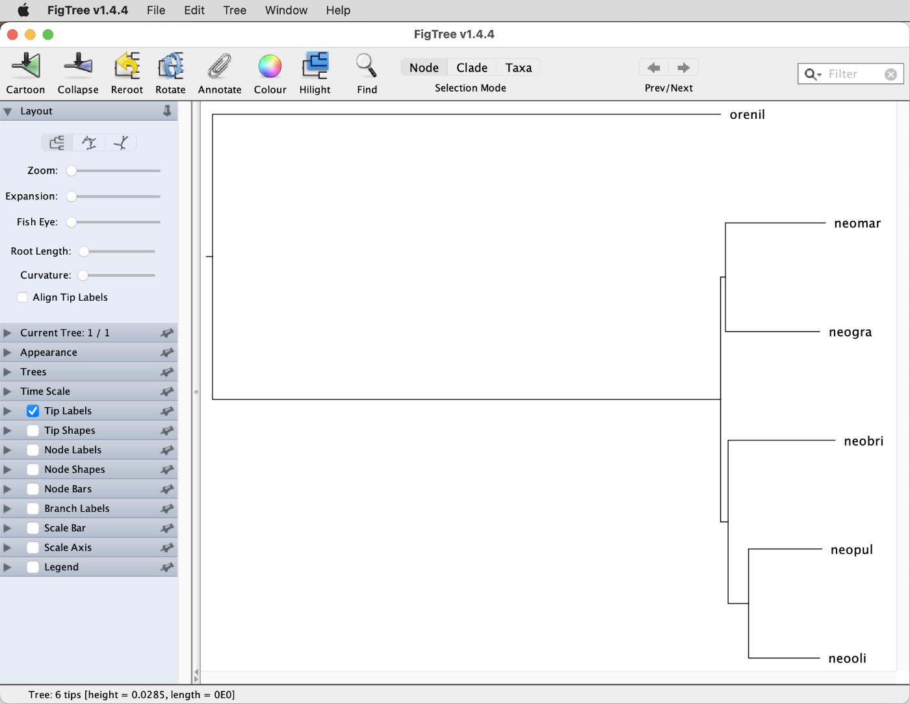

# Whole Genome Alignment

A tutorial on multiple whole genome alignment with Cactus 
By Ole K. Tørresen and Michael Matschiner

## Summary

Large scale projects such as Earth BioGenome Project ([Lewin et al. (2018)](https://doi.org/10.1073/pnas.1720115115)), the Vertebrate Genomes Project ([Rhie et al. (2021)](https://doi.org/10.1038/s41586-021-03451-0)), and other similar efforts, aspire to sequence and assemble the genomes of all living species. More and more high quality genome assemblies are therefore being deposited in public databases, and these resources contain great potential and enable rigorous investigation into a multitude of aspects of biology through data - and curiosity driven research. The further generation of high-quality genomes will hopefully facilitate great leaps in our understanding of, and ability to answer, core questions within fundamental biology such as in ecology and evolution, and in other fields such as medicine.

However, to actually understand these genomes, we need some way of analysing them comparatively. For smaller projects, sequencing and assembling a few species, annotating and analysing each can be done focussing on each in turn. However, for large projects such as Zoonimia (131 new genome assemblies) ([Zoonomia Consortium (2020)](https://doi.org/10.1038/s41586-020-2876-6)) or bird 10k (B10K; 267 new genome assemblies) ([Feng et al. (2020)](https://doi.org/10.1038/s41586-020-2873-9)), using that much time and effort on each genome is not scalable, and therefore they used whole-genome alignments to analyse their datasets. So far, the only whole-genome aligner that has been used successfully on such large datasets is Cactus ([Armstrong et al. 2020](https://doi.org/10.1038/s41586-020-2871-y)).

## Table of contents

* [Outline](#outline)
* [Dataset](#dataset)
* [Requirements](#requirements)
* [Softmasking with Red](#softmask)
* [Data subsetting](#subset)
* [Creating a guide tree with Mash](#mash)
* [Running Cactus](#cactus)

## Outline

In this tutorial we will produce a whole-genome alignment for six genome assemblies of varying quality. This requires masking repeats in the genomes and a providing a guide tree of the species involved. Due to the large computational requirements of whole-genome alignment, it may not be possible to run the full Cactus analysis, but all intermediate and final files are available on Saga.

## Dataset

The dataset used in this tutorial consists of genome assemblies for a subset of the species that were used in tutorial [Bayesian Species-Tree Inference](../bayesian_species_tree_inference/README.md). The rather fragmented genome assemblies for four species of the cichlid genus *Neolamprologus* (*N. marunguensis*, *N. gracilis*, *N. olivaceous*, and *N. pulcher*) were produced from Illumina sequencing data by [Gante et al. (2016)](https://doi.org/10.1111/mec.13767). Additionally, a fifth genome assembly for *Neolamprologus brichardi* had been released earlier by [Brawand et al. (2014)](https://doi.org/10.1038/nature13726). The five *Neolamprologus* species co-occur in Lake Tanganyika in East Africa. Finally, the chromosome-level genome assembly for Nile tilapia, *Oreochromis niloticus*, is used as an outgroup and was published by [Conte et al. (2019)](https://doi.org/10.1093/gigascience/giz030).

| ID      | Species                       | Distribution           |
|---------|-------------------------------|------------------------|
| neobri  | *Neolamprologus brichardi*    | Lake Tanganyika        |
| neomar  | *Neolamprologus marunguensis* | Lake Tanganyika        |
| neogra  | *Neolamprologus gracilis*     | Lake Tanganyika        |
| neooli  | *Neolamprologus olivaceous*   | Lake Tanganyika        |
| neopul  | *Neolamprologus pulcher*      | Lake Tanganyika        |
| orenil  | *Oreochromis niloticus*       | Central African rivers |

## Requirements

This tutorial requires the programs **Red**<!--http://toolsmith.ens.utulsa.edu/-->, **Minimap2**, **seqtk**, **Samtools**, **Mash**<!--(https://github.com/marbl/Mash)-->, **RapidNJ**<!--https://github.com/somme89/rapidNJ-->. All of these tools are available as modules on Saga. However, we will run Red through the Python script **redmask.py**, for which the following steps are required:

* **redmask.py**: Download the script `redmask.py` from [its GitHub repository](https://github.com/nextgenusfs/redmask) to your working directory on Saga, using `wget`:

		wget https://raw.githubusercontent.com/nextgenusfs/redmask/master/redmask.py
		
	Because `redmask.py` uses the deprecated `xrange`, it might be worth to fix this so that the script runs without an error. To do so, use the following command, which replace all occurrences of "xrange" with "range":
	
		sed -i 's/xrange/range/g' redmask.py

	As `redmask.py` requires a Python package that is not readily available on Saga, you will need to install this package locally (for you as a user), do this:

		module purge
		module load Biopython/1.72-foss-2018b-Python-3.6.6
		pip3 install natsort --user

Additionally, the program Cactus is required:

* **Cactus**: The program [Cactus](https://github.com/ComparativeGenomicsToolkit/cactus) is not available as a module on Saga, and is best used within a [Singularity](https://apptainer.org) container, as its installation is far from trivial. In your working directory on Saga, obtain the Cactus container for Singularity with the following command:

		singularity pull --name cactus-v2.2.3.sif docker://quay.io/comparative-genomics-toolkit/cactus:v2.2.3

## Softmasking with Red

To create an alignment, two sequences need to be compared in some manner. The classic algorithms for pairwise alignment are [Smith-Waterman](https://en.wikipedia.org/wiki/Smith%E2%80%93Waterman_algorithm) and [Needleman-Wunsch](https://en.wikipedia.org/wiki/Needleman%E2%80%93Wunsch_algorithm), for respectively "local" and "global" alignments. In local alignment, the most similar part is found between two input sequences, while a global alignment compares both input sequences from end to end. However, the computational demands of these algorithms prevent their application to longer sequences such as full chromosomes. To circumvent this issue, different approaches have been developed, such as [BLAST](https://en.wikipedia.org/wiki/BLAST_(biotechnology)), where "words" (substrings of the sequences) are connected to the sequences and only sequences with words in common are compared.

Repetitive sequences are sequences that are identical or very similar, occurring at multiple locations in a genome. For instance, repetitive sequences include microsatellites or transposable elements that copied themselves across the genome. These repetitive sequences will lead to large numbers of comparisons in alignments unless they are removed from the analysis in some way. The usual approach to do so is by "masking" them. "Hard masking" means that repetitive regions of the genome are replaced with "N"s so that sequence information is effectively removed, while "soft masking" retains all sequence information, but marks repetitive sequences with lower case letters (standard Fasta format uses upper case letters). Even though the sequence information is still present with soft masking, alignment programs are usually written so that they recognize these masked regions and do not initiate alignments within such regions. However, alignments initiated outside of softmasked regions can be extended into these regions, which thus leads to less fragmented alignments.

One of the most common approaches for repeat masking is to create a species specific repeat library with [RepeatModeler](http://www.repeatmasker.org/RepeatModeler/) ([Flynn et al (2020)](https://doi.org/10.1073/pnas.1921046117)) and to use that library to mask the genome with [RepeatMasker](https://www.repeatmasker.org/). The combination of these two tools is computationally rather demanding, though. For example, running both programs for a bird genome (about 1 Gbp) took around over 20 hours with 40 CPUs. While the combination of RepeatModeler and RepeatMasker may be the best option for users interested in the repeats themselves (asking, for example, where certain transposable elements in the genome), running these tools is not required when the goal is merely to mask the repeats, as it is here. In that case, the program Red ([Giris 2015](https://doi.org/10.1186/s12859-015-0654-5)) is a much faster solution. We will run Red via the Python script [redmask.py](https://github.com/nextgenusfs/redmask).

* First have a look at the help text of the script `redmask.py`:

		module purge
		module load Biopython/1.72-foss-2018b-Python-3.6.6
		python3 redmask.py -h

	As you might recognize from this help text, the usage of the script is rather straight forward. The only two arguments required are `-i` for the input genome assembly in Fasta format and `-o` for the name of the output file.

* Copy the directory with the six input genome assemblies to your working directory. The path to this directory on Saga is `/cluster/projects/nn9458k/phylogenomics/week2/data/cichlid_assemblies`. Thus, copy it with this command:

		cp -r /cluster/projects/nn9458k/phylogenomics/week2/data/cichlid_assemblies .

	Alternatively (and this is here listed only for completeness), the genomes could also be obtained from online repositories with the following commands:
	
		# Make the assembly directory.
		mkdir cichlid_assemblies
		
		# Download the genome assembly of Neolamprologus brichardi.
		wget ftp://ftp.ncbi.nlm.nih.gov/genomes/all/GCF/000/239/395/GCF_000239395.1_NeoBri1.0/GCF_000239395.1_NeoBri1.0_genomic.fna.gz
		zcat GCF_000239395.1_NeoBri1.0_genomic.fna.gz | cut -f 1 -d " " > neobri.fasta
		
		# Download the genome assembly of Neolamprologus marunguensis.
		wget http://evoinformatics.group/repos/neolamprologus/Ma.scf.fasta.gz
		gunzip Ma.scf.fasta.gz
		mv Ma.scf.fasta neomar.fasta
		
		# Download the genome assembly of Neolamprologus gracilis.
		wget http://evoinformatics.group/repos/neolamprologus/Gr.scf.fasta.gz
		gunzip Gr.scf.fasta.gz
		mv Gr.scf.fasta neogra.fasta
		
		# Download the genome assembly of Neolamprologus olivaceous.
		wget http://evoinformatics.group/repos/neolamprologus/Ol.scf.fasta.gz
		gunzip Ol.scf.fasta.gz
		mv Ol.scf.fasta neooli.fasta

		# Download the genome assembly of Neolamprologus pulcher.
		wget http://evoinformatics.group/repos/neolamprologus/Pu.scf.fasta.gz
		gunzip Pu.scf.fasta.gz
		mv Pu.scf.fasta neopul.fasta
		
		# Download the genome assembly of Oreochromis niloticus.
		wget ftp://ftp.ncbi.nlm.nih.gov/genomes/all/GCF/001/858/045/GCF_001858045.2_O_niloticus_UMD_NMBU/GCF_001858045.2_O_niloticus_UMD_NMBU_genomic.fna.gz
		zcat GCF_001858045.2_O_niloticus_UMD_NMBU_genomic.fna.gz | cut -f 1 -d " " > orenil.fasta

* Write a new Slurm script named `run_red.slurm` with the following content to run the `redmask.py` script:

		#!/bin/bash

		# Job name:
		#SBATCH --job-name=red
		#
		# Wall clock limit:
		#SBATCH --time=2:00:00
		#
		# Processor and memory usage:
		#SBATCH --mem-per-cpu=20G
		#SBATCH --nodes=1
		#SBATCH --ntasks-per-node=1
		#
		# Accounting:
		#SBATCH --account=nn9458k

		# Set up job environment.
		set -o errexit  # Exit the script on any error
		set -o nounset  # Treat any unset variables as an error
		module --quiet purge  # Reset the modules to the system default

		# Load modules.
		module load Biopython/1.72-foss-2018b-Python-3.6.6
		module load Red/2015-05-22-GCC-7.3.0-2.30

		# Get the command-line arguments.
		fasta=`readlink -f ${1}`
		masked_fasta=`readlink -f ${2}`

		# Copy the redmask script to a temporary directory.
		cp redmask.py ${SCRATCH}

		# Move to the temporary directory.
		cd ${SCRATCH}

		# Run redmask.py.
		python3 redmask.py -i ${fasta} -o ${masked_fasta}

	Note that the script contains commands to move to a temporary directory before running `redmask.py` (`cd ${SCRATCH}`). This is because Red produces a large number of small files which would exceeded the quota for the course if they would accumulate in the course directory.

* To submit the Slurm script `run_red.slurm` in parallel for all six assemblies, write another new script named `run_red.sh` with the following content:

		mkdir cichlid_assemblies_masked
		for fasta in cichlid_assemblies/*.fasta
		do
			fasta_id=`basename ${fasta$.fasta}`
			masked_fasta=cichlid_assemblies_masked/${fasta_id}
			log=run_red.${fasta_id}.out
			sbatch -o ${log} run_red.slurm ${fasta} ${masked_fasta}
		done

* Then, execute the script `run_red.sh` (which then internally runs `run_red.slurm`, which in turn runs `redmask.py`):

		bash run_red.sh

	This should take between 20 and 40 minutes to finish. But since the next part of this tutorial does not use the softmasked assemblies produced by Red, you can already continue with this next part. Nevertheless, if you should be unable to run Red for some reason, you can also obtain prepared softmasked assemblies from `/cluster/projects/nn9458k/phylogenomics/cichlid_assemblies_masked`:

		cp -r /cluster/projects/nn9458k/phylogenomics/cichlid_assemblies_masked .

## Data subsetting

As Cactus is computationally highly demanding (see discussion below), producing a complete whole-genome alignment of the six assemblies might take several days and is not feasible for this course. However one way to reduce the computational demand is to subset the assemblies first, keeping only those contigs that map to a certain chromosome of one of the species included in the analysis. In our case, the genome for *Oreochromis niloticus* ("orenil") is assembled to chromosome-level, and thus a suitable reference for this type of data subsetting. We'll pick chromosome 5 of this genome, and thus keep all contigs of the other species that map to this chromosome. Note, that this could in principle be done with all other chromsomes simultaneously, so that we could parallelize the whole-genome alignment, using one Cactus job for each chromosome. This would reduce the overall run time as well as the memory requirements for a complete whole-genome alignment. But for this tutorial, using data from a single chromosome will be more than sufficient.

* Write a new Slurm script named `run_minimap2.slurm`, with the following content:

		#!/bin/bash

		# Job name:
		#SBATCH --job-name=minimap2
		#
		# Wall clock limit:
		#SBATCH --time=1:00:00
		#
		# Processor and memory usage:
		#SBATCH --mem-per-cpu=2G
		#SBATCH --nodes=1
		#SBATCH --ntasks-per-node=10
		#
		# Accounting:
		#SBATCH --account=nn9458k

		# Set up job environment.
		set -o errexit  # Exit the script on any error
		set -o nounset  # Treat any unset variables as an error
		module --quiet purge  # Reset the modules to the system default

		# Load modules.
		module load minimap2/2.17-GCC-8.3.0

		# Get the command-line argument.
		fasta=${1}

		# Run minimap2.
		minimap2 -t 10 -cx asm20 cichlid_assemblies/orenil.fasta ${fasta} > ${fasta%.fasta}_to_orenil.paf

* Then, execute this Slurm script script for each of the *Neolamprologus* assemblies in parallel:

		for fasta in cichlid_assemblies/neo*.fasta
		do
			fasta_id=`basename ${fasta%.fasta}`
			sbatch -o run_minimap2.${fasta_id}.out run_minimap2.slurm ${fasta}
		done

	This should take around 5 minutes.

* Once the Minimap2 runs have finished, five files with the ending `.paf` should be added to the directory `cichlid_assemblies`. Make sure that this is the case:

		ls cichlid_assemblies/*.paf

So far, no data subsetting has taken place. Instead, we only mapped all contigs of the five *Neolamprologus* species to the genome assembly of *Oreochromis niloticus* ("orenil"). But through this mapping, Minimap2's output files in PAF format (those ending in `.paf`) store the information connecting contigs to *Oreochromis niloticus* ("orenil") chromosomes, and this information will allow us to subset those contigs that map to chromosome 5.

* Have a look at the content of one of Minimap2's output files, for example `neobri_to_orenil.paf`, using `less -S`:

		less -S cichlid_assemblies/neobri_to_orenil.paf
		
	**Question 1:** Can you figure out what information is stored in this file? [(see answer)](#q1)

* To subset the contigs that map to chromosome 5 of *Oreochromis niloticus* ("orenil"), we'll first need to identify the IDs of these contigs from the files in PAF format. In the assembly file `orenil.fasta`, chromsome 5 has the ID "NC_031970.2". To identify the IDs of contigs that map to this chromosome, write a new Slurm script named `identify_contigs_from_paf.slurm` with the following content:

		#!/bin/bash

		# Job name:
		#SBATCH --job-name=ident_paf
		#
		# Wall clock limit:
		#SBATCH --time=0:10:00
		#
		# Processor and memory usage:
		#SBATCH --mem-per-cpu=1G
		#SBATCH --nodes=1
		#
		# Accounting:
		#SBATCH --account=nn9458k

		# Set up job environment.
		set -o errexit  # Exit the script on any error
		set -o nounset  # Treat any unset variables as an error
		module --quiet purge  # Reset the modules to the system default

		# Get the command-line arguments.
		paf=${1}

		# Identify ids of contigs mapping to chromosome 5 of orenil.
		grep NC_031970.2 ${paf} \    # Keep only lines that contain the ID of chromosome 5
		  | awk '$12 > 50' \         # Keep only lines with an alignment quality is above 50
		  | awk '$11 > 5000' \       # Keep only lines with an alignment length above 5000
		  | cut -f 1 \               # Keep only the first column of remaining lines
		  | sort -u > ${paf%.paf}_chr5_contig_ids.txt

* Then, submit the Slurm script `identify_contigs_from_paf.sh` five times, with each PAF-format file as input:

		for paf in cichlid_assemblies/*.paf
		do
			paf_id=`basename ${paf%_to_orenil.paf}`
			sbatch -o identify_contigs_from_paf.${paf_id} identify_contigs_from_paf.slurm ${paf}
		done
	
	These jobs should finish within seconds.

	**Question 2:** How many contigs map to chromosome 5 of *Oreochromis niloticus* ("orenil"), per species? [(see answer)](#q2)

As a next step, we'll need to extract those contigs from each of the *Neolamprologus* genomes that map to chromosome 5 of *Oreochromis niloticus* ("orenil"). We will do this with the [SeqTK](https://github.com/lh3/seqtk) toolkit by Heng Li. And importantly, we'll extract the contigs from the softmasked versions of the genome assemblies.

* Copy the Slurm script `identify_contigs_from_paf.slurm` to a new file named `extract_identified_contigs.slurm`:

		cp identify_contigs_from_paf.slurm extract_identified_contigs.slurm
		
* Open file `extract_identified_contigs.slurm` with a text editor, change the job name on line 4, and edit the last part of the script (after line 20), so that it has the following content:

		#!/bin/bash

		# Job name:
		#SBATCH --job-name=extract_ids
		#
		# Wall clock limit:
		#SBATCH --time=0:10:00
		#
		# Processor and memory usage:
		#SBATCH --mem-per-cpu=1G
		#SBATCH --nodes=1
		#
		# Accounting:
		#SBATCH --account=nn9458k
		
		# Set up job environment.
		set -o errexit  # Exit the script on any error
		set -o nounset  # Treat any unset variables as an error
		module --quiet purge  # Reset the modules to the system default

		# Load modules.
		module load seqtk/1.3-foss-2018b

		# Get the command-line arguments.
		fasta=${1}
		id_list=${2}
		chr5_fasta=${3}
		
		# Extract contigs mapping to chromosome 5 of orenil.
		seqtk subseq ${fasta} ${id_list} > ${chr5_fasta}

* Use the following commands to submit the Slurm script `extract_identified_contigs.slurm` with for every softmasked *Neolamprologus* genome assembly:

		mkdir cichlid_assemblies_masked_chr5
		for fasta in cichlid_assemblies_masked/neo*.softmasked.fa
		do
			fasta_id=`basename ${fasta%.softmasked.fa}`
			id_list=cichlid_assemblies/${fasta_id}_to_orenil_chr5_contig_ids.txt
			chr5_fasta=cichlid_assemblies_masked_chr5/${fasta_id}.softmasked.chr5.fasta
			sbatch -o extract_identified_contigs.${fasta_id}.out extract_identified_contigs.slurm ${fasta} ${id_list} ${chr5_fasta}
		done

	These jobs should take 1-10 minutes to finish.
	
* Finally, we'll also need to extract chromosome 5 from the *Oreochromis niloticus* ("orenil") assembly itself, which we can do with the program [Samtools](https://www.htslib.org) ([Li et al. 2009](https://doi.org/10.1093/bioinformatics/btp352)).

		module purge
		module load SAMtools/1.15.1-GCC-11.3.0
		srun --ntasks=1 --mem-per-cpu=1G --time=00:10:00 --account=nn9458k samtools faidx cichlid_assemblies_masked/orenil.softmasked.fa NC_031970.2 > cichlid_assemblies_masked_chr5/orenil.softmasked.chr5.fasta

	The directory `cichlid_assemblies_masked_chr5` should now contain six Fasta files with a data subset corresponding to chromosome 5 of *Oreochromis niloticus* ("orenil").

## Creating a guide tree with Mash

In addition to softmasked genome assemblies, Cactus requires a guide tree to perform the whole-genome alignment. This is because for computational reasons it does not align all genomes at once, but applies an iterative process instead. Thus, the program begins by aligning the most-closely related genomes to each other, uses this pairwise alignment to reconstruct the ancestral genome of their common ancestor, and then proceeds by aligning that reconstructed genome to the next-closely related one. By progressing in this way, the computational demands of Cactus scale linear with the number of genomes and not quadratically, as would have been the case if all genomes were compared against all.

Providing a guide tree to produce an alignment may sound circular, because the alignment is often required for exactly the purpose of building a phylogeny. Thus, one might worry that the guide tree that is used influences the alignment, and that this in turn biases the phylogeny that is produced from the alignment, so that this phylogeny may then just be the same as the guide tree again. However, the influence of the guide tree on the alignment is usually not very strong, so that the phylogeny produced with the alignment is largely independent of the guide tree that was used. Thus, if any phylogenetic hypothesis is available (e.g. from previous studies), this hypothesis can be used to provide a guide tree, usually without having to worry that it might bias the outcome. But if this is not the case, an elegant alternative (that is completely free of circularity) is to produce a guide tree not on the basis of an alignment, but based on the similarity of the [k-mer](https://en.wikipedia.org/wiki/K-mer) profiles of genome assemblies.

One convenient tool for the fast calculation and comparison of k-mer profiles is the program Mash ([Ondov et al. 2016](https://doi.org/10.1186/s13059-016-0997-x)). Mash reduces large sequences to compressed "sketch representations", enabling much quicker comparisons between sequences compared to older methods. We are going to use two functions of Mash, "sketch" to produce a sketch representation of each of the six unmasked genome assemblies, and "triangle" to calculate a distance matrix from these sketch representations.

* Write a new Slurm script named `run_mash.slurm` with the following content:

		#!/bin/bash

		# Job name:
		#SBATCH --job-name=mash
		#
		# Wall clock limit:
		#SBATCH --time=0:10:00
		#
		# Processor and memory usage:
		#SBATCH --mem-per-cpu=5G
		#SBATCH --nodes=1
		#SBATCH --ntasks-per-node=10
		#
		# Accounting:
		#SBATCH --account=nn9458k
		#
		# Output:
		#SBATCH --output=run_mash.out

		# Set up job environment.
		set -o errexit  # Exit the script on any error
		set -o nounset  # Treat any unset variables as an error
		module --quiet purge  # Reset the modules to the system default

		# Load modules.
		module load Mash/2.3-GCC-10.2.0

		# Produce a sketch representation of each unmasked assembly.
		for fasta in cichlid_assemblies/*.fasta
		do
			mash sketch ${fasta}
		done	

		# Calculate a distance matrix from the sketch representations.
		mash triangle cichlid_assemblies/*.msh > distance_matrix.txt

* Submit the Slurm script `run_mash.slurm`:

		sbatch run_mash.slurm

	This should finish quite quickly, probably within a few minutes. Considering that Mash is comparing the content of six whole-genome assemblies with sizes between 600 and 1,000 Mbp, this is quite impressive.

* Have a look at the result file named `distance_matrix.txt`, which you should now find in the working directory:

		less distance_matrix.txt

	If you recognise a lower-triangle [distance matrix](https://evolution.gs.washington.edu/phylip/doc/distance.html) here, you are quite correct. This distance matrix will be the basis for the guide tree, which we will produce with the Neighbor-Joining algorithm implemented in the program [RapidNJ](https://github.com/somme89/rapidNJ) ([Simonsen et al. 2008](https://users-birc.au.dk/cstorm/software/rapidnj/papers/SimonsenOthers2008_WABI.pdf)). However, RapidNJ does not accept lower-triangle distance matrices as input and instead requires a full matrix, so we will need to convert its format. To do so, we'll use a slightly modified version of a Python script provided by Anthony Underwood on the [support forum to Mash](https://github.com/marbl/Mash/issues/9). This script is now named `convert_triangle_to_square_matrix.py`.
	
* Either copy the Python script `convert_triangle_to_square_matrix.py` to your working directory or download it from GitHub. To copy it on Saga, use this command:

		cp /cluster/projects/nn9458k/phylogenomics/week2/src/convert_triangle_to_square_matrix.py .
		
	To download it from GitHub, use this command:
	
		wget https://raw.githubusercontent.com/ForBioPhylogenomics/tutorials/main/week2_src/convert_triangle_to_square_matrix.py
	
* Execute the Python script `convert_triangle_to_square_matrix.py`:

		module purge
		module load Biopython/1.72-foss-2018b-Python-3.6.6
		srun --ntasks=1 --mem-per-cpu=1G --time=00:10:00 --account=nn9458k --pty python convert_triangle_to_square_matrix.py distance_matrix.txt distance_matrix_full.txt

	In the above code, the Biopython module is loaded so that the Python libraries [NumPy](https://numpy.org) and [pandas](https://pandas.pydata.org) are available.

* Have a look at the full distance in file `distance_matrix_full.txt`:

		less distance_matrix_full.txt
		
	**Question 3:** Which species are most closely related to each other, and which is the most distantly related species, according to this distance matrix? [(see answer)](#q3)

* As you will have seen, the distance matrix includes, in the first column, not just the species IDs, but the paths to assembly filenames (e.g. "cichlid_assemblies/neobri.fasta" and not just "neobri"). We will need to replace this before we use the guide tree as input for Cactus, and we might as well do it now in the distance matrix. Do so with the following command:

		sed -i 's/cichlid_assemblies\///g' distance_matrix_full.txt
		sed -i 's/.fasta//g' distance_matrix_full.txt

* Have another look at file `distance_matrix_full.txt`. You should see that the first column now only contains the species IDs (except on the first row, where the number "6" specifies the number of taxa in the distance matrix).

* Next, we'll need to run [RapidNJ](https://github.com/somme89/rapidNJ) on the full distance matrix to obtain the guide tree. To do so, execute the following commands:

		module purge
		module load rapidNJ/210609-foss-2020b
		srun --ntasks=1 --mem-per-cpu=1G --time=00:10:00 --account=nn9458k rapidnj distance_matrix_full.txt -i pd > nj.tre
	
* Have a look at the output file `nj.tre` with `less`:

		less nj.tre

	You should see that the file contains a single line with a tree string in Newick format. However, we still need to change one thing, namely, we have to remove the single quotes that RapidNJ placed around each species ID, because these would confuse Cactus. Remove the single quotes with this command:

		sed -i "s/'//g" nj.tre

	(Note that this time, double quotes were required around the expression.)

* Once more display the content of `nj.tre` with `less`, and then copy the tree string.

* Paste the tree string on your own computer into a new FigTree window. Root the tree on the long branch leading to "orenil", and also orient the tree. The FigTree window should then look as shown below.

	**Question 4:** How does this phylogeny compare to the one estimated by [Gante et al. (2016)](https://doi.org/10.1111/mec.13767)? [(see answer)](#q4)

With the softmasked assemblies (subset to data from a single chromosome) and the guide tree at hand, we can now prepare a setup file for the Cactus analysis. This file should contain, on its first line, the guide tree, followed by a table with two columns, in which for each genome assembly, the species ID and the path to the assembly are separated by a tab.

* To write the setup file for Cactus, named `cactus_setup.txt`, execute the following commands:

		cat nj.tre > cactus_setup.txt
		for fasta in cichlid_assemblies_masked_chr5/*.softmasked.chr5.fasta
		do
			species_id=`basename ${fasta%.softmasked.chr5.fasta}`
			echo "${species_id} /data/${fasta}" >> cactus_setup.txt
		done

## Running Cactus

Multiple genome alignment programs align several genomes to each other, unlike pairwise genome alignment programs (such as Minimap2) which only align two. They have existed for more than a decade, but several of the older programs were reference based, meaning that one genome was considered the reference and all others were aligned to this one, as with Minimap2. With such reference-based whole-genome alignment, regions shared only by the non-reference genomes are not represented in the final alignment. Depending on the intended analysis type, this can be a rather severe limitation; however, for the phylogenetic analyses performed in this course, excluding such regions has no consequences. [Cactus](https://github.com/ComparativeGenomicsToolkit/cactus) ([Armstrong et al. 2020](https://doi.org/10.1038/s41586-020-2871-y)), or Progressive Cactus as the authors also call it, is one of the few modern reference-free multiple genome aligners. Perhaps the only other such program is [SibeliaZ](https://github.com/medvedevgroup/SibeliaZ) ([Minkin and Medvedev 2020](https://doi.org/10.1038/s41467-020-19777-8)); however, SibeliaZ does not seem to perform as well as Cactus.

Unfortunately, Cactus is not an easy program to use. There are likely multiple reasons for this, some might be that its parts are quite old (it builds directly on software older than a decade), which can lead to it being a bit clunky and difficult to update. It is tightly connected to a system called [Toil](https://toil.readthedocs.io/en/latest/) ([Vivian et al. 2017](https://doi.org/10.1038/nbt.3772)), which handles running jobs, and any issues with Toil will make it hard to get Cactus working. For these reasons, it can be difficult to install Cactus properly. Luckily the authors of Cactus provide a Docker container within which Cactus can run, and Saga has support for such containers via the installed [Singularity](https://apptainer.org) program.

Despite the support for Docker containers, getting Cactus to run on Saga is still not trivial. The first limitation is that [Toil](https://github.com/DataBiosphere/toil) uses many hard links via [`os.link`](https://docs.python.org/3/library/os.html#os.link) (and not soft links) to link files between directories, especially to two directories that it names `jobStore` and `workDir`. Unfortunately, the filesystem on Saga, BeeGFS, [does not support hard linking between directories](https://www.beegfs.io/wiki/FAQ#hardlinks). That means that using `--workDir` as an option for Cactus will just not work, because files would need to be be hard linked. This limitation has been listed as an [open issue on the Toil github page](https://github.com/DataBiosphere/toil/issues/2232) since 2018.

The second limitation is that Cactus makes extensive use of the `/tmp` directories on Saga nodes (unless specifying `--workDir`, but, as explained above, that is not possible on Saga). The normal nodes on Saga seem to have `/tmp` partitions with a size of only about 19 GB, so jobs analyzing larger datasets will quickly fill these and then fail. Specifying a different temporary directory will also not work, because that will again be affected by the lack for hard link. As one solution, Saga's "bigmem" nodes can be requested for the analysis (with the command `#SBATCH --partition=bigmem` at the top of Slurm scripts). These partitions have `/tmp` directories with a size of up to 303 GB, which in most cases is sufficient. However, the "bigmem" nodes often have long waiting times on Saga, which can be inconvenient when multiple settings need to be tested. Fortunately, the data subset that we will analyze here does not exceed the resources available on Saga's standard nodes, and we don't need to request a "bigmem" node.

Nevertheless, if all course participants would run Cactus in their working directories, too many temporary files would be written in subdirectories of `/cluster/projects/nn9458k/phylogenomics`. Therefore, we'll need to include commands to move to another directory (`${USERWORK}`), and to copy input files into that directory, before Cactus is started.

* To run Cactus, write a new Slurm script named `run_cactus.slurm`, with the following content:

		#!/bin/bash

		# Job name:
		#SBATCH --job-name=cactus
		#
		# Wall clock limit:
		#SBATCH --time=24:00:00
		#
		# Processor and memory usage:
		#SBATCH --mem-per-cpu=4G
		#SBATCH --nodes=1
		#SBATCH --ntasks-per-node=20
		#
		# Accounting:
		#SBATCH --account=nn9458k
		#
		# Output:
		#SBATCH --output=run_cactus.out

		# Purge modules.
		module --force purge

		# Memorize the current directory as start directory.
		start_dir=${PWD}

		# Move to the work directory.
		cd ${USERWORK}

		# Set up the directory structure.
		mkdir -p cactus
		cd cactus
		rm -rf jobStore

		# Copy the input files from the start directory.
		rsync -ravz ${start_dir}/cichlid_assemblies_masked_chr5 .
		cp ${start_dir}/cactus_setup.txt .

		# Copy the cactus image from its directory.
		rsync ${start_dir}/cactus-v2.2.3.sif .

		# Run cactus.
		singularity exec -B $(pwd):/data cactus-v2.2.3.sif cactus --maxCores 20 /data/jobStore /data/cactus_setup.txt /data/cichlids_chr5.hal --binariesMode local

		# Validate the hal file.
		singularity exec -B $(pwd):/data cactus-v2.2.3.sif halValidate /data/cichlids_chr5.hal > ${start_dir}/cichlids_chr5.hal.valid.txt

		# Get statistics for the result.
		singularity exec -B $(pwd):/data cactus-v2.2.3.sif halStats /data/cichlids_chr5.hal > ${start_dir}/cichlids_chr5.hal.stats.txt

		# Return the result in hal format to the start directory.
		rsync cichlids_chr5.hal ${start_dir}

* Submit the Cactus run with `sbatch`:

		sbatch run_cactus.slurm

	Note that if we had produced data subsets not just for chromosome 5 but for all chromosomes, we could have executed `run_cactus.slurm` in parallel for all of these chromosomes after only minor rewriting of the script.

	This Cactus run should not take more than 30 minutes, but unfortunately, this will not yet produce the output files that we need, and we will need to submit another more computationally demanding job to obtain the whole-genome alignment in a usable format.
	
* Once the Cactus job has finished, wee which output files have been returned to the working directory:

		ls cichlids_chr5.hal*
		
	This should show three files, named `cichlids_chr5.hal`, `cichlids_chr5.hal.valid.txt`, and `cichlids_chr5.hal.stats.txt`.
	
* The content of the file `cichlids_chr5.hal.valid.txt` should contain only the two words "File valid", confirming that a valid output file was written by Cactus. Make sure that this is the case.

* Also have a look at file `cichlids_chr5.hal.stats.txt`. Below a line starting with "GenomeName, NumChildren...", you should see a table that lists for each of the genome assemblies and the reconstructed ancestral genomes, their IDs ("GenomeName") followed by the numbers of their descendents in the guide tree ("NumChildren"), the total length of the aligned sequences, and the number of these sequences. You should be able to recognize that 18 of the 20 sequences that were included in the input file of *N. brichardi* ("neobri"), and of course the 1 sequence used for *Oreochromis niloticus* ("orenil") are listed.

* Finally, try to see the content of file that contains the whole-genome alignment, `cichlids_chr5.hal`, using `less`:

		less cichlids_chr5.hal
		
	As you'll find out, this file is not human-readable, but in the binary [HAL format](https://github.com/ComparativeGenomicsToolkit/hal). This format can be used with a program called [HAL Tools](https://github.com/ComparativeGenomicsToolkit/hal), but this won't allow us to perform phylogenomic analyses with it. Thus, we still need to convert the whole-genome alignment into a different format that we can use for downstream analyses. The only option to do so is to convert it into [MAF format](https://genome.ucsc.edu/FAQ/FAQformat.html#format5), with the `hal2maf` command that is also only available through Cactus.
	
* Start writing another Slurm script named `convert_hal_to_maf.slurm` by copying the script `run_cactus.slurm`:

		cp run_cactus.slurm convert_hal_to_maf.slurm

* Then, edit the script `convert_hal_to_maf.slurm` by changing the job name on line 4, the requested number of tasks per node on line 12, the name of the log file on line 18, and the last part of the script after line 34. It should then have the following content:

		#!/bin/bash

		# Job name:
		#SBATCH --job-name=convert
		#
		# Wall clock limit:
		#SBATCH --time=24:00:00
		#
		# Processor and memory usage:
		#SBATCH --mem-per-cpu=4G
		#SBATCH --nodes=1
		#SBATCH --ntasks-per-node=1
		#
		# Accounting:
		#SBATCH --account=nn9458k
		#
		# Output:
		#SBATCH --output=convert_hal_to_maf.out

		# Purge modules.
		module --force purge

		# Memorize the current directory as start directory.
		start_dir=${PWD}

		# Move to the work directory.
		cd ${USERWORK}

		# Set up the directory structure.
		mkdir -p cactus
		cd cactus
		rm -rf jobStore

		# Copy the input files from the start directory.
		rsync ${start_dir}/cichlids_chr5.hal .

		# Copy the cactus image from its directory.
		rsync ${start_dir}/cactus-v2.2.3.sif .

		# Convert the whole-genome alignment from hal to maf format, using orenil as reference.
		singularity exec -B $(pwd):/data cactus-v2.2.3.sif hal2maf --refGenome orenil --onlyOrthologs --noAncestors --maxBlockLen 1000000 --maxRefGap 1000 /data/cichlids_chr5.hal /data/cichlids_chr5.hal

		# Return the result in maf format to the start directory.
		rsync cichlids_chr5.maf ${start_dir}

* Submit the Slurm script `convert_hal_to_maf.slurm` with `sbatch`:

		sbatch convert_hal_to_maf.slurm

	This format conversion will take longer than the first Cactus analysis, and should finish after about 2 hours. The whole-genome alignment in MAF format, in file `cichlids_chr5.maf`, will be used for phylogenomic analyses in the following tutorials.

 

                   

## Answers

* **Question 1:** The table format of files in PAF format lists for each alignment between a contig and a chromsome the name of the mapped contig (the query) in the first column, the start and end of the mapping region on that contig in columns 3 and 4, and the name of the chromosome to which the contig maps (the target) in column 6. Additionally, the length of the alignment is given in column 11 and the mapping quality in column 12. A full format reference can be found on [Heng Li's GitHub repository](https://github.com/lh3/miniasm/blob/master/PAF.md).

* **Question 2:** The number of contigs per species mapping to chromosome 5 of *Oreochromis niloticus* ("orenil") can be found with the following command:

		for id_list in cichlid_assemblies/*_chr5_contig_ids.txt
		do
			cat ${id_list} | wc -l
		done

	This should show that around 1,500 contigs map for all species, except for *Neolamprologus brichardi* ("neobri"), which has only 20 aligning regions. The reason for this is that the *Neolamprologus brichardi* genome was sequenced with much greater coverage than the other *Neolamprologus* genomes, resulting in a far more contiguous assembly. The "contigs" in this case are in fact scaffolds.

* **Question 3:** The full distance matrix should have a content very similar to the following:

		6
		cichlid_assemblies/neobri.fasta 0.0     0.00981378      0.00985499      0.00904645      0.00924552      0.0519203
		cichlid_assemblies/neogra.fasta 0.00981378      0.0     0.00888862      0.00948708      0.00924552      0.0509537
		cichlid_assemblies/neomar.fasta 0.00985499      0.00888862      0.0     0.0090861       0.00932572      0.0515304
		cichlid_assemblies/neooli.fasta 0.00904645      0.00948708      0.0090861       0.0     0.00659353      0.0509537
		cichlid_assemblies/neopul.fasta 0.00924552      0.00924552      0.00932572      0.00659353      0.0     0.0511448
		cichlid_assemblies/orenil.fasta 0.0519203       0.0509537       0.0515304       0.0509537       0.0511448       0.0

	The smallest value overall in this matrix is 0.00659353. This value can be found on the fifth column in the sixth row, meaning that it is the distance between the sketch representations for *Neolamprologus pulcher* ("neopul") and *N. olivaceus* ("neooli"). Therefore, these two species seem to be most closely related to each other. The largest values in the distance matrix (each around 0.05) are found in the last row, and thus are the distances between the sketch representation for *Oreochromis niloticus* ("orenil") and all other species. This makes sense because *Oreochromis niloticus* was added to the dataset as an outgroup.
	
	

* **Question 4:** The two phylogenies are not so different. Both recover the sister-group relationship between *Neolamprologus pulcher* ("neopul") and *N. olivaceous* ("neooli"), and also the clade that combines these two species with *N. brichardi* ("neobri"). The only difference is the position of *N. gracilis* ("neogra"), which is the sister to *N. marunguensis* ("neomar") in the phylogeny produced by RapidNJ, but was placed closer to the other three *Neolamprologus* species in Gante et al. (2016). But as the analyses of Gante et al. (2016) suggested, introgression occurred between *N. marunguensis* and *N. gracilis*, rendering the position of the latter rather difficult to identify.